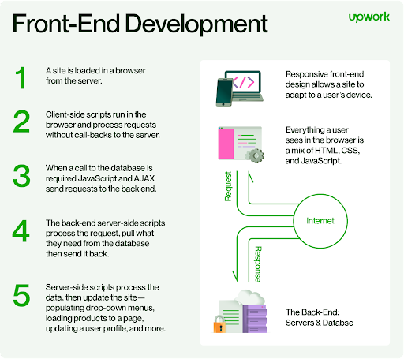
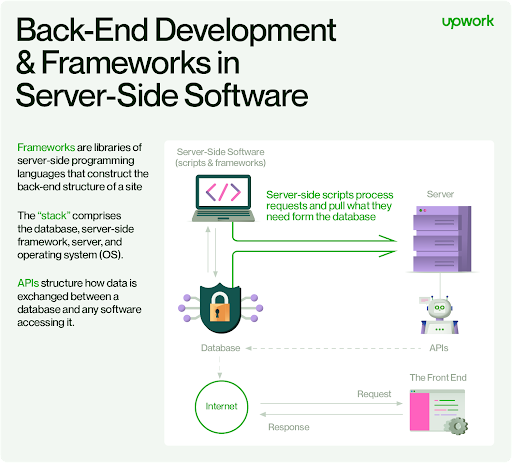

# Backend 소개

## 목차
- [Backend 소개](#backend-소개)
  - [목차](#목차)
  - [Client–server model](#clientserver-model)
    - [Client and server role](#client-and-server-role)
    - [Client and server communication](#client-and-server-communication)
    - [Example](#example)
    - [Server-side](#server-side)
      - [General concepts](#general-concepts)
      - [Computer security](#computer-security)
      - [Examples](#examples)
    - [Client side](#client-side)
      - [General concepts](#general-concepts-1)
      - [Computer security](#computer-security-1)
      - [Examples](#examples-1)
    - [Early history](#early-history)
      - [Client-host and server-host](#client-host-and-server-host)
    - [Centralized computing](#centralized-computing)
    - [Comparison with peer-to-peer architecture](#comparison-with-peer-to-peer-architecture)
  - [Frontend and backend](#frontend-and-backend)
    - [Introduction](#introduction)
    - [Software definitions](#software-definitions)
      - [Web development as an example](#web-development-as-an-example)
      - [API](#api)
  - [Back-end web development](#back-end-web-development)
    - [Back-end development basics](#back-end-development-basics)
      - [What is back-end development?](#what-is-back-end-development)
      - [Back-end vs. front-end development](#back-end-vs-front-end-development)
      - [Common programming languages](#common-programming-languages)
    - [How back-end development works](#how-back-end-development-works)
      - [Servers and hosting](#servers-and-hosting)
      - [Databases and data storage](#databases-and-data-storage)
      - [APIs and middleware](#apis-and-middleware)
  - [출처](#출처)
  - [다음](#다음)

---
## Client–server model

클라이언트-서버 모델은 자원이나 서비스를 제공하는 서버와 서비스를 요청하는 클라이언트 사이에서 작업이나 부하를 분할하는 분산 애플리케이션 구조입니다 . 종종 클라이언트와 서버는 별도의 하드웨어에서 컴퓨터 네트워크를 통해 통신하지만, 클라이언트와 서버가 동일한 시스템에 존재할 수도 있습니다. 서버 호스트는 하나 이상의 서버 프로그램을 실행하여 클라이언트와 자원을 공유합니다. 클라이언트는 일반적으로 자원을 공유하지 않으며, 서버로부터 콘텐츠나 서비스를 요청합니다. 따라서 클라이언트는 서버와의 통신 세션을 시작하며, 서버는 들어오는 요청을 기다립니다. 클라이언트-서버 모델을 사용하는 컴퓨터 애플리케이션의 예로는 이메일, 네트워크 인쇄, 월드 와이드 웹이 있습니다.

### Client and server role

"클라이언트-서버" 특성은 애플리케이션 내 협력 프로그램 간의 관계를 설명합니다. 서버 구성 요소는 하나 이상의 클라이언트에게 기능이나 서비스를 제공하며, 클라이언트는 이러한 서비스를 요청합니다. 서버는 제공하는 서비스에 따라 분류됩니다. 예를 들어, 웹 서버는 웹 페이지를 제공하고, 파일 서버는 컴퓨터 파일을 제공합니다. 공유 자원은 프로그램과 데이터에서 프로세서와 저장 장치에 이르기까지 서버 컴퓨터의 소프트웨어와 전자 구성 요소 중 어떤 것이든 될 수 있습니다. 서버의 자원 공유는 서비스를 구성합니다.

컴퓨터가 클라이언트인지 서버인지 또는 둘 다인지 여부는 서비스 기능을 요구하는 애플리케이션의 성격에 따라 결정됩니다. 예를 들어, 단일 컴퓨터가 웹 서버와 파일 서버 소프트웨어를 동시에 실행하여 서로 다른 종류의 요청을 하는 클라이언트에게 다른 데이터를 제공할 수 있습니다. 클라이언트 소프트웨어는 동일한 컴퓨터 내의 서버 소프트웨어와도 통신할 수 있습니다. 서버 간 데이터 동기화와 같은 통신은 때때로 서버 간 통신(inter-server communication) 또는 서버-서버 통신(server-to-server communication)이라고 합니다​ (Wikipedia)​.

### Client and server communication

일반적으로, 서비스는 컴퓨터 자원의 추상화이며, 클라이언트는 서버가 요청을 수행하고 응답을 제공하는 방식에 대해 걱정할 필요가 없습니다. 클라이언트는 잘 알려진 애플리케이션 프로토콜, 즉 요청된 서비스의 데이터 내용과 형식에 따라 응답을 이해하기만 하면 됩니다.

클라이언트와 서버는 요청-응답 메시징 패턴으로 메시지를 교환합니다. 클라이언트가 요청을 보내면 서버는 응답을 반환합니다. 이 메시지 교환은 프로세스 간 통신(inter-process communication)의 한 예입니다. 통신을 위해서는 컴퓨터가 공통 언어를 가져야 하고, 클라이언트와 서버가 기대할 것을 알 수 있도록 규칙을 따라야 합니다. 통신의 언어와 규칙은 통신 프로토콜에서 정의됩니다. 모든 프로토콜은 애플리케이션 계층에서 작동합니다. 애플리케이션 계층 프로토콜은 대화의 기본 패턴을 정의합니다. 데이터 교환을 더욱 공식화하기 위해 서버는 애플리케이션 프로그래밍 인터페이스(API)를 구현할 수 있습니다. API는 서비스를 액세스하기 위한 추상화 계층입니다. 특정 콘텐츠 형식으로 통신을 제한함으로써 파싱을 용이하게 하고, 접근을 추상화함으로써 플랫폼 간 데이터 교환을 용이하게 합니다.

서버는 짧은 시간 내에 여러 다른 클라이언트로부터 요청을 받을 수 있습니다. 컴퓨터는 한 번에 제한된 수의 작업만 수행할 수 있으며, 클라이언트의 들어오는 요청을 우선순위로 처리하기 위해 스케줄링 시스템에 의존합니다. 남용을 방지하고 가용성을 최대화하기 위해 서버 소프트웨어는 클라이언트에 대한 가용성을 제한할 수 있습니다. 서비스 거부(DoS) 공격은 과도한 요청률로 서버를 과부하시키는 방식으로 서버의 요청 처리 의무를 악용하도록 설계되었습니다. 민감한 정보가 클라이언트와 서버 간에 통신될 경우 암호화를 적용해야 합니다.

### Example

은행 고객이 웹 브라우저(클라이언트)를 사용하여 온라인 뱅킹 서비스에 접속할 때, 클라이언트는 은행의 웹 서버에 요청을 시작합니다. 고객의 로그인 자격 증명은 데이터베이스에 저장될 수 있으며, 웹 서버는 클라이언트로서 데이터베이스 서버에 접근합니다. 애플리케이션 서버는 반환된 데이터를 해석하여 은행의 비즈니스 로직을 적용하고, 웹 서버에 출력 결과를 제공합니다. 마지막으로, 웹 서버는 결과를 클라이언트 웹 브라우저로 반환하여 화면에 표시합니다.

이 클라이언트-서버 메시지 교환의 각 단계에서 컴퓨터는 요청을 처리하고 데이터를 반환합니다. 이것이 요청-응답 메시징 패턴입니다. 모든 요청이 충족되면, 이 시퀀스는 완료되고 웹 브라우저는 고객에게 데이터를 제공합니다.

이 예는 클라이언트-서버 모델에 적용 가능한 디자인 패턴인 관심사 분리를 보여줍니다.

### Server-side

서버 측(server-side)은 서버에서 실행되는 프로그램과 작업을 말합니다. 이는 클라이언트에서 실행되는 프로그램과 작업을 의미하는 클라이언트 측(client-side)과 대조됩니다​ (Wikipedia)​.

#### General concepts
"서버 측 소프트웨어"는 웹 서버와 같은 원격 서버 하드웨어에서 실행되는 컴퓨터 애플리케이션을 의미하며, 이는 사용자의 로컬 컴퓨터, 스마트폰 또는 다른 장치에서 접근할 수 있습니다. 서버 측에서 작업이 수행되는 이유는 클라이언트에서 접근할 수 없는 정보나 기능을 요구하거나, 클라이언트 측에서 이러한 작업을 수행하는 것이 느리거나, 신뢰할 수 없거나, 보안상 문제가 될 수 있기 때문입니다.

클라이언트와 서버 프로그램은 표준화된 프로토콜을 사용하여 서로 통신하는 무료 또는 상업용 웹 서버와 웹 브라우저와 같은 일반적으로 사용 가능한 프로그램일 수 있습니다. 또는 프로그래머가 작성한 서버, 클라이언트 및 통신 프로토콜을 사용하여 서로만 사용할 수 있는 시스템을 만들 수도 있습니다.

서버 측 작업에는 클라이언트 요청에 따라 수행되는 작업과 유지 관리 작업과 같은 비클라이언트 지향 작업이 모두 포함됩니다​ (Wikipedia)​​ (Wikipedia)​.

#### Computer security

컴퓨터 보안 맥락에서, 서버 측 취약점 또는 공격은 클라이언트 측이나 그 중간이 아닌 서버 컴퓨터 시스템에서 발생하는 것을 의미합니다. 예를 들어, 공격자가 웹 애플리케이션의 SQL 삽입(SQL injection) 취약점을 악용하여 서버의 데이터베이스에 있는 데이터를 악의적으로 변경하거나 무단 접근할 수 있습니다. 또는, 공격자가 기본 운영 체제의 취약점을 이용하여 서버 시스템에 침입한 후, 서버의 권한이 있는 관리자와 동일한 방식으로 데이터베이스 및 기타 파일에 접근할 수 있습니다.

#### Examples

SETI@home 및 Great Internet Mersenne Prime Search와 같은 분산 컴퓨팅 프로젝트의 경우, 대부분의 작업은 클라이언트 측에서 발생하지만, 서버는 클라이언트를 조정하고, 분석할 데이터를 보내고, 결과를 수신 및 저장하며, 프로젝트 관리자에게 보고 기능을 제공하는 등의 역할을 합니다. Google Earth와 같은 인터넷 의존 사용자 애플리케이션의 경우, 지도 데이터의 쿼리 및 디스플레이는 클라이언트 측에서 발생하지만, 서버는 지도 데이터의 영구 저장, 사용자 쿼리를 지도 데이터로 변환하여 클라이언트에 반환하는 등의 역할을 합니다.

월드 와이드 웹 맥락에서 일반적으로 사용되는 서버 측 컴퓨터 언어는 다음과 같습니다​ (Wikipedia)​:

 - ASP.NET 환경에서의 C# 또는 Visual Basic
 - Java
 - Perl
 - PHP
 - Python
 - Ruby
 - Node.js
 - Swift

그러나 웹 애플리케이션 및 서비스는 표준 기반 웹 브라우저에 데이터를 반환할 수 있는 한(중간 프로그램을 통해서라도), 거의 모든 언어로 구현될 수 있습니다.

### Client side

클라이언트 측(client-side)은 컴퓨터 네트워크에서 클라이언트가 수행하는 작업을 의미합니다.

#### General concepts

일반적으로 클라이언트는 웹 브라우저와 같은 컴퓨터 애플리케이션으로, 사용자의 로컬 컴퓨터, 스마트폰 또는 다른 장치에서 실행되며 필요에 따라 서버에 연결합니다. 클라이언트 측에서 작업이 수행되는 이유는 클라이언트에만 있는 정보나 기능에 접근해야 하거나, 사용자가 작업을 관찰하거나 입력해야 하거나, 서버가 모든 클라이언트를 신속하게 처리할 수 있는 처리 능력이 부족하기 때문입니다. 또한, 네트워크를 통해 데이터를 전송하지 않고 클라이언트에서 작업을 수행할 수 있다면, 시간이 덜 걸리고, 대역폭을 적게 사용하며, 보안 위험이 줄어들 수 있습니다.

서버가 HTTP나 FTP와 같은 표준 프로토콜에 따라 일반적으로 데이터를 제공할 때, 사용자는 여러 클라이언트 프로그램(예: 대부분의 최신 웹 브라우저는 HTTP와 FTP를 사용하여 데이터를 요청하고 받을 수 있습니다) 중에서 선택할 수 있습니다. 더 전문화된 애플리케이션의 경우, 프로그래머가 상호 간에만 사용할 수 있는 서버, 클라이언트 및 통신 프로토콜을 작성할 수 있습니다.

네트워크를 통해 데이터를 전송하거나 수신하지 않고 사용자의 로컬 컴퓨터에서만 실행되는 프로그램은 클라이언트로 간주되지 않으므로, 이러한 프로그램의 작업은 클라이언트 측 작업이라고 하지 않습니다.

#### Computer security

컴퓨터 보안 관점에서 클라이언트 측 취약점 또는 공격은 서버 측이나 그 사이가 아닌 클라이언트/사용자의 컴퓨터 시스템에서 발생하는 것을 의미합니다. 예를 들어, 서버에 암호화된 파일이나 메시지가 있고 해당 파일이나 메시지를 해독하는 데 사용되는 키가 사용자의 컴퓨터 시스템에 저장되어 있다면, 클라이언트 측 공격은 보통 공격자가 해독된 내용에 액세스할 수 있는 유일한 기회가 될 것입니다. 예를 들어, 공격자가 악성 코드를 클라이언트 시스템에 설치하여 사용자의 화면을 볼 수 있게 하거나 사용자의 키 입력을 기록하거나 사용자의 암호화 키 사본을 훔칠 수 있습니다. 또는 공격자가 사용자의 시스템에 영구적으로 상주하는 악성 코드를 설치하지 않고도 사용자의 시스템에 악의적인 코드를 실행시킬 수 있는 교차 사이트 스크립팅 취약점을 이용할 수도 있습니다.

#### Examples

SETI@home 및 Great Internet Mersenne Prime Search와 같은 분산 컴퓨팅 프로젝트 및 Google Earth와 같은 인터넷 종속 애플리케이션은 주로 클라이언트 측 작업에 의존합니다. 이들은 서버와의 연결을 시작하고 (Google Earth의 경우 사용자 쿼리에 응답으로 또는 SETI@home과 같은 경우 자동화된 방식으로), 일부 데이터를 요청합니다. 서버는 데이터 집합을 선택하고 (서버 측 작업), 이를 클라이언트로 다시 보냅니다. 그런 다음 클라이언트는 데이터를 분석하고 (클라이언트 측 작업), 분석이 완료되면 사용자에게 결과를 표시하거나(Google Earth와 같이) 계산 결과를 다시 서버로 전송합니다(SETI@home와 같이).

월드 와이드 웹의 맥락에서 클라이언트 측에서 평가되거나 실행되는 일반적으로 만날 수 있는 컴퓨터 언어는 다음과 같습니다:

 - Cascading Style Sheets (CSS)
 - HTML
 - JavaScript

### Early history

클라이언트-서버 아키텍처의 초기 형태는 적어도 1964년에 공개된 OS/360의 원격 작업 입력(remote job entry)입니다. 여기서 요청은 작업을 실행하는 것이고, 응답은 출력물입니다.

1960년대와 1970년대에 클라이언트-서버 모델을 개발하던 컴퓨터 과학자들은 ARPANET(스탠포드 연구소)을 구축하면서 서버-호스트(또는 서빙 호스트)와 사용자-호스트(또는 사용 호스트)라는 용어를 사용했으며, 이 용어들은 초기 문서 RFC 5와 RFC 4에 나타납니다. 이러한 용어 사용은 1970년대 중반의 제록스 PARC에서도 계속되었습니다.

연구자들이 이러한 용어를 사용한 한 가지 맥락은 Decode-Encode Language (DEL)라는 컴퓨터 네트워크 프로그래밍 언어의 설계였습니다. 이 언어의 목적은 네트워크 패킷으로 명령을 인코딩하는 동안 사용자-호스트에서 명령을 받아들이고, 사용자에게 상태 보고서를 반환하는 것이었습니다. 또 다른 DEL 호환 컴퓨터인 서버-호스트가 패킷을 수신하여 디코딩하고, 포맷된 데이터를 사용자-호스트에 반환했습니다. 사용자에게 결과를 제시하기 위해 사용자-호스트의 DEL 프로그램이 결과를 수신했습니다. 이것이 클라이언트-서버 트랜잭션입니다. DEL의 개발은 1969년에 막 시작되었으며, 미국 국방부가 ARPANET(인터넷의 전신)을 설정한 해였습니다.

#### Client-host and server-host

라이언트-호스트와 서버-호스트는 클라이언트와 서버와 미묘하게 다른 의미를 갖습니다. 호스트는 네트워크에 연결된 모든 컴퓨터를 의미합니다. 서버와 클라이언트라는 단어는 컴퓨터 또는 컴퓨터 프로그램을 지칭할 수 있지만, 서버-호스트와 클라이언트-호스트는 항상 컴퓨터를 지칭합니다. 호스트는 다목적 컴퓨터이며, 클라이언트와 서버는 호스트에서 실행되는 프로그램에 불과합니다. 클라이언트-서버 모델에서 서버는 주로 서비스를 제공하는 작업에 전념하는 경우가 많습니다.

클라이언트라는 단어의 초기 사용 예는 1978년 제록스 PARC의 컴퓨터 과학자 Howard Sturgis, James Mitchell, Jay Israel이 작성한 "분산 파일 시스템에서 데이터와 기능 분리하기"라는 논문에서 발견됩니다. 저자들은 독자를 위해 이 용어를 신중하게 정의하고, 이를 사용자와 사용자의 네트워크 노드(클라이언트)를 구별하는 데 사용한다고 설명합니다. 1992년까지 서버라는 단어는 일반적으로 사용되기 시작했습니다.

### Centralized computing

클라이언트-서버 모델은 서버-호스트가 클라이언트-호스트보다 더 많은 자원을 가져야 한다고 규정하지 않습니다. 오히려 이 모델은 모든 범용 컴퓨터가 다른 호스트의 공유 자원을 사용하여 기능을 확장할 수 있게 합니다. 반면 중앙 집중식 컴퓨팅은 특정 소수의 컴퓨터에 많은 자원을 할당합니다. 클라이언트-호스트에서 중앙 컴퓨터로 더 많은 연산 작업이 전가될수록 클라이언트-호스트는 단순해질 수 있습니다. 중앙 집중식 컴퓨팅은 연산과 저장을 위해 네트워크 자원(서버와 인프라)에 크게 의존합니다. 디스크가 없는 노드는 심지어 운영 체제도 네트워크에서 로드하고, 컴퓨터 터미널은 운영 체제가 전혀 없으며, 단지 서버에 대한 입출력 인터페이스 역할을 합니다. 반면 개인용 컴퓨터와 같은 풍부한 클라이언트는 많은 자원을 보유하고 있어 필수 기능을 위해 서버에 의존하지 않습니다.

1980년대부터 1990년대 후반까지 마이크로컴퓨터의 가격이 하락하고 성능이 향상됨에 따라 많은 조직이 메인프레임 및 미니컴퓨터와 같은 중앙 서버에서 풍부한 클라이언트로 연산을 전환했습니다. 이는 컴퓨터 자원에 대한 더 크고 개별화된 통제권을 제공했지만, 정보 기술 관리가 복잡해졌습니다. 2000년대에는 웹 애플리케이션이 특정 마이크로아키텍처를 위해 개발된 애플리케이션 소프트웨어에 필적할 만큼 성숙해졌습니다. 이러한 성숙, 더 저렴해진 대용량 저장 장치, 서비스 지향 아키텍처의 등장 등은 2010년대 클라우드 컴퓨팅 트렌드의 부상을 가져온 요인 중 일부였습니다.

### Comparison with peer-to-peer architecture

클라이언트-서버 모델 외에도 분산 컴퓨팅 애플리케이션은 종종 피어-투-피어(P2P) 애플리케이션 아키텍처를 사용합니다.

클라이언트-서버 모델에서 서버는 종종 많은 클라이언트에게 서비스를 제공하는 중앙 집중식 시스템으로 설계됩니다. 서버의 컴퓨팅 파워, 메모리 및 저장 용량 요구 사항은 예상 작업 부하에 맞게 적절히 조정되어야 합니다. 서버를 단일 물리적 기계를 넘어 확장하기 위해 로드 밸런싱 및 장애 조치 시스템이 자주 사용됩니다.

로드 밸런싱은 네트워크 또는 애플리케이션 트래픽을 여러 서버에 체계적이고 효율적으로 분배하는 것으로 정의됩니다. 각 로드 밸런서는 클라이언트 장치와 백엔드 서버 사이에 위치하여 들어오는 요청을 수신한 후 이를 수행할 수 있는 가용 서버에 분배합니다.

피어-투-피어 네트워크에서는 두 대 이상의 컴퓨터(피어)가 자원을 공유하고 분산된 시스템에서 통신합니다. 피어는 비계층적 네트워크에서 동등한 또는 동등한 능력을 가진 노드입니다. 클라이언트-서버 또는 클라이언트-큐-클라이언트 네트워크의 클라이언트와 달리, 피어는 서로 직접 통신합니다. 피어-투-피어 네트워킹에서는 피어-투-피어 통신 프로토콜의 알고리즘이 로드를 분산하며, 자원이 적은 피어도 로드를 분담할 수 있습니다. 노드가 사용할 수 없게 되면, 다른 피어가 이를 제공하는 한 공유된 자원은 계속 사용할 수 있습니다. 이상적으로, 피어는 높은 가용성을 달성할 필요가 없으며, 다른 중복된 피어가 자원의 다운타임을 보완합니다. 피어의 가용성과 로드 용량이 변경되면 프로토콜은 요청을 다시 라우팅합니다.

클라이언트-서버와 마스터-슬레이브는 모두 분산 피어-투-피어 시스템의 하위 범주로 간주됩니다.

---
## Frontend and backend

소프트웨어 공학에서 프론트엔드(frontend)와 백엔드(backend, 때로는 back end 또는 back-end로 표기)는 소프트웨어의 프레젠테이션 계층(프론트엔드)과 데이터 접근 계층(백엔드) 또는 물리적 인프라나 하드웨어 간의 관심사 분리를 나타냅니다. 클라이언트-서버 모델에서 클라이언트는 일반적으로 프론트엔드로 간주되고 서버는 일반적으로 백엔드로 간주됩니다. 심지어 일부 프레젠테이션 작업이 실제로 서버에서 수행되더라도 그렇습니다.

### Introduction

소프트웨어 아키텍처에서 하드웨어와 최종 사용자 사이에는 여러 계층이 있을 수 있습니다. 프론트는 사용자 친화적인 인터페이스를 제공함으로써 기본 구성 요소를 단순화하는 추상화이며, 백은 주로 데이터 저장 및 비즈니스 로직을 처리합니다.

통신 분야에서는 프론트를 장치나 서비스로 간주할 수 있으며, 백은 서비스 제공을 지원하는 인프라입니다.

일반적인 규칙은 클라이언트 측(또는 "프론트엔드")이 사용자가 조작하는 모든 구성 요소라는 것입니다. 서버 측(또는 "백엔드") 코드는 보통 서버에 있으며, 종종 사용자로부터 물리적으로 멀리 떨어져 있습니다.

### Software definitions

콘텐츠 관리 시스템(CMS)에서 프론트엔드와 백엔드는 각각 CMS의 최종 사용자용 뷰와 관리자용 뷰를 가리킬 수 있습니다.

음성 합성에서는 프론트엔드가 입력된 텍스트를 상징적 음성 표현으로 변환하는 합성 시스템의 부분을 의미하며, 백엔드는 상징적 음성 표현을 실제 소리로 변환합니다.

컴파일러에서는 프론트엔드가 컴퓨터 프로그래밍 소스 코드를 중간 표현으로 번역하고, 백엔드는 중간 표현을 사용하여 컴퓨터 출력 언어로 코드를 생성합니다. 백엔드는 주로 더 빠르게 실행되는 코드를 생성하도록 최적화합니다. 프론트엔드/백엔드 구분은 소스 코드를 처리하는 파서 섹션과 코드를 생성하고 최적화하는 백엔드를 분리할 수 있습니다. GCC와 같은 일부 설계에서는 여러 프론트엔드(다른 소스 언어를 파싱) 또는 백엔드(다른 대상 프로세서에 대한 코드를 생성)를 선택할 수 있습니다.

데스크톱 환경에서 실행되는 일부 그래픽 사용자 인터페이스(GUI) 애플리케이션은 사용자가 특수 용어를 배우고 명령을 외우는 것을 피하기 위해 기본 명령 줄 인터페이스(CLI) 프로그램에 대한 얇은 프론트엔드로 구현됩니다.

#### Web development as an example

두 개의 차이를 이해하는 또 다른 방법은 프론트엔드와 백엔드 소프트웨어 개발자가 요구되는 지식을 이해하는 것입니다. 아래 목록은 웹 개발을 예로 들고 있습니다.

**공통 사항**
- Git, Mercurial, Subversion과 같은 버전 관리 도구
- FTP, rsync와 같은 파일 전송 도구 및 프로토콜

**프론트엔드 중심**
- HTML, CSS, JavaScript와 같은 마크업 및 웹 언어, Sass, jQuery와 같은 보조 라이브러리
- 비동기 요청 처리 및 AJAX
- React, Angular, Vue.js 같은 프레임워크를 사용하는 싱글 페이지 애플리케이션
- 웹 성능 (가장 큰 콘텐츠 색칠, 대화형 시간, 60 FPS 애니메이션 및 상호작용, 메모리 사용 등)
- 반응형 웹 디자인
- 크로스 브라우저 호환성 문제 및 해결 방법
- 헤드리스 브라우저를 사용한 엔드투엔드 테스트
- Webpack, Gulp.js와 같은 도구를 사용하여 JavaScript 파일을 변환하고 번들링, 이미지 크기 축소 등의 빌드 자동화
- 검색 엔진 최적화
- 접근성 문제
- GIMP, Photoshop과 같은 이미지 편집 도구의 기본 사용법
- 사용자 인터페이스

**백엔드 중심**
- PHP, Python, Ruby, Perl, Node.js와 같은 스크립트 언어 또는 C#, Java, Go와 같은 컴파일 언어
- 사용 중인 언어에 대한 자동화 테스트 프레임워크
- 데이터 접근 계층
- 비즈니스 로직
- 데이터베이스 관리
- 확장성
- 높은 가용성
- 보안 문제, 인증 및 권한 부여
- 소프트웨어 아키텍처
- 데이터 변환
- 백업 방법 및 소프트웨어

두 직책은 동일한 제품에서 작업할 수 있지만, 매우 구체적인 기술 세트를 가지고 있다는 점에 유의하십시오.

#### API

프론트엔드는 API를 통해 백엔드와 통신합니다. 웹 및 모바일 프론트엔드의 경우, API는 종종 HTTP 요청/응답을 기반으로 합니다. API는 때때로 프론트엔드 측의 처리를 용이하게 하기 위해 응답을 제공하는 "Backend for Frontend" (BFF) 패턴을 사용하여 설계됩니다.

---
## Back-end web development

### Back-end development basics

#### What is back-end development?

백엔드 개발은 웹사이트와 애플리케이션이 작동하도록 만드는 뒤편의 마법과 같습니다. 이는 데이터베이스, 서버, 애플리케이션을 구동하는 코드로, 기본적으로 서버 측에서 발생하는 모든 것입니다.

백엔드 웹 개발자로서, 당신은 데이터베이스를 구축하고, API를 통합하며, 웹사이트에 생명을 불어넣는 서버 측 기술을 설정하는 역할을 합니다. 당신 없이는 웹사이트가 제대로 작동하지 않을 것입니다. 따라서 서버 측 프로그래밍에 능숙하다면, 클라이언트의 다음 웹 프로젝트에 딱 맞는 인재일 수 있습니다.

#### Back-end vs. front-end development

백엔드를 이해하려면, 즉 "서버 측"을 이해하려면 프론트 엔드와 두 가지가 어떻게 상호작용하는지도 이해해야 합니다.

프론트 엔드는 "클라이언트 측" 프로그래밍이라고도 하며, 브라우저에서 일어나는 모든 일—즉, 최종 사용자가 보고 상호작용하는 모든 것을 의미합니다. 반면에 백엔드는 서버(현장 또는 클라우드)와 데이터베이스에서 발생합니다. 이는 무대 뒤에서 작동하는 기계와 같으며, 최종 사용자가 직접 보거나 상호작용하지는 않지만 발생하는 모든 일을 구동합니다.

아래는 프론트 엔드와 백엔드 개발의 흐름을 시각적으로 보여주는 예시입니다.

프론트 엔드 스크립트는 사용자 요청을 처리하기 위해 서버 측으로 보내고, 적절한 데이터를 프론트 엔드로 반환합니다. 이러한 과정은 서버에 대한 요청과 응답이 지속적으로 반복되는 루프에서 자주 발생합니다.

이제 위의 그래픽에서 네 번째 단계에서 수행되는 백엔드 아키텍처의 작동 방식을 살펴보겠습니다. 이는 소프트웨어와 기계 장치가 어떻게 역할을 수행하는지를 설명합니다.

전통적인 백엔드는 서버, 데이터베이스, API 및 운영 체제의 조합으로 구성되어 애플리케이션의 프론트 엔드를 구동합니다. 이를 모두 연결하는 소프트웨어에 대한 자세한 내용은 서버 측 스크립팅에 관한 우리의 기사를 참조하십시오.

애플리케이션의 백엔드는 클라우드 기반 서버와 데이터 웨어하우스, Docker와 같은 서비스의 컨테이너화, BaaS(Backend-as-a-Service) 제공자 또는 더 복잡한 처리를 대체하는 API를 사용하는지 여부에 따라 애플리케이션마다 매우 다르게 보일 수 있습니다.

#### Common programming languages

백엔드 개발자로서, 여러 프로그래밍 언어 중에서 선택할 수 있습니다. 가장 일반적인 언어로는 Python, Java, JavaScript, Ruby, SQL, 그리고 Golang이 있습니다.

개발 속도를 높이기 위해, Node.js, Laravel, Express, Flask, Ruby on Rails, Django와 같은 프레임워크를 사용할 수도 있습니다. 이러한 웹 프레임워크는 데이터베이스 작업과 파일 업로드와 같은 작업을 처리하는 내장 기능을 제공하므로, 특정 프로젝트에 맞는 기능을 커스터마이징하는 데 집중할 수 있습니다.

### How back-end development works

백엔드 개발은 애플리케이션의 핵심 기능을 정의하는 코드 작성으로 시작됩니다. 그 다음에는 코드를 서버에 호스팅하고, 데이터베이스 작업을 관리하며, API를 처리합니다. 이제 이러한 각 영역을 자세히 살펴보겠습니다.

#### Servers and hosting

서버는 데이터를 저장하고 검색하며, 요청을 처리하고 네트워크를 통해 필요한 정보를 응답하는 하드웨어입니다. 서버에는 다양한 계산과 파일 저장을 위한 RAM과 저장 드라이브가 있습니다.

웹사이트를 서버에 배포하면 특정 URL과 IP 주소가 할당됩니다. 사용자는 해당 URL을 사용하여 애플리케이션에 접근할 수 있습니다. 백엔드 앱과 프론트엔드 웹 페이지를 별도의 서버에 호스팅하고 API를 사용하여 이들 간의 통신을 원활하게 할 수도 있습니다.

호스팅에는 클라우드 호스팅과 온프레미스 호스팅 두 가지 옵션이 있습니다. 클라우드 호스팅은 빠른 확장성, 더 나은 가동 시간 및 가용성 측면에서 좋지만, 웹사이트가 많은 리소스를 필요로 할 경우 비용이 많이 들 수 있습니다.

반면에 온프레미스 호스팅은 IT 인프라를 완전히 제어할 수 있어 필요에 맞게 맞춤화할 수 있습니다. 그러나 리소스 제한으로 인해 증가하는 웹 트래픽을 수용하는 것이 어려울 수 있습니다.

#### Databases and data storage

데이터베이스는 직원 기록과 사용자 정보에서 제품 세부 정보 및 멀티미디어 파일에 이르는 모든 종류의 정보를 저장하기 때문에 백엔드 개발의 중요한 부분입니다.

프로젝트에 따라 SQL 또는 NoSQL 데이터베이스를 사용할 수 있습니다. Oracle Database와 PostgreSQL과 같은 SQL 관계형 데이터베이스는 데이터를 테이블과 행에 저장하여 구조화된 데이터에 이상적입니다. 이들은 또한 데이터 안전성, 신뢰성 및 무결성을 보장하는 ACID 원칙을 따릅니다.

반면 MongoDB와 Firebase와 같은 NoSQL 데이터베이스는 주로 비구조화된 데이터나 반구조화된 데이터를 저장하는 데 사용됩니다. 이는 변화하는 데이터 요구에 적응할 수 있게 해줍니다.

데이터베이스를 사용하면 기록을 검색하고, 기존 데이터를 수정하거나 업데이트하며, 특정 기록을 삭제하는 작업을 수행할 수 있습니다.

#### APIs and middleware

API(응용 프로그램 프로그래밍 인터페이스)는 백엔드가 프론트 엔드와 통신할 수 있도록 합니다.

예를 들어, 사용자가 프론트 엔드에 입력한 정보가 API를 통해 백엔드로 전송되어 처리 또는 저장됩니다. 백엔드는 또한 요청된 정보를 프론트 엔드로 보내 사용자에게 표시할 수 있습니다. 이는 넷플릭스가 백엔드 데이터베이스에서 영화와 TV 프로그램 목록을 가져와 사용자 인터페이스에 표시하는 방식입니다.

소프트웨어 애플리케이션은 일반적으로 CRUD(Create, Read, Update, Delete) API가 필요합니다. 이는 API가 사용자가 데이터베이스에 새 기록을 생성하고, 기존 데이터를 JSON 또는 지원되는 다른 형식으로 가져오며, 특정 항목을 업데이트하거나 특정 또는 모든 기록을 삭제할 수 있게 한다는 의미입니다.

프론트 엔드와 기본 API의 중심에는 미들웨어가 있습니다. 미들웨어(서버 측 소프트웨어)는 클라이언트-서버 연결을 촉진하여 애플리케이션과 네트워크, 서버, 데이터베이스, 운영 체제 등을 연결하는 중간 계층을 형성합니다.

미들웨어는 프레젠테이션 계층이나 비즈니스 계층 등 사이트의 다양한 계층으로 구성될 수 있습니다. 웹 API는 비즈니스 계층과 프레젠테이션 계층 간의 차이를 연결할 수 있습니다.

미들웨어는 클라우드 및 온프레미스 애플리케이션 간의 통신을 가능하게 하고, 데이터 통합 및 오류 처리와 같은 서비스를 제공합니다. 좋은 미들웨어는 IT 효율성을 극대화하고 사용자 참여, 비즈니스 프로세스 관리, 콘텐츠 관리, 인증 등을 지원할 수 있습니다. Koa.js는 서버 측 자바스크립트 프레임워크의 예입니다.

---
## 출처
 - [Wikipedia Client–server model](https://en.wikipedia.org/wiki/Client%E2%80%93server_model)
 - [Wikipedia Frontend and backend](https://en.wikipedia.org/wiki/Frontend_and_backend)
 - [Back-end Development for Beginners: Basics, Examples, and Skills](https://www.upwork.com/resources/beginners-guide-back-end-development)

---
## [다음](./03_ASP.NET_Core_소개.md)

