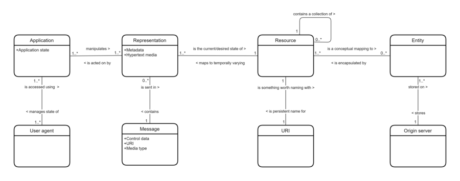

# REST 소개

## 목차
- [REST 소개](#rest-소개)
  - [목차](#목차)
  - [HTTP](#http)
    - [Technical overview](#technical-overview)
    - [Request methods](#request-methods)
  - [API](#api)
    - [Purpose](#purpose)
    - [Usage](#usage)
  - [REST](#rest)
    - [Principle](#principle)
    - [History](#history)
    - [Architectural properties](#architectural-properties)
    - [Architectural constraints](#architectural-constraints)
      - [Uniform interface](#uniform-interface)
  - [출처](#출처)
  - [다음](#다음)

---

**API**

'응용 프로그램 프로그래밍 인터페이스'의 약자입니다. API는 소프트웨어 프로그램들이 서로 통신할 수 있게 해주는 방법입니다. 예를 들어, 스마트폰 앱이 날씨 정보를 보여줄 때, 이 앱은 날씨 데이터를 제공하는 서버와 통신합니다. 이 통신을 가능하게 하는 것이 바로 API입니다. API는 프로그램 간의 의사소통을 도와주며, 서로 다른 시스템들이 데이터를 주고받을 수 있게 해줍니다.

**HTTP**

'하이퍼텍스트 전송 프로토콜'의 약자입니다. HTTP는 인터넷을 통해 웹 페이지를 주고받을 때 사용하는 규칙입니다. 웹 브라우저에서 어떤 웹사이트를 방문할 때, HTTP를 통해 그 웹사이트의 서버와 통신합니다. 예를 들어, 우리가 웹 브라우저에 주소를 입력하고 엔터를 누르면, 브라우저는 HTTP를 사용하여 해당 서버에 요청을 보냅니다. 서버는 요청을 받고, HTTP를 통해 웹 페이지 데이터를 응답으로 보냅니다. 이처럼 HTTP는 인터넷 상에서 데이터를 주고받기 위한 표준 규칙입니다.

**HTTP API**

HTTP 프로토콜을 사용하여 두 프로그램이 통신하는 방법입니다. 예를 들어, 날씨 정보를 제공하는 서버와 날씨 앱 사이의 통신은 HTTP API를 사용하여 이루어질 수 있습니다. 이 경우, 날씨 앱은 HTTP 요청을 보내고, 서버는 HTTP 응답으로 데이터를 보냅니다. HTTP API는 프로그램이 인터넷을 통해 데이터를 주고받을 수 있도록 해줍니다. HTTP API를 사용하면, 웹 브라우저 외에도 다양한 프로그램들이 HTTP를 통해 서로 데이터를 주고받을 수 있습니다.

**REST**

'표현 상태 전이'의 약자입니다. REST는 웹에서 API를 설계하는 방식 중 하나입니다. REST는 자원을 URL로 표현하고, HTTP 요청 메서드(GET, POST, PUT, DELETE 등)를 사용하여 이 자원들을 처리하는 방식입니다. 예를 들어, 블로그 사이트에서 글 목록을 가져오거나 새로운 글을 작성하는 등의 작업을 REST 원칙을 따르는 API를 통해 할 수 있습니다. REST는 간단하고 직관적인 설계를 지향하며, 웹의 기존 기술을 최대한 활용합니다.

**REST API**

REST 원칙을 따르는 API입니다. 이는 HTTP를 사용하여 데이터를 주고받습니다. REST API를 사용하면 클라이언트(예: 웹 브라우저, 모바일 앱)가 서버와 통신하여 데이터를 주고받을 수 있습니다. 예를 들어, 블로그 사이트에서 글 목록을 가져오거나 새로운 글을 작성하는 등의 작업을 REST API를 통해 할 수 있습니다. REST API는 자원을 URL로 표현하고, HTTP 메서드를 사용하여 이 자원들을 처리하므로, 직관적이고 사용하기 쉽습니다.

## HTTP

HTTP(Hypertext Transfer Protocol)는 분산, 협업, 하이퍼미디어 정보 시스템을 위한 인터넷 프로토콜 스위트 모델의 응용 계층 프로토콜입니다. HTTP는 하이퍼텍스트 문서에 다른 자원으로의 하이퍼링크를 포함하는 월드 와이드 웹의 데이터 통신의 기초입니다. 사용자는 웹 브라우저에서 마우스 클릭이나 화면 탭으로 이러한 자원에 쉽게 접근할 수 있습니다.

HTTP의 개발은 1989년 CERN의 팀 버너스 리에 의해 시작되었으며, 클라이언트와 서버가 첫 번째 HTTP 버전인 0.9을 사용하는 동작을 설명하는 간단한 문서로 요약되었습니다. 이 버전은 이후 개발되어 결국 공개 버전 1.0이 되었습니다.

초기 HTTP 요청 사양(RFC)의 개발은 몇 년 후 인터넷 엔지니어링 태스크 포스(IETF)와 월드 와이드 웹 컨소시엄(W3C)의 협력 노력으로 시작되었으며, 이후 IETF로 작업이 이전되었습니다.

HTTP/1은 1996년에 완성되어 완전히 문서화되었고(버전 1.0), 1997년에 발전하여(버전 1.1), 1999년, 2014년, 2022년에 사양이 업데이트되었습니다.

보안 변형인 HTTPS는 85% 이상의 웹사이트에서 사용됩니다. 2015년에 발표된 HTTP/2는 HTTP의 의미를 더 효율적으로 표현합니다. 2024년 1월 기준으로, 36%의 웹사이트가 HTTP/2를 사용하고 있으며, 거의 모든 웹 브라우저(98% 이상의 사용자)에서 지원됩니다. 또한 주요 웹 서버가 애플리케이션 계층 프로토콜 협상(ALPN) 확장을 사용하여 전송 계층 보안(TLS) 위에서 HTTP/2를 지원합니다.

HTTP/2의 후속 버전인 HTTP/3는 2022년에 발표되었습니다. 2024년 2월 기준으로, 29%의 웹사이트에서 사용되고 있으며, 대부분의 웹 브라우저(97%의 사용자)에서 지원됩니다. HTTP/3는 기본 전송 프로토콜로 TCP 대신 QUIC을 사용합니다. HTTP/2와 마찬가지로 이전 주요 버전을 대체하지 않습니다. HTTP/3는 Cloudflare와 Google Chrome에서 먼저 지원되었으며, Firefox에서도 활성화되었습니다. HTTP/3는 서버에서 활성화될 경우 실제 웹 페이지의 지연 시간을 줄이며, HTTP/2보다 더 빠르게 로드됩니다. 경우에 따라 HTTP/1.1보다 세 배 이상 빠를 수 있습니다.

### Technical overview

HTTP(Hypertext Transfer Protocol)는 클라이언트-서버 모델에서 요청-응답 프로토콜로 작동합니다. 예를 들어, 웹 브라우저는 클라이언트일 수 있고, 하나 이상의 웹사이트를 호스팅하는 컴퓨터에서 실행되는 웹 서버라는 프로세스는 서버일 수 있습니다. 클라이언트는 서버에 HTTP 요청 메시지를 제출합니다. 서버는 HTML 파일 및 기타 콘텐츠와 같은 자원을 제공하거나 클라이언트를 대신하여 다른 기능을 수행하며, 클라이언트에게 응답 메시지를 반환합니다. 응답에는 요청에 대한 완료 상태 정보가 포함되며, 메시지 본문에 요청된 콘텐츠가 포함될 수 있습니다.

웹 브라우저는 사용자 에이전트(UA)의 한 예입니다. 다른 유형의 사용자 에이전트로는 검색 제공자(웹 크롤러)가 사용하는 인덱싱 소프트웨어, 음성 브라우저, 모바일 앱 및 웹 콘텐츠에 접근하거나 소비하거나 표시하는 기타 소프트웨어가 있습니다.

HTTP는 중간 네트워크 요소가 클라이언트와 서버 간의 통신을 개선하거나 가능하게 할 수 있도록 설계되었습니다. 트래픽이 많은 웹사이트는 상위 서버를 대신하여 콘텐츠를 제공하여 응답 시간을 개선하는 웹 캐시 서버의 이점을 종종 누립니다. 웹 브라우저는 이전에 접근한 웹 자원을 캐시하고, 가능한 경우 이를 재사용하여 네트워크 트래픽을 줄입니다. 사설 네트워크 경계의 HTTP 프록시 서버는 외부 서버와 메시지를 중계하여 전역 라우팅 가능한 주소가 없는 클라이언트의 통신을 용이하게 할 수 있습니다.

중간 HTTP 노드(프록시 서버, 웹 캐시 등)가 기능을 수행할 수 있도록 하기 위해, 일부 HTTP 헤더는 홉-바이-홉 방식으로 관리되는 반면, 다른 HTTP 헤더는 종단 간 방식으로 관리됩니다(소스 클라이언트와 대상 웹 서버에 의해서만 관리됨).

HTTP는 인터넷 프로토콜 스위트의 프레임워크 내에서 설계된 응용 계층 프로토콜입니다. 그 정의는 신뢰할 수 있는 전송 계층 프로토콜을 전제로 합니다. 최신 버전인 HTTP/3에서는 전송 제어 프로토콜(TCP)이 더 이상 사용되지 않지만, 이전 버전은 여전히 TCP를 가장 많이 사용합니다. HTTP/3는 예를 들어 HTTPU 및 간단한 서비스 검색 프로토콜(SSDP)에서와 같이 사용자 데이터그램 프로토콜(UDP)과 같은 신뢰할 수 없는 프로토콜을 사용하도록 조정되었습니다.

HTTP 자원은 HTTP 및 HTTPS URI 스킴을 사용하여 네트워크에서 URL로 식별되고 위치가 지정됩니다. RFC 3986에 정의된 대로, URI는 HTML 문서에서 하이퍼링크로 인코딩되어 상호 연결된 하이퍼텍스트 문서를 형성합니다.

HTTP/1.0에서는 동일한 서버에 대한 각 자원 요청마다 별도의 TCP 연결이 만들어집니다.

HTTP/1.1에서는 대신 동일한 TCP 연결을 재사용하여 여러 자원 요청(HTML 페이지, 프레임, 이미지, 스크립트, 스타일시트 등)을 수행할 수 있습니다.

따라서 HTTP/1.1 통신은 TCP 연결 설정에 상당한 오버헤드가 발생할 때 특히 트래픽이 많은 조건에서 지연이 적습니다.

HTTP/2는 이전 HTTP/1.1의 개정판으로, 동일한 클라이언트-서버 모델과 동일한 프로토콜 메서드를 유지하면서 다음과 같은 차이점을 갖습니다:

- 메타데이터(HTTP 헤더)의 텍스트 표현 대신 압축된 바이너리 표현을 사용하여 헤더의 공간을 크게 줄임.
- 접근한 서버 도메인당 하나의 TCP/IP(보통 암호화된) 연결을 사용하여 2~8개의 TCP/IP 연결을 대신함.
- HTTP 요청과 응답을 작은 패킷으로 분할하여 전송하는 다중 양방향 스트림을 TCP/IP 연결당 하나 이상 사용하여 HOLB(헤드 오브 라인 블로킹) 문제를 거의 해결함.
- 서버 애플리케이션이 새로운 데이터가 있을 때 클라이언트에게 데이터를 푸시할 수 있는 기능을 추가하여 클라이언트가 주기적으로 서버에 새로운 데이터를 요청하지 않도록 함.

따라서 HTTP/2 통신은 HTTP/1.1 통신보다 지연이 훨씬 적고, 대부분의 경우 더 높은 속도를 경험합니다.

HTTP/3는 이전 HTTP/2의 개정판으로, TCP 대신 QUIC+UDP 전송 프로토콜을 사용합니다. 이 버전 이전에는 TCP/IP 연결이 사용되었지만, 이제는 IP 계층만 사용됩니다(UDP는 TCP와 마찬가지로 이 계층 위에서 작동). 이는 평균 통신 속도를 약간 개선하고, TCP 연결 혼잡으로 인한 간헐적(매우 드문) 문제를 피하여 모든 스트림의 데이터 흐름이 일시적으로 차단되거나 느려지는 문제를 해결합니다.

### Request methods

HTTP는 식별된 자원에 대해 수행될 원하는 작업을 나타내기 위해 메서드(때때로 동사라고도 하지만, 명세서에서는 '동사'라는 용어를 사용하지 않음)를 정의합니다. 이 자원이 미리 존재하는 데이터인지 동적으로 생성된 데이터인지는 서버의 구현에 따라 다릅니다. 종종 자원은 서버에 위치한 파일이나 실행 가능한 출력과 일치합니다. HTTP/1.0 명세는 GET, HEAD, POST 메서드를 정의했으며, PUT, DELETE, LINK, UNLINK 메서드를 추가 메서드로 나열했습니다. 그러나 HTTP/1.1 명세는 공식적으로 다섯 가지 새로운 메서드(PUT, DELETE, CONNECT, OPTIONS, TRACE)를 정의하고 추가했습니다. 모든 클라이언트는 어떤 메서드든 사용할 수 있으며, 서버는 어떤 메서드 조합이든 지원하도록 구성될 수 있습니다. 중간 노드가 메서드를 알 수 없는 경우, 해당 메서드는 안전하지 않고 비동기적(non-idempotent)인 메서드로 간주됩니다. 정의할 수 있는 메서드 수에는 제한이 없으므로 기존 인프라를 깨뜨리지 않고도 미래의 메서드를 정의할 수 있습니다. 예를 들어, WebDAV는 일곱 가지 새로운 메서드를 정의했으며 RFC 5789는 PATCH 메서드를 지정했습니다.

메서드 이름은 대소문자를 구분합니다. 이는 HTTP 헤더 필드 이름이 대소문자를 구분하지 않는 것과 대조적입니다.

**GET**

GET 메서드는 대상 자원이 자신의 상태를 나타내는 표현을 전송하도록 요청합니다. GET 요청은 데이터를 검색하는 데만 사용해야 하며 다른 영향을 미치지 않아야 합니다. 데이터 변경 없이 자원을 검색하는 경우, URL을 통해 접근할 수 있는 GET이 POST보다 선호됩니다. 이는 북마크와 공유를 가능하게 하고, 캐시를 통해 네트워크 트래픽을 줄일 수 있습니다.

**HEAD**

HEAD 메서드는 대상 자원이 자신의 상태를 나타내는 표현을 전송하도록 요청하지만, 응답 본문에는 표현 데이터가 포함되지 않습니다. 이는 응답 헤더에 있는 표현 메타데이터를 검색하는 데 유용합니다. 예를 들어, 페이지가 상태 코드로 이용 가능한지 확인하고 파일의 크기(Content-Length)를 빠르게 찾는 데 사용할 수 있습니다.

**POST**

POST 메서드는 대상 자원이 요청에 포함된 표현을 처리하도록 요청합니다. 예를 들어, 인터넷 포럼에 메시지를 게시하거나, 메일링 리스트에 가입하거나, 온라인 쇼핑 거래를 완료하는 데 사용됩니다.

**PUT**

PUT 메서드는 요청에 포함된 표현으로 정의된 상태로 대상 자원이 자신의 상태를 생성하거나 업데이트하도록 요청합니다. POST와의 차이점은 클라이언트가 서버에서 대상 위치를 지정한다는 점입니다.

**DELETE**

DELETE 메서드는 대상 자원이 자신의 상태를 삭제하도록 요청합니다.

**CONNECT**

CONNECT 메서드는 중간 노드가 요청 대상에 의해 식별된 원본 서버로의 TCP/IP 터널을 설정하도록 요청합니다. 이는 종종 TLS를 통해 하나 이상의 HTTP 프록시를 통한 보안 연결을 위해 사용됩니다.

**OPTIONS**

OPTIONS 메서드는 대상 자원이 지원하는 HTTP 메서드를 전송하도록 요청합니다. 이는 특정 자원 대신 '*'를 요청하여 웹 서버의 기능을 확인하는 데 사용할 수 있습니다.

**TRACE**

TRACE 메서드는 대상 자원이 수신된 요청을 응답 본문에 전송하도록 요청합니다. 이를 통해 클라이언트는 중간 노드에 의해 수행된(있을 경우) 변경 사항이나 추가 사항을 확인할 수 있습니다.

**PATCH**

PATCH 메서드는 요청에 포함된 표현으로 정의된 부분 업데이트에 따라 대상 자원이 자신의 상태를 수정하도록 요청합니다. 이를 통해 파일이나 문서의 일부를 전체적으로 전송하지 않고도 업데이트할 수 있어 대역폭을 절약할 수 있습니다.

모든 범용 웹 서버는 최소한 GET과 HEAD 메서드를 구현해야 하며, 나머지 메서드는 명세에서 선택 사항으로 간주됩니다.

---
## API

응용 프로그래밍 인터페이스(API)는 두 개 이상의 컴퓨터 프로그램 또는 구성 요소가 서로 통신할 수 있도록 하는 방법입니다. 이는 소프트웨어 인터페이스의 한 종류로, 다른 소프트웨어에 서비스를 제공합니다. 이러한 연결 또는 인터페이스를 구축하거나 사용하는 방법을 설명하는 문서나 표준을 API 사양이라고 합니다. 이 표준을 충족하는 컴퓨터 시스템은 API를 구현하거나 노출한다고 합니다. API라는 용어는 사양 또는 구현을 지칭할 수 있습니다. 시스템의 사용자 인터페이스가 최종 사용자가 해당 시스템과 상호작용하는 방식을 규정하는 반면, API는 해당 시스템의 기능을 활용할 수 있도록 코드를 작성하는 방식을 규정합니다.

사용자 인터페이스가 컴퓨터와 사람을 연결하는 것과 대조적으로, 응용 프로그래밍 인터페이스는 컴퓨터나 소프트웨어 구성 요소 간의 연결을 담당합니다. 이는 컴퓨터 프로그래머가 소프트웨어에 통합하는 것 외에는 사람(최종 사용자)이 직접 사용하는 것을 목적으로 하지 않습니다. API는 종종 프로그래머가 사용할 수 있는 도구나 서비스로 구성된 여러 부분으로 이루어져 있습니다. 이 부분 중 하나를 사용하는 프로그램이나 프로그래머는 해당 API 부분을 호출한다고 합니다. API를 구성하는 호출은 서브루틴, 메서드, 요청 또는 엔드포인트라고도 합니다. API 사양은 이러한 호출을 정의하며, 이를 사용하거나 구현하는 방법을 설명합니다.

API의 목적 중 하나는 시스템이 작동하는 내부 세부 사항을 숨기고, 프로그래머에게 유용한 부분만 노출하며, 내부 세부 사항이 나중에 변경되더라도 일관성을 유지하는 것입니다. API는 특정 시스템 쌍을 위해 맞춤형으로 제작될 수 있으며, 여러 시스템 간의 상호 운용성을 허용하는 공유 표준일 수도 있습니다.

프로그래밍 언어, 소프트웨어 라이브러리, 컴퓨터 운영 체제 및 컴퓨터 하드웨어에는 API가 있습니다. API는 1940년대에 기원했지만, 용어는 1960년대와 1970년대에 등장했습니다. 현대의 API 용어는 종종 인터넷으로 연결된 컴퓨터 간의 통신을 허용하는 웹 API를 지칭합니다. 최근 API의 발전은 퍼블릭 API를 통해 접근할 수 있는 느슨하게 결합된 서비스인 마이크로서비스의 인기를 증가시켰습니다.

API는 버전 관리를 해야 합니다. 두 가지 일반적인 버전 관리 전략이 있습니다:

추가적 변경 전략: 기존 기능을 수정하지 않고 새로운 기능을 추가합니다. 모든 업데이트는 이전 버전과 호환되어야 합니다. 이 전략은 변화율이 낮은 소규모 프로젝트에 적합합니다.
명시적 버전 전략: 이 전략은 파괴적인 변경을 포함한 모든 변경을 허용합니다. 이 전략은 복잡한 애플리케이션과 복잡한 변경에 적합합니다.

### Purpose

애플리케이션을 구축할 때, API는 기본 구현을 추상화하고 개발자가 필요한 객체나 동작만 노출하여 프로그래밍을 단순화합니다. 예를 들어, 이메일 클라이언트의 그래픽 인터페이스는 사용자가 새로운 이메일을 가져오고 강조 표시하는 모든 단계를 수행하는 버튼을 제공할 수 있지만, 파일 입력/출력 API는 개발자가 파일 시스템 작업을 이해할 필요 없이 파일을 한 위치에서 다른 위치로 복사하는 함수를 제공할 수 있습니다.

### Usage

**라이브러리와 프레임워크**
소프트웨어 라이브러리에 대한 인터페이스는 API의 한 유형입니다. API는 "예상 동작"(사양)을 설명하고 규정하며, 라이브러리는 이 규칙 집합의 "실제 구현"입니다.

단일 API는 동일한 프로그래밍 인터페이스를 공유하는 다양한 라이브러리 형태로 여러 구현(또는 추상적이어서 구현이 없는 경우)이 있을 수 있습니다.

API와 구현을 분리하면 한 언어로 작성된 프로그램이 다른 언어로 작성된 라이브러리를 사용할 수 있습니다. 예를 들어, Scala와 Java는 호환되는 바이트코드로 컴파일되므로, Scala 개발자는 모든 Java API를 활용할 수 있습니다.

프로그래밍 언어 유형에 따라 API 사용이 달라질 수 있습니다. Lua와 같은 절차적 언어의 API는 주로 코드 실행, 데이터 조작 또는 오류 처리를 위한 기본 루틴으로 구성될 수 있으며, Java와 같은 객체 지향 언어의 API는 클래스 및 클래스 메서드의 사양을 제공합니다. 하이럼의 법칙에 따르면 "API 사용자가 충분히 많아지면, 계약서에 무엇을 약속하든 상관없이 시스템의 모든 관찰 가능한 동작이 누군가에게 의존하게 된다"고 합니다. 여러 연구에 따르면 대부분의 API를 사용하는 애플리케이션은 API의 일부만 사용하는 경향이 있습니다.

언어 바인딩도 API입니다. 한 언어의 기능과 능력을 다른 언어로 구현된 인터페이스에 매핑함으로써, 언어 바인딩은 한 언어로 작성된 라이브러리나 서비스를 다른 언어로 개발할 때 사용할 수 있게 합니다.

SWIG 및 F2PY(Fortran to Python 인터페이스 생성기)와 같은 도구는 이러한 인터페이스 생성을 용이하게 합니다.

API는 소프트웨어 프레임워크와도 관련이 있을 수 있습니다. 프레임워크는 여러 API를 구현하는 여러 라이브러리에 기반할 수 있지만, 일반적인 API 사용과 달리 프레임워크의 동작에 접근하려면 프레임워크 자체에 새로운 클래스를 추가하여 내용을 확장해야 합니다.

또한, 전체 프로그램 흐름 제어는 제어의 역전이나 유사한 메커니즘에 의해 호출자의 제어 밖에 있고 프레임워크의 손에 있을 수 있습니다.

**운영 체제**
API는 애플리케이션과 운영 체제 간의 인터페이스를 지정할 수 있습니다. 예를 들어, POSIX는 POSIX 준수 운영 체제를 위해 작성된 애플리케이션을 다른 POSIX 준수 운영 체제로 컴파일할 수 있도록 하는 공통 API 사양 세트를 제공합니다.

리눅스와 버클리 소프트웨어 배포(BSD)는 POSIX API를 구현하는 운영 체제의 예입니다.

마이크로소프트는 특히 Windows API(Win32) 라이브러리 내에서 이전 버전과의 호환성을 유지하는 API에 강력하게 전념하고 있으므로, 이전 애플리케이션은 "호환 모드"라는 실행 파일별 설정을 사용하여 최신 버전의 Windows에서도 실행될 수 있습니다.

API는 소스 코드 기반인 반면, 애플리케이션 바이너리 인터페이스(ABI)는 바이너리 기반이라는 점에서 다릅니다. 예를 들어, POSIX는 API를 제공하는 반면, 리눅스 표준 기반은 ABI를 제공합니다.

**원격 API**
원격 API는 프로토콜을 통해 원격 자원을 조작할 수 있도록 합니다. 예를 들어, Java Database Connectivity API는 동일한 함수 세트를 사용하여 여러 유형의 데이터베이스에 쿼리할 수 있게 하며, Java 원격 메서드 호출 API는 Java 원격 메서드 프로토콜을 사용하여 로컬로 보이는 함수가 원격에서 작동할 수 있도록 합니다.

따라서 원격 API는 객체 지향 프로그래밍에서 객체 추상을 유지하는 데 유용합니다. 로컬 프록시 객체에서 실행된 메서드 호출이 원격 객체에서 해당 메서드를 호출하고, 결과를 로컬로 반환값으로 사용합니다.

프록시 객체의 수정은 원격 객체의 수정으로 이어집니다.

**웹 API**
웹 API는 HTTP를 사용하여 클라이언트 장치(모바일 폰, 노트북 등)에서 웹 서버에 접근하는 서비스입니다. 클라이언트 장치는 HTTP 요청 형태로 요청을 보내고, 응답 메시지는 일반적으로 JSON 또는 XML 형식으로 반환됩니다. 개발자는 일반적으로 웹 API를 사용하여 서버에서 특정 데이터 세트를 쿼리합니다.

예를 들어, 배송 회사 API는 전자 상거래 웹사이트에 추가되어 배송 서비스를 주문하고 현재 배송 요금을 자동으로 포함할 수 있게 합니다. 웹 API는 역사적으로 웹 서비스와 거의 동의어였지만, 최근에는 SOAP 기반 웹 서비스 및 서비스 지향 아키텍처(SOA)에서 더 직접적인 REST 스타일 웹 리소스 및 리소스 지향 아키텍처(ROA)로 이동하는 추세입니다. 이러한 추세의 일부는 웹 기반 온톨로지 엔지니어링 기술을 촉진하기 위한 리소스 설명 프레임워크(RDF) 개념과 관련이 있습니다. 웹 API는 여러 API를 결합하여 매시업이라는 새로운 애플리케이션을 만들 수 있게 합니다.

소셜 미디어 공간에서 웹 API는 웹 커뮤니티가 콘텐츠와 데이터를 공유할 수 있도록 합니다. 이로 인해 한 곳에서 생성된 콘텐츠를 웹의 여러 위치에 동적으로 게시하고 업데이트할 수 있습니다. 예를 들어, Twitter의 REST API는 개발자가 핵심 Twitter 데이터에 접근할 수 있게 하고, Search API는 개발자가 Twitter 검색 및 트렌드 데이터와 상호작용할 수 있는 메서드를 제공합니다.

---
## REST

REST(Representational State Transfer)는 월드 와이드 웹의 아키텍처 설계와 개발을 안내하기 위해 만들어진 소프트웨어 아키텍처 스타일입니다. REST는 웹과 같은 분산된 인터넷 규모의 하이퍼미디어 시스템 아키텍처가 어떻게 작동해야 하는지에 대한 일련의 제약을 정의합니다. REST 아키텍처 스타일은 균일한 인터페이스, 구성 요소의 독립적인 배포, 상호 작용의 확장성, 캐싱을 촉진하여 사용자 인식 지연을 줄이고, 보안을 강화하며, 레거시 시스템을 캡슐화하는 계층화된 아키텍처의 생성을 강조합니다 .

REST는 소프트웨어 산업 전반에 걸쳐 상태 비저장(stateless) 및 신뢰할 수 있는 웹 기반 애플리케이션을 만들기 위해 사용되었습니다. REST 아키텍처 제약을 준수하는 애플리케이션은 비공식적으로 "RESTful"이라고 할 수 있지만, 이 용어는 주로 HTTP 기반 API의 설계와 관련된 것으로, 리소스가 응답하는 "동사"(HTTP 메서드)에 관한 널리 인정되는 모범 사례와 관련이 있으며, 원래의 REST 개념과는 거의 관련이 없으며 종종 그 개념과 상충되기도 합니다 .

### Principle

'Representational State Transfer(REST)'라는 용어는 2000년에 컴퓨터 과학자 Roy Fielding이 그의 박사 학위 논문에서 소개하고 정의했습니다. 이 용어는 서버가 리소스의 표현(오늘날에는 주로 HTML, XML 또는 JSON 문서)을 응답으로 제공하며, 해당 리소스에는 시스템 상태를 변경할 수 있는 하이퍼미디어 링크가 포함된다는 의미입니다. 이러한 요청은 각기 리소스의 표현을 반환하며, 이 과정이 반복됩니다.

이러한 접근 방식의 중요한 결과는, 알아야 할 유일한 식별자는 처음 요청한 리소스의 식별자이며, 나머지 식별자는 모두 발견된다는 점입니다. 이는 이러한 식별자가 클라이언트에게 사전에 알리지 않고도 변경될 수 있으며, 클라이언트와 서버 간의 결합도가 느슨할 수 있음을 의미합니다.

### History

1993-1994년에 일반 사용자들을 위한 웹사이트가 등장하기 시작하면서 웹이 일상적으로 사용되기 시작했습니다. 당시에는 웹의 아키텍처에 대한 설명이 단편적이었고, 산업계에서는 웹 인터페이스 프로토콜에 대한 표준을 합의할 필요성이 있었습니다. 예를 들어, 프록시를 지원하기 위해 통신 프로토콜(HTTP)에 몇 가지 실험적 확장이 추가되었고, 더 많은 확장이 제안되었으나, 이러한 변화의 영향을 평가하기 위한 공식적인 웹 아키텍처가 필요했습니다.

W3C와 IETF 작업 그룹은 URI, HTTP, HTML이라는 웹의 세 가지 주요 표준에 대한 공식적인 설명을 작성하기 시작했습니다. Roy Fielding은 이러한 표준(특히 HTTP 1.0 및 1.1, URI) 작성에 관여했으며, 다음 6년 동안 그는 REST 아키텍처 스타일을 개발하여 웹의 프로토콜 표준에 대한 제약을 테스트하고 아키텍처 개선을 정의하며 아키텍처 불일치를 식별하는 수단으로 사용했습니다. Fielding은 2000년 UC 어바인에서 "네트워크 기반 소프트웨어 아키텍처의 설계 및 아키텍처 스타일"이라는 박사 학위 논문에서 REST를 정의했습니다.

REST 아키텍처 스타일을 만들기 위해 Fielding은 전 세계 네트워크 기반 애플리케이션을 만들 때 적용해야 하는 요구 사항, 예를 들어 글로벌 채택을 가능하게 하는 낮은 진입 장벽의 필요성을 식별했습니다. 그는 또한 많은 기존 네트워크 기반 애플리케이션의 아키텍처 스타일을 조사하여 캐싱 및 클라이언트-서버 기능과 같은 다른 스타일과 공유되는 기능과 리소스 개념과 같이 REST에 고유한 기능을 식별했습니다. Fielding은 현재 구현의 기존 아키텍처를 분류하고 웹의 동작 및 성능 요구 사항에 중심적인 측면을 식별하려고 했습니다.

아키텍처 스타일은 본질적으로 특정 구현과 독립적이며, REST가 웹 표준 개발의 일부로 생성되었지만, 웹의 구현이 REST 아키텍처 스타일의 모든 제약을 준수하는 것은 아닙니다. 무지나 간과로 인해 불일치가 발생할 수 있지만, REST 아키텍처 스타일의 존재는 표준화되기 전에 이를 식별할 수 있게 합니다. 예를 들어, Fielding은 URI에 세션 정보를 삽입하는 것이 공유 캐싱 및 서버 확장성에 부정적인 영향을 미칠 수 있는 REST 제약 위반이라고 식별했습니다. HTTP 쿠키 또한 브라우저의 애플리케이션 상태와 동기화되지 않을 수 있어 신뢰할 수 없게 만들며, 불투명한 데이터를 포함하여 개인정보 보호 및 보안에 대한 우려를 초래할 수 있기 때문에 REST 제약을 위반합니다.

### Architectural properties

REST 아키텍처 스타일은 네트워크 기반 애플리케이션, 특히 클라이언트-서버 애플리케이션을 위해 설계되었습니다. 하지만 그 이상으로, 인터넷 규모의 사용을 위해 설계되었기 때문에 사용자 에이전트(클라이언트)와 원본 서버 간의 결합은 대규모 채택을 촉진하기 위해 가능한 한 느슨해야 합니다.

클라이언트와 서버의 강력한 분리와 통일된 주소 지정 프로토콜을 사용한 텍스트 기반 정보 전송은 웹의 요구 사항을 충족시키는 기초를 제공했습니다: 확장성, 무정부적 확장성 및 독립적인 구성 요소 배포, 대용량 데이터 전송, 콘텐츠 독자, 콘텐츠 작성자 및 개발자 모두를 위한 낮은 진입 장벽.

REST 아키텍처 스타일의 제약은 다음과 같은 아키텍처 속성에 영향을 미칩니다:

- 컴포넌트 간 상호작용의 성능, 이는 사용자 인식 성능과 네트워크 효율성의 지배적인 요소가 될 수 있습니다.
- 다수의 컴포넌트 및 컴포넌트 간 상호작용을 지원할 수 있는 확장성.
- 통일된 인터페이스의 단순성.
- 애플리케이션이 실행 중일 때도 변화하는 요구를 충족하기 위한 컴포넌트의 수정 가능성.
- 서비스 에이전트를 통한 컴포넌트 간 통신의 가시성.
- 데이터와 함께 프로그램 코드를 이동하여 컴포넌트의 이식성.
- 컴포넌트, 커넥터 또는 데이터 내의 실패가 있는 경우 시스템 수준에서의 실패 저항성을 통한 신뢰성.

### Architectural constraints

REST 아키텍처 스타일은 여섯 가지 주요 제약을 정의합니다. 이러한 제약이 시스템 아키텍처에 적용되면 성능, 확장성, 단순성, 수정 가능성, 가시성, 이식성, 신뢰성과 같은 바람직한 비기능적 특성을 얻게 됩니다.

공식적인 REST 제약은 다음과 같습니다:

1. **클라이언트/서버 (Client/Server)** - 클라이언트는 잘 정의된 인터페이스에 의해 서버와 분리됩니다.
2. **무상태 (Stateless)** - 특정 클라이언트가 "휴면 상태"일 때 서버 저장소를 소비하지 않습니다.
3. **캐시 (Cache)** - 응답은 자체 캐시 가능성을 나타냅니다.
4. **통일된 인터페이스 (Uniform Interface)**
5. **계층화 시스템 (Layered System)** - 클라이언트는 일반적으로 최종 서버에 직접 연결되어 있는지, 아니면 중간 매개체를 통해 연결되어 있는지 알 수 없습니다.
6. **요청 시 코드 전송 (Code on Demand) (선택 사항)** - 서버는 클라이언트로 전송되어 표준 가상 머신 내에서 실행될 수 있는 로직을 통해 클라이언트의 기능을 일시적으로 확장하거나 사용자 정의할 수 있습니다.

#### Uniform interface

통일된 인터페이스 제약은 모든 RESTful 시스템 설계의 기본입니다. 이는 아키텍처를 단순화하고 분리하여 각 부분이 독립적으로 발전할 수 있게 합니다. 통일된 인터페이스를 위한 네 가지 제약은 다음과 같습니다:

1. **요청에서의 자원 식별**: 개별 자원은 URI를 사용하여 요청에서 식별됩니다. 자원 자체는 클라이언트에 반환되는 표현과 개념적으로 분리되어 있습니다. 예를 들어, 서버는 데이터베이스의 데이터를 HTML, XML 또는 JSON 형식으로 보낼 수 있습니다. 이 형식들은 서버의 내부 표현과는 다릅니다.

2. **표현을 통한 자원 조작**: 클라이언트가 자원의 표현(첨부된 메타데이터 포함)을 보유하고 있을 때, 자원의 상태를 수정하거나 삭제할 수 있는 충분한 정보를 가지고 있습니다.

3. **자체 기술 메시지**: 각 메시지에는 메시지를 처리하는 방법을 설명하는 데 충분한 정보가 포함되어 있습니다. 예를 들어, 어떤 파서를 호출할지를 미디어 타입으로 지정할 수 있습니다.

4. **애플리케이션 상태의 하이퍼미디어 엔진 (HATEOAS)**: REST 애플리케이션의 초기 URI에 접근한 후, REST 클라이언트는 서버가 제공하는 링크를 동적으로 사용하여 필요한 모든 자원을 발견할 수 있어야 합니다. 접근이 진행됨에 따라, 서버는 현재 사용할 수 있는 다른 자원에 대한 하이퍼링크를 포함한 텍스트로 응답합니다. 클라이언트는 서버의 구조에 대한 정보를 하드코딩할 필요가 없습니다.

---

---
## 출처
 - [Wikipedia HTTP](https://en.wikipedia.org/wiki/HTTP)
 - [Wikipedia API](https://en.wikipedia.org/wiki/API)
 - [Wikipedia REST](https://en.wikipedia.org/wiki/REST)

---
## [다음](./07_환경설정.md)

