# 환경 설정
## 목차
- [환경 설정](#환경-설정)
  - [목차](#목차)
  - [Install VS Code](#install-vs-code)
  - [Install .NET SDK](#install-net-sdk)
  - [Install VS Code C# Dev Kit extension](#install-vs-code-c-dev-kit-extension)
  - [출처](#출처)

---
## Install VS Code

1. [홈페이지](https://code.visualstudio.com/)로 이동 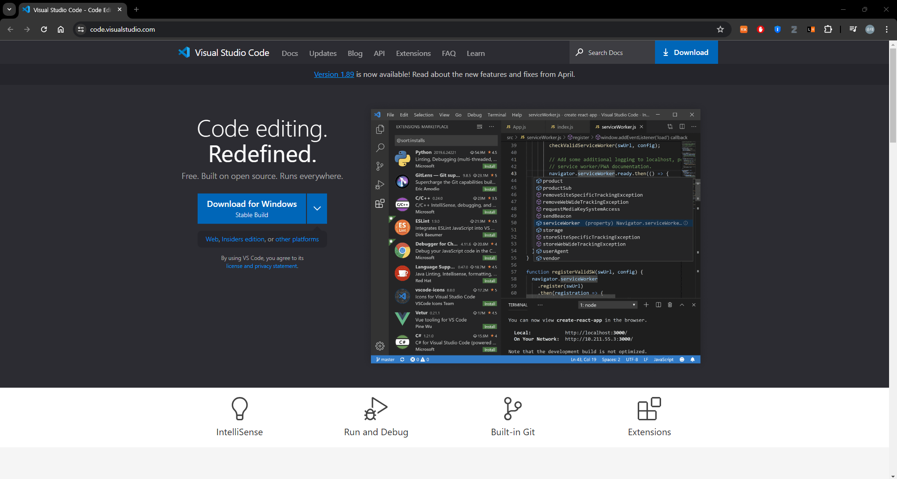
2. `Download for Window` 클릭하여 다운로드
3. 다운로드 된 파일 실행하여 설치
     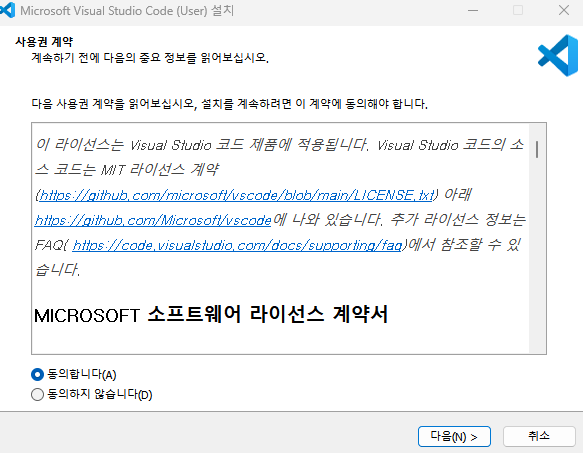
     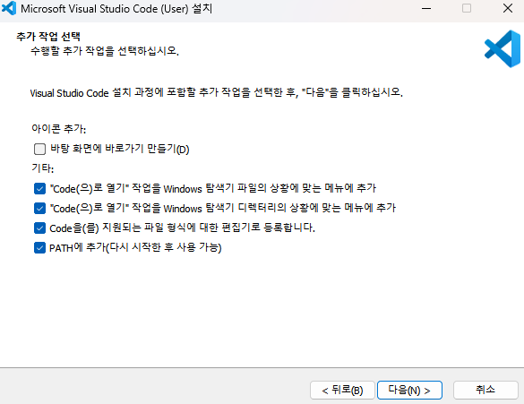
     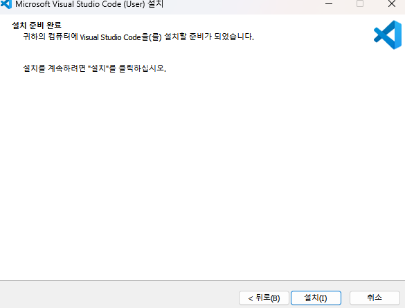
     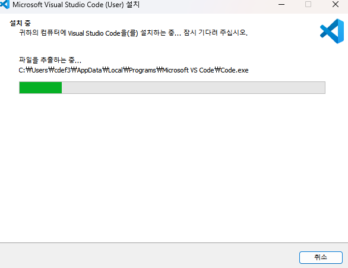
     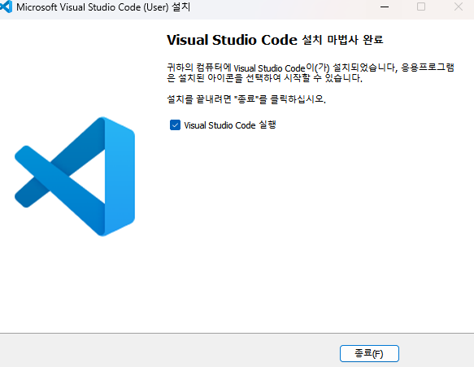
---
## Install .NET SDK

1. [홈페이지](https://dotnet.microsoft.com/ko-kr/download)로 이동 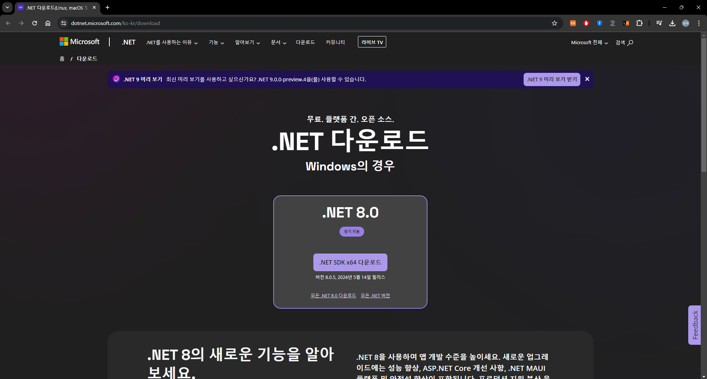
2. `.NET SDK x64 다운로드` 클릭하여 다운로드
3. 다운로드 된 파일 실행하여 설치
     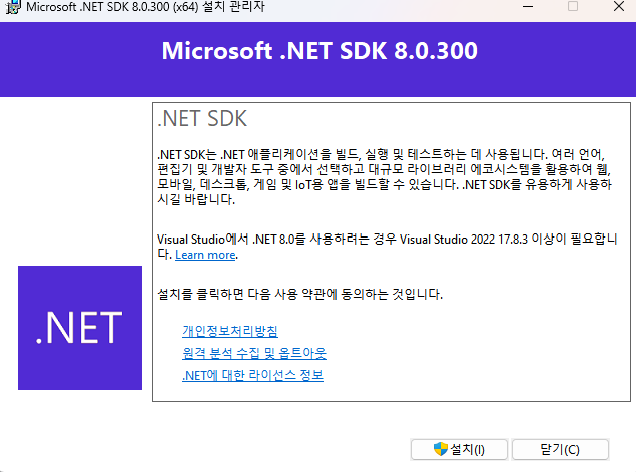
     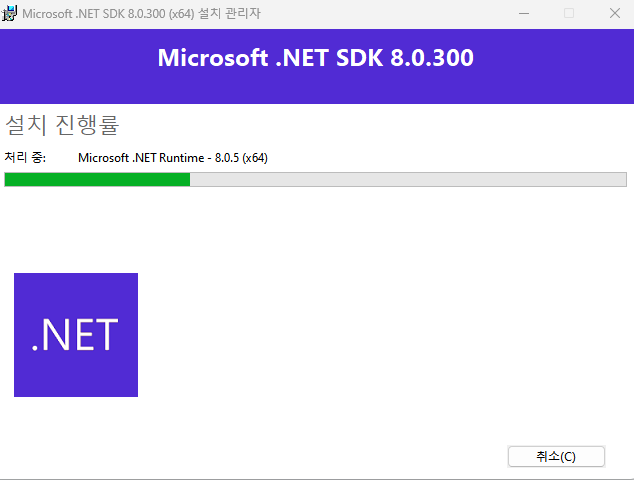
     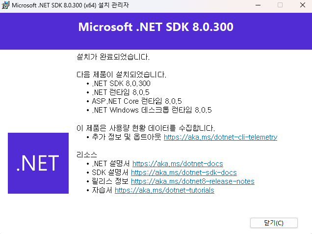

---
## Install VS Code C# Dev Kit extension

1. VS Code 실행
     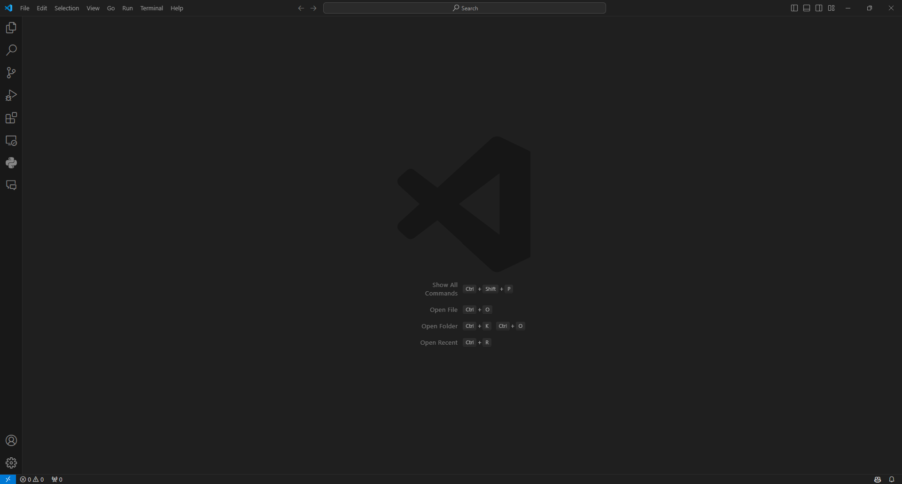
2. Extensions 탭 이동
     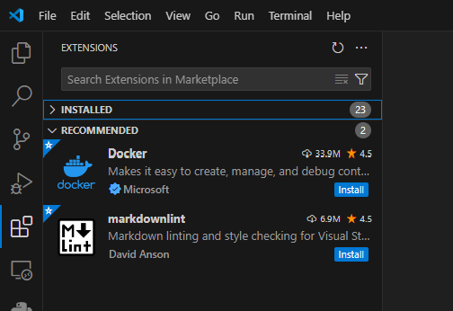
3. `C#` 검색
     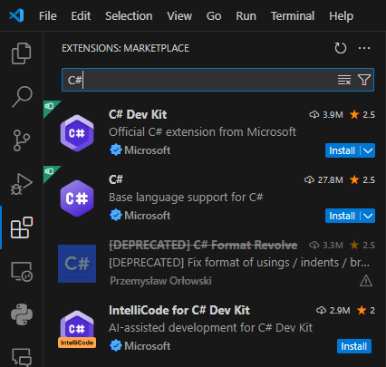
4. `C# Dev Kit` 설치
     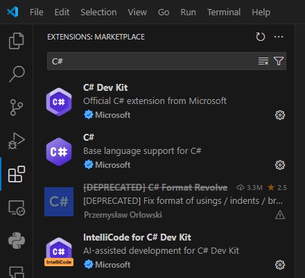
---
## 출처
 - [Getting Started with C# in VS Code](https://code.visualstudio.com/docs/csharp/get-started)
