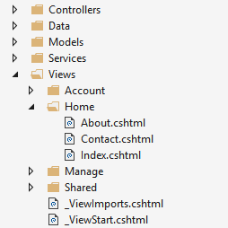
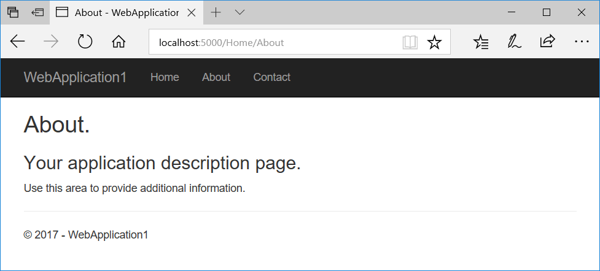

# Views in ASP.NET Core MVC

## 목차
- [Views in ASP.NET Core MVC](#views-in-aspnet-core-mvc)
  - [목차](#목차)
  - [뷰 사용의 장점](#뷰-사용의-장점)
  - [뷰 생성](#뷰-생성)
  - [컨트롤러가 뷰를 지정하는 방법](#컨트롤러가-뷰를-지정하는-방법)
    - [뷰 검색](#뷰-검색)
  - [뷰에 데이터 전달](#뷰에-데이터-전달)
    - [강력한 형식 데이터(ViewModel)](#강력한-형식-데이터viewmodel)
    - [약한 형식 데이터(`ViewData`, `[ViewData]` 속성 및 `ViewBag`)](#약한-형식-데이터viewdata-viewdata-속성-및-viewbag)
      - [`ViewData`](#viewdata)
      - [`[ViewData]` 속성](#viewdata-속성)
      - [`ViewBag`](#viewbag)
      - [`ViewData`와 `ViewBag`을 동시에 사용](#viewdata와-viewbag을-동시에-사용)
      - [`ViewData`와 `ViewBag`의 차이점 요약](#viewdata와-viewbag의-차이점-요약)
      - [`ViewData` 또는 `ViewBag`을 언제 사용해야 하는지](#viewdata-또는-viewbag을-언제-사용해야-하는지)
    - [동적 뷰](#동적-뷰)
  - [추가 뷰 기능](#추가-뷰-기능)
  - [CSS 격리](#css-격리)
  - [CSS 전처리기 지원](#css-전처리기-지원)
  - [CSS 격리 구성](#css-격리-구성)
    - [스코프 식별자 형식 사용자 지정](#스코프-식별자-형식-사용자-지정)
    - [정적 웹 자산 기본 경로 변경](#정적-웹-자산-기본-경로-변경)
    - [자동 번들링 비활성화](#자동-번들링-비활성화)
  - [Razor 클래스 라이브러리(RCL) 지원](#razor-클래스-라이브러리rcl-지원)
  - [출처](#출처)
  - [다음](#다음)

---

이 문서는 ASP.NET Core MVC 애플리케이션에서 사용되는 뷰에 대해 설명합니다. Razor Pages에 대한 정보는 [Introduction to Razor Pages in ASP.NET Core](https://learn.microsoft.com/en-us/aspnet/core/razor-pages/?view=aspnetcore-8.0)를 참조하십시오.

모델-뷰-컨트롤러(MVC) 패턴에서 *뷰*는 애플리케이션의 데이터 표시 및 사용자 상호 작용을 처리합니다. 뷰는 임베디드 Razor 마크업을 사용하는 HTML 템플릿입니다. Razor 마크업은 HTML 마크업과 상호 작용하여 클라이언트에 전송되는 웹 페이지를 생성하는 코드입니다.

ASP.NET Core MVC에서 뷰는 Razor 마크업에 C# 프로그래밍 언어를 사용하는 `.cshtml` 파일입니다. 일반적으로 뷰 파일은 애플리케이션의 컨트롤러별로 이름이 지정된 폴더에 그룹화됩니다. 이러한 폴더는 애플리케이션 루트의 `Views` 폴더에 저장됩니다:



`Home` 컨트롤러는 `Views` 폴더 안의 `Home` 폴더로 표현됩니다. `Home` 폴더에는 `About`, `Contact`, `Index`(홈페이지) 웹 페이지의 뷰가 포함되어 있습니다. 사용자가 이 세 웹 페이지 중 하나를 요청하면 `Home` 컨트롤러의 컨트롤러 작업이 세 개의 뷰 중 어느 것을 사용하여 웹 페이지를 작성하고 사용자에게 반환할지를 결정합니다.

레이아웃을 사용하여 일관된 웹 페이지 섹션을 제공하고 코드 중복을 줄일 수 있습니다. 레이아웃에는 종종 헤더, 내비게이션 및 메뉴 요소, 푸터가 포함됩니다. 헤더와 푸터에는 일반적으로 많은 메타데이터 요소 및 스크립트 및 스타일 자산에 대한 링크에 대한 기본 마크업이 포함됩니다. 레이아웃을 사용하면 뷰에서 이러한 기본 마크업을 피할 수 있습니다.

부분 뷰는 뷰의 재사용 가능한 부분을 관리하여 코드 중복을 줄입니다. 예를 들어, 여러 뷰에 나타나는 블로그 웹사이트의 작가 약력에 부분 뷰가 유용할 수 있습니다. 작가 약력은 일반적인 뷰 콘텐츠이며, 웹 페이지 콘텐츠를 생성하기 위해 코드를 실행할 필요가 없습니다. 작가 약력 콘텐츠는 모델 바인딩만으로 뷰에 제공되므로, 이러한 유형의 콘텐츠에는 부분 뷰를 사용하는 것이 이상적입니다.

뷰 컴포넌트는 부분 뷰와 유사하게 반복적인 코드를 줄일 수 있지만, 서버에서 실행되어 웹 페이지를 렌더링하기 위해 코드가 필요한 뷰 콘텐츠에 적합합니다. 뷰 컴포넌트는 데이터베이스 상호 작용이 필요한 웹 사이트 쇼핑 카트와 같은 경우에 유용합니다. 뷰 컴포넌트는 웹 페이지 출력을 생성하기 위해 모델 바인딩에 제한되지 않습니다.

## 뷰 사용의 장점

뷰는 MVC 앱 내에서 사용자 인터페이스 마크업을 애플리케이션의 다른 부분과 분리하여 관심사의 분리를 확립하는 데 도움이 됩니다. SoC 설계를 따르면 애플리케이션을 모듈화할 수 있으며, 이는 여러 가지 이점을 제공합니다:

* 애플리케이션이 더 잘 구성되어 유지 관리가 용이해집니다. 뷰는 일반적으로 앱 기능별로 그룹화됩니다. 이를 통해 기능 작업 시 관련 뷰를 더 쉽게 찾을 수 있습니다.
* 애플리케이션의 부분이 느슨하게 결합됩니다. 비즈니스 로직 및 데이터 액세스 구성 요소와는 별도로 뷰를 작성하고 업데이트할 수 있습니다. 앱의 다른 부분을 업데이트할 필요 없이 뷰를 수정할 수 있습니다.
* 뷰가 별도의 단위이기 때문에 애플리케이션의 사용자 인터페이스 부분을 테스트하기가 더 쉽습니다.
* 더 나은 구성으로 인해 사용자 인터페이스 섹션을 실수로 반복할 가능성이 줄어듭니다.

## 뷰 생성

컨트롤러에 특정한 뷰는 `Views/[ControllerName]` 폴더에 생성됩니다. 컨트롤러 간에 공유되는 뷰는 `Views/Shared` 폴더에 배치됩니다. 뷰를 생성하려면 새 파일을 추가하고 `.cshtml` 파일 확장자로 관련 컨트롤러 작업과 동일한 이름을 지정하십시오. `Home` 컨트롤러의 `About` 작업에 해당하는 뷰를 생성하려면 `Views/Home` 폴더에 `About.cshtml` 파일을 만드십시오:

```cshtml
@{
    ViewData["Title"] = "About";
}
<h2>@ViewData["Title"].</h2>
<h3>@ViewData["Message"]</h3>

<p>Use this area to provide additional information.</p>
```

Razor 마크업은 `@` 기호로 시작합니다. 중괄호(`{ ... }`)로 구분된 Razor 코드 블록 내에 C# 코드를 배치하여 C# 문을 실행할 수 있습니다. 예를 들어, 위에 표시된 "About"를 `ViewData["Title"]`에 할당하는 것을 참조하십시오. HTML 내에 값을 표시하려면 단순히 `@` 기호로 값을 참조하면 됩니다. 위의 `<h2>` 및 `<h3>` 요소의 내용을 참조하십시오.

위에 표시된 뷰 콘텐츠는 사용자에게 렌더링되는 전체 웹 페이지의 일부에 불과합니다. 페이지의 나머지 레이아웃 및 뷰의 다른 공통 요소는 다른 뷰 파일에 지정됩니다. 자세한 내용은 레이아웃 주제를 참조하십시오.

## 컨트롤러가 뷰를 지정하는 방법

뷰는 일반적으로 `ViewResult`로 반환되며, 이는 `ActionResult`의 한 유형입니다. 작업 메서드는 `ViewResult`를 직접 생성하고 반환할 수 있지만, 일반적으로 그렇게 하지 않습니다. 대부분의 컨트롤러가 `Controller`에서 상속되므로, `View` 도우미 메서드를 사용하여 `ViewResult`를 반환하기만 하면 됩니다:

`HomeController.cs`:

```C#
public IActionResult About()
{
    ViewData["Message"] = "Your application description page.";

    return View();
}
```

이 작업이 반환되면, 이전 섹션에 표시된 `About.cshtml` 뷰가 다음과 같은 웹 페이지로 렌더링됩니다:



`View` 도우미 메서드에는 여러 오버로드가 있습니다. 선택적으로 다음을 지정할 수 있습니다:

* 명시적으로 반환할 뷰:

  ```csharp
  return View("Orders");
  ```

* 뷰에 전달할 모델:

  ```csharp
  return View(Orders);
  ```

* 뷰와 모델 모두:

  ```csharp
  return View("Orders", Orders);
  ```

### 뷰 검색

작업이 뷰를 반환할 때, *뷰 검색*이라는 프로세스가 실행됩니다. 이 프로세스는 뷰 이름을 기준으로 사용할 뷰 파일을 결정합니다.

`View` 메서드(`return View();`)의 기본 동작은 호출된 작업 메서드와 동일한 이름의 뷰를 반환하는 것입니다. 예를 들어, 컨트롤러의 `About` `ActionResult` 메서드 이름은 `About.cshtml`이라는 뷰 파일을 찾기 위해 사용됩니다. 먼저 런타임은 `Views/[ControllerName]` 폴더에서 뷰를 찾습니다. 일치하는 뷰를 찾지 못하면 `Shared` 폴더에서 뷰를 검색합니다.

`ViewResult`를 `return View();`로 암시적으로 반환하거나, `return View("<ViewName>");`로 뷰 이름을 `View` 메서드에 명시적으로 전달하더라도 상관없습니다. 두 경우 모두 뷰 검색은 다음 순서로 일치하는 뷰 파일을 검색합니다:

1. `Views/\[ControllerName]/\[ViewName].cshtml`
2. `Views/Shared/\[ViewName].cshtml`

뷰 파일 경로는 뷰 이름 대신 제공될 수 있습니다. 애플리케이션 루트에서 시작하는 절

대 경로를 사용할 경우(선택적으로 "/" 또는 "~/"로 시작), `.cshtml` 확장자를 지정해야 합니다:

```csharp
return View("Views/Home/About.cshtml");
```

상대 경로를 사용하여 `.cshtml` 확장자 없이 다른 디렉터리의 뷰를 지정할 수도 있습니다. `HomeController` 내부에서 상대 경로를 사용하여 `Manage` 뷰의 `Index` 뷰를 반환할 수 있습니다:

```csharp
return View("../Manage/Index");
```

마찬가지로, "./" 접두사를 사용하여 현재 컨트롤러 특정 디렉터리를 나타낼 수 있습니다:

```csharp
return View("./About");
```

부분 뷰 및 뷰 컴포넌트는 유사하지만 동일하지 않은 검색 메커니즘을 사용합니다.

앱 내에서 뷰를 찾는 기본 규칙을 사용자 정의하려면 사용자 지정 `IViewLocationExpander`를 사용하십시오.

뷰 검색은 파일 이름으로 뷰 파일을 찾는 데 의존합니다. 기본 파일 시스템이 대소문자를 구분하는 경우, 뷰 이름도 대소문자를 구분할 가능성이 있습니다. 운영 체제 간의 호환성을 위해, 컨트롤러 및 작업 이름과 관련 뷰 폴더 및 파일 이름 간의 대소문자를 일치시키십시오. 대소문자를 구분하는 파일 시스템에서 작업할 때 뷰 파일을 찾을 수 없다는 오류가 발생하면, 요청된 뷰 파일과 실제 뷰 파일 이름 간의 대소문자가 일치하는지 확인하십시오.

유지 관리 및 명확성을 위해 컨트롤러, 작업 및 뷰 간의 관계를 반영하도록 뷰 파일 구조를 구성하는 모범 사례를 따르십시오.

## 뷰에 데이터 전달

여러 가지 접근 방식을 사용하여 뷰에 데이터를 전달할 수 있습니다:

* 강력한 형식 데이터: ViewModel
* 약한 형식 데이터
  * `ViewData` (`ViewDataAttribute`)
  * `ViewBag`

### 강력한 형식 데이터(ViewModel)

가장 강력한 접근 방식은 뷰에서 모델 유형을 지정하는 것입니다. 이 모델은 일반적으로 *ViewModel*이라고 합니다. 작업에서 뷰로 ViewModel 유형의 인스턴스를 전달합니다.

뷰에 데이터를 전달하기 위해 ViewModel을 사용하는 것은 뷰가 *강력한* 타입 검사의 이점을 누릴 수 있도록 합니다. *강력한 형식* 또는 *강력한 형식 지정*은 모든 변수 및 상수가 명시적으로 정의된 유형(예: `string`, `int`, 또는 `DateTime`)을 갖는 것을 의미합니다. 뷰에서 사용된 유형의 유효성은 컴파일 시간에 검사됩니다.

[Visual Studio](https://visualstudio.microsoft.com) 및 [Visual Studio Code](https://code.visualstudio.com/)는 [IntelliSense](/visualstudio/ide/using-intellisense)라는 기능을 사용하여 강력한 형식의 클래스 멤버를 나열합니다. ViewModel의 속성을 보려면 ViewModel의 변수 이름 뒤에 점(`.`)을 입력하십시오. 이는 더 빠르고 오류가 적은 코드 작성을 도와줍니다.

`@model` 지시문을 사용하여 모델을 지정하십시오. `@Model`을 사용하여 모델을 사용하십시오:

```cshtml
@model WebApplication1.ViewModels.Address

<h2>Contact</h2>
<address>
    @Model.Street<br>
    @Model.City, @Model.State @Model.PostalCode<br>
    <abbr title="Phone">P:</abbr> 425.555.0100
</address>
```

컨트롤러는 모델을 매개변수로 전달하여 뷰에 제공합니다:

```csharp
public IActionResult Contact()
{
    ViewData["Message"] = "Your contact page.";

    var viewModel = new Address()
    {
        Name = "Microsoft",
        Street = "One Microsoft Way",
        City = "Redmond",
        State = "WA",
        PostalCode = "98052-6399"
    };

    return View(viewModel);
}
```

뷰에 제공할 수 있는 모델 유형에 대한 제한은 없습니다. 메서드가 정의되지 않은 간단한 POCO(Plain Old CLR Object) ViewModel을 사용하는 것이 좋습니다. 일반적으로 ViewModel 클래스는 `Models` 폴더 또는 앱 루트의 별도 `ViewModels` 폴더에 저장됩니다. 위 예제에서 사용된 `Address` ViewModel은 `Address.cs`라는 파일에 저장된 POCO ViewModel입니다:

```csharp
namespace WebApplication1.ViewModels
{
    public class Address
    {
        public string Name { get; set; }
        public string Street { get; set; }
        public string City { get; set; }
        public string State { get; set; }
        public string PostalCode { get; set; }
    }
}
```

뷰모델 유형과 비즈니스 모델 유형 모두에 동일한 클래스를 사용할 수 있습니다. 그러나 별도의 모델을 사용하면 뷰가 애플리케이션의 비즈니스 로직 및 데이터 액세스 부분과 독립적으로 변동될 수 있습니다. 모델과 뷰모델을 분리하면 사용자로부터 앱으로 전송된 데이터를 위해 모델 바인딩 및 유효성 검사를 사용하는 경우 보안상의 이점도 제공합니다.

### 약한 형식 데이터(`ViewData`, `[ViewData]` 속성 및 `ViewBag`)

`ViewBag`은 기본적으로 Razor Pages `PageModel` 클래스에서 사용 가능하지 않습니다.

강력한 형식의 뷰 외에도 뷰는 *약한 형식* (또는 *느슨한 형식*)의 데이터 컬렉션에 접근할 수 있습니다. 강력한 형식과는 달리, *약한 형식*은 사용 중인 데이터의 유형을 명시적으로 선언하지 않는 것을 의미합니다. 약한 형식의 데이터 컬렉션을 사용하여 컨트롤러와 뷰 간에 소량의 데이터를 전달할 수 있습니다.

| 데이터 전달 간 ...                           | 예시                                                               |
| -------------------------------------------- | ------------------------------------------------------------------ |
| 컨트롤러와 뷰                                 | 데이터로 드롭다운 목록을 채웁니다.                                   |
| 뷰와 레이아웃 뷰    | 뷰 파일에서 레이아웃 뷰의 `<title>` 요소 콘텐츠를 설정합니다.       |
| 부분 뷰와 뷰       | 사용자가 요청한 웹 페이지에 따라 데이터를 표시하는 위젯입니다.       |

이 컬렉션은 컨트롤러와 뷰에서 `ViewData` 또는 `ViewBag` 속성을 통해 참조할 수 있습니다. `ViewData` 속성은 약한 형식 객체의 딕셔너리입니다. `ViewBag` 속성은 기본 `ViewData` 컬렉션에 대한 동적 속성을 제공하는 래퍼입니다. 참고: `ViewData` 및 `ViewBag` 모두에 대한 키 조회는 대소문자를 구분하지 않습니다.

`ViewData`와 `ViewBag`은 런타임에 동적으로 해석됩니다. 컴파일 시간 타입 검사를 제공하지 않으므로, 둘 다 일반적으로 ViewModel을 사용하는 것보다 오류가 발생하기 쉽습니다. 이로 인해 일부 개발자는 `ViewData` 및 `ViewBag`을 최소한으로 또는 전혀 사용하지 않습니다.


#### `ViewData`

`ViewData`는 `ViewDataDictionary` 객체로, `string` 키를 통해 접근합니다. 문자열 데이터는 캐스트 없이 직접 저장하고 사용할 수 있지만, 다른 `ViewData` 객체 값을 추출할 때는 특정 타입으로 캐스트해야 합니다. `ViewData`를 사용하여 컨트롤러에서 뷰로, 뷰 내에서(부분 뷰 및 레이아웃 포함) 데이터를 전달할 수 있습니다.

다음은 `ViewData`를 사용하여 인사말과 주소 값을 설정하는 작업의 예입니다:

```csharp
public IActionResult SomeAction()
{
    ViewData["Greeting"] = "Hello";
    ViewData["Address"]  = new Address()
    {
        Name = "Steve",
        Street = "123 Main St",
        City = "Hudson",
        State = "OH",
        PostalCode = "44236"
    };

    return View();
}
```

뷰에서 데이터를 사용하는 예:

```cshtml
@{
    // Address는 문자열이 아니므로 캐스트가 필요합니다.
    var address = ViewData["Address"] as Address;
}

@ViewData["Greeting"] World!

<address>
    @address.Name<br>
    @address.Street<br>
    @address.City, @address.State @address.PostalCode
</address>
```

#### `[ViewData]` 속성

또 다른 `ViewDataDictionary`을 사용하는 접근 방식은 `ViewDataAttribute`입니다. `[ViewData]` 속성으로 표시된 컨트롤러 또는 Razor Page 모델의 속성은 딕셔너리에 저장되고 로드됩니다.

다음 예제에서 Home 컨트롤러는 `[ViewData]`로 표시된 `Title` 속성을 포함합니다. `About` 메서드는 About 뷰에 대한 제목을 설정합니다:

```csharp
public class HomeController : Controller
{
    [ViewData]
    public string Title { get; set; }

    public IActionResult About()
    {
        Title = "About Us";
        ViewData["Message"] = "Your application description page.";

        return View();
    }
}
```

레이아웃에서 제목은 ViewData 딕셔너리에서 읽어옵니다:

```cshtml
<!DOCTYPE html>
<html lang="en">
<head>
    <title>@ViewData["Title"] - WebApplication</title>
    ...
```

#### `ViewBag`

`ViewBag`은 기본적으로 Razor Pages `PageModel` 클래스에서 사용 가능하지 않습니다.

`ViewBag`은 기본 `ViewData` 컬렉션에 저장된 객체에 대한 동적 접근을 제공하는 `Microsoft.AspNetCore.Mvc.ViewFeatures.Internal.DynamicViewData` 객체입니다. `ViewBag`은 캐스트가 필요하지 않기 때문에 작업하기 더 편리할 수 있습니다. 다음 예제는 위에서 `ViewData`를 사용한 것과 동일한 결과를 보여줍니다:

```csharp
public IActionResult SomeAction()
{
    ViewBag.Greeting = "Hello";
    ViewBag.Address  = new Address()
    {
        Name = "Steve",
        Street = "123 Main St",
        City = "Hudson",
        State = "OH",
        PostalCode = "44236"
    };

    return View();
}
```

```cshtml
@ViewBag.Greeting World!

<address>
    @ViewBag.Address.Name<br>
    @ViewBag.Address.Street<br>
    @ViewBag.Address.City, @ViewBag.Address.State @ViewBag.Address.PostalCode
</address>
```

#### `ViewData`와 `ViewBag`을 동시에 사용

`ViewBag`은 기본적으로 Razor Pages `PageModel` 클래스에서 사용 가능하지 않습니다.

`ViewData`와 `ViewBag`은 동일한 기본 `ViewData` 컬렉션을 참조하기 때문에, `ViewData`와 `ViewBag`을 모두 사용하고 값을 읽고 쓸 때 혼합하여 사용할 수 있습니다.

`About.cshtml` 뷰의 상단에서 `ViewBag`을 사용하여 제목을 설정하고 `ViewData`를 사용하여 설명을 설정하십시오:

```cshtml
@{
    Layout = "/Views/Shared/_Layout.cshtml";
    ViewBag.Title = "About Contoso";
    ViewData["Description"] = "Let us tell you about Contoso's philosophy and mission.";
}
```

속성을 읽을 때는 `ViewData`와 `ViewBag`의 사용을 반대로 합니다. `_Layout.cshtml` 파일에서 `ViewData`를 사용하여 제목을 얻고 `ViewBag`을 사용하여 설명을 얻습니다:

```cshtml
<!DOCTYPE html>
<html lang="en">
<head>
    <title>@ViewData["Title"]</title>
    <meta name="description" content="@ViewBag.Description">
    ...
```

문자열은 `ViewData`에 대해 캐스트가 필요하지 않습니다. `@ViewData["Title"]`을 캐스트 없이 사용할 수 있습니다.

동시에 `ViewData`와 `ViewBag`을 사용하는 것이 가능하며, 속성을 읽고 쓰는 것을 혼합하는 것도 가능합니다. 다음 마크업이 렌더링됩니다:

```html
<!DOCTYPE html>
<html lang="en">
<head>
    <title>About Contoso</title>
    <meta name="description" content="Let us tell you about Contoso's philosophy and mission.">
    ...
```

#### `ViewData`와 `ViewBag`의 차이점 요약

`ViewBag`은 기본적으로 Razor Pages `PageModel` 클래스에서 사용 가능하지 않습니다.

* `ViewData`
  * `ViewDataDictionary`에서 파생되므로 `ContainsKey`, `Add`, `Remove`, `Clear`와 같은 딕셔너리 속성을 사용할 수 있습니다.
  * 딕셔너리의 키는 문자열이므로 공백이 허용됩니다. 예: `ViewData["Some Key With Whitespace"]`
  * `string` 이외의 모든 유형은 `ViewData`를 사용하여 뷰에서 캐스트해야 합니다.
* `ViewBag`
  * `Microsoft.AspNetCore.Mvc.ViewFeatures.Internal.DynamicViewData`에서 파생되므로 점 표기법(`@ViewBag.SomeKey = <value or object>`)을 사용하여 동적 속성을 생성할 수 있으며, 캐스트가 필요하지 않습니다. `ViewBag`의 구문은 컨트롤러와 뷰에 추가할 때 더 빠릅니다.
  * 널 값 확인이 더 간단합니다. 예: `@ViewBag.Person?.Name`

#### `ViewData` 또는 `ViewBag`을 언제 사용해야 하는지

`ViewData`와 `ViewBag` 모두 컨트롤러와 뷰 간에 소량의 데이터를 전달하는 유효한 접근 방식입니다. 어느 것을 사용할지는 선호도에 따라 다릅니다. `ViewData`와 `ViewBag` 객체를 혼합하여 사용할 수 있지만, 일관된 접근 방식을 사용하는 것이 코드를 더 읽기 쉽고 유지 관리하기 쉽습니다. 두 접근 방식 모두 런타임에 동적으로 해석되므로 런타임 오류를 유발하기 쉽습니다. 일부 개발 팀은 이를 피합니다.

### 동적 뷰

`@model`을 사용하여 모델 유형을 선언하지 않지만 모델 인스턴스가 전달된 뷰(예: `return View(Address);`)는 인스턴스의 속성을 동적으로 참조할 수 있습니다:

```cshtml
<address>
    @Model.Street<br>
    @Model.City, @Model.State @Model.PostalCode<br>
    <abbr title="Phone">P:</abbr> 425.555.0100
</address>
```

이 기능은 유연성을 제공하지만 컴파일 보호 또는 IntelliSense를 제공하지 않습니다. 속성이 존재하지 않으면 웹 페이지 생성이 런타임에 실패합니다.

## 추가 뷰 기능

태그 헬퍼는 기존 HTML 태그에 서버 측 동작을 쉽게 추가할 수 있게 합니다. 태그 헬퍼를 사용하면 뷰 내에서 사용자 정의 코드 또는 헬퍼를 작성할 필요가 없습니다. 태그 헬퍼는 HTML 요소에 속성으로 적용되며, 이를 처리할 수 없는 편집기는 무시합니다. 이를 통해 다양한 도구에서 뷰 마크업을 편집하고 렌더링할 수 있습니다.

많은 내장 HTML 헬퍼를 사용하여 사용자 정의 HTML 마크업을 생성할 수 있습니다. 더 복잡한 사용자 인터페이스 로직은 뷰 컴포넌트로 처리할 수 있습니다. 뷰 컴포넌트는 컨트롤러와 뷰가 제공하는 것과 동일한 SoC(관심사의 분리)를 제공합니다. 공통 사용자 인터페이스 요소에 사용되는 데이터를 처리하는 작업 및 뷰가 필요하지 않도록 할 수 있습니다.

ASP.NET Core의 다른 많은 측면과 마찬가지로 뷰는 의존성 주입을 지원하여 뷰에 서비스 주입을 허용합니다.

## CSS 격리

개별 페이지, 뷰 및 구성 요소에 CSS 스타일을 격리하여 다음을 줄이거나 방지할 수 있습니다:

* 유지 관리가 어려운 전역 스타일에 대한 의존성.
* 중첩된 콘텐츠에서 스타일 충돌.

페이지나 뷰에 *스코프된 CSS 파일*을 추가하려면, CSS 스타일을 해당 `.cshtml` 파일과 동일한 이름의 `.cshtml.css` 파일에 배치하십시오. 다음 예제에서, `Index.cshtml.css` 파일은 `Index.cshtml` 페이지나 뷰에만 적용되는 CSS 스타일을 제공합니다.

`Pages/Index.cshtml.css`(Razor Pages) 또는 `Views/Index.cshtml.css`(MVC):

```css
h1 {
    color: red;
}
```

CSS 격리는 빌드 시점에 발생합니다. 프레임워크는 애플리케이션의 페이지나 뷰에서 렌더링된 마크업과 일치하도록 CSS 선택자를 재작성합니다. 재작성된 CSS 스타일은 번들로 묶여 `{APP ASSEMBLY}.styles.css`라는 정적 자산으로 생성됩니다. `{APP ASSEMBLY}` 플레이스홀더는 프로젝트의 어셈블리 이름입니다. 번들로 묶인 CSS 스타일에 대한 링크는 애플리케이션의 레이아웃에 배치됩니다.

애플리케이션의 `Pages/Shared/_Layout.cshtml`(Razor Pages) 또는 `Views/Shared/_Layout.cshtml`(MVC)의 `<head>` 콘텐츠에 번들로 묶인 CSS 스타일에 대한 링크를 추가하거나 존재하는지 확인하십시오:

```html
<link rel="stylesheet" href="~/{APP ASSEMBLY}.styles.css" />
```

다음 예제에서 애플리케이션의 어셈블리 이름은 `WebApp`입니다:

```html
<link rel="stylesheet" href="WebApp.styles.css" />
```

스코프된 CSS 파일에 정의된 스타일은 일치하는 파일의 렌더링된 출력에만 적용됩니다. 앞의 예제에서 애플리케이션의 다른 곳에서 정의된 모든 `h1` CSS 선언은 `Index`의 헤딩 스타일과 충돌하지 않습니다. 스코프된 CSS 파일의 경우에도 CSS 스타일 계단식 및 상속 규칙은 그대로 적용됩니다. 예를 들어, `Index.cshtml` 파일의 `<h1>` 요소에 직접 적용된 스타일은 `Index.cshtml.css`의 스코프된 CSS 파일의 스타일을 재정의합니다.

> [!NOTE]
> 번들링이 발생할 때 CSS 스타일 격리를 보장하기 위해, Razor 코드 블록에서 CSS를 가져오는 것은 지원되지 않습니다.
>
> CSS 격리는 HTML 요소에만 적용됩니다. 태그 헬퍼에는 CSS 격리가 지원되지 않습니다.

번들로 묶인 CSS 파일 내에서 각 페이지, 뷰 또는 Razor 구성 요소는 `b-{STRING}` 형식의 스코프 식별자와 연결됩니다. `{STRING}` 플레이스홀더는 프레임워크에서 생성된 10자리 문자열입니다. 다음 예제는 Razor Pages 애플리케이션의 `Index` 페이지에서 앞서 언급한 `<h1>` 요소에 대한 스타일을 제공합니다:

```css
/* /Pages/Index.cshtml.rz.scp.css */
h1[b-3xxtam6d07] {
    color: red;
}
```

번들 파일에서 CSS 스타일이 적용된 `Index` 페이지에서는 스코프 식별자가 HTML 속성으로 추가됩니다:

```html
<h1 b-3xxtam6d07>
```

식별자는 애플리케이션에 고유합니다. 빌드 시점에 프로젝트 번들이 `{STATIC WEB ASSETS BASE PATH}/Project.lib.scp.css` 규칙으로 생성됩니다. `{STATIC WEB ASSETS BASE PATH}`는 정적 웹 자산의 기본 경로입니다.

NuGet 패키지나 Razor 클래스 라이브러리와 같은 다른 프로젝트를 사용할 경우, 번들 파일은 다음과 같습니다:

* CSS 가져오기를 사용하여 스타일을 참조합니다.
* 스타일을 사용하는 애플리케이션의 정적 웹 자산으로 게시되지 않습니다.

## CSS 전처리기 지원

CSS 전처리기는 변수, 중첩, 모듈, 믹스인 및 상속과 같은 기능을 활용하여 CSS 개발을 개선하는 데 유용합니다. CSS 격리는 Sass 또는 Less와 같은 CSS 전처리기를 기본적으로 지원하지 않지만, 빌드 프로세스 중에 프레임워크가 CSS 선택자를 재작성하기 전에 전처리기 컴파일이 발생하는 한 CSS 전처리기를 통합하는 것은 원활합니다. 예를 들어 Visual Studio를 사용하는 경우, Visual Studio Task Runner Explorer에서 기존 전처리기 컴파일을 **빌드 전** 작업으로 구성하십시오.

`AspNetCore.SassCompiler`와 같은 많은 타사 NuGet 패키지는 빌드 프로세스 시작 시 SASS/SCSS 파일을 컴파일하여 CSS 격리가 발생하기 전에 CSS 선택자를 재작성합니다.

## CSS 격리 구성

CSS 격리는 기존 도구나 워크플로에 대한 종속성이 있는 고급 시나리오에 대해 구성을 허용합니다.

### 스코프 식별자 형식 사용자 지정

*이 섹션에서 `{Pages|Views}` 플레이스홀더는 Razor Pages 애플리케이션의 경우 `Pages` 또는 MVC 애플리케이션의 경우 `Views`입니다.*

기본적으로 스코프 식별자는 `{STRING}` 플레이스홀더가 10자리 문자열인 `b-{STRING}` 형식을 사용합니다. 스코프 식별자 형식을 사용자 지정하려면 프로젝트 파일을 원하는 패턴으로 업데이트하십시오:

```xml
<ItemGroup>
  <None Update="{Pages|Views}/Index.cshtml.css" CssScope="custom-scope-identifier" />
</ItemGroup>
```

앞의 예제에서, `Index.cshtml.css`에 대해 생성된 CSS는 스코프 식별자를 `b-{STRING}`에서 `custom-scope-identifier`로 변경합니다.

스코프 식별자를 사용하여 스코프된 CSS 파일에서 상속을 달성할 수 있습니다. 다음 프로젝트 파일 예제에서, `BaseView.cshtml.css` 파일은 뷰 간 공통 스타일을 포함합니다. `DerivedView.cshtml.css` 파일은 이러한 스타일을 상속합니다.

```xml
<ItemGroup>
  <None Update="{Pages|Views}/BaseView.cshtml.css" CssScope="custom-scope-identifier" />
  <None Update="{Pages|Views}/DerivedView.cshtml.css" CssScope="custom-scope-identifier" />
</ItemGroup>
```

와일드카드(`*`) 연산자를 사용하여 여러 파일 간에 스코프 식별자를 공유하십시오:

```xml
<ItemGroup>
  <None Update="{Pages|Views}/*.cshtml.css" CssScope="custom-scope-identifier" />
</ItemGroup>
```

### 정적 웹 자산 기본 경로 변경

스코프된 CSS 파일은 애플리케이션의 루트에 생성됩니다. 프로젝트 파일에서 `StaticWebAssetBasePath` 속성을 사용하여 기본 경로를 변경하십시오. 다음 예제에서는 스코프된 CSS 파일과 애플리케이션의 나머지 자산을 `_content` 경로에 배치합니다:

```xml
<PropertyGroup>
  <StaticWebAssetBasePath>_content/$(PackageId)</StaticWebAssetBasePath>
</PropertyGroup>
```

### 자동 번들링 비활성화

프레임워크가 런타임에 스코프된 파일을 게시하고 로드하는 방식을 옵트 아웃하려면 `DisableScopedCssBundling` 속성을 사용하십시오. 이 속성을 사용할 때 다른 도구나 프로세스는 `obj` 디렉토리에서 격리된 CSS 파일을 가져와 런타임에 게시하고 로드하는 책임이 있습니다:

```xml
<PropertyGroup>
  <DisableScopedCssBundling>true</DisableScopedCssBundling>
</PropertyGroup>
```

## Razor 클래스 라이브러리(RCL) 지원

Razor 클래스 라이브러리(RCL)이 격리된 스타일을 제공할 때, `<link>` 태그의 `href` 속성은 `{STATIC WEB ASSET BASE PATH}/{PACKAGE ID}.bundle.scp.css`를 가리킵니다. 여기서 플레이스홀더는 다음과 같습니다:

* `{STATIC WEB ASSET BASE PATH}`: 정적 웹 자산 기본 경로.
* `{PACKAGE ID}`: 라이브러리의 패키지 식별자. 프로젝트 파일에 패키지 식별자가 지정되지 않은 경우 패키지 식별자는 프로젝트의 어셈블리 이름으로 기본 설정됩니다.

다음 예제에서:

* 정적 웹 자산 기본 경로는 `_content/ClassLib`입니다.
* 클래스 라이브러리의 어셈블리 이름은 `ClassLib`입니다.

`Pages/Shared/_Layout.cshtml`(Razor Pages) 또는 `Views/Shared/_Layout.cshtml`(MVC):

```html


<link href="_content/ClassLib/ClassLib.bundle.scp.css" rel="stylesheet">
```

---
## 출처
[Views in ASP.NET Core MVC](https://learn.microsoft.com/en-us/aspnet/core/mvc/views/overview?view=aspnetcore-8.0)

---
## [다음](./03_Partial_view.md)
