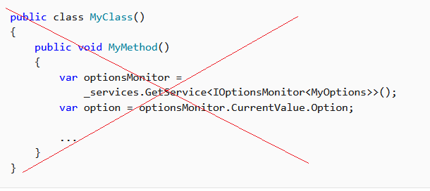

# Dependency injection in ASP.NET Core

## 목차
- [Dependency injection in ASP.NET Core](#dependency-injection-in-aspnet-core)
  - [목차](#목차)
  - [의존성 주입 개요](#의존성-주입-개요)
  - [확장 메서드를 사용하여 서비스 그룹 등록](#확장-메서드를-사용하여-서비스-그룹-등록)
  - [서비스 수명](#서비스-수명)
  - [서비스 등록 메서드](#서비스-등록-메서드)
    - [Keyed services](#keyed-services)
  - [생성자 주입 동작](#생성자-주입-동작)
  - [Entity Framework 컨텍스트](#entity-framework-컨텍스트)
  - [수명 및 등록 옵션](#수명-및-등록-옵션)
  - [앱 시작 시 서비스 해결](#앱-시작-시-서비스-해결)
  - [스코프 검증](#스코프-검증)
  - [요청 서비스](#요청-서비스)
  - [의존성 주입을 위한 서비스 설계](#의존성-주입을-위한-서비스-설계)
    - [서비스의 폐기](#서비스의-폐기)
    - [서비스 컨테이너에 의해 생성되지 않은 서비스](#서비스-컨테이너에-의해-생성되지-않은-서비스)
    - [일시적 및 공유 인스턴스에 대한 IDisposable 지침](#일시적-및-공유-인스턴스에-대한-idisposable-지침)
  - [기본 서비스 컨테이너 교체](#기본-서비스-컨테이너-교체)
  - [권장 사항](#권장-사항)
  - [DI에서 다중 테넌시를 위한 권장 패턴](#di에서-다중-테넌시를-위한-권장-패턴)
  - [프레임워크 제공 서비스](#프레임워크-제공-서비스)
  - [출처](#출처)
  - [다음](#다음)

---

ASP.NET Core는 클래스와 그 의존성 간의 [제어의 역전 (IoC)](https://learn.microsoft.com/en-us/dotnet/standard/modern-web-apps-azure-architecture/architectural-principles#dependency-inversion)을 달성하기 위한 기술인 의존성 주입 (DI) 소프트웨어 디자인 패턴을 지원합니다.

MVC 컨트롤러 내의 의존성 주입에 대한 자세한 내용은 [Dependency injection into controllers in ASP.NET Core](https://learn.microsoft.com/en-us/aspnet/core/mvc/controllers/dependency-injection?view=aspnetcore-8.0)를 참조하십시오.

웹 애플리케이션 외의 애플리케이션에서 의존성 주입을 사용하는 방법에 대한 정보는 [Dependency injection in .NET](https://learn.microsoft.com/en-us/dotnet/core/extensions/dependency-injection)을 참조하십시오.

옵션의 의존성 주입에 대한 자세한 내용은 [Options pattern in ASP.NET Core](https://learn.microsoft.com/en-us/aspnet/core/fundamentals/configuration/options?view=aspnetcore-8.0)를 참조하십시오.

이 주제는 ASP.NET Core에서의 의존성 주입에 대한 정보를 제공합니다. 의존성 주입 사용에 대한 기본 문서는 [Dependency injection in .NET](https://learn.microsoft.com/en-us/dotnet/core/extensions/dependency-injection)에 포함되어 있습니다.

[샘플 코드 보기 또는 다운로드](https://github.com/dotnet/AspNetCore.Docs/tree/main/aspnetcore/fundamentals/dependency-injection/samples) ([다운로드 방법](https://learn.microsoft.com/en-us/aspnet/core/introduction-to-aspnet-core?view=aspnetcore-8.0#how-to-download-a-sample))

## 의존성 주입 개요

*의존성*은 다른 객체가 의존하는 객체입니다. 다음 `MyDependency` 클래스와 같은 메서드를 가진 객체를 살펴보십시오:

```C#
public class MyDependency
{
    public void WriteMessage(string message)
    {
        Console.WriteLine($"MyDependency.WriteMessage called. Message: {message}");
    }
}
```

클래스는 `MyDependency` 클래스의 인스턴스를 생성하여 `WriteMessage` 메서드를 사용할 수 있습니다. 다음 예제에서 `MyDependency` 클래스는 `IndexModel` 클래스의 의존성입니다:

```C#
public class IndexModel : PageModel
{
    private readonly MyDependency _dependency = new MyDependency();

    public void OnGet()
    {
        _dependency.WriteMessage("IndexModel.OnGet");
    }
}
```

클래스는 `MyDependency` 클래스를 생성하고 직접 의존합니다. 이전 예제와 같은 코드 의존성은 다음과 같은 이유로 문제를 일으키며 피해야 합니다:

* `MyDependency`를 다른 구현으로 교체하려면 `IndexModel` 클래스를 수정해야 합니다.
* `MyDependency`에 의존성이 있는 경우, `IndexModel` 클래스에서 이를 구성해야 합니다. 여러 클래스가 `MyDependency`에 의존하는 대형 프로젝트에서는 구성 코드가 앱 전체에 분산됩니다.
* 이 구현은 단위 테스트하기 어렵습니다.

의존성 주입은 다음을 통해 이러한 문제를 해결합니다:

* 의존성 구현을 추상화하기 위해 인터페이스나 기본 클래스를 사용합니다.
* 서비스 컨테이너에 의존성을 등록합니다. ASP.NET Core는 기본 서비스 컨테이너인 `IServiceProvider`를 제공합니다. 서비스는 일반적으로 앱의 `Program.cs` 파일에 등록됩니다.
* 서비스가 사용되는 클래스의 생성자에 서비스를 *주입*합니다. 프레임워크는 의존성 인스턴스를 생성하고 더 이상 필요하지 않을 때 폐기하는 책임을 집니다.

[샘플 앱](https://github.com/dotnet/AspNetCore.Docs/tree/main/aspnetcore/fundamentals/dependency-injection/samples/6.x)에서 `IMyDependency` 인터페이스는 `WriteMessage` 메서드를 정의합니다:

```C#
public interface IMyDependency
{
    void WriteMessage(string message);
}
```

이 인터페이스는 구체적인 타입 `MyDependency`에 의해 구현됩니다:

```C#
public class MyDependency : IMyDependency
{
    public void WriteMessage(string message)
    {
        Console.WriteLine($"MyDependency.WriteMessage Message: {message}");
    }
}
```

샘플 앱은 `IMyDependency` 서비스를 구체적인 타입 `MyDependency`로 등록합니다. `AddScoped` 메서드는 단일 요청의 생애 동안 서비스를 스코프 수명으로 등록합니다. [서비스 수명](#service-lifetimes)은 이 주제에서 후에 설명됩니다.

```C#
using DependencyInjectionSample.Interfaces;
using DependencyInjectionSample.Services;

var builder = WebApplication.CreateBuilder(args);

builder.Services.AddRazorPages();

builder.Services.AddScoped<IMyDependency, MyDependency>();

var app = builder.Build();
```

샘플 앱에서 `IMyDependency` 서비스를 요청하고 `WriteMessage` 메서드를 호출하는 데 사용됩니다:

```C#
public class Index2Model : PageModel
{
    private readonly IMyDependency _myDependency;

    public Index2Model(IMyDependency myDependency)
    {
        _myDependency = myDependency;            
    }

    public void OnGet()
    {
        _myDependency.WriteMessage("Index2Model.OnGet");
    }
}
```

DI 패턴을 사용하면 컨트롤러나 Razor 페이지는:

* 구체적인 타입 `MyDependency`가 아닌 `IMyDependency` 인터페이스만 사용합니다. 이를 통해 컨트롤러나 Razor 페이지를 수정하지 않고 구현을 쉽게 변경할 수 있습니다.
* `MyDependency` 인스턴스를 생성하지 않으며, DI 컨테이너가 이를 생성합니다.

`IMyDependency` 인터페이스의 구현은 내장 로깅 API를 사용하여 개선될 수 있습니다:

```C#
public class MyDependency2 : IMyDependency
{
    private readonly ILogger<MyDependency2> _logger;

    public MyDependency2(ILogger<MyDependency2> logger)
    {
        _logger = logger;
    }

    public void WriteMessage(string message)
    {
        _logger.LogInformation( $"MyDependency2.WriteMessage Message: {message}");
    }
}
```

업데이트된 `Program.cs`는 새로운 `IMyDependency` 구현을 등록합니다:

```C#
using DependencyInjectionSample.Interfaces;
using DependencyInjectionSample.Services;

var builder = WebApplication.CreateBuilder(args);

builder.Services.AddRazorPages();

builder.Services.AddScoped<IMyDependency, MyDependency2>();

var app = builder.Build();
```

`MyDependency2`는 생성자에서 `ILogger<TCategoryName>`를 요청합니다. `ILogger<TCategoryName>`은 프레임워크 제공 서비스입니다.

연쇄 방식으로 의존성 주입을 사용하는 것은 드문 일이 아닙니다. 요청된 각 의존성은 자신의 의존성을 요청합니다. 컨테이너는 그래프에서 의존성을 해결하고 완전히 해결된 서비스를 반환합니다. 해결해야 할 의존성의 집합은 일반적으로 *의존성 트리*, *의존성 그래프* 또는 *객체 그래프*라고 합니다.

컨테이너는 [일반(generic) 오픈 타입](https://learn.microsoft.com/en-us/dotnet/csharp/language-reference/language-specification/types#843-open-and-closed-types)을 활용하여 `ILogger<TCategoryName>`을 해결하며, 모든 [일반(generic) 생성 타입](https://learn.microsoft.com/en-us/dotnet/csharp/language-reference/language-specification/types#84-constructed-types)을 등록할 필요가 없습니다.

의존성 주입 용어에서 서비스는:

* 일반적으로 다른 객체에 서비스를 제공하는 객체로, 예를 들어 `IMyDependency` 서비스입니다.
* 웹 서비스와 관련이 없으며, 서비스는 웹 서비스를 사용할 수 있습니다.

프레임워크는 강력한 [로깅](https://learn.microsoft.com/en-us/aspnet/core/fundamentals/logging/?view=aspnetcore-8.0) 시스템을 제공합니다. 이전 예제에서 `IMyDependency` 구현은 기본 DI를 시연하기 위해 작성되었으며, 로깅을 구현하기 위한 것이 아닙니다. 대부분의 앱은 로거를 작성할 필요가 없습니다. 다음 코드는 기본 로깅을 사용하는 방법을 보여주며, 별도의 서비스 등록이 필요하지 않습니다:

```C#
public class AboutModel : PageModel
{
    private readonly ILogger _logger;

    public AboutModel(ILogger<AboutModel> logger)
    {
        _logger = logger;
    }
    
    public string Message { get; set; } = string.Empty;

    public void OnGet()
    {
        Message = $"About page visited at {DateTime.UtcNow.ToLongTimeString()}";
        _logger.LogInformation(Message);
    }
}
```

이전 코드를 사용하면, [로깅](https://learn.microsoft.com/en-us/aspnet/core/fundamentals/logging/?view=aspnetcore-8.0)은 프레임워크에서 제공되기 때문에 `Program.cs`를 업데이트할 필요가 없습니다.

## 확장 메서드를 사용하여 서비스 그룹 등록

ASP.NET Core 프레임워크는 관련 서비스 그룹을 등록하기 위한 규칙을 사용합니다. 규칙은 단일 `Add{GROUP_NAME}` 확장 메서드를 사용하여 프레임워크 기능에 필요한 모든 서비스를 등록하는 것입니다. 예를 들어, `AddControllers` 확장 메서드는 MVC 컨트롤러에 필요한 서비스를 등록합니다.

다음 코드는 개별 사용자 계정을 사용하는 Razor Pages 템플릿에서 생성된 코드로, `AddDbContext` 및 `AddDefaultIdentity` 확장 메서드를 사용하여 컨테이너에 추가 서비스를 등록하는 방법을 보여줍니다:

```C#
using DependencyInjectionSample.Data;
using Microsoft.AspNetCore.Identity;
using Microsoft.EntityFrameworkCore;

var builder = WebApplication.CreateBuilder(args);

var connectionString = builder.Configuration.GetConnectionString("DefaultConnection");
builder.Services.AddDbContext<ApplicationDbContext>(options =>
    options.UseSqlServer(connectionString));
builder.Services.AddDatabaseDeveloperPageExceptionFilter();

builder.Services.AddDefaultIdentity<IdentityUser>(options => options.SignIn.RequireConfirmedAccount = true)
    .AddEntityFrameworkStores<ApplicationDbContext>();
builder.Services.AddRazorPages();

var app = builder.Build();
```

다음은 서비스를 등록하고 옵션을 구성하는 예입니다:

```C#
using ConfigSample.Options;
using Microsoft.Extensions.DependencyInjection.ConfigSample.Options;

var builder = WebApplication.CreateBuilder(args);

builder.Services.AddRazorPages();

builder.Services.Configure<PositionOptions>(
    builder.Configuration.GetSection(PositionOptions.Position));
builder.Services.Configure<ColorOptions>(
    builder.Configuration.GetSection(ColorOptions.Color));

builder.Services.AddScoped<IMyDependency, MyDependency>();
builder.Services.AddScoped<IMyDependency2, MyDependency2>();

var app = builder.Build();
```

관련된 등록 그룹은 확장 메서드로 이동하여 서비스를 등록할 수 있습니다. 예를 들어, 구성 서비스는 다음 클래스에 추가됩니다:

```C#
using ConfigSample.Options;
using Microsoft.Extensions.Configuration;

namespace Microsoft.Extensions.DependencyInjection
{
    public static class MyConfigServiceCollectionExtensions
    {
        public static IServiceCollection AddConfig(
             this IServiceCollection services, IConfiguration config)
        {
            services.Configure<PositionOptions>(
                config.GetSection(PositionOptions.Position));
            services.Configure<ColorOptions>(
                config.GetSection(ColorOptions.Color));

            return services;
        }

        public static IServiceCollection AddMyDependencyGroup(
             this IServiceCollection services)
        {
            services.AddScoped<IMyDependency, MyDependency>();
            services.AddScoped<IMyDependency2, MyDependency2>();

            return services;
        }
    }
}
```

나머지 서비스는 유사한 클래스에 등록됩니다. 다음 코드는 새로운 확장 메서드를 사용하여 서비스를 등록합니다:

```C#
using Microsoft.Extensions.DependencyInjection.ConfigSample.Options;

var builder = WebApplication.CreateBuilder(args);

builder.Services
    .AddConfig(builder.Configuration)
    .AddMyDependencyGroup();

builder.Services.AddRazorPages();

var app = builder.Build();
```

참고: 각 services.Add{GROUP_NAME} 확장 메서드는 서비스를 추가하고 잠재적으로 구성합니다. 예를 들어, AddControllersWithViews는 뷰가 있는 MVC 컨트롤러에 필요한 서비스를 추가하고, AddRazorPages는 Razor Pages에 필요한 서비스를 추가합니다.

## 서비스 수명

[Dependency injection in .NET](https://learn.microsoft.com/en-us/dotnet/core/extensions/dependency-injection)의 [서비스 수명](https://learn.microsoft.com/en-us/dotnet/core/extensions/dependency-injection#service-lifetimes)을 참조하십시오.

미들웨어에서 스코프 서비스를 사용하려면 다음 방법 중 하나를 사용하십시오:

* 미들웨어의 `Invoke` 또는 `InvokeAsync`메서드에 서비스를 주입합니다. [생성자 주입](https://learn.microsoft.com/en-us/aspnet/core/mvc/controllers/dependency-injection?view=aspnetcore-8.0#constructor-injection)을 사용하면 스코프 서비스가 싱글톤처럼 동작하게 되어 런타임 예외가 발생합니다. [Lifetime and registration options](https://learn.microsoft.com/en-us/aspnet/core/fundamentals/dependency-injection?view=aspnetcore-8.0#lifetime-and-registration-options) 섹션의 샘플은 `InvokeAsync` 접근 방식을 보여줍니다.
* [Factory-based middleware](https://learn.microsoft.com/en-us/aspnet/core/fundamentals/middleware/extensibility?view=aspnetcore-8.0)를 사용합니다. 이 접근 방식으로 등록된 미들웨어는 클라이언트 요청(연결)당 활성화되므로, 스코프 서비스를 미들웨어의 생성자에 주입할 수 있습니다.

자세한 내용은 [Write custom ASP.NET Core middleware](https://learn.microsoft.com/en-us/aspnet/core/fundamentals/middleware/write?view=aspnetcore-8.0#per-request-middleware-dependencies)를 참조하십시오.

## 서비스 등록 메서드

[Dependency injection in .NET](https://learn.microsoft.com/en-us/dotnet/core/extensions/dependency-injection)의 [서비스 등록 메서드](https://learn.microsoft.com/en-us/dotnet/core/extensions/dependency-injection#service-registration-methods)를 참조하십시오.

테스트를 위해 [모킹 유형](https://learn.microsoft.com/en-us/aspnet/core/test/integration-tests?view=aspnetcore-8.0#inject-mock-services)을 사용할 때 여러 구현을 사용하는 것이 일반적입니다.

서비스를 구현 유형으로만 등록하는 것은 해당 서비스와 동일한 구현 및 서비스 유형으로 등록하는 것과 동일합니다. 따라서 명시적인 서비스 유형을 받지 않는 메서드를 사용하여 서비스의 여러 구현을 등록할 수 없습니다. 이러한 메서드는 서비스의 여러 *인스턴스*를 등록할 수 있지만, 모든 인스턴스는 동일한 *구현* 유형을 갖습니다.

위의 서비스 등록 메서드 중 하나를 사용하여 동일한 서비스 유형의 여러 서비스 인스턴스를 등록할 수 있습니다. 다음 예제에서는 `AddSingleton`이 서비스 유형으로 `IMyDependency`를 사용하여 두 번 호출됩니다. 두 번째 `AddSingleton` 호출은 `IMyDependency`로 해결될 때 이전 호출을 덮어쓰며, 여러 서비스를 `IEnumerable<IMyDependency>`로 해결할 때 이전 호출에 추가됩니다. 서비스는 `IEnumerable<{SERVICE}>`를 통해 해결될 때 등록된 순서대로 나타납니다.

```csharp
services.AddSingleton<IMyDependency, MyDependency>();
services.AddSingleton<IMyDependency, DifferentDependency>();

public class MyService
{
    public MyService(IMyDependency myDependency, 
       IEnumerable<IMyDependency> myDependencies)
    {
        Trace.Assert(myDependency is DifferentDependency);

        var dependencyArray = myDependencies.ToArray();
        Trace.Assert(dependencyArray[0] is MyDependency);
        Trace.Assert(dependencyArray[1] is DifferentDependency);
    }
}
```

### Keyed services

*Keyed services*는 키를 사용하여 의존성 주입 (DI) 서비스를 등록하고 검색하는 메커니즘을 나타냅니다. 서비스는 `AddKeyedSingleton` (또는 `AddKeyedScoped` 또는 `AddKeyedTransient`)을 호출하여 키와 연결됩니다. 등록된 서비스에 키를 지정하여 [`[FromKeyedServices]`](https://learn.microsoft.com/en-us/dotnet/api/microsoft.extensions.dependencyinjection.fromkeyedservicesattribute) 속성을 사용하여 액세스합니다. 다음 코드는 키 서비스를 사용하는 방법을 보여줍니다:

```C#
using Microsoft.AspNetCore.Mvc;
using Microsoft.AspNetCore.SignalR;

var builder = WebApplication.CreateBuilder(args);

builder.Services.AddKeyedSingleton<ICache, BigCache>("big");
builder.Services.AddKeyedSingleton<ICache, SmallCache>("small");
builder.Services.AddControllers();

var app = builder.Build();

app.MapGet("/big", ([FromKeyedServices("big")] ICache bigCache) => bigCache.Get("date"));
app.MapGet("/small", ([FromKeyedServices("small")] ICache smallCache) =>
                                                               smallCache.Get("date"));

app.MapControllers();

app.Run();

public interface ICache
{
    object Get(string key);
}
public class BigCache : ICache
{
    public object Get(string key) => $"Resolving {key} from big cache.";
}

public class SmallCache : ICache
{
    public object Get(string key) => $"Resolving {key} from small cache.";
}

[ApiController]
[Route("/cache")]
public class CustomServicesApiController : Controller
{
    [HttpGet("big-cache")]
    public ActionResult<object> GetOk([FromKeyedServices("big")] ICache cache)
    {
        return cache.Get("data-mvc");
    }
}

public class MyHub : Hub
{
    public void Method([FromKeyedServices("small")] ICache cache)
    {
        Console.WriteLine(cache.Get("signalr"));
    }
}
```

## 생성자 주입 동작

[Dependency injection in .NET](https://learn.microsoft.com/en-us/dotnet/core/extensions/dependency-injection)의 [생성자 주입 동작](https://learn.microsoft.com/en-us/dotnet/core/extensions/dependency-injection#constructor-injection-behavior)을 참조하십시오.

## Entity Framework 컨텍스트

기본적으로, Entity Framework 컨텍스트는 [스코프 수명]([#service-lifetimes](https://learn.microsoft.com/en-us/aspnet/core/fundamentals/dependency-injection?view=aspnetcore-8.0#service-lifetimes))을 사용하여 서비스 컨테이너에 추가됩니다. 이는 웹 애플리케이션 데이터베이스 작업이 일반적으로 클라이언트 요청에 스코프되기 때문입니다. 다른 수명을 사용하려면, `AddDbContext` 오버로드를 사용하여 수명을 지정하십시오. 주어진 수명의 서비스는 서비스의 수명보다 짧은 데이터베이스 컨텍스트를 사용해서는 안 됩니다.

## 수명 및 등록 옵션

서비스 수명 및 등록 옵션 간의 차이를 보여주기 위해 다음 인터페이스는 식별자인 `OperationId`를 사용하여 작업을 나타내는 작업으로 구성됩니다. 다음 인터페이스의 작업 서비스 수명에 따라 컨테이너는 클래스에서 요청할 때 동일하거나 다른 서비스 인스턴스를 제공합니다:

```C#
public interface IOperation
{
    string OperationId { get; }
}

public interface IOperationTransient : IOperation { }
public interface IOperationScoped : IOperation { }
public interface IOperationSingleton : IOperation { }
```

다음 `Operation` 클래스는 위의 모든 인터페이스를 구현합니다. `Operation` 생성자는 GUID를 생성하고 마지막 4자를 `OperationId` 속성에 저장합니다:

```C#
public class Operation : IOperationTransient, IOperationScoped, IOperationSingleton
{
    public Operation()
    {
        OperationId = Guid.NewGuid().ToString()[^4..];
    }

    public string OperationId { get; }
}
```

다음 코드는 명명된 수명에 따라 `Operation` 클래스의 여러 등록을 생성합니다:

```C#
var builder = WebApplication.CreateBuilder(args);

builder.Services.AddRazorPages();

builder.Services.AddTransient<IOperationTransient, Operation>();
builder.Services.AddScoped<IOperationScoped, Operation>();
builder.Services.AddSingleton<IOperationSingleton, Operation>();

var app = builder.Build();

if (!app.Environment.IsDevelopment())
{
    app.UseExceptionHandler("/Error");
    app.UseHsts();
}

app.UseHttpsRedirection();
app.UseStaticFiles();

app.UseMyMiddleware();
app.UseRouting();

app.UseAuthorization();

app.MapRazorPages();

app.Run();
```

샘플 앱은 요청 내 및 요청 간에 객체 수명을 시연합니다. `IndexModel` 및 미들웨어는 각 유형의 `IOperation`을 요청하고 각 `OperationId`를 기록합니다:

```C#
public class IndexModel : PageModel
{
    private readonly ILogger _logger;
    private readonly IOperationTransient _transientOperation;
    private readonly IOperationSingleton _singletonOperation;
    private readonly IOperationScoped _scopedOperation;

    public IndexModel(ILogger<IndexModel> logger,
                      IOperationTransient transientOperation,
                      IOperationScoped scopedOperation,
                      IOperationSingleton singletonOperation)
    {
        _logger = logger;
        _transientOperation = transientOperation;
        _scopedOperation    = scopedOperation;
        _singletonOperation = singletonOperation;
    }

    public void  OnGet()
    {
        _logger.LogInformation("Transient: " + _transientOperation.OperationId);
        _logger.LogInformation("Scoped: "    + _scopedOperation.OperationId);
        _logger.LogInformation("Singleton: " + _singletonOperation.OperationId);
    }
}
```

`IndexModel`과 유사하게, 미들웨어는 동일한 서비스를 해결합니다:

```C#
public class MyMiddleware
{
    private readonly RequestDelegate _next;
    private readonly ILogger _logger;

    private readonly IOperationSingleton _singletonOperation;

    public MyMiddleware(RequestDelegate next, ILogger<MyMiddleware> logger,
        IOperationSingleton singletonOperation)
    {
        _logger = logger;
        _singletonOperation = singletonOperation;
        _next = next;
    }

    public async Task InvokeAsync(HttpContext context,
        IOperationTransient transientOperation, IOperationScoped scopedOperation)
    {
        _logger.LogInformation("Transient: " + transientOperation.OperationId);
        _logger.LogInformation("Scoped: " + scopedOperation.OperationId);
        _logger.LogInformation("Singleton: " + _singletonOperation.OperationId);

        await _next(context);
    }
}

public static class MyMiddlewareExtensions
{
    public static IApplicationBuilder UseMyMiddleware(this IApplicationBuilder builder)
    {
        return builder.UseMiddleware<MyMiddleware>();
    }
}
```

스코프 및 일시적인 서비스는 `InvokeAsync` 메서드에서 해결해야 합니다:

```C#
public async Task InvokeAsync(HttpContext context,
    IOperationTransient transientOperation, IOperationScoped scopedOperation)
{
    _logger.LogInformation("Transient: " + transientOperation.OperationId);
    _logger.LogInformation("Scoped: " + scopedOperation.OperationId);
    _logger.LogInformation("Singleton: " + _singletonOperation.OperationId);

    await _next(context);
}
```

로그 출력은 다음을 보여줍니다:

* *일시적* 객체는 항상 다릅니다. 일시적인 `OperationId` 값은 `IndexModel` 및 미들웨어에서 다릅니다.
* *스코프* 객체는 주어진 요청에 대해 동일하지만 각 새로운 요청마다 다릅니다.
* *싱글톤* 객체는 모든 요청에 대해 동일합니다.

로그 출력을 줄이려면, `appsettings.Development.json` 파일에서 "Logging:LogLevel:Microsoft:Error"를 설정하십시오:

```json
{
  "MyKey": "MyKey from appsettings.Developement.json",
  "Logging": {
    "LogLevel": {
      "Default": "Information",
      "System": "Debug",
      "Microsoft": "Error"
    }
  }
}
```

## 앱 시작 시 서비스 해결

다음 코드는 앱이 시작될 때 제한된 기간 동안 스코프 서비스를 해결하는 방법을 보여줍니다:

```C#
var builder = WebApplication.CreateBuilder(args);

builder.Services.AddScoped<IMyDependency, MyDependency>();

var app = builder.Build();

using (var serviceScope = app.Services.CreateScope())
{
    var services = serviceScope.ServiceProvider;

    var myDependency = services.GetRequiredService<IMyDependency>();
    myDependency.WriteMessage("Call services from main");
}

app.MapGet("/", () => "Hello World!");

app.Run();
```

## 스코프 검증

[Dependency injection in .NET](https://learn.microsoft.com/en-us/dotnet/core/extensions/dependency-injection)의 [생성자 주입 동작](https://learn.microsoft.com/en-us/dotnet/core/extensions/dependency-injection#constructor-injection-behavior)을 참조하십시오.

자세한 내용은 [스코프 검증](https://learn.microsoft.com/en-us/aspnet/core/fundamentals/host/web-host?view=aspnetcore-8.0#scope-validation)을 참조하십시오.

## 요청 서비스

ASP.NET Core 요청 내의 서비스 및 의존성은 `HttpContext.RequestServices`를 통해 노출됩니다.

프레임워크는 요청당 스코프를 생성하며, `RequestServices`는 스코프 서비스 제공자를 노출합니다. 모든 스코프 서비스는 요청이 활성 상태인 동안 유효합니다.

> [!NOTE]
> 의존성을 `RequestServices`에서 해결하기보다 생성자 매개변수로 요청하는 것을 선호하십시오. 생성자 매개변수로 의존성을 요청하면 테스트하기 쉬운 클래스를 생성할 수 있습니다.

## 의존성 주입을 위한 서비스 설계

의존성 주입을 위한 서비스를 설계할 때:

* 상태가 있는 정적 클래스와 멤버를 피하십시오. 싱글톤 서비스를 사용하도록 앱을 설계하여 전역 상태 생성을 피하십시오.
* 서비스 내에서 종속 클래스를 직접 인스턴스화하지 마십시오. 직접 인스턴스화는 코드를 특정 구현에 결합합니다.
* 서비스를 작고, 잘 분리되고, 쉽게 테스트할 수 있도록 만드십시오.

클래스에 많은 주입된 의존성이 있다면, 클래스가 너무 많은 책임을 가지고 있으며 [단일 책임 원칙 (SRP)](https://learn.microsoft.com/en-us/dotnet/standard/modern-web-apps-azure-architecture/architectural-principles#single-responsibility)을 위반하고 있을 수 있습니다. 클래스의 일부 책임을 새로운 클래스로 이동하여 리팩토링을 시도하십시오. Razor Pages 페이지 모델 클래스 및 MVC 컨트롤러 클래스는 UI 관련 사항에 중점을 두어야 합니다.

### 서비스의 폐기

컨테이너는 `IDisposable` 유형을 생성할 때 `Dispose`를 호출합니다. 컨테이너에서 해결된 서비스는 개발자가 직접 폐기해서는 안 됩니다. 타입이나 팩토리가 싱글톤으로 등록된 경우, 컨테이너는 싱글톤을 자동으로 폐기합니다.

다음 예제에서는 서비스가 서비스 컨테이너에 의해 생성되고 자동으로 폐기됩니다:

```csharp
public class Service1 : IDisposable
{
    public void Dispose()
    {
        // Dispose 서비스
    }
}

services.AddSingleton<Service1>();
```

```csharp
public class IndexModel : PageModel
{
    private readonly Service1 _service1;

    public IndexModel(Service1 service1)
    {
        _service1 = service1;
    }

    public void OnGet()
    {
        // 서비스 사용
    }
}
```

디버그 콘솔은 각 Index 페이지 새로 고침 후 다음 출력을 보여줍니다:

```console
Service1: IndexModel.OnGet
Service1.Dispose
```

### 서비스 컨테이너에 의해 생성되지 않은 서비스

다음 코드를 고려하십시오:

```csharp
var service = new Service1();

services.AddSingleton(service);
```

위 코드에서:

* 서비스 인스턴스는 서비스 컨테이너에 의해 생성되지 않습니다.
* 프레임워크는 서비스를 자동으로 폐기하지 않습니다.
* 개발자가 서비스를 폐기할 책임이 있습니다.

### 일시적 및 공유 인스턴스에 대한 IDisposable 지침

[Dependency injection in .NET](https://learn.microsoft.com/en-us/dotnet/core/extensions/dependency-injection)의 [일시적 및 공유 인스턴스에 대한 IDisposable 지침](https://learn.microsoft.com/en-us/dotnet/core/extensions/dependency-injection-guidelines#idisposable-guidance-for-transient-and-shared-instances)을 참조하십시오.

## 기본 서비스 컨테이너 교체

[Dependency injection in .NET](https://learn.microsoft.com/en-us/dotnet/core/extensions/dependency-injection)의 [기본 서비스 컨테이너 교체](https://learn.microsoft.com/en-us/dotnet/core/extensions/dependency-injection-guidelines#default-service-container-replacement)를 참조하십시오.

## 권장 사항

[Dependency injection in .NET](https://learn.microsoft.com/en-us/dotnet/core/extensions/dependency-injection)의 [권장 사항](https://learn.microsoft.com/en-us/dotnet/core/extensions/dependency-injection-guidelines#recommendations)을 참조하십시오.

* *서비스 로케이터 패턴*을 사용하지 마십시오. 예를 들어, DI 대신 GetService를 호출하여 서비스 인스턴스를 얻지 마십시오:

  **잘못된 방법:**

  

  **올바른 방법**:

  ```csharp
  public class MyClass
  {
      private readonly IOptionsMonitor<MyOptions> _optionsMonitor;
  
      public MyClass(IOptionsMonitor<MyOptions> optionsMonitor)
      {
          _optionsMonitor = optionsMonitor;
      }
  
      public void MyMethod()
      {
          var option = _optionsMonitor.CurrentValue.Option;
  
          //...
      }
  }
  ```

* 런타임에 의존성을 해결하는 팩토리를 주입하는 또 다른 서비스 로케이터 변형을 피하십시오. 이 두 가지 실천은 [제어의 역전](https://learn.microsoft.com/en-us/dotnet/standard/modern-web-apps-azure-architecture/architectural-principles#dependency-inversion) 전략을 혼합합니다.
* `HttpContext`에 대한 정적 액세스를 피하십시오 (예: [IHttpContextAccessor.HttpContext](https://learn.microsoft.com/en-us/dotnet/api/microsoft.aspnetcore.http.ihttpcontextaccessor.httpcontext#microsoft-aspnetcore-http-ihttpcontextaccessor-httpcontext)).

DI는 정적/전역 객체 접근 패턴의 *대안*입니다. DI를 정적 객체 접근과 혼합하면 DI의 이점을 실현할 수 없습니다.

## DI에서 다중 테넌시를 위한 권장 패턴

[Orchard Core](https://github.com/OrchardCMS/OrchardCore)는 ASP.NET Core에서 모듈식, 다중 테넌트 애플리케이션을 구축하기 위한 애플리케이션 프레임워크입니다. 자세한 내용은 [Orchard Core Documentation](https://docs.orchardcore.net)을 참조하십시오.

[Orchard Core samples](https://github.com/OrchardCMS/OrchardCore.Samples)를 참조하여 CMS-specific 기능 없이 Orchard Core Framework만 사용하여 모듈식 및 다중 테넌트 앱을 구축하는 예제를 확인하십시오.

## 프레임워크 제공 서비스

`Program.cs`는 플랫폼 기능(예: Entity Framework Core 및 ASP.NET Core MVC)을 포함하여 앱이 사용하는 서비스를 등록합니다. 처음에 `Program.cs`에 제공된 `IServiceCollection`은 [호스트가 구성된 방식](https://learn.microsoft.com/en-us/aspnet/core/fundamentals/?view=aspnetcore-8.0#host)에 따라 프레임워크에서 정의한 서비스를 포함합니다. ASP.NET Core 템플릿을 기반으로 하는 앱의 경우, 프레임워크는 250개 이상의 서비스를 등록합니다.

다음 표는 프레임워크가 등록한 서비스의 일부 예시를 보여줍니다:

| 서비스 유형                                                                                     | 수명       |
|--------------------------------------------------------------------------------------------------|------------|
| Microsoft.AspNetCore.Hosting.Builder.IApplicationBuilderFactory  | 일시적     |
| IHostApplicationLifetime                                     | 싱글톤     |
| IWebHostEnvironment                                         | 싱글톤     |
| Microsoft.AspNetCore.Hosting.IStartup                            | 싱글톤     |
| Microsoft.AspNetCore.Hosting.IStartupFilter                      | 일시적     |
| Microsoft.AspNetCore.Hosting.Server.IServer                      | 싱글톤     |
| Microsoft.AspNetCore.Http.IHttpContextFactory                    | 일시적     |
| Microsoft.Extensions.Logging.ILogger<TCategoryName>                         | 싱글톤     |
| Microsoft.Extensions.Logging.ILoggerFactory                      | 싱글톤     |
| Microsoft.Extensions.ObjectPool.ObjectPoolProvider               | 싱글톤     |
| Microsoft.Extensions.Options.IConfigureOptions<TOptions>               | 일시적     |
| Microsoft.Extensions.Options.IOptions<TOptions>                        | 싱글톤     |
| System.Diagnostics.DiagnosticSource                              | 싱글톤     |
| System.Diagnostics.DiagnosticListener                            | 싱글톤     |

---
## 출처
[Dependency injection in ASP.NET Core](https://learn.microsoft.com/en-us/aspnet/core/fundamentals/dependency-injection?view=aspnetcore-8.0)

---
## [다음](./04_native_aot.md)
