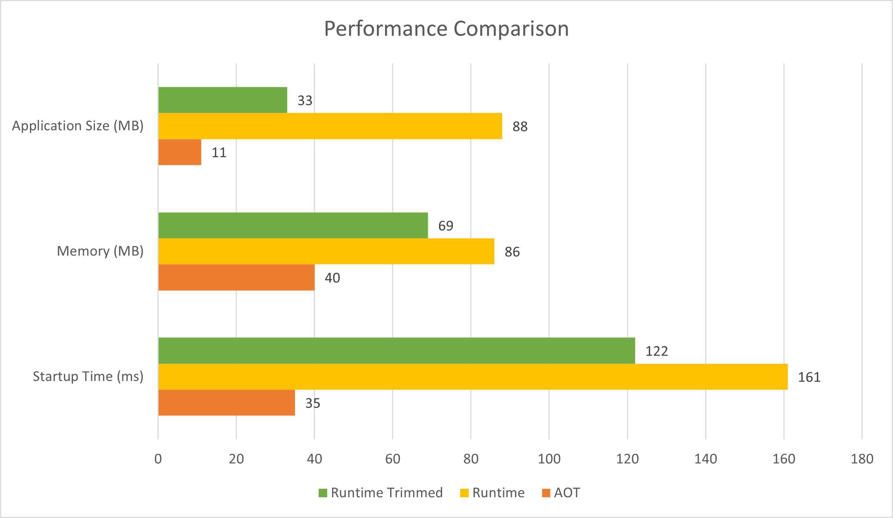

# ASP.NET Core support for Native AOT

## 목차
- [ASP.NET Core support for Native AOT](#aspnet-core-support-for-native-aot)
  - [목차](#목차)
  - [ASP.NET Core에서 Native AOT를 사용하는 이유](#aspnet-core에서-native-aot를-사용하는-이유)
  - [ASP.NET Core와 Native AOT 호환성](#aspnet-core와-native-aot-호환성)
  - [Native AOT 게시](#native-aot-게시)
  - [웹 API (Native AOT) 템플릿](#웹-api-native-aot-템플릿)
    - [소스 생성기 지원을 위한 변경 사항](#소스-생성기-지원을-위한-변경-사항)
    - [`launchSettings.json` 변경 사항](#launchsettingsjson-변경-사항)
    - [`CreateSlimBuilder` 메서드](#createslimbuilder-메서드)
    - [`CreateSlimBuilder` vs `CreateBuilder`](#createslimbuilder-vs-createbuilder)
  - [소스 생성기](#소스-생성기)
    - [라이브러리와 Native AOT](#라이브러리와-native-aot)
  - [최소 API와 JSON 페이로드](#최소-api와-json-페이로드)
  - [알려진 문제](#알려진-문제)
  - [출처](#출처)
  - [다음](#다음)

---

ASP.NET Core 8.0은 [.NET 네이티브 사전 컴파일 (AOT)](https://learn.microsoft.com/en-us/dotnet/core/deploying/native-aot/)을 지원합니다.

## ASP.NET Core에서 Native AOT를 사용하는 이유

네이티브 AOT 앱을 게시하고 배포하면 다음과 같은 이점이 있습니다:

* **최소화된 디스크 공간 사용**: Native AOT를 사용하여 게시하면 외부 종속성에서 프로그램을 지원하는 데 필요한 코드만 포함된 단일 실행 파일이 생성됩니다. 실행 파일 크기 감소는 다음과 같은 이점을 제공합니다:
  * 예를 들어 컨테이너화된 배포 시나리오에서 더 작은 컨테이너 이미지.
  * 더 작은 이미지로 인한 배포 시간 단축.
* **줄어든 시작 시간**: 네이티브 AOT 애플리케이션은 시작 시간이 줄어들 수 있으며, 이는
  * 앱이 요청을 서비스할 준비가 더 빨리 됨을 의미합니다.
  * 컨테이너 오케스트레이터가 앱의 한 버전에서 다른 버전으로 전환을 관리할 때 향상된 배포.
* **줄어든 메모리 수요**: 네이티브 AOT 앱은 앱이 수행하는 작업에 따라 메모리 수요가 줄어들 수 있습니다. 메모리 소비 감소는 더 높은 배포 밀도와 향상된 확장성을 제공합니다.

템플릿 앱은 AOT로 게시된 앱, 트리밍된 런타임 앱, 트리밍되지 않은 런타임 앱의 성능을 비교하기 위해 벤치마킹 실험실에서 실행되었습니다. 다음 차트는 벤치마킹 결과를 보여줍니다:



위 차트는 Native AOT가 앱 크기, 메모리 사용량 및 시작 시간이 더 낮음을 보여줍니다.

## ASP.NET Core와 Native AOT 호환성

현재 ASP.NET Core의 모든 기능이 Native AOT와 호환되는 것은 아닙니다. 다음 표는 Native AOT와의 ASP.NET Core 기능 호환성을 요약한 것입니다:

| 기능 | 완전 지원 | 부분 지원 | 지원 안 됨 |
| - | - | - | - |
| gRPC | <span aria-hidden="true">✔️</span><span class="visually-hidden">완전 지원</span> | | |
| 최소 API | | <span aria-hidden="true">✔️</span><span class="visually-hidden">부분 지원</span> | |
| MVC | | | <span aria-hidden="true">❌</span><span class="visually-hidden">지원 안 됨</span> |
| Blazor 서버 | | | <span aria-hidden="true">❌</span><span class="visually-hidden">지원 안 됨</span> |
| SignalR | | | <span aria-hidden="true">❌</span><span class="visually-hidden">지원 안 됨</span> |
| JWT 인증 | <span aria-hidden="true">✔️</span><span class="visually-hidden">완전 지원</span> | | |
| 기타 인증 | | | <span aria-hidden="true">❌</span><span class="visually-hidden">지원 안 됨</span> |
| CORS | <span aria-hidden="true">✔️</span><span class="visually-hidden">완전 지원</span> | | |
| 헬스 체크 | <span aria-hidden="true">✔️</span><span class="visually-hidden">완전 지원</span> | | |
| HttpLogging | <span aria-hidden="true">✔️</span><span class="visually-hidden">완전 지원</span> | | |
| 로컬라이제이션 | <span aria-hidden="true">✔️</span><span class="visually-hidden">완전 지원</span> | | |
| 출력 캐싱 | <span aria-hidden="true">✔️</span><span class="visually-hidden">완전 지원</span> | | |
| 속도 제한 | <span aria-hidden="true">✔️</span><span class="visually-hidden">완전 지원</span> | | |
| 요청 압축 해제 | <span aria-hidden="true">✔️</span><span class="visually-hidden">완전 지원</span> | | |
| 응답 캐싱 | <span aria-hidden="true">✔️</span><span class="visually-hidden">완전 지원</span> | | |
| 응답 압축 | <span aria-hidden="true">✔️</span><span class="visually-hidden">완전 지원</span> | | |
| 리라이트 | <span aria-hidden="true">✔️</span><span class="visually-hidden">완전 지원</span> | | |
| 세션 | | | <span aria-hidden="true">❌</span><span class="visually-hidden">지원 안 됨</span> |
| Spa | | | <span aria-hidden="true">❌</span><span class="visually-hidden">지원 안 됨</span> |
| 정적 파일 | <span aria-hidden="true">✔️</span><span class="visually-hidden">완전 지원</span> | | |
| WebSockets | <span aria-hidden="true">✔️</span><span class="visually-hidden">완전 지원</span> | | |

제한 사항에 대한 자세한 내용은 다음을 참조하세요:

* [Native AOT 배포의 제한 사항](https://learn.microsoft.com/en-us/dotnet/core/deploying/native-aot#limitations-of-native-aot-deployment)
* [AOT 경고 소개](https://learn.microsoft.com/en-us/dotnet/core/deploying/native-aot/fixing-warnings)
* [알려진 트리밍 비호환성](https://learn.microsoft.com/en-us/dotnet/core/deploying/trimming/incompatibilities)
* [트리밍 경고 소개](https://learn.microsoft.com/en-us/dotnet/core/deploying/trimming/fixing-warnings)
* [GitHub issue dotnet/core #8288](https://github.com/dotnet/core/issues/8288)

Native AOT 배포 모델로 전환할 때 앱을 철저히 테스트하는 것이 중요합니다. AOT 배포된 앱은 트리밍되지 않고 JIT 컴파일된 앱과 기능이 변경되지 않았음을 확인하기 위해 테스트해야 합니다. 앱을 빌드할 때 AOT 경고를 검토하고 수정하세요. 게시 시 AOT 경고를 발행하는 앱은 제대로 작동하지 않을 수 있습니다. 게시 시 AOT 경고가 없으면 게시된 AOT 앱은 트리밍되지 않고 JIT 컴파일된 앱과 동일하게 작동해야 합니다.

## Native AOT 게시

Native AOT는 `PublishAot` MSBuild 속성으로 활성화됩니다. 다음 예제는 프로젝트 파일에서 Native AOT를 활성화하는 방법을 보여줍니다:

```xml
<PropertyGroup>
  <PublishAot>true</PublishAot>
</PropertyGroup>
```

이 설정은 게시 중에 Native AOT 컴파일을 활성화하고 빌드 및 편집 중에 동적 코드 사용 분석을 활성화합니다. Native AOT 게시를 사용하는 프로젝트는 로컬에서 실행할 때 JIT 컴파일을 사용합니다. AOT 앱은 JIT 컴파일된 앱과 다음과 같은 차이점이 있습니다:

* Native AOT와 호환되지 않는 기능은 비활성화되고 실행 시 예외를 발생시킵니다.
* 소스 분석기가 활성화되어 Native AOT와 호환되지 않는 코드를 강조 표시합니다. 게시 시 앱 전체와 NuGet 패키지가 다시 호환성 분석을 수행합니다.

Native AOT 분석은 앱의 모든 코드와 앱이 의존하는 라이브러리를 포함합니다. Native AOT 경고를 검토하고 수정 단계를 수행하세요. 앱을 자주 게시하여 개발 주기 초기에 문제를 발견하는 것이 좋습니다.

.NET 8에서 Native AOT는 다음 ASP.NET Core 앱 유형을 지원합니다:

* 최소 API - 자세한 내용은 이 기사 후반의 [웹 API (Native AOT) 템플릿](https://learn.microsoft.com/en-us/aspnet/core/fundamentals/native-aot?view=aspnetcore-8.0#the-web-api-native-aot-template) 섹션을 참조하세요.
* gRPC - 자세한 내용은 [gRPC와 Native AOT](https://learn.microsoft.com/en-us/aspnet/core/grpc/native-aot?view=aspnetcore-8.0)를 참조하세요.
* 작업자 서비스 - 자세한 내용은 [작업자 서비스 템플릿에서의 AOT](https://learn.microsoft.com/en-us/aspnet/core/fundamentals/host/hosted-services?view=aspnetcore-8.0&preserve-view=true&view=aspnetcore-8.0#native-aot)를 참조하세요.

## 웹 API (Native AOT) 템플릿

**ASP.NET Core Web API (Native AOT)** 템플릿 (단축 이름 `webapiaot`)은 AOT가 활성화된 프로젝트를 생성합니다. 이 템플릿은 **Web API** 프로젝트 템플릿과 다음과 같은 차이점이 있습니다:

* MVC는 아직 Native AOT와 호환되지 않으므로 최소 API만 사용합니다.
* 앱의 배포 크기를 최소화하기 위해 기본적으로 필수 기능만 활성화하는 CreateSlimBuilder() API를 사용합니다.
* 클라우드 네이티브 배포에서 일반적으로 인그레스 서비스에 의해 HTTPS 트래픽이 처리되므로 HTTP만 청취하도록 구성됩니다.
* IIS 또는 IIS Express에서 실행하기 위한 실행 프로필을 포함하지 않습니다.
* 앱의 엔드포인트로 보낼 수 있는 샘플 HTTP 요청으로 구성된 [`.http` 파일](https://learn.microsoft.com/en-us/aspnet/core/test/http-files?view=aspnetcore-8.0)을 생성합니다.
* 날씨 예보 샘플 대신 샘플 `Todo` API를 포함합니다.
* 프로젝트 파일에 [이 기사 앞부분](https://learn.microsoft.com/en-us/aspnet/core/fundamentals/native-aot?view=aspnetcore-8.0#native-aot-publishing)에서 설명한 대로 `PublishAot`를 추가합니다.
* [JSON 직렬화 소스 생성기](https://learn.microsoft.com/en-us/dotnet/standard/serialization/system-text-json/source-generation)를 활성화합니다. 소스 생성기는 Native AOT 컴파일을 위해 빌드 시 직렬화 코드를 생성하는 데 사용됩니다.

### 소스 생성기 지원을 위한 변경 사항

다음 예제는 JSON 직렬화 소스 생성을 지원하기 위해 `Program.cs` 파일에 추가된 코드를 보여줍니다:

```diff
using MyFirstAotWebApi;
+using System.Text.Json.Serialization;

-var builder = WebApplication.CreateBuilder();
+var builder = WebApplication.CreateSlimBuilder(args);

+builder.Services.ConfigureHttpJsonOptions(options =>
+{
+  options.SerializerOptions.TypeInfoResolverChain.Insert(0, AppJsonSerializerContext.Default);
+});

var app = builder.Build();

var sampleTodos = TodoGenerator.GenerateTodos().ToArray();

var todosApi = app.MapGroup("/todos");
todosApi.MapGet("/", () => sampleTodos);
todosApi.MapGet("/{id}", (int id) =>
    sampleTodos.FirstOrDefault(a => a.Id == id) is { } todo
        ? Results.Ok(todo)
        : Results.NotFound());

app.Run();

+[JsonSerializable(typeof(Todo[]))]
+internal partial class AppJsonSerializerContext : JsonSerializerContext
+{
+
+}
```

이 추가된 코드가 없으면 `System.Text.Json`은 JSON을 직렬화 및 역직렬화하는 데 반사를 사용합니다. 반사는 Native AOT에서 지원되지 않습니다.

자세한 내용은 다음을 참조하세요:

* [소스 생성기 결합](https://learn.microsoft.com/en-us/dotnet/standard/serialization/system-text-json/source-generation?pivots=dotnet-8-0#combine-source-generators)
* [TypeInfoResolverChain](https://learn.microsoft.com/en-us/dotnet/api/system.text.json.jsonserializeroptions.typeinforesolverchain#system-text-json-jsonserializeroptions-typeinforesolverchain)

### `launchSettings.json` 변경 사항

**Web API (Native AOT)** 템플릿에서 생성된 `launchSettings.json` 파일은 `iisSettings` 섹션과 `IIS Express` 프로필이 제거되었습니다:

```diff
{
  "$schema": "http://json.schemastore.org/launchsettings.json",
-  "iisSettings": {
-     "windowsAuthentication": false,
-     "anonymousAuthentication": true,
-     "iisExpress": {
-       "applicationUrl": "http://localhost:11152",
-       "sslPort": 0
-     }
-   },
  "profiles": {
    "http": {
      "commandName": "Project",
      "dotnetRunMessages": true,
      "launchBrowser": true,
      "launchUrl": "todos",
      "applicationUrl": "http://localhost:5102",
        "environmentVariables": {
          "ASPNETCORE_ENVIRONMENT": "Development"
        }
      },
-     "IIS Express": {
-       "commandName": "IISExpress",
-       "launchBrowser": true,
-       "launchUrl": "todos",
-      "environmentVariables": {
-       "ASPNETCORE_ENVIRONMENT": "Development"
-      }
-    }
  }
}
```

### `CreateSlimBuilder` 메서드

템플릿은 `CreateBuilder()` 메서드 대신 `CreateSlimBuilder()` 메서드를 사용합니다.

```C#
using System.Text.Json.Serialization;
using MyFirstAotWebApi;

var builder = WebApplication.CreateSlimBuilder(args);
builder.Logging.AddConsole();

builder.Services.ConfigureHttpJsonOptions(options =>
{
    options.SerializerOptions.TypeInfoResolverChain.Insert(0, AppJsonSerializerContext.Default);
});

var app = builder.Build();

var sampleTodos = TodoGenerator.GenerateTodos().ToArray();

var todosApi = app.MapGroup("/todos");
todosApi.MapGet("/", () => sampleTodos);
todosApi.MapGet("/{id}", (int id) =>
    sampleTodos.FirstOrDefault(a => a.Id == id) is { } todo
        ? Results.Ok(todo)
        : Results.NotFound());

app.Run();

[JsonSerializable(typeof(Todo[]))]
internal partial class AppJsonSerializerContext : JsonSerializerContext
{

}
```

`CreateSlimBuilder` 메서드는 WebApplicationBuilder를 최소한의 ASP.NET Core 기능으로 초기화하여 앱을 실행하는 데 필요한 최소한의 기능만 포함합니다.

앞서 언급했듯이, `CreateSlimBuilder` 메서드는 HTTPS 또는 HTTP/3에 대한 지원을 포함하지 않습니다. 이러한 프로토콜은 일반적으로 TLS 종료 프록시 뒤에서 실행되는 앱에 필요하지 않습니다. 예를 들어, [Application Gateway를 사용한 TLS 종료 및 종단 간 TLS](https://learn.microsoft.com/en-us/azure/application-gateway/ssl-overview)를 참조하세요. HTTPS는 [builder.WebHost.UseKestrelHttpsConfiguration](https://source.dot.net/#Microsoft.AspNetCore.Server.Kestrel/WebHostBuilderKestrelExtensions.cs,fcec859000ccaa50)를 호출하여 활성화할 수 있습니다. HTTP/3는 [builder.WebHost.UseQuic](https://learn.microsoft.com/en-us/dotnet/api/microsoft.aspnetcore.hosting.webhostbuilderquicextensions.usequic)를 호출하여 활성화할 수 있습니다.

### `CreateSlimBuilder` vs `CreateBuilder`

`CreateSlimBuilder` 메서드는 `CreateBuilder` 메서드가 지원하는 다음 기능을 지원하지 않습니다:

* [호스팅 시작 어셈블리](https://learn.microsoft.com/en-us/aspnet/core/fundamentals/host/platform-specific-configuration?view=aspnetcore-8.0)
* [UseStartup](https://learn.microsoft.com/en-us/dotnet/api/microsoft.aspnetcore.hosting.webhostbuilderextensions.usestartup)
* 다음 로깅 공급자:
  * [Windows EventLog](https://learn.microsoft.com/en-us/aspnet/core/fundamentals/logging#windows-eventlog)
  * [디버그](https://learn.microsoft.com/en-us/aspnet/core/fundamentals/logging#debug)
  * [Event Source](https://learn.microsoft.com/en-us/aspnet/core/fundamentals/logging#event-source)
* 웹 호스팅 기능:
  * [UseStaticWebAssets](https://learn.microsoft.com/en-us/dotnet/api/microsoft.aspnetcore.hosting.webhostbuilderextensions.usestaticwebassets)
  * [IIS 통합](https://learn.microsoft.com/en-us/aspnet/core/host-and-deploy/iis/?view=aspnetcore-8.0)
* Kestrel 구성
  * [Kestrel에서의 HTTPS 엔드포인트](https://learn.microsoft.com/en-us/aspnet/core/fundamentals/servers/kestrel/endpoints?view=aspnetcore-8.0#https)
  * [Quic (HTTP/3)](https://learn.microsoft.com/en-us/aspnet/core/fundamentals/servers/kestrel/http3?view=aspnetcore-8.0#http3-benefits)
* [라우팅에서 사용되는 Regex 및 알파 제약 조건](https://github.com/dotnet/aspnetcore/issues/46142)

`CreateSlimBuilder` 메서드는 효율적인 개발 경험을 위해 필요한 다음 기능을 포함합니다:

* `appsettings.json` 및 `appsettings.{EnvironmentName}.json`에 대한 JSON 파일 구성.
* 사용자 비밀 구성.
* 콘솔 로깅.
* 로깅 구성.

위의 기능을 생략한 빌더는 [The `CreateEmptyBuilder` method](https://learn.microsoft.com/en-us/aspnet/core/release-notes/aspnetcore-8.0?view=aspnetcore-8.0#new-createemptybuilder-method)를 참조하세요.

최소 기능 포함은 트리밍 및 AOT에 유리합니다. 자세한 내용은 [트리밍된 자체 포함 배포 및 실행 파일](https://learn.microsoft.com/en-us/dotnet/core/deploying/trimming/trim-self-contained)을 참조하세요.

자세한 내용은 [WebApplication.CreateBuilder와 CreateSlimBuilder 비교](https://andrewlock.net/exploring-the-dotnet-8-preview-comparing-createbuilder-to-the-new-createslimbuilder-method/)를 참조하세요.

## 소스 생성기

게시 중에 사용되지 않는 코드는 트리밍되므로 앱은 런타임에 무제한 반사를 사용할 수 없습니다. [소스 생성기](https://learn.microsoft.com/en-us/dotnet/csharp/roslyn-sdk/source-generators-overview)를 사용하여 반사의 필요성을 피하는 코드를 생성합니다. 일부 경우 소스 생성기는 생성기가 필요하지 않을 때에도 AOT에 최적화된 코드를 생성합니다.

생성된 소스 코드를 보려면, 앱의 `.csproj` 파일에 [`EmitCompilerGeneratedFiles`](https://learn.microsoft.com/en-us/dotnet/csharp/roslyn-sdk/source-generators-overview) 속성을 추가합니다. 다음 예제와 같이:

```xml
<Project Sdk="Microsoft.NET.Sdk.Web">

  <PropertyGroup>
    <!-- 간결함을 위해 다른 속성 생략 -->
    <EmitCompilerGeneratedFiles>true</EmitCompilerGeneratedFiles>
  </PropertyGroup>

</Project>
```

생성된 코드를 보려면 `dotnet build` 명령을 실행하세요. 출력에는 프로젝트의 모든 생성된 파일이 포함된 `obj/Debug/net8.0/generated/` 디렉터리가 포함됩니다.

`dotnet publish` 명령은 소스 파일을 컴파일하고 컴파일된 파일을 생성합니다. 또한 `dotnet publish`는 생성된 어셈블리를 네이티브 IL 컴파일러에 전달합니다. IL 컴파일러는 네이티브 실행 파일을 생성합니다. 네이티브 실행 파일에는 네이티브 기계 코드가 포함됩니다.

### 라이브러리와 Native AOT

많은 인기 있는 ASP.NET Core 프로젝트에서 사용되는 라이브러리들은 Native AOT를 타겟팅하는 프로젝트에서 다음과 같은 호환성 문제를 가지고 있습니다:

* 타입을 검사하고 발견하기 위해 반사를 사용함.
* 런타임에 조건부로 라이브러리를 로드함.
* 기능을 구현하기 위해 코드를 동적으로 생성함.

이러한 동적 기능을 사용하는 라이브러리들은 Native AOT와 함께 작동하도록 업데이트가 필요합니다. 이들은 Roslyn 소스 생성기와 같은 도구를 사용하여 업데이트할 수 있습니다.

Native AOT를 지원하려는 라이브러리 작성자들은 다음을 참고하는 것이 좋습니다:

* [Native AOT 호환성 요구사항](https://learn.microsoft.com/en-us/dotnet/core/deploying/native-aot/?tabs=net8plus)에 대해 읽어보세요.
* [라이브러리를 트리밍에 대비](https://learn.microsoft.com/en-us/dotnet/core/deploying/trimming/prepare-libraries-for-trimming)하세요.

## 최소 API와 JSON 페이로드

최소 API 프레임워크는 System.Text.Json을 사용하여 JSON 페이로드를 수신하고 반환하도록 최적화되었습니다. `System.Text.Json`:

* JSON과 Native AOT에 대한 호환성 요구 사항을 부과합니다.
* [`System.Text.Json` 소스 생성기](https://learn.microsoft.com/en-us/dotnet/standard/serialization/system-text-json/source-generation)를 사용해야 합니다.

최소 API 앱의 HTTP 본문의 일부로 전송되거나 요청 대리자로부터 반환되는 모든 타입은 ASP.NET Core의 종속성 주입을 통해 등록된 `JsonSerializerContext`에 구성되어야 합니다:

```C#
using System.Text.Json.Serialization;
using MyFirstAotWebApi;

var builder = WebApplication.CreateSlimBuilder(args);
builder.Logging.AddConsole();

builder.Services.ConfigureHttpJsonOptions(options =>
{
    options.SerializerOptions.TypeInfoResolverChain.Insert(0, AppJsonSerializerContext.Default);
});

var app = builder.Build();

var sampleTodos = TodoGenerator.GenerateTodos().ToArray();

var todosApi = app.MapGroup("/todos");
todosApi.MapGet("/", () => sampleTodos);
todosApi.MapGet("/{id}", (int id) =>
    sampleTodos.FirstOrDefault(a => a.Id == id) is { } todo
        ? Results.Ok(todo)
        : Results.NotFound());

app.Run();

[JsonSerializable(typeof(Todo[]))]
internal partial class AppJsonSerializerContext : JsonSerializerContext
{

}
```

위 코드에서 강조된 부분:

* JSON 직렬화 컨텍스트가 [DI 컨테이너](https://learn.microsoft.com/en-us/aspnet/core/fundamentals/dependency-injection?view=aspnetcore-8.0)에 등록됩니다. 자세한 내용은 다음을 참조하세요:
  * [소스 생성기 결합](https://learn.microsoft.com/en-us/dotnet/standard/serialization/system-text-json/source-generation?pivots=dotnet-8-0#combine-source-generators)
  * [TypeInfoResolverChain](https://learn.microsoft.com/en-us/dotnet/api/system.text.json.jsonserializeroptions.typeinforesolverchain#system-text-json-jsonserializeroptions-typeinforesolverchain)
* 사용자 정의 `JsonSerializerContext`는 `Todo` 타입에 대한 소스 생성된 JSON 직렬화 코드를 활성화하기 위해 [`[JsonSerializable]`](https://learn.microsoft.com/en-us/dotnet/api/system.text.json.serialization.jsonserializableattribute) 속성으로 주석이 달렸습니다.

대리자에서 본문에 바인딩되지 않는 매개변수는 직렬화될 필요가 없습니다. 예를 들어, 풍부한 객체 타입의 쿼리 문자열 매개변수는 `IParsable<T>`를 구현합니다.

```C#
public class Todo
{
    public int Id { get; set; }
    public string? Title { get; set; }
    public DateOnly? DueBy { get; set; }
    public bool IsComplete { get; set; }
}

static class TodoGenerator
{
    private static readonly (string[] Prefixes, string[] Suffixes)[] _parts = new[]
        {
            (new[] { "Walk the", "Feed the" }, new[] { "dog", "cat", "goat" }),
            (new[] { "Do the", "Put away the" }, new[] { "groceries", "dishes", "laundry" }),
            (new[] { "Clean the" }, new[] { "bathroom", "pool", "blinds", "car" })
        };
    // Remaining code omitted for brevity.
```


## 알려진 문제

Native AOT 지원 관련 문제는 [GitHub 이슈](https://github.com/dotnet/core/issues/8288)를 참조하거나 보고하세요.

---
## 출처
[ASP.NET Core support for Native AOT](https://learn.microsoft.com/en-us/aspnet/core/fundamentals/native-aot?view=aspnetcore-8.0)

---
## [다음](./05_native_aot_tutorial.md)
