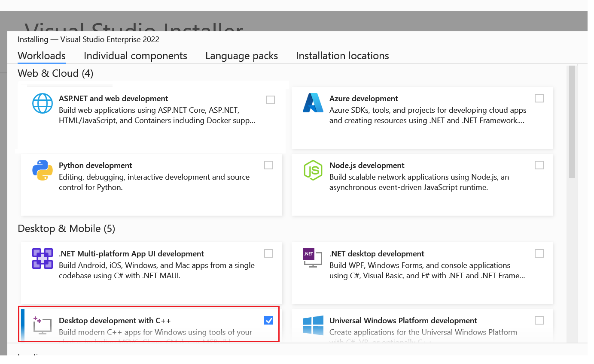
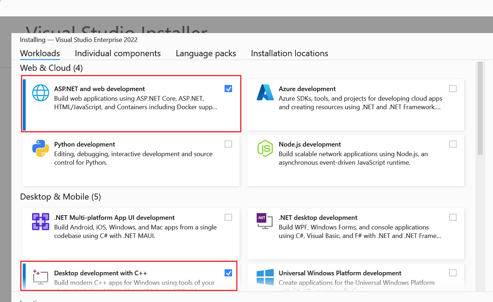

# Tutorial: Publish an ASP.NET Core app using Native AOT

## 목차
- [Tutorial: Publish an ASP.NET Core app using Native AOT](#tutorial-publish-an-aspnet-core-app-using-native-aot)
  - [목차](#목차)
  - [필수 조건](#필수-조건)
  - [Native AOT를 사용하는 웹 앱 생성](#native-aot를-사용하는-웹-앱-생성)
  - [Native AOT 앱 게시](#native-aot-앱-게시)
    - [라이브러리와 Native AOT](#라이브러리와-native-aot)
  - [출처](#출처)
  - [다음](#다음)

---
ASP.NET Core 8.0은 [.NET native ahead-of-time (AOT)](https://learn.microsoft.com/en-us/dotnet/core/deploying/native-aot/) 지원을 도입합니다.

> [!NOTE]
> * Native AOT 기능은 현재 미리 보기 상태입니다.
> * .NET 8에서는 모든 ASP.NET Core 기능이 Native AOT와 호환되지 않습니다.
> * [.NET CLI](https://learn.microsoft.com/en-us/dotnet/core/tools/) 및 [Visual Studio](https://visualstudio.microsoft.com/vs/preview/) 지침을 위한 탭이 제공됩니다:
>   * Visual Studio 탭을 선택하더라도 CLI를 사용하여 게시해야 합니다.
>   * CLI 탭을 선택한 경우에도 Visual Studio가 필요합니다.

## 필수 조건

**.NET CLI** 

* [.NET 8.0 SDK](https://dotnet.microsoft.com/download/dotnet/8.0)
* 리눅스에서는 [Native AOT 배포를 위한 필수 조건](https://learn.microsoft.com/en-us/dotnet/core/deploying/native-aot/?tabs=net8plus#prerequisites-for-native-aot-deployment)을 참조하세요.
* **Desktop development with C++** 워크로드가 설치된 [Visual Studio 2022 Preview](https://visualstudio.microsoft.com/vs/preview/).

  

> [!NOTE]
> Native AOT는 [link.exe](https://learn.microsoft.com/en-us/cpp/build/reference/linker-options) 및 Visual C++ 정적 런타임 라이브러리가 필요하기 때문에 Visual Studio 2022 Preview가 필요합니다. Visual Studio 없이 Native AOT를 지원할 계획은 없습니다.

**Visual Studio**

* [.NET 8.0 SDK](https://dotnet.microsoft.com/download/dotnet/8.0)

* 다음 워크로드가 설치된 [Visual Studio 2022 Preview](https://visualstudio.microsoft.com/vs/preview/):
  * **ASP.NET and web development**
  * **Desktop development with C++**

  

---

## Native AOT를 사용하는 웹 앱 생성

Native AOT와 함께 작동하도록 구성된 ASP.NET Core API 앱을 생성합니다:

**.NET CLI**

다음 명령을 실행합니다:

```dotnetcli
dotnet new webapiaot -o MyFirstAotWebApi && cd MyFirstAotWebApi
```

다음과 유사한 출력이 표시됩니다:

```output
The template "ASP.NET Core Web API (Native AOT)" was created successfully.

Processing post-creation actions...
Restoring C:\Code\Demos\MyFirstAotWebApi\MyFirstAotWebApi.csproj:
  Determining projects to restore...
  Restored C:\Code\Demos\MyFirstAotWebApi\MyFirstAotWebApi.csproj (in 302 ms).
Restore succeeded.
```

**Visual Studio**

1. 새로운 `ASP.NET Core Web API (Native AOT)` 프로젝트를 만듭니다.
1. 프로젝트 이름을 **MyFirstAotWebApi**로 지정합니다.
1. **Create**를 선택합니다.

---

## Native AOT 앱 게시

Native AOT를 사용하여 앱을 게시할 수 있는지 확인합니다:

**.NET CLI** 

```dotnetcli
dotnet publish
```

**Visual Studio**

Visual Studio는 AOT 앱 게시를 지원하지 않습니다. CLI 명령을 사용하세요:

```dotnetcli
dotnet publish
```

---

`dotnet publish` 명령은 다음을 수행합니다:

* 소스 파일을 컴파일합니다.
* 컴파일된 소스 코드 파일을 생성합니다.
* 생성된 어셈블리를 네이티브 IL 컴파일러에 전달합니다. IL 컴파일러는 네이티브 실행 파일을 생성합니다. 네이티브 실행 파일은 네이티브 머신 코드를 포함합니다.

다음과 유사한 출력이 표시됩니다:

```output
MSBuild version 17.<version> for .NET
  Determining projects to restore...
  Restored C:\Code\Demos\MyFirstAotWebApi\MyFirstAotWebApi.csproj (in 241 ms).
C:\Code\dotnet\aspnetcore\.dotnet\sdk\8.0.<version>\Sdks\Microsoft.NET.Sdk\targets\Microsoft.NET.RuntimeIde
ntifierInference.targets(287,5): message NETSDK1057: You are using a preview version of .NET. See: https://aka.ms/dotne
t-support-policy [C:\Code\Demos\MyFirstAotWebApi\MyFirstAotWebApi.csproj]
  MyFirstAotWebApi -> C:\Code\Demos\MyFirstAotWebApi\bin\Release\net8.0\win-x64\MyFirstAotWebApi.dll
  Generating native code
  MyFirstAotWebApi -> C:\Code\Demos\MyFirstAotWebApi\bin\Release\net8.0\win-x64\publish\
```

출력은 사용된 .NET 8 버전, 사용된 디렉터리 등 여러 요인에 따라 위 예제와 다를 수 있습니다.

출력 디렉터리의 내용을 검토합니다:

```
dir bin\Release\net8.0\win-x64\publish
```

다음과 유사한 출력이 표시됩니다:

```Output
    Directory: C:\Code\Demos\MyFirstAotWebApi\bin\Release\net8.0\win-x64\publish

Mode                 LastWriteTime         Length Name
----                 -------------         ------ ----
-a---          30/03/2023  1:41 PM        9480704 MyFirstAotWebApi.exe
-a---          30/03/2023  1:41 PM       43044864 MyFirstAotWebApi.pdb
```

실행 파일은 자체 포함되어 있으며 실행하는 데 .NET 런타임이 필요하지 않습니다. 실행되면 개발 환경에서 실행된 앱과 동일하게 동작합니다. AOT 앱을 실행합니다:

```
.\bin\Release\net8.0\win-x64\publish\MyFirstAotWebApi.exe
```

다음과 유사한 출력이 표시됩니다:

```output
info: Microsoft.Hosting.Lifetime[14]
      Now listening on: http://localhost:5000
info: Microsoft.Hosting.Lifetime[0]
      Application started. Press Ctrl+C to shut down.
info: Microsoft.Hosting.Lifetime[0]
      Hosting environment: Production
info: Microsoft.Hosting.Lifetime[0]
      Content root path: C:\Code\Demos\MyFirstAotWebApi
```

### 라이브러리와 Native AOT

많은 인기 있는 ASP.NET Core 프로젝트에서 사용되는 라이브러리들은 Native AOT를 타겟팅하는 프로젝트에서 다음과 같은 호환성 문제를 가지고 있습니다:

* 타입을 검사하고 발견하기 위해 반사를 사용함.
* 런타임에 조건부로 라이브러리를 로드함.
* 기능을 구현하기 위해 코드를 동적으로 생성함.

이러한 동적 기능을 사용하는 라이브러리들은 Native AOT와 함께 작동하도록 업데이트가 필요합니다. 이들은 Roslyn 소스 생성기와 같은 도구를 사용하여 업데이트할 수 있습니다.

Native AOT를 지원하려는 라이브러리 작성자들은 다음을 참고하는 것이 좋습니다:

* [Native AOT 호환성 요구사항](https://learn.microsoft.com/en-us/dotnet/core/deploying/native-aot/?tabs=net8plus)에 대해 읽어보세요.
* [라이브러리를 트리밍에 대비](https://learn.microsoft.com/en-us/dotnet/core/deploying/trimming/prepare-libraries-for-trimming)하세요.

---
## 출처
[Tutorial: Publish an ASP.NET Core app using Native AOT](https://learn.microsoft.com/en-us/aspnet/core/fundamentals/aot/native-aot-tutorial?view=aspnetcore-8.0&tabs=net-cli)

---
## [다음](./06_native_aot_RDG.md)
