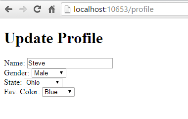

# Dependency injection into views in ASP.NET Core

## 목차
- [Dependency injection into views in ASP.NET Core](#dependency-injection-into-views-in-aspnet-core)
  - [목차](#목차)
  - [구성 주입](#구성-주입)
  - [서비스 주입](#서비스-주입)
  - [조회 데이터 채우기](#조회-데이터-채우기)
  - [서비스 재정의](#서비스-재정의)
  - [추가 자료](#추가-자료)
  - [출처](#출처)
  - [다음](#다음)

---
ASP.NET Core는 뷰에 [종속성 주입](https://learn.microsoft.com/en-us/aspnet/core/fundamentals/dependency-injection?view=aspnetcore-8.0)을 지원합니다. 이는 로컬라이제이션 또는 뷰 요소를 채우기 위해 필요한 데이터와 같은 뷰 특정 서비스에 유용할 수 있습니다. 대부분의 데이터는 컨트롤러에서 전달되어야 합니다.

[샘플 코드 보기 또는 다운로드](https://github.com/dotnet/AspNetCore.Docs/tree/main/aspnetcore/mvc/views/dependency-injection/6.0sample) ([다운로드 방법](https://learn.microsoft.com/en-us/aspnet/core/introduction-to-aspnet-core?view=aspnetcore-8.0#how-to-download-a-sample))

## 구성 주입

`appsettings.json` 및 `appsettings.Development.json`과 같은 설정 파일의 값은 뷰에 주입될 수 있습니다. [샘플 코드](https://github.com/dotnet/AspNetCore.Docs/tree/main/aspnetcore/mvc/views/dependency-injection/6.0sample)에서 `appsettings.Development.json`을 고려해 보십시오:

```json
{
  "Logging": {
    "LogLevel": {
      "Default": "Information",
      "Microsoft.AspNetCore": "Warning"
    }
  },
  "MyRoot": {
    "MyParent": {
      "MyChildName": "Joe"
    }
  }
}
```

다음 마크업은 Razor Pages 뷰에서 구성 값을 표시합니다:

```cshtml
@page
@model PrivacyModel
@using Microsoft.Extensions.Configuration
@inject IConfiguration Configuration
@{
    ViewData["Title"] = "Privacy RP";
}
<h1>@ViewData["Title"]</h1>

<p>PR Privacy</p>

<h2>
   MyRoot:MyParent:MyChildName: @Configuration["MyRoot:MyParent:MyChildName"]
</h2>
```

다음 마크업은 MVC 뷰에서 구성 값을 표시합니다:

```cshtml
@using Microsoft.Extensions.Configuration
@inject IConfiguration Configuration
@{
    ViewData["Title"] = "Privacy MVC";
}
<h1>@ViewData["Title"]</h1>

<p>MVC Use this page to detail your site's privacy policy.</p>

<h2>
   MyRoot:MyParent:MyChildName: @Configuration["MyRoot:MyParent:MyChildName"]
</h2>
```

자세한 내용은 [Configuration in ASP.NET Core](https://learn.microsoft.com/en-us/aspnet/core/fundamentals/configuration/?view=aspnetcore-8.0)을 참조하십시오.

## 서비스 주입

서비스는 `@inject` 지시어를 사용하여 뷰에 주입될 수 있습니다.

```cshtml
@using System.Threading.Tasks
@using ViewInjectSample.Model
@using ViewInjectSample.Model.Services
@model IEnumerable<ToDoItem>
@inject StatisticsService StatsService
<!DOCTYPE html>
<html>
<head>
    <title>To Do Items</title>
</head>
<body>
    <div>
        <h1>To Do Items</h1>
        <ul>
            <li>Total Items: @StatsService.GetCount()</li>
            <li>Completed: @StatsService.GetCompletedCount()</li>
            <li>Avg. Priority: @StatsService.GetAveragePriority()</li>
        </ul>
        <table>
            <tr>
                <th>Name</th>
                <th>Priority</th>
                <th>Is Done?</th>
            </tr>
            @foreach (var item in Model)
            {
                <tr>
                    <td>@item.Name</td>
                    <td>@item.Priority</td>
                    <td>@item.IsDone</td>
                </tr>
            }
        </table>
    </div>
</body>
</html>
```

이 뷰는 `ToDoItem` 인스턴스 목록과 전체 통계를 보여주는 요약을 표시합니다. 요약은 주입된 `StatisticsService`에서 채워집니다. 이 서비스는 `Program.cs`의 `ConfigureServices`에 종속성 주입을 위해 등록됩니다:

```c#
using ViewInjectSample.Helpers;
using ViewInjectSample.Infrastructure;
using ViewInjectSample.Interfaces;
using ViewInjectSample.Model.Services;

var builder = WebApplication.CreateBuilder(args);

builder.Services.AddControllersWithViews();
builder.Services.AddRazorPages();

builder.Services.AddTransient<IToDoItemRepository, ToDoItemRepository>();
builder.Services.AddTransient<StatisticsService>();
builder.Services.AddTransient<ProfileOptionsService>();
builder.Services.AddTransient<MyHtmlHelper>();

var app = builder.Build();

if (!app.Environment.IsDevelopment())
{
    app.UseExceptionHandler("/Home/Error");
    app.UseHsts();
}

app.UseHttpsRedirection();
app.UseStaticFiles();

app.UseRouting();

app.MapRazorPages();

app.MapDefaultControllerRoute();


app.Run();
```

`StatisticsService`는 리포지토리를 통해 액세스하는 `ToDoItem` 인스턴스 세트에 대한 일부 계산을 수행합니다:

```c#
using System.Linq;
using ViewInjectSample.Interfaces;

namespace ViewInjectSample.Model.Services
{
    public class StatisticsService
    {
        private readonly IToDoItemRepository _toDoItemRepository;

        public StatisticsService(IToDoItemRepository toDoItemRepository)
        {
            _toDoItemRepository = toDoItemRepository;
        }

        public int GetCount()
        {
            return _toDoItemRepository.List().Count();
        }

        public int GetCompletedCount()
        {
            return _toDoItemRepository.List().Count(x => x.IsDone);
        }

        public double GetAveragePriority()
        {
            if (_toDoItemRepository.List().Count() == 0)
            {
                return 0.0;
            }

            return _toDoItemRepository.List().Average(x => x.Priority);
        }
    }
}
```

샘플 리포지토리는 메모리 내 컬렉션을 사용합니다. 메모리 내 구현은 대규모 원격 액세스 데이터 세트에 사용하면 안 됩니다.

샘플은 모델에서 바인딩된 데이터와 뷰에 주입된 서비스를 표시합니다:


## 조회 데이터 채우기

뷰 주입은 드롭다운 목록과 같은 UI 요소의 옵션을 채우는 데 유용할 수 있습니다. 성별, 상태 및 기타 선호도를 지정하는 옵션이 포함된 사용자 프로필 폼을 고려해 보십시오. 표준 접근 방식을 사용하여 이러한 폼을 렌더링하려면 컨트롤러 또는 Razor Page가:

* 각 옵션 세트에 대한 데이터 액세스 서비스를 요청해야 합니다.
* 바인딩할 각 옵션 세트와 함께 모델 또는 `ViewBag`을 채워야 합니다.

대안 접근 방식은 뷰에 직접 서비스를 주입하여 옵션을 얻는 것입니다. 이는 컨트롤러나 Razor Page에서 필요한 코드 양을 최소화하고, 이 뷰 요소 구성 논리를 뷰 자체로 이동시킵니다. 프로필 편집 폼을 표시하는 컨트롤러 액션 또는 Razor Page는 폼에 프로필 인스턴스만 전달하면 됩니다:

```C#
using Microsoft.AspNetCore.Mvc;
using ViewInjectSample.Model;

namespace ViewInjectSample.Controllers;

public class ProfileController : Controller
{
    public IActionResult Index()
    {
        // A real app would up profile based on the user.
        var profile = new Profile()
        {
            Name = "Rick",
            FavColor = "Blue",
            Gender = "Male",
            State = new State("Ohio","OH")
        };
        return View(profile);
    }
}
```

환경설정을 업데이트하는 데 사용되는 HTML 폼에는 세 가지 속성에 대한 드롭다운 목록이 포함되어 있습니다:



이 목록들은 뷰에 주입된 서비스에 의해 채워집니다:

```cshtml
@using System.Threading.Tasks
@using ViewInjectSample.Model.Services
@model ViewInjectSample.Model.Profile
@inject ProfileOptionsService Options
<!DOCTYPE html>
<html>
<head>
    <title>Update Profile</title>
</head>
<body>
<div>
    <h1>Update Profile</h1>
    Name: @Html.TextBoxFor(m => m.Name)
    <br/>
    Gender: @Html.DropDownList("Gender",
           Options.ListGenders().Select(g => 
                new SelectListItem() { Text = g, Value = g }))
    <br/>

    State: @Html.DropDownListFor(m => m.State!.Code,
           Options.ListStates().Select(s => 
                new SelectListItem() { Text = s.Name, Value = s.Code}))
    <br />

    Fav. Color: @Html.DropDownList("FavColor",
           Options.ListColors().Select(c => 
                new SelectListItem() { Text = c, Value = c }))
    </div>
</body>
</html>
```

`ProfileOptionsService`는 이 폼에 필요한 데이터만 제공하도록 설계된 UI 수준 서비스입니다:

```c#
namespace ViewInjectSample.Model.Services;

public class ProfileOptionsService
{
    public List<string> ListGenders()
    {
        // Basic sample
        return new List<string>() {"Female", "Male"};
    }

    public List<State> ListStates()
    {
        // Add a few states
        return new List<State>()
        {
            new State("Alabama", "AL"),
            new State("Alaska", "AK"),
            new State("Ohio", "OH")
        };
    }

    public List<string> ListColors()
    {
        return new List<string>() { "Blue","Green","Red","Yellow" };
    }
}
```

등록되지 않은 유형은 서비스 제공자가 내부적으로 `GetRequiredService`를 통해 쿼리되므로 런타임에 예외를 발생시킵니다.

## 서비스 재정의

새로운 서비스를 주입하는 것 외에도 이 기술을 사용하여 페이지에서 이전에 주입된 서비스를 재정의할 수 있습니다. 아래 그림은 첫 번째 예제에서 사용된 페이지에서 사용할 수 있는 모든 필드를 보여줍니다:


기본 필드에는 `Html`, `Component` 및 `Url`이 포함됩니다. 기본 HTML 도우미를 사용자 정의 버전으로 교체하려면 `@inject`를 사용하십시오:

```cshtml
@using System.Threading.Tasks
@using ViewInjectSample.Helpers
@inject MyHtmlHelper Html
<!DOCTYPE html>
<html>
<head>
    <title>My Helper</title>
</head>
<body>
    <div>
        Test: @Html.Value
    </div>
</body>
</html>
```

## 추가 자료

* Simon Timms 블로그: [Getting Lookup Data Into Your View](https://blog.simontimms.com/2015/06/09/getting-lookup-data-into-you-view/)

---
## 출처
[Dependency injection into views in ASP.NET Core](https://learn.microsoft.com/en-us/aspnet/core/mvc/views/dependency-injection?view=aspnetcore-8.0)

---
## [다음](./08_test.md)
