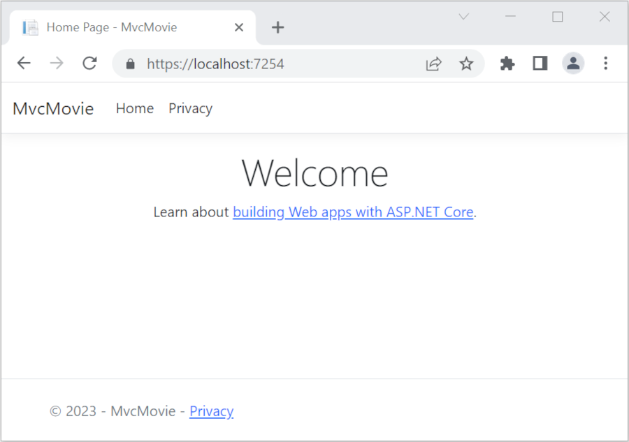

# Get started with ASP.NET Core MVC

## 목차
- [Get started with ASP.NET Core MVC](#get-started-with-aspnet-core-mvc)
  - [목차](#목차)
  - [필수 조건](#필수-조건)
  - [웹 앱 생성](#웹-앱-생성)
    - [앱 실행](#앱-실행)
  - [출처](#출처)
  - [다음](#다음)

---
이것은 컨트롤러와 뷰를 사용하여 ASP.NET Core MVC 웹 개발을 가르치는 시리즈 중 첫 번째 튜토리얼입니다.

시리즈가 끝나면 영화 데이터를 관리하고 표시하는 앱을 갖게 됩니다. 다음을 배우게 됩니다:

> [!div class="checklist"]
> * 웹 앱을 생성합니다.
> * 모델을 추가하고 스캐폴딩합니다.
> * 데이터베이스와 작업합니다.
> * 검색 및 유효성 검사를 추가합니다.

[샘플 코드 보기 또는 다운로드](https://github.com/dotnet/AspNetCore.Docs/tree/main/aspnetcore/tutorials/first-mvc-app/start-mvc/sample) ([다운로드 방법](https://learn.microsoft.com/en-us/aspnet/core/introduction-to-aspnet-core?view=aspnetcore-8.0#how-to-download-a-sample)).

## 필수 조건

**Visual Studio Code**

* [Visual Studio Code](https://code.visualstudio.com/download)
* [C# for Visual Studio Code (최신 버전)](https://marketplace.visualstudio.com/items?itemName=ms-dotnettools.csharp)
* [.NET 8.0 SDK](https://dotnet.microsoft.com/download/dotnet/8.0)

Visual Studio Code 지침은 프로젝트 생성과 같은 ASP.NET Core 개발 기능을 위해 .NET CLI를 사용합니다. 이러한 지침은 macOS, Linux 또는 Windows 및 모든 코드 편집기에서 따를 수 있습니다. Visual Studio Code 이외의 편집기를 사용하는 경우 약간의 변경이 필요할 수 있습니다.

---

## 웹 앱 생성

**Visual Studio Code**

이 튜토리얼은 VS Code에 익숙하다는 것을 전제로 합니다. 자세한 내용은 [VS Code 시작하기](https://code.visualstudio.com/docs) 및 [Visual Studio Code 도움말](https://learn.microsoft.com/en-us/aspnet/core/tutorials/first-mvc-app/start-mvc?view=aspnetcore-8.0&tabs=visual-studio-code#visual-studio-code-help)을 참조하세요.

* **터미널** 메뉴에서 **새 터미널**을 선택하여 [통합 터미널](https://code.visualstudio.com/docs/editor/integrated-terminal)을 엽니다.
* 프로젝트를 포함할 디렉터리(`cd`)로 이동합니다. 프로젝트는 어디든 위치할 수 있습니다.
* 다음 명령을 실행합니다:

   ```dotnetcli
   dotnet new mvc -o MvcMovie
   code -r MvcMovie
   ```

  `dotnet new` 명령은 *MvcMovie* 폴더에 새 ASP.NET Core MVC 프로젝트를 생성합니다.

  `code` 명령은 현재 Visual Studio Code 인스턴스에서 *MvcMovie* 프로젝트 폴더를 엽니다.

Visual Studio Code는 다음과 같은 대화 상자를 표시할 수 있습니다: **이 폴더의 파일 작성자를 신뢰하십니까?**

* 상위 폴더의 모든 파일을 신뢰하는 경우, **상위 폴더의 모든 파일 작성자를 신뢰합니다**를 선택합니다.
* 프로젝트 폴더에 .NET이 생성한 파일이 있으므로 **예, 작성자를 신뢰합니다**를 선택합니다.
* Visual Studio Code에서 프로젝트를 빌드하고 디버그하기 위해 자산을 추가하라고 요청하면 **예**를 선택합니다. Visual Studio Code가 빌드 및 디버그 자산을 추가하라고 제안하지 않으면, **보기** > **명령 팔레트**를 선택하고 검색 상자에 "`.NET`"을 입력합니다. 명령 목록에서 `.NET: Generate Assets for Build and Debug` 명령을 선택합니다.

Visual Studio Code는 생성된 `launch.json` 및 `tasks.json` 파일이 포함된 `.vscode` 폴더를 추가합니다.

---

### 앱 실행

**Visual Studio Code**

* 다음 명령을 실행하여 HTTPS 개발 인증서를 신뢰합니다:

  ```dotnetcli
  dotnet dev-certs https --trust
  ```

  위 명령은 Linux에서 작동하지 않습니다. 인증서를 신뢰하는 방법에 대해서는 각 Linux 배포판의 문서를 참조하십시오.

  위 명령은 인증서가 이전에 신뢰되지 않은 경우 다음과 같은 대화 상자를 표시합니다:

  

* 개발 인증서를 신뢰하는 것에 동의하면 **예**를 선택합니다.

  자세한 내용은 [ASP.NET Core HTTPS 개발 인증서 신뢰하기](https://learn.microsoft.com/en-us/aspnet/core/security/enforcing-ssl?view=aspnetcore-8.0#trust-the-aspnet-core-https-development-certificate-on-windows-and-macos)를 참조하십시오.

Firefox 브라우저를 신뢰하는 방법에 대한 자세한 내용은 [Firefox SEC_ERROR_INADEQUATE_KEY_USAGE 인증서 오류](https://learn.microsoft.com/en-us/aspnet/core/security/enforcing-ssl?view=aspnetcore-8.0#trust-ff)를 참조하십시오.

* Visual Studio Code에서 <kbd>Ctrl</kbd>+<kbd>F5</kbd> (Windows) / <kbd>^</kbd>+<kbd>F5</kbd> (macOS)를 눌러 디버깅 없이 앱을 실행합니다.

  Visual Studio Code는:

  * [Kestrel](https://learn.microsoft.com/en-us/aspnet/core/fundamentals/servers/kestrel?view=aspnetcore-8.0)을 시작합니다.
  * 브라우저를 실행합니다.
  * `https://localhost:<port#>`로 이동합니다.

  주소 표시줄에는 `example.com`과 같은 것이 아니라 `localhost:<port#>`가 표시됩니다. 로컬 컴퓨터의 표준 호스트 이름은 `localhost`입니다. Localhost는 로컬 컴퓨터에서만 웹 요청을 제공합니다.

<kbd>Ctrl</kbd>+<kbd>F5</kbd>를 눌러 디버깅 없이 앱을 실행하면 다음을 수행할 수 있습니다:

* 코드 변경.
* 파일 저장.
* 브라우저를 빠르게 새로 고쳐 코드 변경 사항을 확인합니다.

  

* 브라우저 창을 닫습니다.

* Visual Studio Code에서 *실행* 메뉴에서 *디버깅 중지*를 선택하거나 <kbd>Shift</kbd>+<kbd>F5</kbd>를 눌러 앱을 중지합니다.

이 시리즈의 다음 튜토리얼에서는 MVC에 대해 배우고 코드를 작성하기 시작합니다.

---
## 출처
[Get started with ASP.NET Core MVC](https://learn.microsoft.com/en-us/aspnet/core/tutorials/first-mvc-app/start-mvc?view=aspnetcore-8.0&tabs=visual-studio-code)

---
## [다음](./09_02_add_controller.md)
