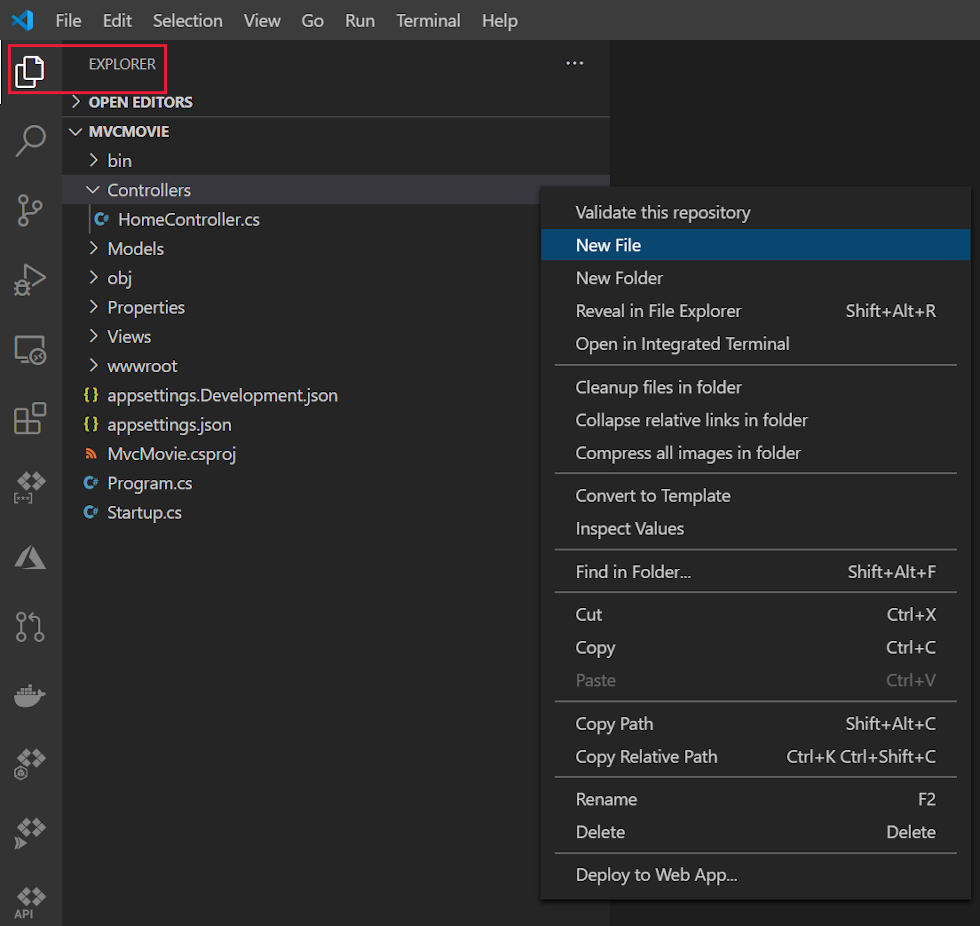
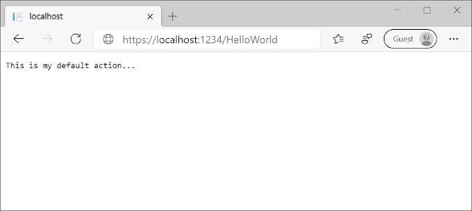
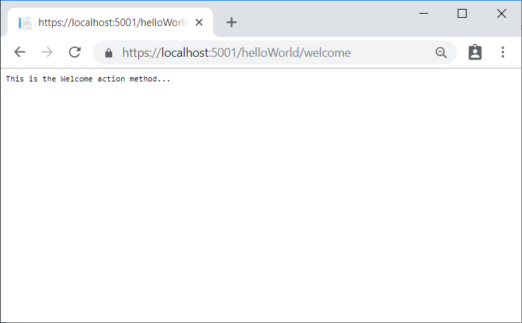
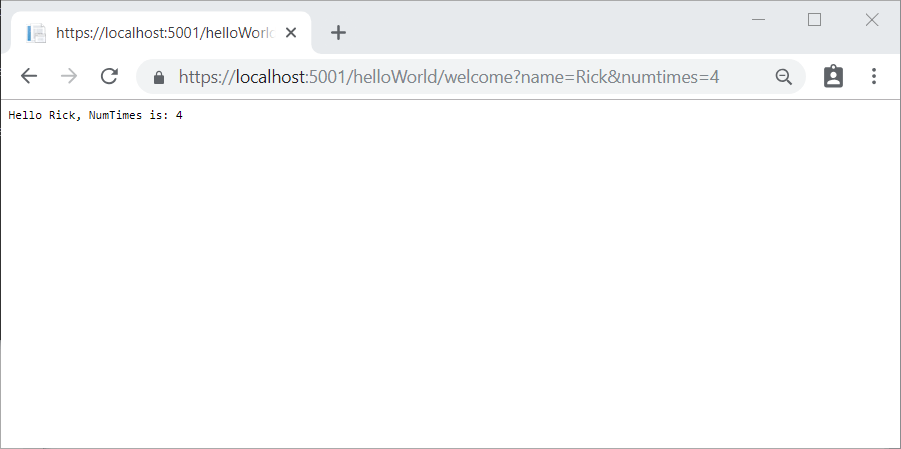

# Part 2, add a controller to an ASP.NET Core MVC app

## 목차
- [Part 2, add a controller to an ASP.NET Core MVC app](#part-2-add-a-controller-to-an-aspnet-core-mvc-app)
  - [목차](#목차)
  - [컨트롤러 추가](#컨트롤러-추가)
  - [출처](#출처)
  - [다음](#다음)

---
모델-뷰-컨트롤러(MVC) 아키텍처 패턴은 앱을 세 가지 주요 구성 요소인 **M**odel(모델), **V**iew(뷰) 및 **C**ontroller(컨트롤러)로 분리합니다. MVC 패턴은 전통적인 모놀리식 앱보다 테스트가 용이하고 업데이트가 쉬운 앱을 만드는 데 도움을 줍니다.

MVC 기반 앱은 다음을 포함합니다:

* **M**odels: 앱의 데이터를 나타내는 클래스입니다. 모델 클래스는 데이터에 대한 비즈니스 규칙을 강제하기 위해 검증 로직을 사용합니다. 일반적으로 모델 객체는 데이터베이스에서 모델 상태를 검색하고 저장합니다. 이 튜토리얼에서는 `Movie` 모델이 데이터베이스에서 영화 데이터를 검색하고, 이를 뷰에 제공하거나 업데이트합니다. 업데이트된 데이터는 데이터베이스에 기록됩니다.
* **V**iews: 앱의 사용자 인터페이스(UI)를 표시하는 구성 요소입니다. 일반적으로 이 UI는 모델 데이터를 표시합니다.
* **C**ontrollers: 다음을 수행하는 클래스입니다:
  * 브라우저 요청 처리.
  * 모델 데이터 검색.
  * 응답을 반환하는 뷰 템플릿 호출.

MVC 앱에서는 뷰가 정보만 표시하고, 컨트롤러가 사용자 입력과 상호 작용을 처리합니다. 예를 들어, 컨트롤러는 URL 세그먼트 및 쿼리 문자열 값을 처리하고, 이러한 값을 모델에 전달합니다. 모델은 이러한 값을 사용하여 데이터베이스를 쿼리할 수 있습니다. 예를 들어:

* `https://localhost:5001/Home/Privacy`: `Home` 컨트롤러와 `Privacy` 액션을 지정합니다.
* `https://localhost:5001/Movies/Edit/5`: `Movies` 컨트롤러와 `Edit` 액션을 사용하여 ID=5인 영화를 편집하라는 요청입니다. 이는 튜토리얼에서 자세히 설명됩니다.

경로 데이터는 튜토리얼에서 후에 설명됩니다.

MVC 아키텍처 패턴은 앱을 모델, 뷰 및 컨트롤러의 세 가지 주요 구성 요소 그룹으로 분리합니다. 이 패턴은 다음과 같은 관심사 분리를 달성하는 데 도움을 줍니다: UI 로직은 뷰에, 입력 로직은 컨트롤러에, 비즈니스 로직은 모델에 속합니다. 이러한 분리는 앱을 구축할 때 복잡성을 관리하는 데 도움을 주며, 다른 코드에 영향을 주지 않고 하나의 구현 측면에서 작업할 수 있게 합니다. 예를 들어, 비즈니스 로직 코드에 의존하지 않고 뷰 코드를 작업할 수 있습니다.

이러한 개념은 영화 앱을 구축하는 동안 이 튜토리얼 시리즈에서 도입되고 시연됩니다. MVC 프로젝트에는 *Controllers* 및 *Views* 폴더가 포함되어 있습니다.

## 컨트롤러 추가

**Visual Studio Code**

**EXPLORER** 아이콘을 선택한 다음 **Controllers > New File**을 컨트롤 클릭(마우스 오른쪽 버튼 클릭)하고 새 파일 이름을 `HelloWorldController.cs`로 지정합니다.



---

`Controllers/HelloWorldController.cs`의 내용을 다음 코드로 대체합니다:

```C#
using Microsoft.AspNetCore.Mvc;
using System.Text.Encodings.Web;

namespace MvcMovie.Controllers;

public class HelloWorldController : Controller
{
    // 
    // GET: /HelloWorld/
    public string Index()
    {
        return "This is my default action...";
    }
    // 
    // GET: /HelloWorld/Welcome/ 
    public string Welcome()
    {
        return "This is the Welcome action method...";
    }
}
```

모든 `public` 메서드는 HTTP 엔드포인트로 호출할 수 있습니다. 위의 예제에서 두 메서드는 문자열을 반환합니다. 각 메서드 앞에 있는 주석을 확인하세요.

HTTP 엔드포인트:

* 웹 애플리케이션에서 타겟이 되는 URL입니다. 예: `https://localhost:5001/HelloWorld`.
* 다음을 결합합니다:
  * 사용된 프로토콜: `HTTPS`.
  * 웹 서버의 네트워크 위치, TCP 포트를 포함하여: `localhost:5001`.
  * 타겟 URI: `HelloWorld`.

첫 번째 주석은 [HTTP GET](https://developer.mozilla.org/docs/Web/HTTP/Methods/GET) 메서드로, 기본 URL에 `/HelloWorld/`를 추가하여 호출됩니다.

두 번째 주석은 [HTTP GET](https://developer.mozilla.org/docs/Web/HTTP/Methods) 메서드로, URL에 `/HelloWorld/Welcome/`을 추가하여 호출됩니다. 튜토리얼의 후반부에서는 HTTP POST 메서드를 생성하여 데이터를 업데이트하는 방법을 살펴봅니다.

디버거 없이 앱을 실행하려면 <kbd>Ctrl</kbd>+<kbd>F5</kbd>(Windows) 또는 <kbd>⌘</kbd>+<kbd>F5</kbd>(macOS)를 누릅니다.

주소 표시줄에 `/HelloWorld`를 추가합니다. `Index` 메서드는 문자열을 반환합니다.



MVC는 URL에 따라 컨트롤러 클래스와 그 안의 액션 메서드를 호출합니다. MVC에서 사용되는 기본 [URL 라우팅 로직](https://learn.microsoft.com/en-us/aspnet/core/mvc/controllers/routing?view=aspnetcore-8.0)은 어떤 코드를 호출할지를 결정하기 위해 다음과 같은 형식을 사용합니다:

`/[Controller]/[ActionName]/[Parameters]`

라우팅 형식은 `Program.cs` 파일에서 설정됩니다.

```C#
app.MapControllerRoute(
    name: "default",
    pattern: "{controller=Home}/{action=Index}/{id?}");
```

앱을 열고 URL 세그먼트를 제공하지 않으면, 위의 강조된 템플릿 줄에 지정된 대로 "Home" 컨트롤러와 "Index" 메서드로 기본 설정됩니다. 위의 URL 세그먼트에서:

* 첫 번째 URL 세그먼트는 실행할 컨트롤러 클래스를 결정합니다. 따라서 `localhost:5001/HelloWorld`는 **HelloWorld** 컨트롤러 클래스로 매핑됩니다.
* URL 세그먼트의 두 번째 부분은 클래스의 액션 메서드를 결정합니다. 따라서 `localhost:5001/HelloWorld/Index`는 `HelloWorldController` 클래스의 `Index` 메서드를 실행하게 합니다. 주목할 점은 `localhost:5001/HelloWorld`로만 브라우징하면 `Index` 메서드가 기본적으로 호출된다는 것입니다. 명시적으로 메서드 이름이 지정되지 않으면 `Index`가 기본적으로 호출됩니다.
* URL 세그먼트의 세 번째 부분(`id`)는 경로 데이터입니다. 경로 데이터는 튜토리얼 후반에 설명됩니다.

다음으로 이동합니다: `https://localhost:{PORT}/HelloWorld/Welcome`. `{PORT}`를 포트 번호로 바꿉니다.

`Welcome` 메서드는 실행되고 `This is the Welcome action method...` 문자열을 반환합니다. 이 URL에서는 컨트롤러가 `HelloWorld`이고, 액션 메서드가 `Welcome`입니다. 아직 URL의 `[Parameters]` 부분은 사용하지 않았습니다.



URL에서 컨트롤러에 매개변수 정보를 전달하도록 코드를 수정합니다. 예를 들어, `/HelloWorld/Welcome?name=Rick&numtimes=4`.

`Welcome` 메서드를 다음 코드와 같이 두 개의 매개변수를 포함하도록 변경합니다.

```C#
// GET: /HelloWorld/Welcome/ 
// Requires using System.Text.Encodings.Web;
public string Welcome(string name, int numTimes = 1)
{
    return HtmlEncoder.Default.Encode($"Hello {name}, NumTimes is: {numTimes}");
}
```

위의 코드는 다음과 같습니다:

* `numTimes` 매개변수에 대한 기본값을 1로 설정하여 C# 선택적 매개변수 기능을 사용합니다.
* JavaScript와 같은 악의적인 입력으로부터 앱을 보호하기 위해 `HtmlEncoder.Default.Encode`를 사용합니다.
* `$"Hello {name}, NumTimes is: {numTimes}"`에서 [Interpolated Strings](https://learn.microsoft.com/en-us/dotnet/articles/csharp/language-reference/keywords/interpolated-strings)을 사용합니다.

앱을 실행하고 다음으로 이동합니다: `https://localhost:{PORT}/HelloWorld/Welcome?name=Rick&numtimes=4`. `{PORT}`를 포트 번호로 바꿉니다.

URL의 `name` 및 `numtimes` 값들을 다르게 변경해 보세요. MVC [모델 바인딩](https://learn.microsoft.com/en-us/aspnet/core/mvc/models/model-binding?view=aspnetcore-8.0) 시스템은 쿼리 문자열의 이름 매개변수를 메서드의 매개변수에 자동으로 매핑합니다. 자세한 내용은 [모델 바인딩](https://learn.microsoft.com/en-us/aspnet/core/mvc/models/model-binding?view=aspnetcore-8.0)을 참조하세요.



이전 이미지에서는:

* URL 세그먼트 `Parameters`가 사용되지 않았습니다.
* `name`과 `numTimes` 매개변수는 [쿼리 문자열](https://wikipedia.org/wiki/Query_string)로 전달되었습니다.
* 위 URL의 `?`(물음표)는 구분자이며, 쿼리 문자열이 뒤따릅니다.
* `&` 문자는 필드-값 쌍을 구분합니다.

`Welcome` 메서드를 다음 코드로 대체합니다:

```C#
public string Welcome(string name, int ID = 1)
{
    return HtmlEncoder.Default.Encode($"Hello {name}, ID: {ID}");
}
```

앱을 실행하고 다음 URL을 입력합니다: `https://localhost:{PORT}/HelloWorld/Welcome/3?name=Rick`

위 URL에서는:

* 세 번째 URL 세그먼트가 경로 매개변수 `id`와 일치합니다.
* `Welcome` 메서드에는 `MapControllerRoute` 메서드의 URL 템플릿과 일치하는 `id` 매개변수가 포함되어 있습니다.
* 후행 `?`는 [쿼리 문자열](https://wikipedia.org/wiki/Query_string)을 시작합니다.

[!code-csharp[](~/tutorials/first-mvc-app/start-mvc/sample/MvcMovie80/Program.cs?name=snippet_MapControllerRoute&highlight=3)]

위 예제에서는:

* 세 번째 URL 세그먼트가 경로 매개변수 `id`와 일치합니다.
* `Welcome` 메서드에는 `MapControllerRoute` 메서드의 URL 템플릿과 일치하는 `id` 매개변수가 포함되어 있습니다.
* 후행 `?`( `id?`에서)는 `id` 매개변수가 선택 사항임을 나타냅니다.

---
## 출처
[Part 2, add a controller to an ASP.NET Core MVC app](https://learn.microsoft.com/en-us/aspnet/core/tutorials/first-mvc-app/adding-controller?view=aspnetcore-8.0&tabs=visual-studio-code)

---
## [다음](./09_03_add_view.md)
