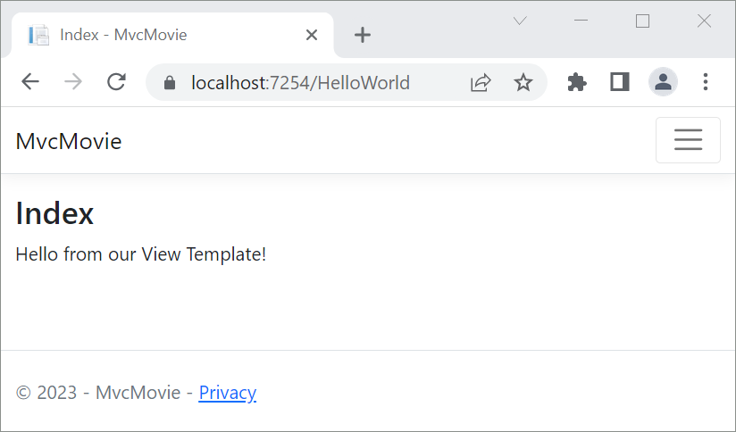
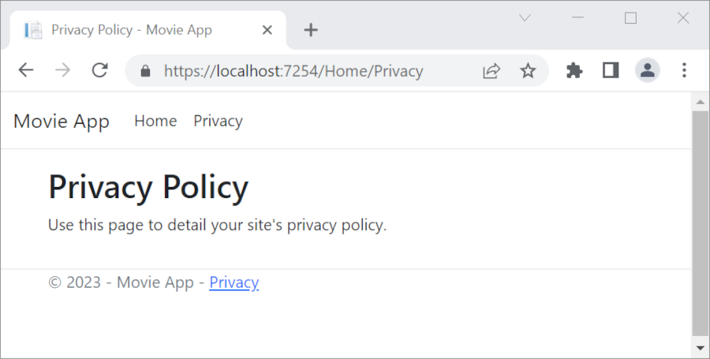
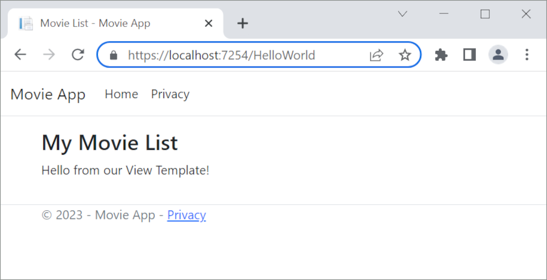
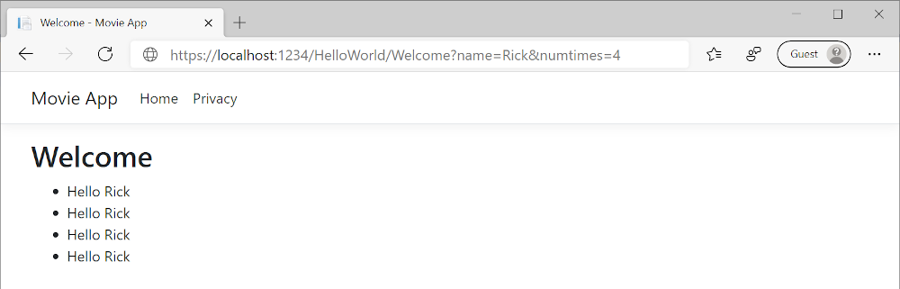

# Part 3, add a view to an ASP.NET Core MVC app

## 목차
- [Part 3, add a view to an ASP.NET Core MVC app](#part-3-add-a-view-to-an-aspnet-core-mvc-app)
  - [목차](#목차)
  - [뷰 추가](#뷰-추가)
  - [뷰와 레이아웃 페이지 변경](#뷰와-레이아웃-페이지-변경)
  - [레이아웃 파일에서 제목, 바닥글, 메뉴 링크 변경](#레이아웃-파일에서-제목-바닥글-메뉴-링크-변경)
  - [컨트롤러에서 뷰로 데이터 전달하기](#컨트롤러에서-뷰로-데이터-전달하기)
  - [출처](#출처)
  - [다음](#다음)

---

이 섹션에서는 [Razor](https://learn.microsoft.com/en-us/aspnet/core/mvc/views/razor?view=aspnetcore-8.0) 뷰 파일을 사용하도록 `HelloWorldController` 클래스를 수정합니다. 이를 통해 클라이언트에게 HTML 응답을 생성하는 과정을 깔끔하게 캡슐화할 수 있습니다.

뷰 템플릿은 Razor를 사용하여 생성됩니다. Razor 기반 뷰 템플릿은 다음과 같은 특징이 있습니다:

* `.cshtml` 파일 확장자를 가집니다.
* C#을 사용하여 HTML 출력을 우아하게 생성할 수 있는 방법을 제공합니다.

현재 `Index` 메서드는 컨트롤러 클래스에서 메시지가 포함된 문자열을 반환합니다. `HelloWorldController` 클래스에서 `Index` 메서드를 다음 코드로 교체합니다:

```C#
public IActionResult Index()
{
    return View();
}
```

위의 코드는 다음을 수행합니다:

* 컨트롤러의 `View` 메서드를 호출합니다.
* 뷰 템플릿을 사용하여 HTML 응답을 생성합니다.

컨트롤러 메서드는:

* *액션 메서드*라고 불립니다. 예를 들어, 위의 코드에서 `Index` 액션 메서드.
* 일반적으로 `IActionResult` 또는 `ActionResult`에서 파생된 클래스를 반환하며, `string`과 같은 타입을 반환하지 않습니다.

## 뷰 추가

**Visual Studio Code**

`HelloWorldController`에 대한 `Index` 뷰를 추가합니다:

* *Views/HelloWorld* 폴더를 새로 만듭니다.
* *Views/HelloWorld* 폴더에 새 파일을 추가하고, 파일 이름을 `Index.cshtml`로 지정합니다.

---

`Views/HelloWorld/Index.cshtml` Razor 뷰 파일의 내용을 다음 내용으로 교체합니다:

```cshtml
@{
    ViewData["Title"] = "Index";
}

<h2>Index</h2>

<p>Hello from our View Template!</p>
```

`https://localhost:{PORT}/HelloWorld`로 이동합니다:

* `HelloWorldController`의 `Index` 메서드는 `return View();` 문을 실행하여 응답을 브라우저에 렌더링하기 위해 뷰 템플릿 파일을 사용해야 함을 지정했습니다.
* 뷰 템플릿 파일 이름이 지정되지 않았으므로, MVC는 기본 뷰 파일을 사용했습니다. 뷰 파일 이름이 지정되지 않은 경우, 기본 뷰는 액션 메서드와 동일한 이름을 가집니다. 이 예제에서는 `Index`입니다. 뷰 템플릿 `/Views/HelloWorld/Index.cshtml`이 사용되었습니다.
* 다음 이미지는 뷰에 하드코딩된 "Hello from our View Template!" 문자열을 보여줍니다:

  

## 뷰와 레이아웃 페이지 변경

메뉴 링크 **MvcMovie**, **Home**, **Privacy**를 선택합니다. 각 페이지는 동일한 메뉴 레이아웃을 보여줍니다. 메뉴 레이아웃은 `Views/Shared/_Layout.cshtml` 파일에 구현되어 있습니다.

`Views/Shared/_Layout.cshtml` 파일을 엽니다.

[레이아웃](https://learn.microsoft.com/en-us/aspnet/core/mvc/views/layout?view=aspnetcore-8.0) 템플릿을 통해 다음을 수행할 수 있습니다:

* 사이트의 HTML 컨테이너 레이아웃을 한 곳에서 지정합니다.
* 사이트의 여러 페이지에 걸쳐 HTML 컨테이너 레이아웃을 적용합니다.

`@RenderBody()` 줄을 찾습니다. `RenderBody`는 생성한 뷰 특정 페이지가 레이아웃 페이지에 *포함*되는 자리 표시자입니다. 예를 들어, **Privacy** 링크를 선택하면 *`Views/Home/Privacy.cshtml`* 뷰가 `RenderBody` 메서드 내에서 렌더링됩니다.

## 레이아웃 파일에서 제목, 바닥글, 메뉴 링크 변경

`Views/Shared/_Layout.cshtml` 파일의 내용을 다음 마크업으로 교체합니다. 변경 사항은 강조 표시되어 있습니다:

```C#
<!DOCTYPE html>
<html lang="en">
<head>
    <meta charset="utf-8" />
    <meta name="viewport" content="width=device-width, initial-scale=1.0" />
    <title>@ViewData["Title"] - Movie App</title>
    <link rel="stylesheet" href="~/lib/bootstrap/dist/css/bootstrap.css" />
    <link rel="stylesheet" href="~/css/site.css" asp-append-version="true" />
</head>
<body>
    <header>
        <nav class="navbar navbar-expand-sm navbar-toggleable-sm navbar-light bg-white border-bottom box-shadow mb-3">
            <div class="container-fluid">
                <a class="navbar-brand" asp-area="" asp-controller="Movies" asp-action="Index">Movie App</a>
                <button class="navbar-toggler" type="button" data-bs-toggle="collapse" data-bs-target=".navbar-collapse" aria-controls="navbarSupportedContent"
                        aria-expanded="false" aria-label="Toggle navigation">
                    <span class="navbar-toggler-icon"></span>
                </button>
                <div class="navbar-collapse collapse d-sm-inline-flex justify-content-between">
                    <ul class="navbar-nav flex-grow-1">
                        <li class="nav-item">
                            <a class="nav-link text-dark" asp-area="" asp-controller="Home" asp-action="Index">Home</a>
                        </li>
                        <li class="nav-item">
                            <a class="nav-link text-dark" asp-area="" asp-controller="Home" asp-action="Privacy">Privacy</a>
                        </li>
                    </ul>
                </div>
            </div>
        </nav>
    </header>
    <div class="container">
        <main role="main" class="pb-3">
            @RenderBody()
        </main>
    </div>

    <footer class="border-top footer text-muted">
        <div class="container">
            &copy; 2023 - Movie App - <a asp-area="" asp-controller="Home" asp-action="Privacy">Privacy</a>
        </div>
    </footer>
    <script src="~/lib/jquery/dist/jquery.js"></script>
    <script src="~/lib/bootstrap/dist/js/bootstrap.js"></script>
    <script src="~/js/site.js" asp-append-version="true"></script>
    @await RenderSectionAsync("Scripts", required: false)
</body>
</html>
```

위의 마크업은 다음과 같은 변경 사항을 적용했습니다:

* `MvcMovie` 세 번을 `Movie App`으로 변경했습니다.
* 앵커 요소 `<a class="navbar-brand" asp-area="" asp-controller="Home" asp-action="Index">MvcMovie</a>`를 `<a class="navbar-brand" asp-controller="Movies" asp-action="Index">Movie App</a>`로 변경했습니다.

위의 마크업에서 `asp-area=""` [앵커 태그 헬퍼 속성](https://learn.microsoft.com/en-us/aspnet/core/mvc/views/tag-helpers/built-in/anchor-tag-helper?view=aspnetcore-8.0)과 속성 값은 이 앱이 [영역](https://learn.microsoft.com/en-us/aspnet/core/mvc/controllers/areas?view=aspnetcore-8.0)을 사용하지 않기 때문에 생략되었습니다.

**참고**: `Movies` 컨트롤러는 아직 구현되지 않았습니다. 이 시점에서는 `Movie App` 링크가 작동하지 않습니다.

변경 사항을 저장하고 **Privacy** 링크를 선택합니다. 브라우저 탭의 제목이 **Privacy Policy - Movie App**으로 표시되며 **Privacy Policy - MvcMovie**가 아닌지 확인합니다.



**Home** 링크를 선택합니다.

제목과 앵커 텍스트가 **Movie App**으로 표시됩니다. 레이아웃 템플릿에서 한 번 변경하면 사이트의 모든 페이지에 새 링크 텍스트와 새 제목이 반영됩니다.

`Views/_ViewStart.cshtml` 파일을 확인합니다:

```cshtml
@{
    Layout = "_Layout";
}
```

`Views/_ViewStart.cshtml` 파일은 각 뷰에 `Views/Shared/_Layout.cshtml` 파일을 포함시킵니다. `Layout` 속성을 사용하여 다른 레이아웃 뷰를 설정하거나 `null`로 설정하여 레이아웃 파일을 사용하지 않도록 할 수 있습니다.

`Views/HelloWorld/Index.cshtml` 뷰 파일을 엽니다.

제목과 `<h2>` 요소를 다음과 같이 강조 표시된 부분으로 변경합니다:

```cshtml
@{
    ViewData["Title"] = "Movie List";
}

<h2>My Movie List</h2>

<p>Hello from our View Template!</p>
```

제목과 `<h2>` 요소가 약간 다르게 설정되어 있어 어느 부분의 코드가 표시를 변경하는지 명확하게 알 수 있습니다.

위의 코드에서 `ViewData["Title"] = "Movie List";`는 `ViewData` 사전의 `Title` 속성을 "Movie List"로 설정

합니다. `Title` 속성은 레이아웃 페이지의 `<title>` HTML 요소에서 사용됩니다:

```cshtml
<title>@ViewData["Title"] - Movie App</title>
```

변경 사항을 저장하고 `https://localhost:{PORT}/HelloWorld`로 이동합니다.

다음 항목이 변경되었는지 확인합니다:

* 브라우저 제목.
* 주요 제목.
* 보조 제목.

브라우저에서 변경 사항이 없으면 캐시된 콘텐츠가 표시될 수 있습니다. 브라우저에서 Ctrl+F5를 눌러 서버에서 응답을 강제로 로드합니다. 브라우저 제목은 `Index.cshtml` 뷰 템플릿에서 설정한 `ViewData["Title"]`과 레이아웃 파일에서 추가한 "- Movie App"으로 생성됩니다.

`Index.cshtml` 뷰 템플릿의 콘텐츠는 `Views/Shared/_Layout.cshtml` 뷰 템플릿과 병합됩니다. 단일 HTML 응답이 브라우저로 전송됩니다. 레이아웃 템플릿을 사용하면 앱의 모든 페이지에 적용되는 변경 사항을 쉽게 적용할 수 있습니다. 자세한 내용은 [레이아웃](https://learn.microsoft.com/en-us/aspnet/core/mvc/views/layout?view=aspnetcore-8.0)을 참조하세요.



"Hello from our View Template!" 메시지와 같은 작은 "데이터"는 하드코딩되어 있습니다. MVC 애플리케이션은 "V"(뷰)와 "C"(컨트롤러)를 가지고 있지만 아직 "M"(모델)은 없습니다.

## 컨트롤러에서 뷰로 데이터 전달하기

컨트롤러 액션은 들어오는 URL 요청에 응답하여 호출됩니다. 컨트롤러 클래스는 들어오는 브라우저 요청을 처리하는 코드를 작성하는 곳입니다. 컨트롤러는 데이터 소스에서 데이터를 가져와 브라우저에 어떤 유형의 응답을 보낼지 결정합니다. 컨트롤러는 뷰 템플릿을 사용하여 브라우저에 HTML 응답을 생성하고 서식 지정할 수 있습니다.

컨트롤러는 뷰 템플릿이 응답을 렌더링하는 데 필요한 데이터를 제공할 책임이 있습니다.

뷰 템플릿은 **다음 작업을 하지 말아야 합니다**:

* 비즈니스 로직 수행
* 데이터베이스와 직접 상호작용

뷰 템플릿은 컨트롤러가 제공하는 데이터만 사용해야 합니다. 이러한 "관심사의 분리"를 유지하면 코드가 깨끗하고, 테스트 가능하며, 유지 관리가 용이해집니다.

현재 `HelloWorldController` 클래스의 `Welcome` 메서드는 `name`과 `ID` 매개변수를 받아서 값을 브라우저에 직접 출력합니다.

컨트롤러가 이 응답을 문자열로 렌더링하는 대신, 뷰 템플릿을 사용하도록 컨트롤러를 변경합니다. 뷰 템플릿은 동적 응답을 생성하므로, 컨트롤러에서 뷰로 적절한 데이터를 전달하여 응답을 생성해야 합니다. 이를 위해 컨트롤러는 뷰 템플릿이 필요한 동적 데이터(매개변수)를 `ViewData` 사전에 넣습니다. 그런 다음 뷰 템플릿은 동적 데이터에 액세스할 수 있습니다.

`HelloWorldController.cs`에서 `Welcome` 메서드를 변경하여 `Message` 및 `NumTimes` 값을 `ViewData` 사전에 추가합니다.

`ViewData` 사전은 동적 객체이므로 모든 유형을 사용할 수 있습니다. `ViewData` 객체는 무언가가 추가될 때까지 정의된 속성이 없습니다. [MVC 모델 바인딩 시스템](https://learn.microsoft.com/en-us/aspnet/core/mvc/models/model-binding?view=aspnetcore-8.0)은 쿼리 문자열에서 이름이 지정된 매개변수를 메서드의 매개변수에 자동으로 매핑합니다. 전체 `HelloWorldController`:

```C#
using Microsoft.AspNetCore.Mvc;
using System.Text.Encodings.Web;

namespace MvcMovie.Controllers;

public class HelloWorldController : Controller
{
    public IActionResult Index()
    {
        return View();
    }
    public IActionResult Welcome(string name, int numTimes = 1)
    {
        ViewData["Message"] = "Hello " + name;
        ViewData["NumTimes"] = numTimes;
        return View();
    }
}
```

`ViewData` 사전 객체에는 뷰로 전달될 데이터가 포함되어 있습니다.

`Views/HelloWorld/Welcome.cshtml`이라는 Welcome 뷰 템플릿을 만듭니다.

`Welcome.cshtml` 뷰 템플릿에 "Hello"를 `NumTimes`만큼 표시하는 루프를 만듭니다. `Views/HelloWorld/Welcome.cshtml`의 내용을 다음과 같이 교체합니다:

```cshtml
@{
    ViewData["Title"] = "Welcome";
}

<h2>Welcome</h2>

<ul>
    @for (int i = 0; i < (int)ViewData["NumTimes"]!; i++)
    {
        <li>@ViewData["Message"]</li>
    }
</ul>
```

변경 사항을 저장하고 다음 URL로 이동합니다:

`https://localhost:{PORT}/HelloWorld/Welcome?name=Rick&numtimes=4`

데이터는 URL에서 가져와 [MVC 모델 바인더](https://learn.microsoft.com/en-us/aspnet/core/mvc/models/model-binding?view=aspnetcore-8.0)를 사용하여 컨트롤러로 전달됩니다. 컨트롤러는 데이터를 `ViewData` 사전에 패키징하여 뷰로 전달합니다. 그런 다음 뷰는 데이터를 HTML로 렌더링하여 브라우저에 전달합니다.



위 샘플에서 `ViewData` 사전은 컨트롤러에서 뷰로 데이터를 전달하는 데 사용되었습니다. 튜토리얼의 나중 단계에서는 뷰 모델을 사용하여 컨트롤러에서 뷰로 데이터를 전달합니다. 뷰 모델 접근 방식이 `ViewData` 사전 접근 방식보다 선호됩니다.

다음 튜토리얼에서는 영화 데이터베이스를 생성합니다.

---
## 출처
[Part 3, add a view to an ASP.NET Core MVC app](https://learn.microsoft.com/en-us/aspnet/core/tutorials/first-mvc-app/start-mvc?view=aspnetcore-8.0&tabs=visual-studio-code)

---
## [다음](./09_04_add_model.md)
