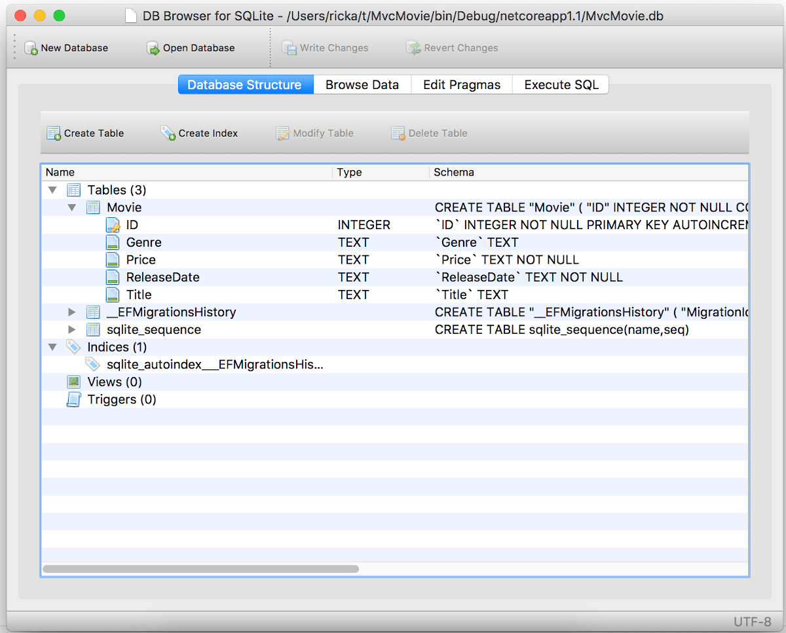

# Part 5, work with a database in an ASP.NET Core MVC app

## 목차
- [Part 5, work with a database in an ASP.NET Core MVC app](#part-5-work-with-a-database-in-an-aspnet-core-mvc-app)
  - [목차](#목차)
  - [SQLite](#sqlite)
  - [데이터베이스 시드](#데이터베이스-시드)
    - [시드 초기화기 추가](#시드-초기화기-추가)
  - [출처](#출처)
  - [다음](#다음)

---

`MvcMovieContext` 객체는 데이터베이스에 연결하고 `Movie` 객체를 데이터베이스 레코드에 매핑하는 작업을 처리합니다. 데이터베이스 컨텍스트는 `Program.cs` 파일에서 [종속성 주입](https://learn.microsoft.com/en-us/aspnet/core/fundamentals/dependency-injection?view=aspnetcore-8.0) 컨테이너에 등록됩니다:

**Visual Studio Code / Visual Studio for Mac**

```C#
var builder = WebApplication.CreateBuilder(args);

builder.Services.AddDbContext<MvcMovieContext>(options =>
    options.UseSqlite(builder.Configuration.GetConnectionString("MvcMovieContext")));
```

ASP.NET Core [구성](https://learn.microsoft.com/en-us/aspnet/core/fundamentals/configuration/?view=aspnetcore-8.0) 시스템은 `ConnectionString` 키를 읽습니다. 로컬 개발의 경우, `appsettings.json` 파일에서 연결 문자열을 가져옵니다:

```json
"ConnectionStrings": {
  "MvcMovieContext": "Data Source=MvcMovie.db"
}
```

---

앱이 테스트 또는 프로덕션 서버에 배포될 때, 환경 변수를 사용하여 프로덕션 SQL Server에 대한 연결 문자열을 설정할 수 있습니다. 자세한 내용은 [구성](https://learn.microsoft.com/en-us/aspnet/core/fundamentals/configuration/?view=aspnetcore-8.0)을 참조하세요.


**Visual Studio Code / Visual Studio for Mac**

## SQLite

[SQLite](https://www.sqlite.org/) 웹사이트에서는 다음과 같이 설명합니다:

> SQLite는 자체 포함, 고신뢰성, 임베디드, 기능이 풍부한 공개 도메인 SQL 데이터베이스 엔진입니다. SQLite는 세계에서 가장 많이 사용되는 데이터베이스 엔진입니다.

SQLite 데이터베이스를 관리하고 보기 위한 많은 서드파티 도구를 다운로드할 수 있습니다. 아래 이미지는 [DB Browser for SQLite](https://sqlitebrowser.org/)에서 가져온 것입니다. 선호하는 SQLite 도구가 있다면, 해당 도구의 장점을 댓글로 남겨주세요.



> [!NOTE]
> 이 튜토리얼에서는 가능한 경우 Entity Framework Core *마이그레이션* 기능을 사용합니다. 마이그레이션은 데이터 모델의 변경 사항에 맞게 데이터베이스 스키마를 업데이트합니다. 그러나 마이그레이션은 EF Core 공급자가 지원하는 종류의 변경만 수행할 수 있으며, SQLite 공급자의 기능은 제한적입니다. 예를 들어, 열 추가는 지원되지만 열 제거 또는 변경은 지원되지 않습니다. 열을 제거하거나 변경하는 마이그레이션을 생성하면 `ef migrations add` 명령은 성공하지만 `ef database update` 명령은 실패합니다. 이러한 제한 사항으로 인해, 이 튜토리얼에서는 SQLite 스키마 변경에 마이그레이션을 사용하지 않습니다. 대신 스키마가 변경될 때 데이터베이스를 삭제하고 다시 생성합니다.
>
>SQLite 제한 사항에 대한 해결 방법은 테이블의 내용이 변경될 때 테이블을 재구축하는 마이그레이션 코드를 수동으로 작성하는 것입니다. 테이블 재구축에는 다음이 포함됩니다:
>
>* 새 테이블 생성.
>* 이전 테이블에서 새 테이블로 데이터 복사.
>* 이전 테이블 삭제.
>* 새 테이블 이름 변경.
>
>자세한 내용은 다음 리소스를 참조하세요:
>
> * [SQLite EF Core 데이터베이스 공급자 제한 사항](https://learn.microsoft.com/en-us/ef/core/providers/sqlite/limitations)
> * [마이그레이션 코드 사용자 정의](https://learn.microsoft.com/en-us/ef/core/managing-schemas/migrations/#customize-migration-code)
> * [데이터 시딩](https://learn.microsoft.com/en-us/ef/core/modeling/data-seeding)
> * [SQLite ALTER TABLE 문](https://sqlite.org/lang_altertable.html)

---

## 데이터베이스 시드

*Models* 폴더에 `SeedData`라는 새 클래스를 만듭니다. 생성된 코드를 다음 코드로 교체합니다:

```C#
using Microsoft.EntityFrameworkCore;
using Microsoft.Extensions.DependencyInjection;
using MvcMovie.Data;
using System;
using System.Linq;

namespace MvcMovie.Models;

public static class SeedData
{
    public static void Initialize(IServiceProvider serviceProvider)
    {
        using (var context = new MvcMovieContext(
            serviceProvider.GetRequiredService<
                DbContextOptions<MvcMovieContext>>()))
        {
            // Look for any movies.
            if (context.Movie.Any())
            {
                return;   // DB has been seeded
            }
            context.Movie.AddRange(
                new Movie
                {
                    Title = "When Harry Met Sally",
                    ReleaseDate = DateTime.Parse("1989-2-12"),
                    Genre = "Romantic Comedy",
                    Price = 7.99M
                },
                new Movie
                {
                    Title = "Ghostbusters ",
                    ReleaseDate = DateTime.Parse("1984-3-13"),
                    Genre = "Comedy",
                    Price = 8.99M
                },
                new Movie
                {
                    Title = "Ghostbusters 2",
                    ReleaseDate = DateTime.Parse("1986-2-23"),
                    Genre = "Comedy",
                    Price = 9.99M
                },
                new Movie
                {
                    Title = "Rio Bravo",
                    ReleaseDate = DateTime.Parse("1959-4-15"),
                    Genre = "Western",
                    Price = 3.99M
                }
            );
            context.SaveChanges();
        }
    }
}
```

데이터베이스에 영화가 있는 경우, 시드 초기화기가 반환되어 영화가 추가되지 않습니다.

```csharp
if (context.Movie.Any())
{
    return;  // DB가 시드되었습니다.
}
```

<a name="si"></a>

### 시드 초기화기 추가

**Visual Studio Code / Visual Studio for Mac**

`Program.cs` 파일을 다음 강조된 코드로 업데이트합니다:

```C#
using Microsoft.EntityFrameworkCore;
using Microsoft.Extensions.DependencyInjection;
using MvcMovie.Data;
using MvcMovie.Models;

var builder = WebApplication.CreateBuilder(args);

builder.Services.AddDbContext<MvcMovieContext>(options =>
    options.UseSqlite(builder.Configuration.GetConnectionString("MvcMovieContext")));

// Add services to the container.
builder.Services.AddControllersWithViews();

var app = builder.Build();

using (var scope = app.Services.CreateScope())
{
    var services = scope.ServiceProvider;

    SeedData.Initialize(services);
}

// Configure the HTTP request pipeline.
if (!app.Environment.IsDevelopment())
{
    app.UseExceptionHandler("/Home/Error");
    // The default HSTS value is 30 days. You may want to change this for production scenarios, see https://aka.ms/aspnetcore-hsts.
    app.UseHsts();
}

app.UseHttpsRedirection();
app.UseStaticFiles();

app.UseRouting();

app.UseAuthorization();

app.MapControllerRoute(
    name: "default",
    pattern: "{controller=Home}/{action=Index}/{id?}");

app.Run();
```

데이터베이스의 모든 레코드를 삭제하시오.

앱을 테스트합니다. 중지했다가 다시 시작하여 `SeedData.Initialize` 메서드가 실행되어 데이터베이스를 시드합니다.

---

앱은 시드된 데이터를 표시합니다.


---
## 출처
[Part 5, work with a database in an ASP.NET Core MVC app](https://learn.microsoft.com/en-us/aspnet/core/tutorials/first-mvc-app/working-with-sql?view=aspnetcore-8.0&tabs=visual-studio-code)

---
## [다음](./09_06_controller_methods_and_views.md)
