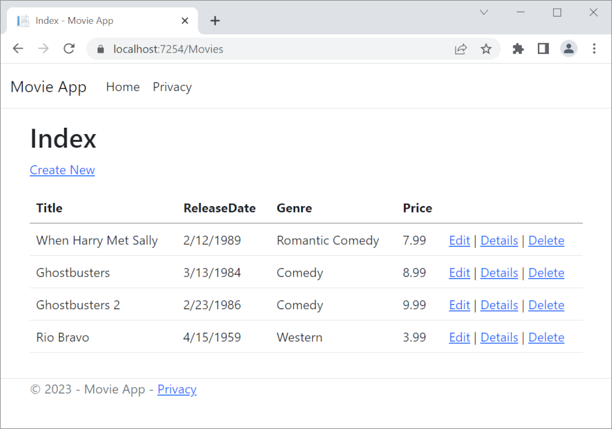
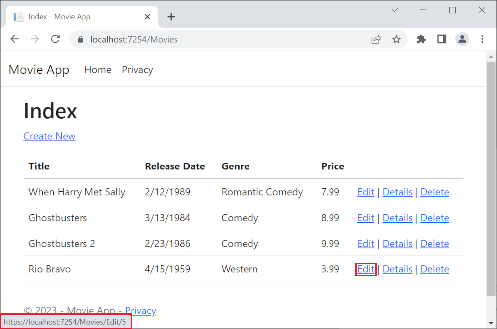
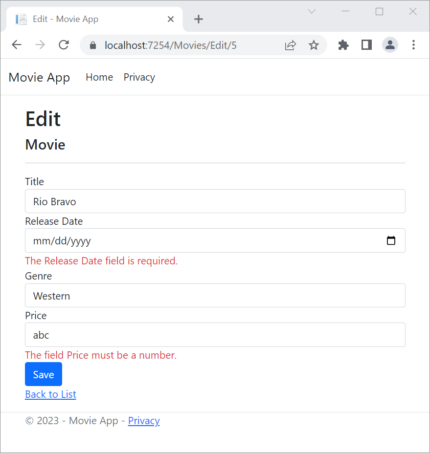

# Part 6, controller methods and views in ASP.NET Core

## 목차
- [Part 6, controller methods and views in ASP.NET Core](#part-6-controller-methods-and-views-in-aspnet-core)
  - [목차](#목차)
  - [POST 요청 처리](#post-요청-처리)
  - [출처](#출처)
  - [다음](#다음)

---
영화 앱을 잘 시작했지만, 예를 들어 **ReleaseDate**는 두 단어로 표시되는 것이 이상적입니다.



`Models/Movie.cs` 파일을 열고 아래 강조된 줄을 추가합니다:

```C#
using System;
using System.ComponentModel.DataAnnotations;
using System.ComponentModel.DataAnnotations.Schema;

namespace MvcMovie.Models;

public class Movie
{
    public int Id { get; set; }
    public string? Title { get; set; }
    
    [Display(Name = "Release Date")]
    [DataType(DataType.Date)]
    public DateTime ReleaseDate { get; set; }
    public string? Genre { get; set; }
    [Column(TypeName = "decimal(18, 2)")]
    public decimal Price { get; set; }
}
```

`DataAnnotations`는 다음 튜토리얼에서 설명합니다. [Display](https://learn.microsoft.com/en-us/dotnet/api/system.componentmodel.dataannotations.displayattribute) 속성은 필드 이름으로 무엇을 표시할지 지정합니다(이 경우 "ReleaseDate" 대신 "Release Date"). [DataType](https://learn.microsoft.com/en-us/dotnet/api/system.componentmodel.dataannotations.datatypeattribute) 속성은 데이터의 유형(날짜)을 지정하여 필드에 저장된 시간 정보가 표시되지 않도록 합니다.

`[Column(TypeName = "decimal(18, 2)")]` 데이터 주석은 Entity Framework Core가 `Price`를 데이터베이스에서 통화로 올바르게 매핑할 수 있도록 필요합니다. 자세한 내용은 [데이터 유형](https://learn.microsoft.com/en-us/ef/core/modeling/relational/data-types)을 참조하세요.

`Movies` 컨트롤러로 이동하여 **Edit** 링크 위에 마우스 포인터를 놓아 대상 URL을 확인합니다.



**Edit**, **Details**, **Delete** 링크는 `Views/Movies/Index.cshtml` 파일의 Core MVC 앵커 태그 도우미에 의해 생성됩니다.

```cshtml
<a asp-action="Edit" asp-route-id="@item.Id">Edit</a> |
        <a asp-action="Details" asp-route-id="@item.Id">Details</a> |
        <a asp-action="Delete" asp-route-id="@item.Id">Delete</a>
    </td>
</tr>
```

[태그 도우미](https://learn.microsoft.com/en-us/aspnet/core/mvc/views/tag-helpers/intro?view=aspnetcore-8.0)는 서버 측 코드를 사용하여 Razor 파일에서 HTML 요소를 생성하고 렌더링하는 데 참여할 수 있게 합니다. 위 코드에서 `AnchorTagHelper`는 컨트롤러 액션 메서드와 라우트 ID에서 HTML `href` 속성 값을 동적으로 생성합니다. 좋아하는 브라우저에서 **소스 보기**를 사용하거나 개발자 도구를 사용하여 생성된 마크업을 확인합니다. 생성된 HTML의 일부는 아래에 표시됩니다:

```html
 <td>
    <a href="/Movies/Edit/4"> Edit </a> |
    <a href="/Movies/Details/4"> Details </a> |
    <a href="/Movies/Delete/4"> Delete </a>
</td>
```

`Program.cs` 파일에 설정된 [라우팅](xref:mvc/controllers/routing) 형식을 기억하세요:

```C#
app.MapControllerRoute(
    name: "default",
    pattern: "{controller=Home}/{action=Index}/{id?}");
```

ASP.NET Core는 `https://localhost:5001/Movies/Edit/4`을 `Id`가 4인 `Movies` 컨트롤러의 `Edit` 액션 메서드에 대한 요청으로 변환합니다. (컨트롤러 메서드는 액션 메서드라고도 합니다.)

[태그 도우미](https://learn.microsoft.com/en-us/aspnet/core/mvc/views/tag-helpers/intro?view=aspnetcore-8.0)는 ASP.NET Core의 가장 인기 있는 새로운 기능 중 하나입니다. 자세한 내용은 [추가 리소스](#추가-리소스)를 참조하세요.

<a name="get-post"></a>

`Movies` 컨트롤러를 열고 두 개의 `Edit` 액션 메서드를 살펴보세요. 다음 코드는 `HTTP GET Edit` 메서드를 보여주며, 이 메서드는 영화를 가져와 `Edit.cshtml` Razor 파일에 의해 생성된 편집 양식을 채웁니다.

```c#
// GET: Movies/Edit/5
public async Task<IActionResult> Edit(int? id)
{
    if (id == null)
    {
        return NotFound();
    }

    var movie = await _context.Movie.FindAsync(id);
    if (movie == null)
    {
        return NotFound();
    }
    return View(movie);
}
```

다음 코드는 게시된 영화 값을 처리하는 `HTTP POST Edit` 메서드를 보여줍니다:

```C#
// POST: Movies/Edit/5
// To protect from overposting attacks, enable the specific properties you want to bind to.
// For more details, see http://go.microsoft.com/fwlink/?LinkId=317598.
[HttpPost]
[ValidateAntiForgeryToken]
public async Task<IActionResult> Edit(int id, [Bind("Id,Title,ReleaseDate,Genre,Price,Rating")] Movie movie)
{
    if (id != movie.Id)
    {
        return NotFound();
    }

    if (ModelState.IsValid)
    {
        try
        {
            _context.Update(movie);
            await _context.SaveChangesAsync();
        }
        catch (DbUpdateConcurrencyException)
        {
            if (!MovieExists(movie.Id))
            {
                return NotFound();
            }
            else
            {
                throw;
            }
        }
        return RedirectToAction(nameof(Index));
    }
    return View(movie);
}
```

`[Bind]` 속성은 [오버 포스팅](https://docs.microsoft.com/aspnet/mvc/overview/getting-started/getting-started-with-ef-using-mvc/implementing-basic-crud-functionality-with-the-entity-framework-in-asp-net-mvc-application#overpost)으로부터 보호하는 한 가지 방법입니다. `[Bind]` 속성에 포함하려는 속성만 포함해야 합니다. 자세한 내용은 [컨트롤러를 오버 포스팅으로부터 보호](https://docs.microsoft.com/aspnet/mvc/overview/getting-started/getting-started-with-ef-using-mvc/implementing-basic-crud-functionality-with-the-entity-framework-in-asp-net-mvc-application)를 참조하세요. [ViewModels](https://rachelappel.com/use-viewmodels-to-manage-data-amp-organize-code-in-asp-net-mvc-applications/)는 오버 포스팅을 방지하는 대체 접근 방식을 제공합니다.

두 번째 `Edit` 액션 메서드는 `[HttpPost]` 속성으로 앞서 있습니다.

```c#
// POST: Movies/Edit/5
// To protect from overposting attacks, enable the specific properties you want to bind to.
// For more details, see http://go.microsoft.com/fwlink/?LinkId=317598.
[HttpPost]
[ValidateAntiForgeryToken]
public async Task<IActionResult> Edit(int id, [Bind("Id,Title,ReleaseDate,Genre,Price,Rating")] Movie movie)
{
    if (id != movie.Id)
    {
        return NotFound();
    }

    if (ModelState.IsValid)
    {
        try
        {
            _context.Update(movie);
            await _context.SaveChangesAsync();
        }
        catch (DbUpdateConcurrencyException)
        {
            if (!MovieExists(movie.Id))
            {
                return NotFound();
            }
            else
            {
                throw;
            }
        }
        return RedirectToAction(nameof(Index));
    }
    return View(movie);
}
```

`HttpPost` 속성은 이 `Edit` 메서드가 *POST* 요청에만 호출될 수 있음을 지정합니다. 첫 번째 편집 메서드에 `[HttpGet]` 속성을 적용할 수 있지만, `[HttpGet]`이 기본값이기 때문에 필요하지 않습니다.

`ValidateAntiForgeryToken` 속성은 [요청 위조 방지](xref:security/anti-request-forgery)에 사용되며, `Edit` 뷰 파일(`Views/Movies/Edit.cshtml`)에서 생성된 위조 방지 토큰과 짝을 이룹니다. 편집 뷰 파일은 [폼 태그 도우미](https://learn.microsoft.com/en-us/aspnet/core/mvc/views/working-with-forms?view=aspnetcore-8.0)를 사용하여 위조 방지 토큰을 생성합니다.

```cshtml
<form asp-action="Edit">
```

[폼 태그 도우미](https://learn.microsoft.com/en-us/aspnet/core/mvc/views/working-with-forms?view=aspnetcore-8.0)는 `Movies` 컨트롤러의 `Edit` 메서드에서 생성된 [ValidateAntiForgeryToken] 위조 방지 토큰과 일치해야 하는 숨겨진 위조 방지 토큰을 생성합니다. 자세한 내용은 [Prevent Cross-Site Request Forgery (XSRF/CSRF) attacks in ASP.NET Core](https://learn.microsoft.com/en-us/aspnet/core/security/anti-request-forgery?view=aspnetcore-8.0)를 참조하세요.

`HttpGet Edit` 메서드는 영화 `ID` 매개 변수를 가져와 Entity Framework `FindAsync` 메서드를 사용하여 영화를 조회하고 선택한 영화를 편집 뷰에 반환합니다. 영화를 찾을 수 없으면 `NotFound`(HTTP 404)가 반환됩니다.

```c#
// GET: Movies/Edit/5
public async Task<IActionResult> Edit(int? id)
{
    if (id == null)
    {
        return NotFound();
    }

    var movie = await _context.Movie.FindAsync(id);
    if (movie == null)
    {
        return NotFound();
    }
    return View(movie);
}
```

스캐폴딩 시스템이 편집 뷰를 생성할 때 `Movie` 클래스를 검사하고 클래스의 각 속성에 대해 `<label>` 및 `<input>` 요소를 렌더링하는 코드를 생성했습니다. 다음 예제는 Visual Studio 스캐폴딩 시스템에 의해 생성된 편집 뷰를 보여줍니다:

```cshtml
@model MvcMovie.Models.Movie

@{
    ViewData["Title"] = "Edit";
}

<h1>Edit</h1>

<h4>Movie</h4>
<hr />
<div class="row">
    <div class="col-md-4">
        <form asp-action="Edit">
            <div asp-validation-summary="ModelOnly" class="text-danger"></div>
            <input type="hidden" asp-for="Id" />
            <div class="form-group">
                <label asp-for="Title" class="control-label"></label>
                <input asp-for="Title" class="form-control" />
                <span asp-validation-for="Title" class="text-danger"></span>
            </div>
            <div class="form-group">
                <label asp-for="ReleaseDate" class="control-label"></label>
                <input asp-for="ReleaseDate" class="form-control" />
                <span asp-validation-for="ReleaseDate" class="text-danger"></span>
            </div>
            <div class="form-group">
                <label asp-for="Genre" class="control-label"></label>
                <input asp-for="Genre" class="form-control" />
                <span asp-validation-for="Genre" class="text-danger"></span>
            </div>
            <div class="form-group">
                <label asp-for="Price" class="control-label"></label>
                <input asp-for="Price" class="form-control" />
                <span asp-validation-for="Price" class="text-danger"></span>
            </div>
            <div class="form-group">
                <input type="submit" value="Save" class="btn btn-primary" />
            </div>
        </form>
    </div>
</div>

<div>
    <a asp-action="Index">Back to List</a>
</div>

@section Scripts {
    @{await Html.RenderPartialAsync("_ValidationScriptsPartial");}
}
```

뷰 템플릿의 맨 위에 `@model MvcMovie.Models.Movie` 문이 있음을 주목하세요. `@model MvcMovie.Models.Movie`는 뷰 템플릿의 모델이 `Movie` 타입이어야 함을 지정합니다.

스캐폴딩된 코드는 HTML 마크업을 간소화하기 위해 여러 태그 도우미 메서드를 사용합니다. [Label Tag Helper](https://learn.microsoft.com/en-us/aspnet/core/mvc/views/working-with-forms?view=aspnetcore-8.0)는 필드의 이름("Title", "ReleaseDate", "Genre", 또는 "Price")을 표시합니다. [Input Tag Helper](https://learn.microsoft.com/en-us/aspnet/core/mvc/views/working-with-forms?view=aspnetcore-8.0)는 HTML `<input>` 요소를 렌더링합니다. [Validation Tag Helper](https://learn.microsoft.com/en-us/aspnet/core/mvc/views/working-with-forms?view=aspnetcore-8.0)는 해당 속성과 관련된 유효성 검사 메시지를 표시합니다.

애플리케이션을 실행하고 `/Movies` URL로 이동합니다. **Edit** 링크를 클릭합니다. 브라우저에서 페이지의 소스를 봅니다. `<form>` 요소에 대한 생성된 HTML은 아래와 같습니다.

```html
<form action="/Movies/Edit/7" method="post">
    <div class="form-horizontal">
        <h4>Movie</h4>
        <hr />
        <div class="text-danger" />
        <input type="hidden" data-val="true" data-val-required="The ID field is required." id="ID" name="ID" value="7" />
        <div class="form-group">
            <label class="control-label col-md-2" for="Genre" />
            <div class="col-md-10">
                <input class="form-control" type="text" id="Genre" name="Genre" value="Western" />
                <span class="text-danger field-validation-valid" data-valmsg-for="Genre" data-valmsg-replace="true"></span>
            </div>
        </div>
        <div class="form-group">
            <label class="control-label col-md-2" for="Price" />
            <div class="col-md-10">
                <input class="form-control" type="text" data-val="true" data-val-number="The field Price must be a number." data-val-required="The Price field is required." id="Price" name="Price" value="3.99" />
                <span class="text-danger field-validation-valid" data-valmsg-for="Price" data-valmsg-replace="true"></span>
            </div>
        </div>
        <!-- Markup removed for brevity -->
        <div class="form-group">
            <div class="col-md-offset-2 col-md-10">
                <input type="submit" value="Save" class="btn btn-default" />
            </div>
        </div>
    </div>
    <input name="__RequestVerificationToken" type="hidden" value="CfDJ8Inyxgp63fRFqUePGvuI5jGZsloJu1L7X9le1gy7NCIlSduCRx9jDQClrV9pOTTmqUyXnJBXhmrjcUVDJyDUMm7-MF_9rK8aAZdRdlOri7FmKVkRe_2v5LIHGKFcTjPrWPYnc9AdSbomkiOSaTEg7RU" />
</form>
```

`<input>` 요소는 `action` 속성이 `/Movies/Edit/id` URL로 설정된 `HTML <form>` 요소에 포함됩니다. `Save` 버튼을 클릭하면 양식 데이터가 서버로 전송됩니다. 닫는 `</form>` 요소 전에 마지막 줄은 [폼 태그 도우미](https://learn.microsoft.com/en-us/aspnet/core/mvc/views/working-with-forms?view=aspnetcore-8.0)에서 생성된 숨겨진 [XSRF](https://learn.microsoft.com/en-us/aspnet/core/security/anti-request-forgery?view=aspnetcore-8.0) 토큰을 보여줍니다.

## POST 요청 처리

다음 목록은 `[HttpPost]` 버전의 `Edit` 액션 메서드를 보여줍니다.

```C#
// POST: Movies/Edit/5
// To protect from overposting attacks, enable the specific properties you want to bind to.
// For more details, see http://go.microsoft.com/fwlink/?LinkId=317598.
[HttpPost]
[ValidateAntiForgeryToken]
public async Task<IActionResult> Edit(int id, [Bind("Id,Title,ReleaseDate,Genre,Price,Rating")] Movie movie)
{
    if (id != movie.Id)
    {
        return NotFound();
    }

    if (ModelState.IsValid)
    {
        try
        {
            _context.Update(movie);
            await _context.SaveChangesAsync();
        }
        catch (DbUpdateConcurrencyException)
        {
            if (!MovieExists(movie.Id))
            {
                return NotFound();
            }
            else
            {
                throw;
            }
        }
        return RedirectToAction(nameof(Index));
    }
    return View(movie);
}
```

`[ValidateAntiForgeryToken]` 속성은 [폼 태그 도우미](https://learn.microsoft.com/en-us/aspnet/core/mvc/views/working-with-forms?view=aspnetcore-8.0)에서 생성된 위조 방지 토큰 생성기에 의해 생성된 숨겨진 [XSRF](https://learn.microsoft.com/en-us/aspnet/core/security/anti-request-forgery?view=aspnetcore-8.0) 토큰을 검증합니다.

[모델 바인딩](https://learn.microsoft.com/en-us/aspnet/core/mvc/models/model-binding?view=aspnetcore-8.0) 시스템은 게시된 양식 값을 가져와 `movie` 매개 변수로 전달되는 `Movie` 객체를 생성합니다. `ModelState.IsValid` 속성은 양식에 제출된 데이터가 `Movie` 객체를 수정(편집 또는 업데이트)하는 데 사용할 수 있는지 확인합니다. 데이터가 유효하면 저장됩니다. 업데이트된(편집된) 영화 데이터는 데이터베이스 컨텍스트의 `SaveChangesAsync` 메서드를 호출하여 데이터베이스에 저장됩니다. 데이터를 저장한 후 코드는 사용자를 `MoviesController` 클래스의 `Index` 액션 메서드로 리디렉션하여 방금 변경된 내용을 포함하여 영화 컬렉션을 표시합니다.

양식이 서버로 게시되기 전에 클라이언트 측 유효성 검사가 필드의 유효성 검사 규칙을 확인합니다. 유효성 검사 오류가 있으면 오류 메시지가 표시되고 양식은 게시되지 않습니다. JavaScript가 비활성화된 경우 클라이언트 측 유효성 검사가 없지만 서버는 유효하지 않은 게시된 값을 감지하고 오류 메시지와 함께 양식 값을 다시 표시합니다. 나중에 이 튜토리얼에서는 [모델 유효성 검사](https://learn.microsoft.com/en-us/aspnet/core/mvc/models/validation?view=aspnetcore-8.0)를 자세히 살펴봅니다. `Views/Movies/Edit.cshtml` 뷰 템플릿의 [유효성 검사 태그 도우미](https://learn.microsoft.com/en-us/aspnet/core/mvc/views/working-with-forms?view=aspnetcore-8.0)는 적절한 오류 메시지를 표시하는 데 도움을 줍니다.



영화 컨트롤러의 모든 `HttpGet` 메서드는 유사한 패턴을 따릅니다. 영화 객체(또는 `Index`의 경우 객체 목록)를 가져와 객체(모델)를 뷰에 전달합니다. `Create` 메서드는 빈 영화 객체를 `Create` 뷰에 전달합니다. 데이터를 생성, 편집, 삭제 또는 수정하는 모든 메서드는 메서드의 `[HttpPost]` 오버로드에서 수행됩니다. `HTTP GET` 메서드에서 데이터를 수정하는 것은 보안 위험입니다. 또한, `HTTP GET` 메서드에서 데이터를 수정하는 것은 HTTP 모범 사례 및 GET 요청이 애플리케이션의 상태를 변경해서는 안 된다고 명시한 아키텍처 [REST](http://rest.elkstein.org/) 패턴을 위반합니다. 즉, GET 작업을 수행하는 것은 부작용이 없고 지속된 데이터를 수정하지 않는 안전한 작업이어야 합니다.

---
## 출처
[Part 6, controller methods and views in ASP.NET Core](https://learn.microsoft.com/en-us/aspnet/core/tutorials/first-mvc-app/controller-methods-views?view=aspnetcore-8.0)

---
## [다음](./09_07_add_search.md)
