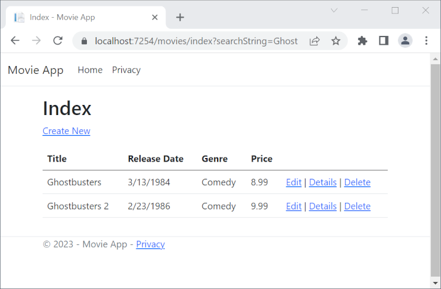
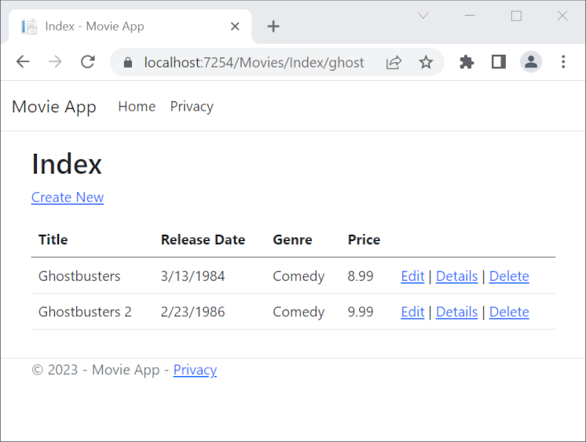
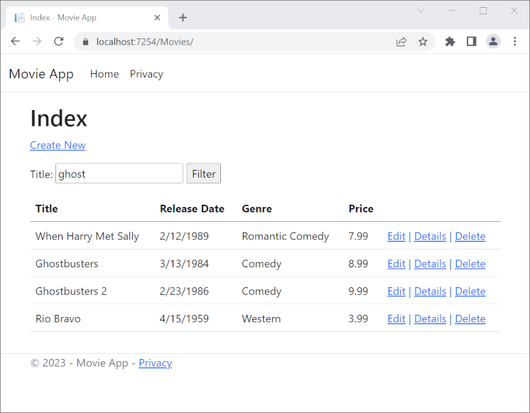
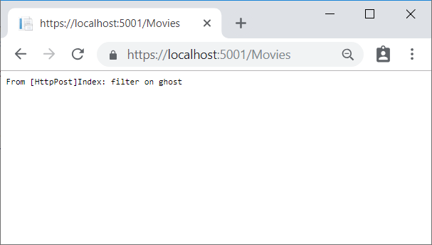
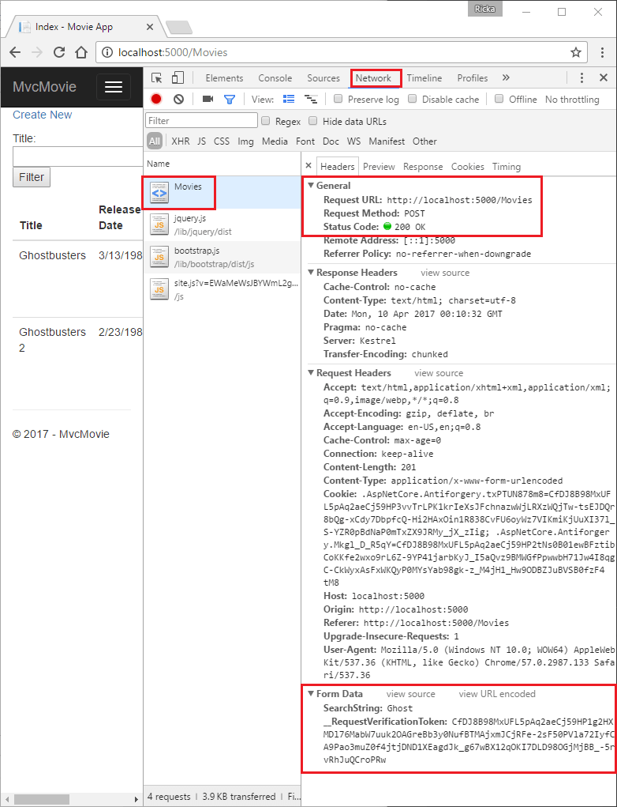
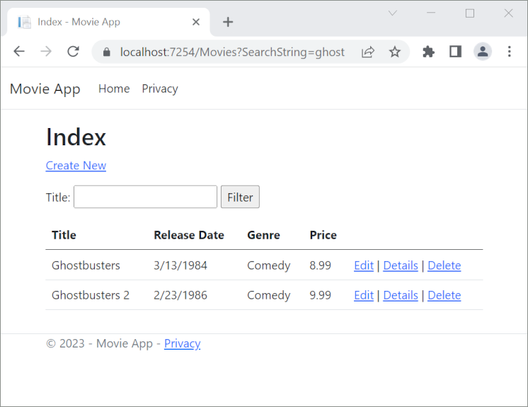
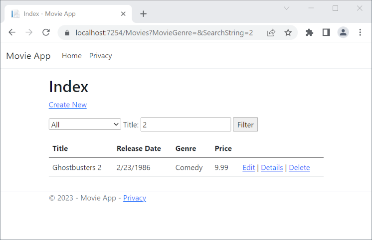

# Part 7, add search to an ASP.NET Core MVC app

## 목차
- [Part 7, add search to an ASP.NET Core MVC app](#part-7-add-search-to-an-aspnet-core-mvc-app)
  - [목차](#목차)
  - [장르별 검색 추가](#장르별-검색-추가)
  - [인덱스 뷰에 장르별 검색 추가](#인덱스-뷰에-장르별-검색-추가)
  - [출처](#출처)
  - [다음](#다음)

---
이 섹션에서는 `Index` 액션 메서드에 검색 기능을 추가하여 *장르* 또는 *이름*으로 영화를 검색할 수 있게 합니다.

`Controllers/MoviesController.cs`에 있는 `Index` 메서드를 다음 코드로 업데이트합니다:

```C#
public async Task<IActionResult> Index(string searchString)
{
    if (_context.Movie == null)
    {
        return Problem("Entity set 'MvcMovieContext.Movie'  is null.");
    }

    var movies = from m in _context.Movie
                select m;

    if (!String.IsNullOrEmpty(searchString))
    {
        movies = movies.Where(s => s.Title!.Contains(searchString));
    }

    return View(await movies.ToListAsync());
}
```

`Index` 액션 메서드의 다음 줄은 영화를 선택하는 [LINQ](https://learn.microsoft.com/en-us/dotnet/standard/using-linq) 쿼리를 생성합니다:

```csharp
var movies = from m in _context.Movie
             select m;
```

이 시점에서는 쿼리가 *정의*만 되었고, **아직** 데이터베이스에 대해 실행되지 않았습니다.

`searchString` 매개 변수가 문자열을 포함하고 있는 경우, 영화 쿼리는 검색 문자열의 값으로 필터링하도록 수정됩니다:

```C#
if (!String.IsNullOrEmpty(searchString))
{
    movies = movies.Where(s => s.Title!.Contains(searchString));
}
```

위의 `s => s.Title!.Contains(searchString)` 코드는 [람다 식](https://learn.microsoft.com/en-us/dotnet/csharp/programming-guide/statements-expressions-operators/lambda-expressions)입니다. 람다는 표준 쿼리 연산자 메서드(예: `Where` 메서드 또는 위 코드에서 사용한 `Contains`)의 인수로 메서드 기반 [LINQ](https://learn.microsoft.com/en-us/dotnet/standard/using-linq) 쿼리에서 사용됩니다. LINQ 쿼리는 정의되거나 `Where`, `Contains`, `OrderBy`와 같은 메서드를 호출하여 수정할 때 실행되지 않습니다. 대신 쿼리 실행이 연기됩니다. 즉, 표현식의 평가가 실제로 반복되거나 `ToListAsync` 메서드가 호출될 때까지 지연됩니다. 지연된 쿼리 실행에 대한 자세한 내용은 [쿼리 실행](https://learn.microsoft.com/en-us/dotnet/framework/data/adonet/ef/language-reference/query-execution)을 참조하세요.

참고: `Contains` 메서드는 위의 c# 코드가 아닌 데이터베이스에서 실행됩니다. 쿼리의 대소문자 구분은 데이터베이스와 정렬 순서에 따라 다릅니다. SQL Server에서는 `Contains`가 대소문자를 구분하지 않는 [SQL LIKE](https://learn.microsoft.com/en-us/sql/t-sql/language-elements/like-transact-sql)로 매핑됩니다. SQLite에서는 기본 정렬 순서로 대소문자를 구분합니다.

`/Movies/Index`로 이동합니다. URL에 `?searchString=Ghost`와 같은 쿼리 문자열을 추가합니다. 필터링된 영화가 표시됩니다.



`Index` 메서드의 시그니처를 `id`라는 매개 변수를 갖도록 변경하면 `id` 매개 변수가 `Program.cs`에 설정된 기본 라우트의 선택적 `{id}` 자리 표시자와 일치합니다.

```C#
app.MapControllerRoute(
    name: "default",
    pattern: "{controller=Home}/{action=Index}/{id?}");
```

매개 변수를 `id`로 변경하고 `searchString`의 모든 항목을 `id`로 변경합니다.

이전 `Index` 메서드:

```C#
public async Task<IActionResult> Index(string searchString)
{
    if (_context.Movie == null)
    {
        return Problem("Entity set 'MvcMovieContext.Movie'  is null.");
    }

    var movies = from m in _context.Movie
                select m;

    if (!String.IsNullOrEmpty(searchString))
    {
        movies = movies.Where(s => s.Title!.Contains(searchString));
    }

    return View(await movies.ToListAsync());
}
```

`id` 매개 변수를 사용하는 업데이트된 `Index` 메서드:

```C#
public async Task<IActionResult> Index(string searchString)
{
    if (_context.Movie == null)
    {
        return Problem("Entity set 'MvcMovieContext.Movie'  is null.");
    }

    var movies = from m in _context.Movie
                select m;

    if (!String.IsNullOrEmpty(searchString))
    {
        movies = movies.Where(s => s.Title!.Contains(searchString));
    }

    return View(await movies.ToListAsync());
}
```

이제 검색 제목을 쿼리 문자열 값 대신 경로 데이터(URL 세그먼트)로 전달할 수 있습니다.



그러나 사용자가 영화를 검색할 때마다 URL을 수정하도록 기대할 수는 없습니다. 이제 필터링을 돕기 위해 UI 요소를 추가합니다. `Index` 메서드의 시그니처를 테스트하기 위해 변경한 경우, 다시 `searchString`이라는 매개 변수를 받도록 변경합니다:

```C#
public async Task<IActionResult> Index(string searchString)
{
    if (_context.Movie == null)
    {
        return Problem("Entity set 'MvcMovieContext.Movie'  is null.");
    }

    var movies = from m in _context.Movie
                select m;

    if (!String.IsNullOrEmpty(searchString))
    {
        movies = movies.Where(s => s.Title!.Contains(searchString));
    }

    return View(await movies.ToListAsync());
}
```

`Views/Movies/Index.cshtml` 파일을 열고 아래 강조된 `<form>` 마크업을 추가합니다:

```cshtml
@model IEnumerable<MvcMovie.Models.Movie>

@{
    ViewData["Title"] = "Index";
}

<h1>Index</h1>

<p>
    <a asp-action="Create">Create New</a>
</p>

<form asp-controller="Movies" asp-action="Index">
    <p>
        Title: <input type="text" name="SearchString" />
        <input type="submit" value="Filter" />
    </p>
</form>
<table class="table">
```

HTML `<form>` 태그는 [폼 태그 도우미](https://learn.microsoft.com/en-us/aspnet/core/mvc/views/working-with-forms?view=aspnetcore-8.0)를 사용하므로 양식을 제출할 때 필터 문자열이 영화 컨트롤러의 `Index` 액션으로 게시됩니다. 변경 사항을 저장한 후 필터를 테스트합니다.



예상할 수 있는 `[HttpPost]` 오버로드 `Index` 메서드는 없습니다. 이 메서드는 앱의 상태를 변경하는 것이 아니라 데이터를 필터링하는 것이므로 필요하지 않습니다.

다음 `[HttpPost] Index` 메서드를 추가할 수 있습니다.

```C#
[HttpPost]
public string Index(string searchString, bool notUsed)
{
    return "From [HttpPost]Index: filter on " + searchString;
}
```

`notUsed` 매개 변수는 `Index` 메서드의 오버로드를 생성하는 데 사용됩니다. 나중에 이 튜토리얼에서 이에 대해 논의할 것입니다.

이 메서드를 추가하면 액션 인보커는 `[HttpPost] Index` 메서드와 일치하게 되며, `[HttpPost] Index` 메서드가 아래 이미지와 같이 실행됩니다.



그러나 `[HttpPost]` 버전의 `Index` 메서드를 추가하더라도, 이 모든 것이 구현된 방식에는 한계가 있습니다. 특정 검색을 북마크하거나 친구에게 링크를 보내 클릭하여 동일한 필터된 영화 목록을 볼 수 있게 하고 싶다고 상상해 보세요. HTTP POST 요청의 URL은 GET 요청의 URL과 동일합니다(localhost:{PORT}/Movies/Index) -- URL에 검색 정보가 없습니다. 검색 문자열 정보는 [양식 필드 값](https://developer.mozilla.org/docs/Learn/HTML/Forms/Sending_and_retrieving_form_data)으로 서버에 전송됩니다. 이는 브라우저 개발자 도구 또는 뛰어난 [Fiddler 도구](https://www.telerik.com/fiddler)를 사용하여 확인할 수 있습니다. 아래 이미지는 Chrome 브라우저 개발자 도구를 보여줍니다:



요청 본문에서 검색 매개 변수와 [XSRF](https://learn.microsoft.com/en-us/aspnet/core/security/anti-request-forgery?view=aspnetcore-8.0) 토큰을 확인할 수 있습니다. 앞의 튜토리얼에서 언급했듯이, [폼 태그 도우미](https://learn.microsoft.com/en-us/aspnet/core/mvc/views/working-with-forms?view=aspnetcore-8.0)는 [XSRF](https://learn.microsoft.com/en-us/aspnet/core/security/anti-request-forgery?view=aspnetcore-8.0) 위조 방지 토큰을 생성합니다. 데이터를 수정하지 않으므로 컨트롤러 메서드에서 토큰을 검증할 필요가 없습니다.

검색 매개 변수가 URL이 아닌 요청 본문에 있기 때문에 검색 정보를 북마크하거나 다른 사람과 공유할 수 없습니다. `Views/Movies/Index.cshtml` 파일에서 요청이 `HTTP GET`이어야 한다고 지정하여 이를 수정합니다.

```cshtml
@model IEnumerable<MvcMovie.Models.Movie>

@{
    ViewData["Title"] = "Index";
}

<h1>Index</h1>

<p>
    <a asp-action="Create">Create New</a>
</p>

<form asp-controller="Movies" asp-action="Index" method="get">
    <p>
        Title: <input type="text" name="SearchString" />
        <input type="submit" value="Filter" />
    </p>
</form>
<table class="table">
```

이제 검색을 제출하면 URL에 검색 쿼리 문자열이 포함됩니다. 검색은 `HttpPost Index` 메서드가 있더라도 `HttpGet Index` 액션 메서드로 이동합니다.



다음 마크업은 `form` 태그의 변경 사항을 보여줍니다:

```cshtml
<form asp-controller="Movies" asp-action="Index" method="get">
```

## 장르별 검색 추가

다음 `MovieGenreViewModel` 클래스를 *Models* 폴더에 추가합니다:

```C#
using Microsoft.AspNetCore.Mvc.Rendering;
using System.Collections.Generic;

namespace MvcMovie.Models;

public class MovieGenreViewModel
{
    public List<Movie>? Movies { get; set; }
    public SelectList? Genres { get; set; }
    public string? MovieGenre { get; set; }
    public string? SearchString { get; set; }
}
```

영화-장르 뷰 모델은 다음을 포함합니다:

* 영화 목록.
* 장르 목록이 포함된 `SelectList`. 사용자가 목록에서 장르를 선택할 수 있습니다.
* 선택된 장르를 포함하는 `MovieGenre`.
* 사용자가 검색 텍스트 상자에 입력한 텍스트를 포함하는 `SearchString`.

`MoviesController.cs`에 있는 `Index` 메서드를 다음 코드로 대체합니다:

```C#
// GET: Movies
public async Task<IActionResult> Index(string movieGenre, string searchString)
{
    if (_context.Movie == null)
    {
        return Problem("Entity set 'MvcMovieContext.Movie'  is null.");
    }

    // Use LINQ to get list of genres.
    IQueryable<string> genreQuery = from m in _context.Movie
                                    orderby m.Genre
                                    select m.Genre;
    var movies = from m in _context.Movie
                 select m;

    if (!string.IsNullOrEmpty(searchString))
    {
        movies = movies.Where(s => s.Title!.Contains(searchString));
    }

    if (!string.IsNullOrEmpty(movieGenre))
    {
        movies = movies.Where(x => x.Genre == movieGenre);
    }

    var movieGenreVM = new MovieGenreViewModel
    {
        Genres = new SelectList(await genreQuery.Distinct().ToListAsync()),
        Movies = await movies.ToListAsync()
    };

    return View(movieGenreVM);
}
```

다음 코드는 데이터베이스에서 모든 장르를 검색하는 `LINQ` 쿼리입니다.

```C#
// Use LINQ to get list of genres.
IQueryable<string> genreQuery = from m in _context.Movie
                                orderby m.Genre
                                select m.Genre;
```

장르의 `SelectList`는 중복된 장르가 없도록 고유한 장르를 투영하여 생성됩니다.

사용자가 항목을 검색할 때 검색 값은 검색 상자에 유지됩니다.

## 인덱스 뷰에 장르별 검색 추가

*Views/Movies/*에 있는 `Index.cshtml`을 다음과 같이 업데이트합니다:

```cshtml
@model MvcMovie.Models.MovieGenreViewModel

@{
    ViewData["Title"] = "Index";
}

<h1>Index</h1>

<p>
    <a asp-action="Create">Create New</a>
</p>
<form asp-controller="Movies" asp-action="Index" method="get">
    <p>

        <select asp-for="MovieGenre" asp-items="Model.Genres">
            <option value="">All</option>
        </select>

        Title: <input type="text" asp-for="SearchString" />
        <input type="submit" value="Filter" />
    </p>
</form>

<table class="table">
    <thead>
        <tr>
            <th>
                @Html.DisplayNameFor(model => model.Movies![0].Title)
            </th>
            <th>
                @Html.DisplayNameFor(model => model.Movies![0].ReleaseDate)
            </th>
            <th>
                @Html.DisplayNameFor(model => model.Movies![0].Genre)
            </th>
            <th>
                @Html.DisplayNameFor(model => model.Movies![0].Price)
            </th>
            <th></th>
        </tr>
    </thead>
    <tbody>
        @foreach (var item in Model.Movies!)
        {
            <tr>
                <td>
                    @Html.DisplayFor(modelItem => item.Title)
                </td>
                <td>
                    @Html.DisplayFor(modelItem => item.ReleaseDate)
                </td>
                <td>
                    @Html.DisplayFor(modelItem => item.Genre)
                </td>
                <td>
                    @Html.DisplayFor(modelItem => item.Price)
                </td>
                <td>
                    <a asp-action="Edit" asp-route-id="@item.Id">Edit</a> |
                    <a asp-action="Details" asp-route-id="@item.Id">Details</a> |
                    <a asp-action="Delete" asp-route-id="@item.Id">Delete</a>
                </td>
            </tr>
        }
    </tbody>
</table>
```

다음 HTML 도우미에서 사용된 람다 식을 살펴보세요:

`@Html.DisplayNameFor(model => model.Movies![0].Title)`

위 코드에서 `DisplayNameFor` HTML 도우미는 람다 식에서 참조된 `Title` 속성을 검사하여 표시 이름을 결정합니다. 람다 식이 평가되지 않고 검사되기 때문에 `model`, `model.Movies` 또는 `model.Movies[0]`이 `null` 또는 비어 있는 경우에도 접근 위반이 발생하지 않습니다. 람다 식이 평가될 때(예: `@Html.DisplayFor(modelItem => item.Title)`), 모델의 속성 값이 평가됩니다. `model.Movies` 뒤의 `!`는 `Movies`가 null이 아님을 선언하는 [null-허용 연산자](https://learn.microsoft.com/en-us/dotnet/csharp/language-reference/operators/null-forgiving)입니다.

장르, 영화 제목 및 둘 다로 검색하여 앱을 테스트합니다:



---
## 출처
[Part 7, add search to an ASP.NET Core MVC app](https://learn.microsoft.com/en-us/aspnet/core/tutorials/first-mvc-app/search?view=aspnetcore-8.0)

---
## [다음](./09_08_add_new_field.md)
