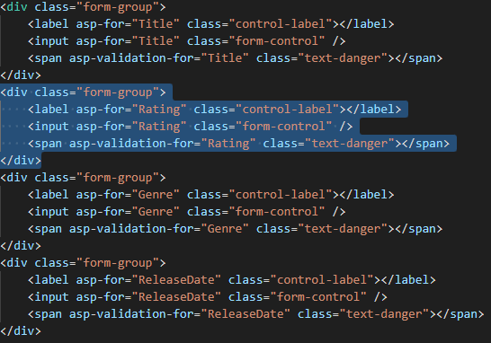

# Part 8, add a new field to an ASP.NET Core MVC app

## 목차
- [Part 8, add a new field to an ASP.NET Core MVC app](#part-8-add-a-new-field-to-an-aspnet-core-mvc-app)
  - [목차](#목차)
  - [Movie 모델에 Rating 속성 추가](#movie-모델에-rating-속성-추가)
  - [출처](#출처)
  - [다음](#다음)

---
이 섹션에서는 [Entity Framework](https://learn.microsoft.com/en-us/ef/core/get-started/aspnetcore/new-db) Code First 마이그레이션을 사용하여 다음을 수행합니다:

* 모델에 새 필드를 추가합니다.
* 새 필드를 데이터베이스로 마이그레이션합니다.

EF Code First를 사용하여 데이터베이스를 자동으로 생성할 때, Code First는 다음을 수행합니다:

* 데이터베이스의 스키마를 추적하기 위해 데이터베이스에 테이블을 추가합니다.
* 데이터베이스가 생성된 모델 클래스와 동기화되어 있는지 확인합니다. 동기화되지 않은 경우 EF는 예외를 발생시킵니다. 이는 일관성 없는 데이터베이스/코드 문제를 찾기 쉽게 만듭니다.

## Movie 모델에 Rating 속성 추가

`Models/Movie.cs`에 `Rating` 속성을 추가합니다:

```C#
using System;
using System.ComponentModel.DataAnnotations;
using System.ComponentModel.DataAnnotations.Schema;

namespace MvcMovie.Models;

public class Movie
{
    public int Id { get; set; }
    public string? Title { get; set; }

    [Display(Name = "Release Date")]
    [DataType(DataType.Date)]
    public DateTime ReleaseDate { get; set; }
    public string? Genre { get; set; }
    
    [Column(TypeName = "decimal(18, 2)")]
    public decimal Price { get; set; }
    public string? Rating {  get; set; }
}
```

앱 빌드

**Visual Studio Code**

*View* 메뉴에서 *Terminal*을 선택하고 다음 명령을 입력합니다:

```dotnetcli
dotnet build
```

`Movie` 클래스에 새 필드를 추가했으므로 이 새 속성을 포함하도록 속성 바인딩 목록을 업데이트해야 합니다. `MoviesController.cs`에서 `Create` 및 `Edit` 액션 메서드의 `[Bind]` 속성을 업데이트하여 `Rating` 속성을 포함합니다:

```csharp
[Bind("Id,Title,ReleaseDate,Genre,Price,Rating")]
```

새 `Rating` 속성을 브라우저 뷰에서 표시, 생성 및 편집할 수 있도록 뷰 템플릿을 업데이트합니다.

`/Views/Movies/Index.cshtml` 파일을 편집하여 `Rating` 필드를 추가합니다:

```cshtml
<table class="table">
    <thead>
        <tr>
            <th>
                @Html.DisplayNameFor(model => model.Movies![0].Title)
            </th>
            <th>
                @Html.DisplayNameFor(model => model.Movies![0].ReleaseDate)
            </th>
            <th>
                @Html.DisplayNameFor(model => model.Movies![0].Genre)
            </th>
            <th>
                @Html.DisplayNameFor(model => model.Movies![0].Price)
            </th>
            <th>
                @Html.DisplayNameFor(model => model.Movies![0].Rating)
            </th>
            <th></th>
        </tr>
    </thead>
    <tbody>
        @foreach (var item in Model.Movies!)
        {
            <tr>
                <td>
                    @Html.DisplayFor(modelItem => item.Title)
                </td>
                <td>
                    @Html.DisplayFor(modelItem => item.ReleaseDate)
                </td>
                <td>
                    @Html.DisplayFor(modelItem => item.Genre)
                </td>
                <td>
                    @Html.DisplayFor(modelItem => item.Price)
                </td>
                <td>
                    @Html.DisplayFor(modelItem => item.Rating)
                </td>
                <td>
                    <a asp-action="Edit" asp-route-id="@item.Id">Edit</a> |
                    <a asp-action="Details" asp-route-id="@item.Id">Details</a> |
                    <a asp-action="Delete" asp-route-id="@item.Id">Delete</a>
                </td>
            </tr>
        }
    </tbody>
</table>
```

`/Views/Movies/Create.cshtml`을 `Rating` 필드로 업데이트합니다.

**Visual Studio Code**



---

나머지 템플릿을 업데이트합니다.

`SeedData` 클래스를 업데이트하여 새 열에 대한 값을 제공합니다. 아래는 예시 변경 사항이며, 각 `new Movie`에 대해 이 변경을 수행해야 합니다.

```C#
new Movie
{
    Title = "When Harry Met Sally",
    ReleaseDate = DateTime.Parse("1989-1-11"),
    Genre = "Romantic Comedy",
    Rating = "R",
    Price = 7.99M
},
```

데이터베이스가 새 필드를 포함하도록 업데이트되지 않으면 앱이 작동하지 않습니다. 지금 실행하면 다음 `SqlException`이 발생합니다:

`SqlException: Invalid column name 'Rating'.`

이 오류는 업데이트된 Movie 모델 클래스가 기존 데이터베이스의 Movie 테이블 스키마와 다르기 때문에 발생합니다. (데이터베이스 테이블에 `Rating` 열이 없습니다.)

오류를 해결하는 몇 가지 접근 방법이 있습니다:

1. 엔티티 프레임워크가 새 모델 클래스 스키마를 기반으로 데이터베이스를 자동으로 삭제하고 다시 생성하도록 합니다. 이 방법은 테스트 데이터베이스에서 적극적으로 개발하는 초기 개발 단계에서 매우 편리합니다. 모델과 데이터베이스 스키마를 함께 빠르게 발전시킬 수 있기 때문입니다. 그러나 이 방법의 단점은 기존 데이터베이스의 데이터를 잃는다는 것입니다. 따라서 프로덕션 데이터베이스에서는 이 방법을 사용하지 않아야 합니다! 초기화 프로그램을 사용하여 테스트 데이터로 데이터베이스를 자동으로 시드하는 것은 응용 프로그램을 개발하는 생산적인 방법입니다. 이는 초기 개발 및 SQLite 사용 시 좋은 접근 방법입니다.

2. 기존 데이터베이스의 스키마를 명시적으로 수정하여 모델 클래스와 일치시키는 방법입니다. 이 방법의 장점은 데이터를 유지할 수 있다는 것입니다. 이 변경은 수동으로 수행하거나 데이터베이스 변경 스크립트를 작성하여 수행할 수 있습니다.

3. `Code First` 마이그레이션을 사용하여 데이터베이스 스키마를 업데이트하는 방법입니다.

이 튜토리얼에서는 `Code First` 마이그레이션을 사용합니다.

**Visual Studio Code / Visual Studio for Mac**

> [!NOTE]
> 이 튜토리얼에서는 가능한 경우 Entity Framework Core *마이그레이션* 기능을 사용합니다. 마이그레이션은 데이터 모델의 변경 사항에 맞게 데이터베이스 스키마를 업데이트합니다. 그러나 마이그레이션은 EF Core 공급자가 지원하는 종류의 변경만 수행할 수 있으며, SQLite 공급자의 기능은 제한적입니다. 예를 들어, 열 추가는 지원되지만 열 제거 또는 변경은 지원되지 않습니다. 열을 제거하거나 변경하는 마이그레이션을 생성하면 `ef migrations add` 명령은 성공하지만 `ef database update` 명령은 실패합니다. 이러한 제한 사항으로 인해, 이 튜토리얼에서는 SQLite 스키마 변경에 마이그레이션을 사용하지 않습니다. 대신 스키마가 변경될 때 데이터베이스를 삭제하고 다시 생성합니다.
>
>SQLite 제한 사항에 대한 해결 방법은 테이블의 내용이 변경될 때 테이블을 재구축하는 마이그레이션 코드를 수동으로 작성하는 것입니다. 테이블 재구축에는 다음이 포함됩니다:
>
>* 새 테이블 생성.
>* 이전 테이블에서 새 테이블로 데이터 복사.
>* 이전 테이블 삭제.
>* 새 테이블 이름 변경.
>
>자세한 내용은 다음 리소스를 참조하세요:
>
> * [SQLite EF Core 데이터베이스 공급자 제한 사항](https://learn.microsoft.com/en-us/ef/core/providers/sqlite/limitations)
> * [마이그레이션 코드 사용자 정의](https://learn.microsoft.com/en-us/ef/core/managing-schemas/migrations/#customize-migration-code)
> * [데이터 시딩](https://learn.microsoft.com/en-us/ef/core/modeling/data-seeding)
> * [SQLite ALTER TABLE 문](https://sqlite.org/lang_altertable.html)

마이그레이션 폴더와 데이터베이스 파일을 삭제한 다음 다음 .NET CLI 명령을 실행합니다:

```dotnetcli
dotnet ef migrations add InitialCreate
```

```dotnetcli
dotnet ef database update
```

자세한 내용은 [모든 마이그레이션 재설정](https://learn.microsoft.com/en-us/ef/core/managing-schemas/migrations/managing?tabs=dotnet-core-cli#resetting-all-migrations)을 참조하세요.

---

앱을 실행하고 `Rating` 필드로 영화를 생성, 편집 및 표시할 수 있는지 확인합니다.

---
## 출처
[Part 8, add a new field to an ASP.NET Core MVC app](https://learn.microsoft.com/en-us/aspnet/core/tutorials/first-mvc-app/new-field?view=aspnetcore-8.0&tabs=visual-studio-code)

---
## [다음](./09_09_add_validation.md)
