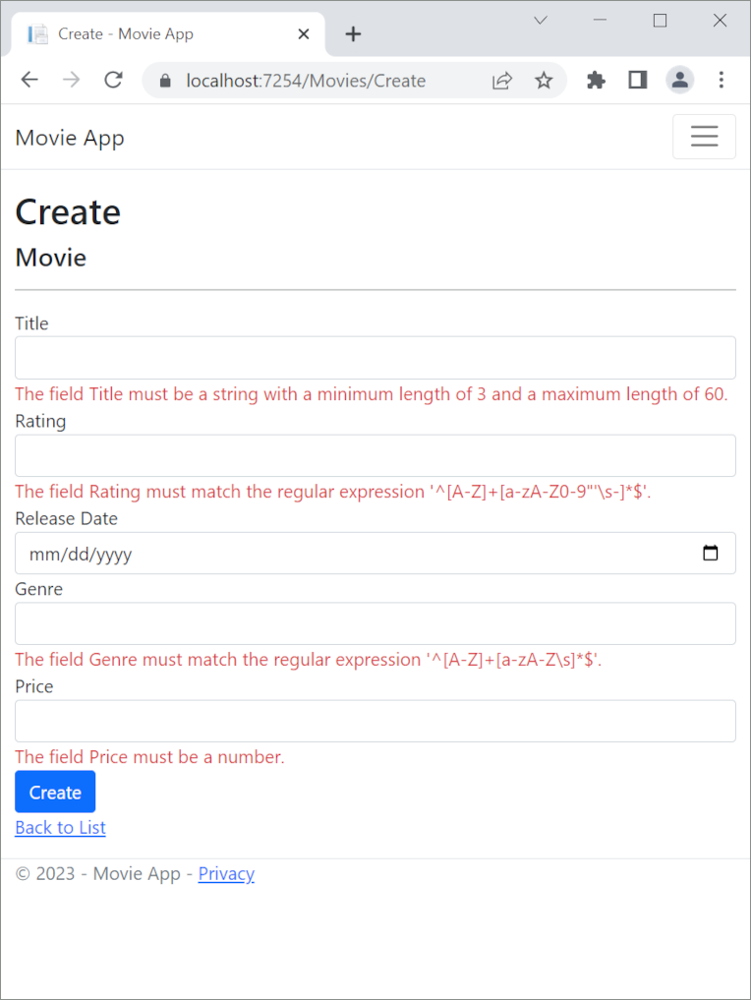
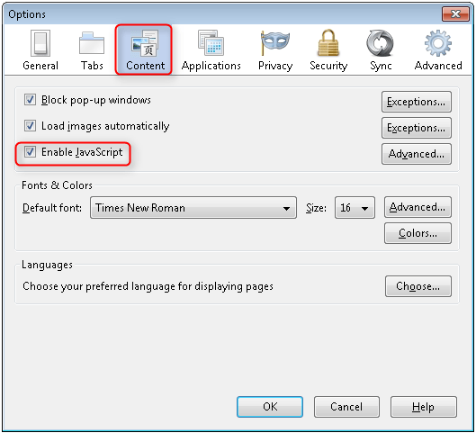
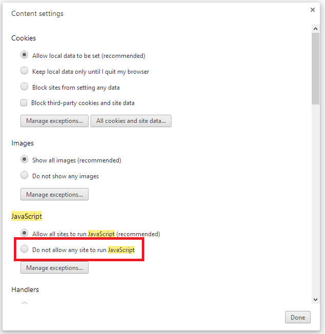
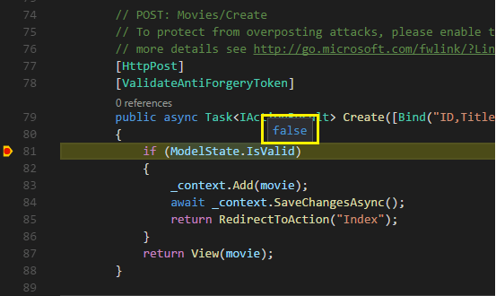

# Part 9, add validation to an ASP.NET Core MVC app

## 목차
- [Part 9, add validation to an ASP.NET Core MVC app](#part-9-add-validation-to-an-aspnet-core-mvc-app)
  - [목차](#목차)
  - [DRY 원칙 유지](#dry-원칙-유지)
  - [이전에 편집된 데이터 삭제](#이전에-편집된-데이터-삭제)
  - [영화 모델에 유효성 검사 규칙 추가](#영화-모델에-유효성-검사-규칙-추가)
  - [유효성 검사 오류 UI](#유효성-검사-오류-ui)
  - [유효성 검사가 작동하는 방법](#유효성-검사가-작동하는-방법)
  - [DataType 속성 사용](#datatype-속성-사용)
  - [추가 자료](#추가-자료)
  - [출처](#출처)
  - [다음](#다음)

---
이 섹션에서는 다음을 수행합니다:

* `Movie` 모델에 유효성 검사 논리를 추가합니다.
* 사용자가 영화를 생성하거나 편집할 때마다 유효성 검사 규칙이 적용되도록 합니다.

## DRY 원칙 유지

MVC의 디자인 원칙 중 하나는 [DRY](https://wikipedia.org/wiki/Don%27t_repeat_yourself) ("Don't Repeat Yourself")입니다. ASP.NET Core MVC는 기능이나 동작을 한 번만 지정하고 앱 전체에 반영되도록 권장합니다. 이는 작성해야 할 코드 양을 줄이고 작성한 코드를 오류가 덜 발생하게 하며, 테스트와 유지보수가 용이하게 만듭니다.

MVC와 Entity Framework Core Code First에서 제공하는 유효성 검사 지원은 DRY 원칙의 좋은 예입니다. 한 곳에서 선언적으로 유효성 검사 규칙을 지정하고(모델 클래스에서) 앱 전체에서 규칙이 적용되도록 할 수 있습니다.

## 이전에 편집된 데이터 삭제

다음 단계에서는 null 값을 허용하지 않는 유효성 검사 규칙이 추가됩니다. 앱을 실행하고 `/Movies/Index`로 이동하여 나열된 모든 영화를 삭제한 다음 앱을 중지합니다. 다음 번에 실행할 때 앱은 시드 데이터를 사용합니다.

## 영화 모델에 유효성 검사 규칙 추가

DataAnnotations 네임스페이스는 클래스나 속성에 선언적으로 적용되는 내장 유효성 검사 속성 세트를 제공합니다. DataAnnotations에는 유효성 검사를 제공하지 않지만 형식 지정에 도움이 되는 `DataType`과 같은 형식 지정 속성도 포함되어 있습니다.

`Movie` 클래스를 업데이트하여 `Required`, `StringLength`, `RegularExpression`, `Range` 및 `DataType` 형식 지정 속성과 같은 내장 유효성 검사 속성을 활용합니다.

```C#
using System;
using System.ComponentModel.DataAnnotations;
using System.ComponentModel.DataAnnotations.Schema;

namespace MvcMovie.Models;

public class Movie
{
    public int Id { get; set; }

    [StringLength(60, MinimumLength = 3)]
    [Required]
    public string? Title { get; set; }

    [Display(Name = "Release Date")]
    [DataType(DataType.Date)]
    public DateTime ReleaseDate { get; set; }

    [Range(1, 100)]
    [DataType(DataType.Currency)]
    [Column(TypeName = "decimal(18, 2)")]
    public decimal Price { get; set; }    

    [RegularExpression(@"^[A-Z]+[a-zA-Z\s]*$")]
    [Required]
    [StringLength(30)]
    public string? Genre { get; set; }
    
    [RegularExpression(@"^[A-Z]+[a-zA-Z0-9""'\s-]*$")]
    [StringLength(5)]
    [Required]
    public string? Rating { get; set; }
}
```

유효성 검사 속성은 적용되는 모델 속성에 대해 적용하려는 동작을 지정합니다:

* `Required` 및 `MinimumLength` 속성은 속성에 값이 있어야 함을 나타냅니다. 그러나 이 유효성 검사를 만족시키기 위해 사용자가 공백을 입력하는 것을 막지는 않습니다.
* `RegularExpression` 속성은 입력할 수 있는 문자를 제한하는 데 사용됩니다. 위 코드에서 "Genre"는:

  * 문자만 사용해야 합니다.
  * 첫 글자는 대문자여야 합니다. 공백은 허용되지만 숫자와 특수 문자는 허용되지 않습니다.

* `RegularExpression` "Rating":

  * 첫 글자가 대문자여야 합니다.
  * 이후에는 특수 문자와 숫자를 허용합니다. "PG-13"은 유효한 등급이지만 "Genre"로는 유효하지 않습니다.

* `Range` 속성은 값을 지정된 범위 내로 제한합니다.
* `StringLength` 속성은 문자열 속성의 최대 길이와 선택적으로 최소 길이를 설정할 수 있습니다.
* 값 형식(예: `decimal`, `int`, `float`, `DateTime`)은 본질적으로 필수이며 `[Required]` 속성이 필요하지 않습니다.

ASP.NET Core에서 유효성 검사 규칙이 자동으로 적용되면 앱이 더 견고해집니다. 또한 유효성 검사를 잊어버리고 실수로 잘못된 데이터를 데이터베이스에 넣는 것을 방지할 수 있습니다.

## 유효성 검사 오류 UI

앱을 실행하고 Movies 컨트롤러로 이동합니다.

새 영화를 추가하려면 **Create New** 링크를 선택합니다. 유효하지 않은 값으로 양식을 작성합니다. jQuery 클라이언트 쪽 유효성 검사가 오류를 감지하면 즉시 오류 메시지를 표시합니다.



> [!NOTE]
> 소수점 필드에 소수점 쉼표를 입력할 수 없을 수 있습니다. 소수점 표시에 쉼표(",")를 사용하는 비영어권 로케일 및 비미국 영어 날짜 형식을 지원하기 위해 [jQuery validation](https://jqueryvalidation.org/)을 사용하려면 앱을 글로벌화해야 합니다. 소수점 쉼표를 추가하는 방법에 대한 지침은 [GitHub 코멘트 4076](https://github.com/dotnet/AspNetCore.Docs/issues/4076#issuecomment-1153254062)을 참조하십시오.

유효하지 않은 값을 포함한 각 필드에 적절한 유효성 검사 오류 메시지가 자동으로 렌더링된 것을 확인할 수 있습니다. 이러한 오류는 클라이언트 쪽(JavaScript 및 jQuery 사용)과 서버 쪽(JavaScript가 비활성화된 경우) 모두에서 적용됩니다.

중요한 점은 이 유효성 검사 UI를 활성화하기 위해 `MoviesController` 클래스나 `Create.cshtml` 뷰에서 단 한 줄의 코드도 변경할 필요가 없었다는 것입니다. 이 튜토리얼에서 이전에 생성한 컨트롤러와 뷰는 `Movie` 모델 클래스의 속성에 유효성 검사 속성을 사용하여 지정한 유효성 검사 규칙을 자동으로 적용합니다. `Edit` 액션 메서드를 사용하여 유효성 검사를 테스트하면 동일한 유효성 검사가 적용됩니다.

클라이언트 쪽 유효성 검사 오류가 없을 때까지 양식 데이터는 서버로 전송되지 않습니다. 이는 [Fiddler 도구](https://www.telerik.com/fiddler) 또는 [F12 개발자 도구](/microsoft-edge/devtools-guide)를 사용하여 확인할 수 있습니다.

## 유효성 검사가 작동하는 방법

컨트롤러나 뷰의 코드에 대한 업데이트 없이 유효성 검사 UI가 생성되는 방식을 궁금해할 수 있습니다. 다음 코드는 두 개의 `Create` 메서드를 보여줍니다.

```C#
// GET: Movies/Create
public IActionResult Create()
{
    return View();
}

// POST: Movies/Create
// To protect from overposting attacks, enable the specific properties you want to bind to.
// For more details, see http://go.microsoft.com/fwlink/?LinkId=317598.
[HttpPost]
[ValidateAntiForgeryToken]
public async Task<IActionResult> Create([Bind("Id,Title,ReleaseDate,Genre,Price,Rating")] Movie movie)
{
    if (ModelState.IsValid)
    {
        _context.Add(movie);
        await _context.SaveChangesAsync();
        return RedirectToAction(nameof(Index));
    }
    return View(movie);
}
```

첫 번째(HTTP GET) `Create` 액션 메서드는 초기 Create 양식을 표시합니다. 두 번째(`[HttpPost]`) 버전은 양식 포스트를 처리합니다. 두 번째 `Create` 메서드(`[HttpPost]` 버전)는 `ModelState.IsValid`를 호출하여 영화에 유효성 검사 오류가 있는지 확인합니다. 이 메서드를 호출하면 객체에 적용된 유효성 검사 속성이 평가됩니다. 객체에 유효성 검사 오류가 있으면 `Create` 메서드는 양식을 다시 표시합니다. 오류가 없으면 메서드는 새 영화를 데이터베이스에 저장합니다. 영화 예제에서는 클라이언트 쪽에서 유효성 검사 오류가 감지될 때 양식이 서버로 포스트되지 않습니다. 클라이언트 쪽 유효성 검사 오류가 있을 때는 두 번째 `Create` 메서드가 호출되지 않습니다. 브라우저에서 JavaScript를 비활성화하면 클라이언트 유효성 검사가 비활성화되고 HTTP POST `Create` 메서드 `ModelState.IsValid`가 유효성 검사 오류를 감지하는 것을 테스트할 수 있습니다.

`[HttpPost] Create` 메서드에 중단점을 설정하고 클라이언트 쪽 유효성 검사가 유효성 검사 오류를 감지했을 때 양식 데이터가 제출되지 않음을 확인할 수 있습니다. 브라우저에서 JavaScript를 비활성화한 후 오류가 있는 양식을 제출하면 중단점이 활성화됩니다. JavaScript 없이도 전체 유효성 검사를 받을 수 있습니다.

다음 이미지는 Firefox 브라우저에서 JavaScript를 비활성화하는 방법을 보여줍니다.



다음 이미지는 Chrome 브라우저에서 JavaScript를 비활성화하는 방법을 보여줍니다.



JavaScript를 비활성화한 후 잘못된 데이터를 포스트하고 디버거를 통해 단계를 진행합니다.



다음은 `Create.cshtml` 뷰 템플릿의 일부를 보여주는 마크업입니다.

```cshtml
<h4>Movie</h4>
<hr />
<div class="row">
    <div class="col-md-4">
        <form asp-action="Create">
            <div asp-validation-summary="ModelOnly" class="text-danger"></div>
            <div class="form-group">
                <label asp-for="Title" class="control-label"></label>
                <input asp-for="Title" class="form-control" />
                <span asp-validation-for="Title" class="text-danger"></span>
            </div>

            @*Markup removed for brevity.*@
```

위의 마크업은 액션 메서드가 초기 양식을 표시하고 오류가 발생한 경우 이를 다시 표시하는 데 사용됩니다.

[Input Tag Helper](https://learn.microsoft.com/en-us/aspnet/core/mvc/views/working-with-forms?view=aspnetcore-8.0)는 [DataAnnotations](https://learn.microsoft.com/en-us/aspnet/mvc/overview/older-versions/mvc-music-store/mvc-music-store-part-6) 속성을 사용하고 클라이언트 쪽에서 jQuery Validation에 필요한 HTML 속성을 생성합니다. [Validation Tag Helper](https://learn.microsoft.com/en-us/aspnet/core/mvc/views/working-with-forms?view=aspnetcore-8.0#the-validation-tag-helpers)는 유효성 검사 오류를 표시합니다. 자세한 내용은 [유효성 검사](https://learn.microsoft.com/en-us/aspnet/core/mvc/models/validation?view=aspnetcore-8.0)를 참조하세요.

이 접근 방식의 정말 좋은 점은 컨트롤러나 `Create` 뷰 템플릿이 실제로 적용되는 유효성 검사 규칙이나 표시되는 특정 오류 메시지에 대해 전혀 알지 못한다는 것입니다. 유효성 검사 규칙과 오류 문자열은 오직 `Movie` 클래스에서만 지정됩니다. 이러한 동일한 유효성 검사 규칙이 `Edit` 뷰와 모델을 편집하는 다른 뷰 템플릿에 자동으로 적용됩니다.

유효성 검사 논리를 변경해야 할 때는 모델(이 예제에서는 `Movie` 클래스)에 유효성 검사 속성을 추가하여 한 곳에서만 변경할 수 있습니다. 규칙이 적용되는 방식이 응용 프로그램의 다른 부분과 일관성이 없는지 걱정할 필요가 없습니다. 모든 유효성 검사 논리는 한 곳에서 정의되고 모든 곳에서 사용됩니다. 이는 코드를 매우 깔끔하게 유지하고 유지보수와 발전을 쉽게 합니다. 또한 DRY 원칙을 완전히 준수하게 됩니다.

## DataType 속성 사용

`Movie.cs` 파일을 열고 `Movie` 클래스를 검사합니다. `System.ComponentModel.DataAnnotations` 네임스페이스는 내장된 유효성 검사 속성 외에도 형식 속성을 제공합니다. 이미 릴리스 날짜와 가격 필드에 `DataType` 열거형 값을 적용했습니다. 다음 코드는 적절한 `DataType` 속성이 있는 `ReleaseDate`와 `Price` 속성을 보여줍니다.

```C#
[Display(Name = "Release Date")]
[DataType(DataType.Date)]
public DateTime ReleaseDate { get; set; }

[Range(1, 100)]
[DataType(DataType.Currency)]
[Column(TypeName = "decimal(18, 2)")]
public decimal Price { get; set; }
```

`DataType` 속성은 뷰 엔진에 데이터를 포맷하도록 힌트를 제공하고 URL에 `<a>` 요소와 이메일에 `<a href="mailto:EmailAddress.com">` 요소를 제공합니다. `RegularExpression` 속성을 사용하여 데이터 형식을 유효성 검사할 수 있습니다. `DataType` 속성은 데이터베이스 고유 형식보다 더 구체적인 데이터 형식을 지정하는 데 사용되며, 유효성 검사 속성은 아닙니다. 이 경우 날짜만 추적하고 시간을 추적하지 않으려 합니다. `DataType` 열거형은 Date, Time, PhoneNumber, Currency, EmailAddress 등 다양한 데이터 형식을 제공합니다. `DataType` 속성은 애플리케이션이 자동으로 형식별 기능을 제공할 수 있게 합니다. 예를 들어, `DataType.EmailAddress`에 대해 `mailto:` 링크를 생성하고 HTML5를 지원하는 브라우저에서 `DataType.Date`에 대해 날짜 선택기를 제공합니다. `DataType` 속성은 HTML 5 브라우저가 이해할 수 있는 HTML 5 `data-`(데이터 대시로 발음) 속성을 생성합니다. `DataType` 속성은 **유효성 검사를 제공하지 않습니다**.

`DataType.Date`는 표시되는 날짜의 형식을 지정하지 않습니다. 기본적으로 데이터 필드는 서버의 `CultureInfo`를 기반으로 한 기본 형식에 따라 표시됩니다.

`DisplayFormat` 속성은 날짜 형식을 명시적으로 지정하는 데 사용됩니다:

```csharp
[DisplayFormat(DataFormatString = "{0:yyyy-MM-dd}", ApplyFormatInEditMode = true)]
public DateTime ReleaseDate { get; set; }
```

`ApplyFormatInEditMode` 설정은 값이 편집을 위해 텍스트 상자에 표시될 때도 형식이 적용되도록 지정합니다. (일부 필드의 경우, 예를 들어 통화 값의 경우 편집을 위해 텍스트 상자에 통화 기호를 포함하지 않기를 원할 수 있습니다.)

`DisplayFormat` 속성을 단독으로 사용할 수 있지만, 일반적으로 `DataType` 속성을 사용하는 것이 좋습니다. `DataType` 속성은 데이터의 의미를 화면에 렌더링하는 방식과는 달리 전달하며, DisplayFormat에서는 얻을 수 없는 다음과 같은 이점을 제공합니다:

* 브라우저가 HTML5 기능을 활성화할 수 있습니다(예: 캘린더 컨트롤 표시, 로캘에 맞는 통화 기호 표시, 이메일 링크 등).

* 기본적으로 브라우저는 로캘에 따라 데이터를 올바른 형식으로 렌더링합니다.

* `DataType` 속성은 MVC가 데이터를 렌더링할 올바른 필드 템플릿을 선택할 수 있게 합니다(`DisplayFormat`이 단독으로 사용되는 경우 문자열 템플릿을 사용합니다).

> [!NOTE]
> jQuery 유효성 검사는 `Range` 속성과 `DateTime`에서 작동하지 않습니다. 예를 들어, 다음 코드는 날짜가 지정된 범위에 있더라도 항상 클라이언트 쪽 유효성 검사 오류를 표시합니다:
>
> `[Range(typeof(DateTime), "1/1/1966", "1/1/2020")]`

`Range` 속성과 `DateTime`을 사용하려면 jQuery 날짜 유효성 검사를 비활성화해야 합니다. 모델에 하드 날짜를 컴파일하는 것은 일반적으로 좋은 실습이 아니므로 `Range` 속성과 `DateTime`을 사용하는 것은 권장되지 않습니다.

다음 코드는 하나의 줄에서 속성을 결합하는 방법을 보여줍니다:

```C#
using System;
using System.ComponentModel.DataAnnotations;
using System.ComponentModel.DataAnnotations.Schema;

namespace MvcMovie.Models;

public class Movie
{
    public int Id { get; set; }
    [StringLength(60, MinimumLength = 3)]
    public string Title { get; set; }
    [Display(Name = "Release Date"), DataType(DataType.Date)]
    public DateTime ReleaseDate { get; set; }
    [RegularExpression(@"^[A-Z]+[a-zA-Z\s]*$"), Required, StringLength(30)]
    public string Genre { get; set; }
    [Range(1, 100), DataType(DataType.Currency)]
    [Column(TypeName = "decimal(18, 2)")]
    public decimal Price { get; set; }
    [RegularExpression(@"^[A-Z]+[a-zA-Z0-9""'\s-]*$"), StringLength(5)]
    public string Rating { get; set; }
}
```

이 시리즈의 다음 부분에서는 앱을 검토하고 자동으로 생성된 `Details` 및 `Delete` 메서드를 개선합니다.

## 추가 자료

* [양식 작업](https://learn.microsoft.com/en-us/aspnet/core/mvc/views/working-with-forms?view=aspnetcore-8.0)
* [글로벌화 및 로컬화](https://learn.microsoft.com/en-us/aspnet/core/fundamentals/localization?view=aspnetcore-8.0)
* [태그 도우미 소개](https://learn.microsoft.com/en-us/aspnet/core/mvc/views/tag-helpers/intro?view=aspnetcore-8.0)
* [태그 도우미 작성](https://learn.microsoft.com/en-us/aspnet/core/mvc/views/tag-helpers/authoring?view=aspnetcore-8.0)

---
## 출처
[Part 9, add validation to an ASP.NET Core MVC app](https://learn.microsoft.com/en-us/aspnet/core/tutorials/first-mvc-app/validation?view=aspnetcore-8.0)

---
## [다음](./09_10_detail_delete.md)
