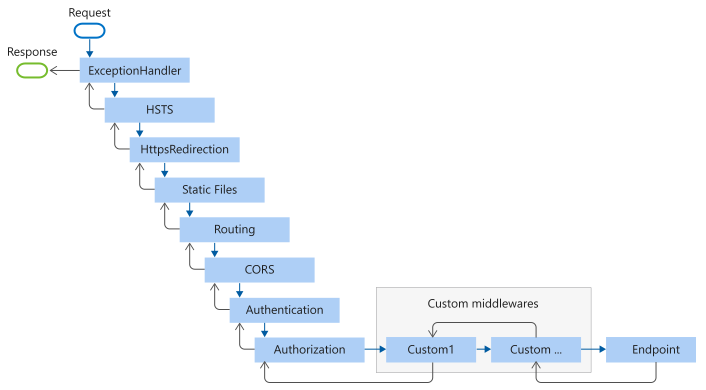

# ASP.NET Core Middleware

## 목차
- [ASP.NET Core Middleware](#aspnet-core-middleware)
  - [목차](#목차)
  - [미들웨어 코드 분석](#미들웨어-코드-분석)
  - [`WebApplication`을 사용하여 미들웨어 파이프라인 생성](#webapplication을-사용하여-미들웨어-파이프라인-생성)
    - [요청 파이프라인 단축](#요청-파이프라인-단축)
    - [`Run` 대리자](#run-대리자)
    - [컨텍스트를 다음으로 전달해야 하는 app.Use 오버로드 선호](#컨텍스트를-다음으로-전달해야-하는-appuse-오버로드-선호)
  - [미들웨어 순서](#미들웨어-순서)
  - [UseCors 및 UseStaticFiles 순서](#usecors-및-usestaticfiles-순서)
    - [전달된 헤더 미들웨어 순서](#전달된-헤더-미들웨어-순서)
  - [미들웨어 파이프라인 분기](#미들웨어-파이프라인-분기)
  - [내장 미들웨어](#내장-미들웨어)
  - [출처](#출처)
  - [다음](#다음)

---

미들웨어는 요청과 응답을 처리하기 위해 앱 파이프라인에 조립된 소프트웨어입니다. 각 구성 요소는 다음을 수행합니다:

* 요청을 파이프라인의 다음 구성 요소에 전달할지 여부를 선택합니다.
* 파이프라인의 다음 구성 요소 이전 및 이후에 작업을 수행할 수 있습니다.

요청 파이프라인은 요청 대리자를 사용하여 구성됩니다. 요청 대리자는 각 HTTP 요청을 처리합니다.

요청 대리자는 `Run`, `Map` 및 `Use` 확장 메서드를 사용하여 구성됩니다. 개별 요청 대리자는 인라인 익명 메서드(인라인 미들웨어라고 함)로 지정할 수 있거나 재사용 가능한 클래스에서 정의할 수 있습니다. 이러한 재사용 가능한 클래스와 인라인 익명 메서드를 *미들웨어* 또는 *미들웨어 구성 요소*라고 합니다. 요청 파이프라인의 각 미들웨어 구성 요소는 파이프라인의 다음 구성 요소를 호출하거나 파이프라인을 단축시키는 역할을 합니다. 미들웨어가 파이프라인을 단축시키면, 이는 더 이상의 미들웨어가 요청을 처리하지 않도록 하는 *종단 미들웨어*라고 합니다.

[Migrate HTTP handlers and modules to ASP.NET Core middleware](https://learn.microsoft.com/en-us/aspnet/core/migration/http-modules?view=aspnetcore-8.0)에서는 ASP.NET Core와 ASP.NET 4.x의 요청 파이프라인 차이를 설명하고 추가 미들웨어 샘플을 제공합니다.

## 미들웨어 코드 분석

ASP.NET Core에는 애플리케이션 코드를 품질 검사하는 여러 컴파일러 플랫폼 분석기가 포함되어 있습니다. 자세한 내용은 [Code analysis in ASP.NET Core apps](https://learn.microsoft.com/en-us/aspnet/core/diagnostics/code-analysis?view=aspnetcore-8.0)를 참조하십시오.

## `WebApplication`을 사용하여 미들웨어 파이프라인 생성

ASP.NET Core 요청 파이프라인은 일련의 요청 대리자로 구성되어 있으며, 하나씩 호출됩니다. 다음 다이어그램은 이 개념을 보여줍니다. 실행 스레드는 검은색 화살표를 따라갑니다.


각 대리자는 다음 대리자 이전 및 이후에 작업을 수행할 수 있습니다. 예외 처리 대리자는 파이프라인의 초기에 호출되어야 하며, 이를 통해 파이프라인 후반부에서 발생하는 예외를 잡을 수 있습니다.

가장 단순한 ASP.NET Core 앱은 모든 요청을 처리하는 단일 요청 대리자를 설정합니다. 이 경우 실제 요청 파이프라인은 포함되지 않습니다. 대신, 모든 HTTP 요청에 응답하여 단일 익명 함수가 호출됩니다.

```C#
var builder = WebApplication.CreateBuilder(args);
var app = builder.Build();

app.Run(async context =>
{
    await context.Response.WriteAsync("Hello world!");
});

app.Run();
```

`Use`를 사용하여 여러 요청 대리자를 연결합니다. `next` 매개변수는 파이프라인의 다음 대리자를 나타냅니다. `next` 매개변수를 호출하지 않음으로써 파이프라인을 단축시킬 수 있습니다. 일반적으로 다음 예제에서 보이는 것처럼 `next` 대리자 이전 및 이후에 작업을 수행할 수 있습니다.

```C#
var builder = WebApplication.CreateBuilder(args);
var app = builder.Build();

app.Use(async (context, next) =>
{
    // Do work that can write to the Response.
    await next.Invoke();
    // Do logging or other work that doesn't write to the Response.
});

app.Run(async context =>
{
    await context.Response.WriteAsync("Hello from 2nd delegate.");
});

app.Run();
```

### 요청 파이프라인 단축

대리자가 요청을 다음 대리자에게 전달하지 않을 때, 이를 *요청 파이프라인 단축*이라고 합니다. 단축은 종종 불필요한 작업을 피하기 위해 바람직합니다. 예를 들어, [정적 파일 미들웨어](https://learn.microsoft.com/en-us/aspnet/core/fundamentals/static-files?view=aspnetcore-8.0)는 정적 파일에 대한 요청을 처리하고 나머지 파이프라인을 단축시키는 *종단 미들웨어*로 작동할 수 있습니다. 종단 처리를 수행하는 미들웨어 전에 추가된 미들웨어는 `next.Invoke` 문 이후에도 코드를 처리합니다. 그러나 이미 전송된 응답에 쓰기를 시도할 때 발생하는 경고에 유의하십시오.

> [!WARNING]
> 응답이 클라이언트로 전송된 후에는 `next.Invoke`를 호출하지 마십시오. `HttpResponse`가 시작된 후 변경 사항은 예외를 발생시킵니다. 예를 들어, 응답이 시작된 후 [헤더 및 상태 코드 설정은 예외를 발생시킵니다](https://learn.microsoft.com/en-us/aspnet/core/fundamentals/best-practices?view=aspnetcore-8.0#do-not-modify-the-status-code-or-headers-after-the-response-body-has-started). 응답 본문에 `next` 호출 후 쓰기를 시도하면:
>
> * 명시된 `Content-Length`보다 더 많이 쓰는 등의 프로토콜 위반을 초래할 수 있습니다.
> * CSS 파일에 HTML 푸터를 쓰는 등의 본문 형식을 손상시킬 수 있습니다.
>
> `HasStarted`는 헤더가 전송되었거나 본문이 작성되었는지 여부를 나타내는 유용한 힌트입니다.

자세한 내용은 [라우팅 이후 미들웨어 단축](https://learn.microsoft.com/en-us/aspnet/core/fundamentals/routing?view=aspnetcore-8.0#short-circuit-middleware-after-routing)을 참조하십시오.

### `Run` 대리자

`Run` 대리자는 `next` 매개변수를 받지 않습니다. 첫 번째 `Run` 대리자는 항상 종단 미들웨어로서 파이프라인을 종료합니다. `Run`은 하나의 관례입니다. 일부 미들웨어 구성 요소는 파이프라인 끝에서 실행되는 `Run[Middleware]` 메서드를 노출할 수 있습니다:

```C#
var builder = WebApplication.CreateBuilder(args);
var app = builder.Build();

app.Use(async (context, next) =>
{
    // Do work that can write to the Response.
    await next.Invoke();
    // Do logging or other work that doesn't write to the Response.
});

app.Run(async context =>
{
    await context.Response.WriteAsync("Hello from 2nd delegate.");
});

app.Run();
```

[!INCLUDE[about the series](~/includes/code-comments-loc.md)]

위의 예제에서 `Run` 대리자는 응답에 `"Hello from 2nd delegate."`를 작성하고 파이프라인을 종료합니다. `Run` 대리자 후에 다른 `Use` 또는 `Run` 대리자가 추가되면 호출되지 않습니다.

### 컨텍스트를 다음으로 전달해야 하는 app.Use 오버로드 선호

비할당 app.Use 확장 메서드:

* 컨텍스트를 `next`로 전달해야 합니다.
* 다른 오버로드를 사용할 때 필요한 두 개의 내부 요청당 할당을 절약합니다.

자세한 내용은 [이 GitHub 이슈](https://github.com/dotnet/aspnetcore/pull/31784)를 참조하십시오.

## 미들웨어 순서

다음 다이어그램은 ASP.NET Core MVC 및 Razor Pages 앱의 전체 요청 처리 파이프라인을 보여줍니다. 일반적인 앱에서 기존 미들웨어가 어떻게 정렬되었는지와 필요한 경우 새 사용자 정의 미들웨어를 추가하는 방법을 볼 수 있습니다. 기존 미들웨어를 재정렬하거나 특정 시나리오에 필요한 새로운 사용자 정의 미들웨어를 주입하는 방법을 완전히 제어할 수 있습니다.



**엔드포인트** 미들웨어는 앞의 다이어그램에서 MVC 또는 Razor Pages와 같은 해당 앱 유형의 필터 파이프라인을 실행합니다.

앞의 다이어그램에서 **라우팅** 미들웨어는 **정적 파일** 이후에 실행됩니다. 이는 프로젝트 템플릿에서 app.UseRouting을 명시적으로 호출하여 구현하는 순서입니다. `app.UseRouting`을 호출하지 않으면 **라우팅** 미들웨어는 기본적으로 파이프라인의 시작 부분에서 실행됩니다. 자세한 내용은 [라우팅](https://learn.microsoft.com/en-us/aspnet/core/fundamentals/routing?view=aspnetcore-8.0)을 참조하십시오.


`Program.cs` 파일에서 미들웨어 구성 요소가 추가되는 순서는 요청에 대한 미들웨어 구성 요소가 호출되는 순서를 정의하고 응답에 대해 반대 순서로 호출됩니다. 이 순서는 보안, 성능 및 기능에 **중요**합니다.

다음 `Program.cs`에서 강조된 코드는 일반적으로 권장되는 순서대로 보안 관련 미들웨어 구성 요소를 추가합니다:

```C#
using Microsoft.AspNetCore.Identity;
using Microsoft.EntityFrameworkCore;
using WebMiddleware.Data;

var builder = WebApplication.CreateBuilder(args);

var connectionString = builder.Configuration.GetConnectionString("DefaultConnection")
    ?? throw new InvalidOperationException("Connection string 'DefaultConnection' not found.");
builder.Services.AddDbContext<ApplicationDbContext>(options =>
    options.UseSqlServer(connectionString));
builder.Services.AddDatabaseDeveloperPageExceptionFilter();

builder.Services.AddDefaultIdentity<IdentityUser>(options => options.SignIn.RequireConfirmedAccount = true)
    .AddEntityFrameworkStores<ApplicationDbContext>();
builder.Services.AddRazorPages();
builder.Services.AddControllersWithViews();

var app = builder.Build();

if (app.Environment.IsDevelopment())
{
    app.UseMigrationsEndPoint();
}
else
{
    app.UseExceptionHandler("/Error");
    app.UseHsts();
}

app.UseHttpsRedirection();
app.UseStaticFiles();
// app.UseCookiePolicy();

app.UseRouting();
// app.UseRateLimiter();
// app.UseRequestLocalization();
// app.UseCors();

app.UseAuthentication();
app.UseAuthorization();
// app.UseSession();
// app.UseResponseCompression();
// app.UseResponseCaching();

app.MapRazorPages();
app.MapDefaultControllerRoute();

app.Run();
```

위의 코드에서는:

* [개별 사용자 계정](https://learn.microsoft.com/en-us/aspnet/core/security/authentication/identity?view=aspnetcore-8.0)으로 새 웹 앱을 만들 때 추가되지 않는 미들웨어가 주석 처리되어 있습니다.
* 모든 미들웨어가 정확히 이 순서대로 나타나는 것은 아니지만, 많은 미들웨어가 그렇습니다. 예를 들어:
  * `UseCors`, `UseAuthentication`, `UseAuthorization`는 표시된 순서대로 나타나야 합니다.
  * `UseCors`는 현재 `UseResponseCaching` 이전에 나타나야 합니다. 이 요구 사항은 [GitHub 이슈 dotnet/aspnetcore #23218](https://github.com/dotnet/aspnetcore/issues/23218)에서 설명합니다.
  * `UseRequestLocalization`은 요청 문화권을 확인할 수 있는 모든 미들웨어 이전에 나타나야 합니다. 예: `app.UseStaticFiles()`.
  * `UseRateLimiter`는 엔드포인트별 API 속도 제한이 사용되는 경우 `UseRouting` 이후에 호출되어야 합니다. 예를 들어, [`[EnableRateLimiting]`](https://learn.microsoft.com/en-us/dotnet/api/microsoft.aspnetcore.ratelimiting.enableratelimitingattribute) 속성이 사용되는 경우 `UseRateLimiter`는 `UseRouting` 이후에 호출되어야 합니다. 전역 제한자를 호출할 때는 `UseRateLimiter`가 `UseRouting` 이전에 호출될 수 있습니다.

일부 시나리오에서는 미들웨어 순서가 다릅니다. 예를 들어, 캐싱 및 압축 순서는 시나리오에 따라 다르며, 여러 가지 유효한 순서가 있을 수 있습니다. 예를 들어:

```csharp
app.UseResponseCaching();
app.UseResponseCompression();
```

위의 코드에서는 압축된 응답을 캐싱하여 CPU 사용량을 줄일 수 있지만, Gzip 또는 Brotli와 같은 다른 압축 알고리즘을 사용하여 리소스의 여러 표현을 캐싱할 수 있습니다.

다음 순서는 정적 파일을 결합하여 압축된 정적 파일을 캐싱할 수 있습니다:

```csharp
app.UseResponseCaching();
app.UseResponseCompression();
app.UseStaticFiles();
```

다음 `Program.cs` 코드는 일반적인 앱 시나리오에 대한 미들웨어 구성 요소를 추가합니다:

1. 예외/오류 처리
   * 앱이 개발 환경에서 실행될 때:
     * 개발자 예외 페이지 미들웨어(`UseDeveloperExceptionPage`)는 앱 런타임 오류를 보고합니다.
     * 데이터베이스 오류 페이지 미들웨어(`UseDatabaseErrorPage`)는 데이터베이스 런타임 오류를 보고합니다.
   * 앱이 프로덕션 환경에서 실행될 때:
     * 예외 처리기 미들웨어(`UseExceptionHandler`)는 후속 미들웨어에서 발생한 예외를 잡습니다.
     * HTTP 엄격 전송 보안 프로토콜(HSTS) 미들웨어(`UseHsts`)는 `Strict-Transport-Security` 헤더를 추가합니다.
2. HTTPS 리디렉션 미들웨어(`UseHttpsRedirection`)는 HTTP 요청을 HTTPS로 리디렉션합니다.
3. 정적 파일 미들웨어(`UseStaticFiles`)는 정적 파일을 반환하고 추가 요청 처리를 단축합니다.
4. 쿠키 정책 미들웨어(`UseCookiePolicy`)는 앱을 EU 일반 데이터 보호 규정(GDPR)에 맞게 조정합니다.
5. 라우팅 미들웨어(`UseRouting`)는 요청을 라우팅합니다.
6. 인증 미들웨어(`UseAuthentication`)는 사용자가 보안 리소스에 접근하기 전에 사용자를 인증하려고 시도합니다.
7. 권한 부여 미들웨어(`UseAuthorization`)는 사용자가 보안 리소스에 접근할 수 있는 권한을 부여합니다.
8. 세션 미들웨어(`UseSession`)는 세션 상태를 설정하고 유지합니다. 앱이 세션 상태를 사용하는 경우, 세션 미들웨어는 쿠키 정책 미들웨어 후, MVC 미들웨어 이전에 호출됩니다.
9. 엔드포인트 라우팅 미들웨어(`UseEndpoints` 및 `MapRazorPages`)는 요청 파이프라인에 Razor Pages 엔드포인트를 추가합니다.

```csharp
if (env.IsDevelopment())
{
    app.UseDeveloperExceptionPage();
    app.UseDatabaseErrorPage();
}
else
{
    app.UseExceptionHandler("/Error");
    app.UseHsts();
}
app.UseHttpsRedirection();
app.UseStaticFiles();
app.UseCookiePolicy();
app.UseRouting();
app.UseAuthentication();
app.UseAuthorization();
app.UseSession();
app.MapRazorPages();
```

위의 예제 코드에서 각 미들웨어 확장 메서드는 `WebApplicationBuilder`를 통해 `Microsoft.AspNetCore.Builder` 네임스페이스에 노출됩니다.

`UseExceptionHandler`는 파이프라인에 추가된 첫 번째 미들웨어 구성 요소입니다. 따라서 예외 처리기 미들웨어는 이후 호출에서 발생하는 모든 예외를 잡습니다.

정적 파일 미들웨어는 요청을 처리하고 나머지 구성 요소를 거치지 않고 단축할 수 있도록 파이프라인 초기에 호출됩니다. 정적 파일 미들웨어는 **아무런** 권한 검사도 제공하지 않습니다. 정적 파일 미들웨어에서 제공하는 모든 파일은 *wwwroot* 하위 폴더를 포함하여 공개적으로 사용할 수 있습니다. 정적 파일을 보호하는 접근 방식에 대한 내용은 [Static files in ASP.NET Core](https://learn.microsoft.com/en-us/aspnet/core/fundamentals/static-files?view=aspnetcore-8.0)를 참조하십시오.

요청이 정적 파일 미들웨어에 의해 처리되지 않으면, 인증 미들웨어(`UseAuthentication`)로 전달되어 인증을 수행합니다. 인증은 인증되지 않은 요청을 단축하지 않습니다. 인증 미들웨어는 요청을 인증하지만, 권한 부여(및 거부)는 MVC가 특정 Razor Page 또는 MVC 컨트롤러와 액션을 선택한 후에만 발생합니다.

다음 예제에서는 요청이 정적 파일 미들웨어에 의해 처리되기 전에 응답 압축 미들웨어가 처리되는 미들웨어 순서를 보여줍니다. 이 미들웨어 순서에서는 정적 파일이 압축되지 않습니다. Razor Pages 응답은 압축될 수 있습니다.

```csharp
// 정적 파일은 정적 파일 미들웨어에 의해 압축되지 않습니다.
app.UseStaticFiles();

app.UseRouting();

app.UseResponseCompression();

app.MapRazorPages();
```

단일 페이지 애플리케이션(SPA)에 대한 자세한 내용은 [Overview of Single Page Apps (SPAs) in ASP.NET Core](https://learn.microsoft.com/en-us/aspnet/core/client-side/spa/intro?view=aspnetcore-8.0)를 참조하십시오.

## UseCors 및 UseStaticFiles 순서

`UseCors`와 `UseStaticFiles`를 호출하는 순서는 앱에 따라 다릅니다. 자세한 내용은 [UseCors 및 UseStaticFiles 순서](xref:security/cors#uc1)를 참조하십시오.

### 전달된 헤더 미들웨어 순서

전달된 헤더 미들웨어는 다른 미들웨어보다 먼저 실행되어야 합니다. 이 순서는 전달된 헤더 정보에 의존하는 미들웨어가 처리에 필요한 헤더 값을 사용할 수 있도록 보장합니다. 전달된 헤더 미들웨어를 진단 및 오류 처리 미들웨어 후에 실행하려면 전달된 헤더 미들웨어 순서를 참조하십시오.

## 미들웨어 파이프라인 분기

Map 확장은 파이프라인을 분기하는 관례로 사용됩니다. `Map`은 주어진 요청 경로의 일치 여부를 기반으로 요청 파이프라인을 분기합니다. 요청 경로가 주어진 경로로 시작하면, 분기가 실행됩니다.

```C#
var builder = WebApplication.CreateBuilder(args);
var app = builder.Build();

app.Map("/map1", HandleMapTest1);

app.Map("/map2", HandleMapTest2);

app.Run(async context =>
{
    await context.Response.WriteAsync("Hello from non-Map delegate.");
});

app.Run();

static void HandleMapTest1(IApplicationBuilder app)
{
    app.Run(async context =>
    {
        await context.Response.WriteAsync("Map Test 1");
    });
}

static void HandleMapTest2(IApplicationBuilder app)
{
    app.Run(async context =>
    {
        await context.Response.WriteAsync("Map Test 2");
    });
}
```

다음 표는 위의 코드를 사용하여 `http://localhost:1234`의 요청 및 응답을 보여줍니다.

| 요청               | 응답                          |
| ------------------ | ----------------------------- |
| localhost:1234     | Hello from non-Map delegate.  |
| localhost:1234/map1 | Map Test 1                    |
| localhost:1234/map2 | Map Test 2                    |
| localhost:1234/map3 | Hello from non-Map delegate.  |

`Map`을 사용하면, 일치하는 경로 세그먼트가 `HttpRequest.Path`에서 제거되고 각 요청에 대해 `HttpRequest.PathBase`에 추가됩니다.

`Map`은 중첩을 지원합니다. 예를 들어:

```csharp
app.Map("/level1", level1App => {
    level1App.Map("/level2a", level2AApp => {
        // "/level1/level2a" 처리
    });
    level1App.Map("/level2b", level2BApp => {
        // "/level1/level2b" 처리
    });
});
```

`Map`은 여러 세그먼트를 한 번에 일치시킬 수도 있습니다:

```C#
var builder = WebApplication.CreateBuilder(args);
var app = builder.Build();

app.Map("/map1/seg1", HandleMultiSeg);

app.Run(async context =>
{
    await context.Response.WriteAsync("Hello from non-Map delegate.");
});

app.Run();

static void HandleMultiSeg(IApplicationBuilder app)
{
    app.Run(async context =>
    {
        await context.Response.WriteAsync("Map Test 1");
    });
}
```

`MapWhen`은 주어진 조건의 결과를 기반으로 요청 파이프라인을 분기합니다. `Func<HttpContext, bool>` 유형의 모든 조건을 사용하여 요청을 파이프라인의 새 분기로 매핑할 수 있습니다. 다음 예제에서는 쿼리 문자열 변수 `branch`의 존재 여부를 감지하기 위해 조건이 사용됩니다:

```C#
var builder = WebApplication.CreateBuilder(args);
var app = builder.Build();

app.MapWhen(context => context.Request.Query.ContainsKey("branch"), HandleBranch);

app.Run(async context =>
{
    await context.Response.WriteAsync("Hello from non-Map delegate.");
});

app.Run();

static void HandleBranch(IApplicationBuilder app)
{
    app.Run(async context =>
    {
        var branchVer = context.Request.Query["branch"];
        await context.Response.WriteAsync($"Branch used = {branchVer}");
    });
}
```

다음 표는 이전 코드를 사용하여 `http://localhost:1234`의 요청 및 응답을 보여줍니다:

| 요청                          | 응답                          |
| ----------------------------- | ------------------------------ |
| `localhost:1234`              | `Hello from non-Map delegate.` |
| `localhost:1234/?branch=main` | `Branch used = main`           |

`UseWhen`도 주어진 조건의 결과를 기반으로 요청 파이프라인을 분기합니다. `MapWhen`과 달리, 이 분기는 종료되지 않거나 종단 미들웨어가 포함되지 않은 경우 기본 파이프라인으로 다시 합류됩니다:

```C#
var builder = WebApplication.CreateBuilder(args);
var app = builder.Build();

app.UseWhen(context => context.Request.Query.ContainsKey("branch"),
    appBuilder => HandleBranchAndRejoin(appBuilder));

app.Run(async context =>
{
    await context.Response.WriteAsync("Hello from non-Map delegate.");
});

app.Run();

void HandleBranchAndRejoin(IApplicationBuilder app)
{
    var logger = app.ApplicationServices.GetRequiredService<ILogger<Program>>(); 

    app.Use(async (context, next) =>
    {
        var branchVer = context.Request.Query["branch"];
        logger.LogInformation("Branch used = {branchVer}", branchVer);

        // Do work that doesn't write to the Response.
        await next();
        // Do other work that doesn't write to the Response.
    });
}
```

위의 예제에서 모든 요청에 대해 `Hello from non-Map delegate.` 응답이 작성됩니다. 요청에 쿼리 문자열 변수 `branch`가 포함된 경우, 그 값이 기록된 후 기본 파이프라인으로 다시 합류됩니다.

## 내장 미들웨어

ASP.NET Core는 다음 미들웨어 구성 요소를 제공합니다. *순서* 열은 요청 처리 파이프라인에서 미들웨어 배치에 대한 주석과 미들웨어가 요청 처리를 종료할 수 있는 조건을 제공합니다. 미들웨어가 요청 처리 파이프라인을 단축하고 추가 다운스트림 미들웨어가 요청을 처리하지 못하게 하는 경우, 이를 *종단 미들웨어*라고 합니다. 단축에 대한 자세한 내용은 [WebApplication을 사용하여 미들웨어 파이프라인 생성]([#create-a-middleware-pipeline-with-webapplication](https://learn.microsoft.com/en-us/aspnet/core/fundamentals/middleware/?view=aspnetcore-8.0#create-a-middleware-pipeline-with-webapplication)) 섹션을 참조하십시오.

| 미들웨어 | 설명 | 순서 |
| -------- | ---- | ---- |
| `Authentication` | `HttpContext.User`가 필요하기 전에. OAuth 콜백의 종단. |
| `Authorization` | 권한 부여 지원을 제공합니다. | 인증 미들웨어 바로 다음에. |
| `Cookie Policy` | 사용자로부터 개인 정보 저장에 대한 동의를 추적하고 `secure` 및 `SameSite`와 같은 쿠키 필드의 최소 기준을 시행합니다. | 쿠키를 발급하는 미들웨어 이전에. 예: 인증, 세션, MVC (TempData). |
| `CORS` | 교차 출처 리소스 공유(CORS)를 구성합니다. | CORS를 사용하는 구성 요소 이전에. `UseCors`는 현재 [이 버그](https://github.com/dotnet/aspnetcore/issues/23218)로 인해 `UseResponseCaching` 이전에 있어야 합니다.|
| `DeveloperExceptionPage` | 개발 환경에서만 사용하도록 설계된 오류 정보를 포함한 페이지를 생성합니다. | 오류를 생성하는 구성 요소 이전에. 프로젝트 템플릿은 개발 환경에서 파이프라인의 첫 번째 미들웨어로 자동 등록합니다. |
| `Diagnostics` | 개발자 예외 페이지, 예외 처리, 상태 코드 페이지, 새 앱에 대한 기본 웹 페이지를 제공하는 여러 개의 별도 미들웨어입니다. | 오류를 생성하는 구성 요소 이전에. 예외 처리 또는 새 앱에 대한 기본 웹 페이지 제공 시 종단. |
| `Forwarded Headers` | 프록시된 헤더를 현재 요청으로 전달합니다. | 업데이트된 필드를 사용하는 구성 요소 이전에. 예: 스키마, 호스트, 클라이언트 IP, 메서드. |
| `Health Check` | ASP.NET Core 앱 및 데이터베이스 가용성 확인과 같은 종속성의 상태를 확인합니다. | 요청이 상태 확인 엔드포인트와 일치하는 경우 종단. |
| `Header Propagation` | 들어오는 요청에서 아웃바운드 HTTP 클라이언트 요청으로 HTTP 헤더를 전달합니다. |
| `HTTP Logging` | HTTP 요청 및 응답을 로깅합니다. | 미들웨어 파이프라인의 시작 부분에. |
| `HTTP Method Override` | 들어오는 POST 요청이 메서드를 재정의할 수 있게 합니다. | 업데이트된 메서드를 사용하는 구성 요소 이전에. |
| `HTTPS Redirection` | 모든 HTTP 요청을 HTTPS로 리디렉션합니다. | URL을 사용하는 구성 요소 이전에. |
| `HTTP Strict Transport Security (HSTS)` | 보안 향상 미들웨어로 특별한 응답 헤더를 추가합니다. | 응답이 전송되기 전 및 요청을 수정하는 구성 요소 이후에. 예: 전달된 헤더, URL 재작성. |
| `MVC` | MVC/Razor Pages로 요청을 처리합니다. | 요청이 라우트와 일치하는 경우 종단. |
| `OWIN` | OWIN 기반 앱, 서버 및 미들웨어와 상호 운용합니다. | OWIN 미들웨어가 요청을 완전히 처리하는 경우 종단. |
| `Output Caching` | 구성에 따라 응답을 캐싱하는 지원을 제공합니다. | 캐싱이 필요한 구성 요소 이전에. `UseRouting`은 `UseOutputCaching` 이전에 와야 합니다. `UseCORS`는 `UseOutputCaching` 이전에 와야 합니다.|
| `Response Caching` | 응답 캐싱 지원을 제공합니다. 이 기능은 작동하려면 클라이언트 참여가 필요합니다. 완전한 서버 제어를 위해 출력 캐싱을 사용하십시오. | 캐싱이 필요한 구성 요소 이전에. `UseCORS`는 `UseResponseCaching` 이전에 와야 합니다. 일반적으로 Razor Pages와 같은 UI 앱에는 유익하지 않습니다. 브라우저는 일반적으로 캐싱을 방지하는 요청 헤더를 설정합니다. [출력 캐싱](https://learn.microsoft.com/en-us/aspnet/core/performance/caching/output?view=aspnetcore-8.0)은 UI 앱에 유익합니다.|
| `Request Decompression` | 요청을 압축 해제하는 지원을 제공합니다. | 요청 본문을 읽는 구성 요소 이전에. |
| `Response Compression` | 응답 압축을 지원합니다. | 압축이 필요한 구성 요소 이전에. |
| `Request Localization` | 로컬라이제이션 지원을 제공합니다. | 로컬라이제이션에 민감한 구성 요소 이전에. `RouteDataRequestCultureProvider`를 사용하는 경우 라우팅 미들웨어 이후에 나타나야 합니다. |
| `Request Timeouts` | 요청 시간 초과를 전역 및 엔드포인트별로 구성하는 지원을 제공합니다. | `UseRequestTimeouts`는 `UseExceptionHandler`, `UseDeveloperExceptionPage`, `UseRouting` 이후에 와야 합니다. |
| `Endpoint Routing` | 요청 경로를 정의하고 제약합니다. | 라우트와 일치하는 경우 종단. |
| `SPA` | 싱글 페이지 애플리케이션(SPA)에 대한 기본 페이지를 반환하여 이 시점에서 체인 내의 모든 요청을 처리합니다. | 체인의 후반부에서 다른 미들웨어가 정적 파일 제공, MVC 액션 등을 우선 처리합니다.|
| `Session` | 사용자 세션 관리를 지원합니다. | 세션이 필요한 구성 요소 이전에. | 
| `Static Files` | 정적 파일 및 디렉터리 브라우징 제공을 지원합니다. | 요청이 파일과 일치하는 경우 종단. |
| `URL Rewrite` | URL을 재작성하고 요청을 리디렉션하는 지원을 제공합니다. | URL을 사용하는 구성 요소 이전에. |
| `W3CLogging` | [W3C 확장 로그 파일 형식](https://www.w3.org/TR/WD-logfile.html)으로 서버 액세스 로그를 생성합니다. | 미들웨어 파이프라인의 시작 부분에. |
| `WebSockets` | WebSockets 프로토콜을 활성화합니다. | WebSocket 요청을 수락해야 하는 구성 요소 이전에. |

---
## 출처
[ASP.NET Core Middleware](https://learn.microsoft.com/en-us/aspnet/core/fundamentals/middleware/?view=aspnetcore-8.0)

---
## [다음](./17_Host_WebApplication_and_WebApplicationBuilder.md)
