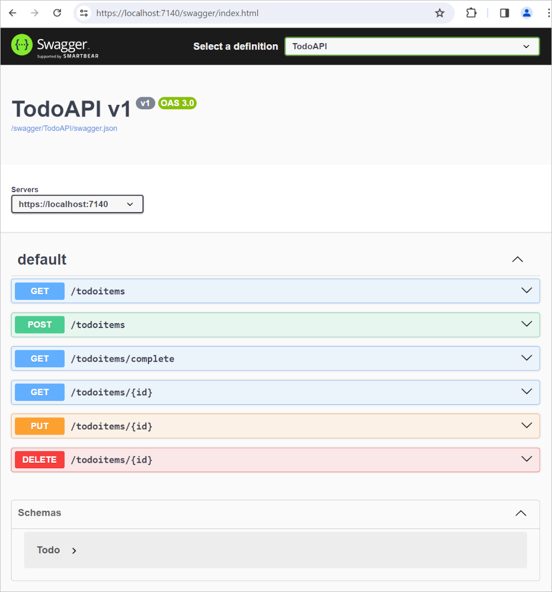
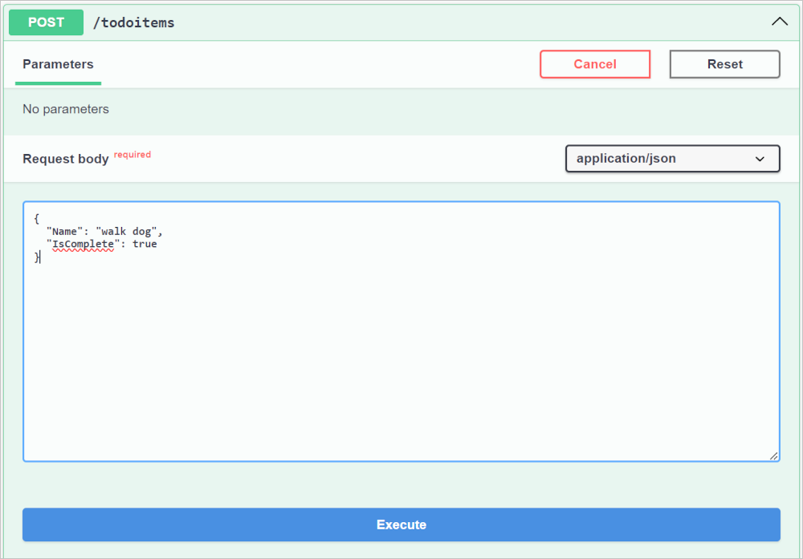
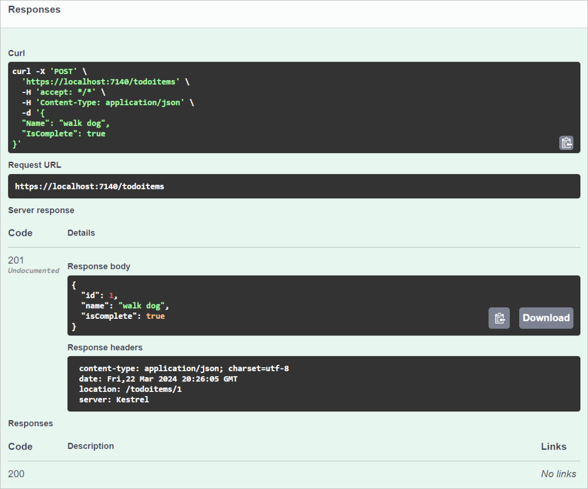

# Tutorial: Create a minimal API with ASP.NET Core

## 목차
- [Tutorial: Create a minimal API with ASP.NET Core](#tutorial-create-a-minimal-api-with-aspnet-core)
  - [목차](#목차)
  - [개요](#개요)
  - [사전 요구 사항](#사전-요구-사항)
  - [API 프로젝트 만들기](#api-프로젝트-만들기)
    - [코드 검토](#코드-검토)
    - [앱 실행](#앱-실행)
  - [NuGet 패키지 추가](#nuget-패키지-추가)
  - [모델 및 데이터베이스 컨텍스트 클래스](#모델-및-데이터베이스-컨텍스트-클래스)
  - [API 코드 추가](#api-코드-추가)
  - [Swagger로 API 테스트 UI 만들기](#swagger로-api-테스트-ui-만들기)
    - [Swagger 도구 설치](#swagger-도구-설치)
    - [Swagger 미들웨어 구성](#swagger-미들웨어-구성)
  - [데이터 게시 테스트](#데이터-게시-테스트)
  - [GET 엔드포인트 검토](#get-엔드포인트-검토)
  - [GET 엔드포인트 테스트](#get-엔드포인트-테스트)
  - [반환 값](#반환-값)
  - [PUT 엔드포인트 검토](#put-엔드포인트-검토)
  - [PUT 엔드포인트 테스트](#put-엔드포인트-테스트)
  - [DELETE 엔드포인트 검토 및 테스트](#delete-엔드포인트-검토-및-테스트)
  - [MapGroup API 사용](#mapgroup-api-사용)
  - [TypedResults API 사용](#typedresults-api-사용)
  - [과도한 게시 방지](#과도한-게시-방지)
  - [완성된 샘플로 문제 해결](#완성된-샘플로-문제-해결)
  - [출처](#출처)
  - [다음](#다음)

---

최소 API는 최소한의 종속성으로 HTTP API를 만들도록 설계되었습니다. 이들은 마이크로서비스와 ASP.NET Core에서 최소 파일, 기능 및 종속성만 포함하려는 앱에 이상적입니다.

이 튜토리얼에서는 ASP.NET Core로 최소 API를 만드는 기본 사항을 다룹니다. ASP.NET Core에서 API를 만드는 또 다른 접근 방식은 컨트롤러를 사용하는 것입니다. 최소 API와 컨트롤러 기반 API 중에서 선택하는 방법에 대한 도움말은 [<xref:fundamentals/apis>](https://learn.microsoft.com/en-us/aspnet/core/fundamentals/apis?view=aspnetcore-8.0)를 참조하세요. 더 많은 기능을 포함한 [컨트롤러](https://learn.microsoft.com/en-us/aspnet/core/web-api/?view=aspnetcore-8.0) 기반의 API 프로젝트를 만드는 튜토리얼은 [웹 API 만들기](https://learn.microsoft.com/en-us/aspnet/core/tutorials/first-web-api?view=aspnetcore-8.0)를 참조하세요.

## 개요

이 튜토리얼은 다음과 같은 API를 만듭니다:

| API                                    | 설명                           | 요청 본문  | 응답 본문              |
|----------------------------------------|--------------------------------|------------|------------------------|
| `GET /todoitems`                       | 모든 할 일 항목 가져오기       | 없음       | 할 일 항목 배열        |
| `GET /todoitems/complete`              | 완료된 할 일 항목 가져오기     | 없음       | 할 일 항목 배열        |
| `GET /todoitems/{id}`                  | ID로 항목 가져오기             | 없음       | 할 일 항목             |
| `POST /todoitems`                      | 새 항목 추가                   | 할 일 항목 | 할 일 항목             |
| `PUT /todoitems/{id}`                  | 기존 항목 업데이트 &nbsp;      | 할 일 항목 | 없음                   |
| `DELETE /todoitems/{id}` &nbsp; &nbsp; | 항목 삭제 &nbsp; &nbsp;        | 없음       | 없음                   |

## 사전 요구 사항

* [Visual Studio Code](https://code.visualstudio.com/download)
* [Visual Studio Code용 C# (최신 버전)](https://marketplace.visualstudio.com/items?itemName=ms-dotnettools.csharp)
* [.NET 8.0 SDK](https://dotnet.microsoft.com/download/dotnet/8.0)

Visual Studio Code 지침은 프로젝트 생성과 같은 ASP.NET Core 개발 기능을 위해 .NET CLI를 사용합니다. 이 지침은 macOS, Linux 또는 Windows 및 모든 코드 편집기에서 따를 수 있습니다. Visual Studio Code가 아닌 다른 편집기를 사용하는 경우 약간의 변경이 필요할 수 있습니다.

---

## API 프로젝트 만들기

* [통합 터미널](https://code.visualstudio.com/docs/editor/integrated-terminal)을 엽니다.
* 프로젝트 폴더를 포함할 폴더로 디렉터리를 변경합니다(`cd`).
* 다음 명령을 실행합니다:

  ```dotnetcli
  dotnet new web -o TodoApi
  cd TodoApi
  code -r ../TodoApi
  ```

* 작가를 신뢰할지 묻는 대화 상자가 나타나면 **Yes**를 선택합니다.
* 프로젝트에 필요한 자산을 추가할지 묻는 대화 상자가 나타나면 **Yes**를 선택합니다. 위 명령은 새로운 웹 최소 API 프로젝트를 만들고 이를 Visual Studio Code에서 엽니다.

---

### 코드 검토

`Program.cs` 파일에는 다음 코드가 포함되어 있습니다:

```C#
var builder = WebApplication.CreateBuilder(args);
var app = builder.Build();

app.MapGet("/", () => "Hello World!");

app.Run();
```

위 코드는:

* 미리 구성된 기본값으로 `WebApplicationBuilder` 및 `WebApplication` 을 만듭니다.
* `Hello World!`를 반환하는 HTTP GET 엔드포인트 `/`를 만듭니다:

### 앱 실행

* 다음 명령을 실행하여 HTTPS 개발 인증서를 신뢰합니다:

  ```dotnetcli
  dotnet dev-certs https --trust
  ```

  위 명령은 Linux에서는 작동하지 않습니다. 인증서를 신뢰하는 방법에 대한 자세한 내용은 해당 Linux 배포판의 문서를 참조하십시오.

  위 명령은 인증서가 이전에 신뢰되지 않은 경우 다음과 같은 대화 상자를 표시합니다:

  

* 개발 인증서를 신뢰하는 것에 동의하면 **예**를 선택합니다.

  자세한 내용은 [ASP.NET Core HTTPS 개발 인증서 신뢰](https://learn.microsoft.com/en-us/aspnet/core/security/enforcing-ssl?view=aspnetcore-8.0#trust-the-aspnet-core-https-development-certificate-on-windows-and-macos)를 참조하십시오.


Visual Studio Code에서 <kbd>Ctrl</kbd>+<kbd>F5</kbd> (Windows) 또는 <kbd>control</kbd>+<kbd>F5</kbd> (macOS)를 눌러 디버깅 없이 앱을 실행합니다.

기본 브라우저가 다음 URL로 시작됩니다: `https://localhost:<port>` 여기서 `<port>`는 무작위로 생성된 포트 번호입니다.

브라우저 창을 닫습니다.

Visual Studio Code에서 *Run* 메뉴에서 *Stop Debugging*을 선택하거나 <kbd>Shift</kbd>+<kbd>F5</kbd>를 눌러 앱을 중지합니다.

---

## NuGet 패키지 추가

이 튜토리얼에서 사용되는 데이터베이스 및 진단을 지원하기 위해 NuGet 패키지를 추가해야 합니다.

* 다음 명령을 실행합니다:

  ```dotnetcli
  dotnet add package Microsoft.EntityFrameworkCore.InMemory
  dotnet add package Microsoft.AspNetCore.Diagnostics.EntityFrameworkCore
  ```

---

## 모델 및 데이터베이스 컨텍스트 클래스

* 프로젝트 폴더에 `Todo.cs`라는 파일을 만들고 다음 코드를 추가합니다:

```C#
public class Todo
{
    public int Id { get; set; }
    public string? Name { get; set; }
    public bool IsComplete { get; set; }
}
```

위 코드는 이 앱의 모델을 만듭니다. *모델*은 앱이 관리하는 데이터를 나타내는 클래스입니다.

* `TodoDb.cs`라는 파일을 만들고 다음 코드를 추가합니다:

```C#
using Microsoft.EntityFrameworkCore;

class TodoDb : DbContext
{
    public TodoDb(DbContextOptions<TodoDb> options)
        : base(options) { }

    public DbSet<Todo> Todos => Set<Todo>();
}
```

위 코드는 *데이터베이스 컨텍스트*를 정의하며, 이는 데이터 모델에 대한 [Entity Framework](https://learn.microsoft.com/en-us/ef/core/) 기능을 조정하는 주요 클래스입니다. 이 클래스는 `Microsoft.EntityFrameworkCore.DbContext` 클래스를 상속합니다.

## API 코드 추가

* `Program.cs` 파일의 내용을 다음 코드로 바꿉니다:

```C#
using Microsoft.EntityFrameworkCore;

var builder = WebApplication.CreateBuilder(args);
builder.Services.AddDbContext<TodoDb>(opt => opt.UseInMemoryDatabase("TodoList"));
builder.Services.AddDatabaseDeveloperPageExceptionFilter();
var app = builder.Build();

app.MapGet("/todoitems", async (TodoDb db) =>
    await db.Todos.ToListAsync());

app.MapGet("/todoitems/complete", async (TodoDb db) =>
    await db.Todos.Where(t => t.IsComplete).ToListAsync());

app.MapGet("/todoitems/{id}", async (int id, TodoDb db) =>
    await db.Todos.FindAsync(id)
        is Todo todo
            ? Results.Ok(todo)
            : Results.NotFound());

app.MapPost("/todoitems", async (Todo todo, TodoDb db) =>
{
    db.Todos.Add(todo);
    await db.SaveChangesAsync();

    return Results.Created($"/todoitems/{todo.Id}", todo);
});

app.MapPut("/todoitems/{id}", async (int id, Todo inputTodo, TodoDb db) =>
{
    var todo = await db.Todos.FindAsync(id);

    if (todo is null) return Results.NotFound();

    todo.Name = inputTodo.Name;
    todo.IsComplete = inputTodo.IsComplete;

    await db.SaveChangesAsync();

    return Results.NoContent();
});

app.MapDelete("/todoitems/{id}", async (int id, TodoDb db) =>
{
    if (await db.Todos.FindAsync(id) is Todo todo)
    {
        db.Todos.Remove(todo);
        await db.SaveChangesAsync();
        return Results.NoContent();
    }

    return Results.NotFound();
});

app.Run();
```

다음 강조된 코드는 데이터베이스 컨텍스트를 [의존성 주입(DI)](https://learn.microsoft.com/en-us/aspnet/core/fundamentals/dependency-injection?view=aspnetcore-8.0) 컨테이너에 추가하고 데이터베이스 관련 예외를 표시할 수 있도록 합니다:

```C#
var builder = WebApplication.CreateBuilder(args);
builder.Services.AddDbContext<TodoDb>(opt => opt.UseInMemoryDatabase("TodoList"));
builder.Services.AddDatabaseDeveloperPageExceptionFilter();
var app = builder.Build();
```

DI 컨테이너는 데이터베이스 컨텍스트 및 기타 서비스에 대한 접근을 제공합니다.

## Swagger로 API 테스트 UI 만들기

선택할 수 있는 웹 API 테스트 도구가 많이 있으며, 이 튜토리얼의 소개 API 테스트 단계를 선호하는 도구로 따라할 수 있습니다.

이 튜토리얼에서는 OpenAPI 사양을 준수하는 테스트 UI를 생성하기 위해 Swagger 도구를 통합하는 .NET 패키지 [NSwag.AspNetCore](https://www.nuget.org/packages/NSwag.AspNetCore/)를 사용합니다.

* NSwag: ASP.NET Core 애플리케이션에 Swagger를 직접 통합하는 .NET 라이브러리로, 미들웨어와 구성을 제공합니다.
* Swagger: OpenAPI 사양을 준수하는 API 테스트 페이지를 생성하는 OpenAPIGenerator와 SwaggerUI와 같은 오픈 소스 도구 세트입니다.
* OpenAPI 사양: 컨트롤러와 모델 내의 XML 및 속성 주석을 기반으로 API의 기능을 설명하는 문서입니다.

ASP.NET에서 OpenAPI 및 NSwag을 사용하는 방법에 대한 자세한 내용은 [<xref:tutorials/web-api-help-pages-using-swagger>](https://learn.microsoft.com/en-us/aspnet/core/tutorials/web-api-help-pages-using-swagger?view=aspnetcore-8.0)를 참조하세요.

### Swagger 도구 설치

* 다음 명령을 실행합니다:

  ```dotnetcli
  dotnet add package NSwag.AspNetCore
  ```

위 명령은 Swagger 문서 및 UI를 생성하는 도구를 포함하는 [NSwag.AspNetCore](https://www.nuget.org/packages/NSwag.AspNetCore/) 패키지를 추가합니다.

### Swagger 미들웨어 구성

* Program.cs에서 상단에 다음 `using` 문을 추가합니다:

  ```C#
  using NSwag.AspNetCore;
  ```

* `var app = builder.Build();` 줄 앞에 다음 강조된 코드를 추가합니다:

  ```C#
  using NSwag.AspNetCore;
  using Microsoft.EntityFrameworkCore;

  var builder = WebApplication.CreateBuilder(args);
  builder.Services.AddDbContext<TodoDb>(opt => opt.UseInMemoryDatabase("TodoList"));
  builder.Services.AddDatabaseDeveloperPageExceptionFilter();

  builder.Services.AddEndpointsApiExplorer();
  builder.Services.AddOpenApiDocument(config =>
  {
      config.DocumentName = "TodoAPI";
      config.Title = "TodoAPI v1";
      config.Version = "v1";
  });
  var app = builder.Build();
  ```

위 코드에서:

  * `builder.Services.AddEndpointsApiExplorer();`: API Explorer를 활성화하며, 이는 HTTP API에 대한 메타데이터를 제공하는 서비스입니다. API Explorer는 Swagger가 Swagger 문서를 생성하는 데 사용됩니다.
  * `builder.Services.AddOpenApiDocument(config => {...});`: 애플리케이션 서비스에 Swagger OpenAPI 문서 생성기를 추가하고 API에 대한 제목과 버전 등의 정보를 제공하도록 구성합니다. 더 강력한 API 세부 정보를 제공하는 방법에 대한 자세한 내용은 [<xref:tutorials/get-started-with-nswag#customize-api-documentation>](https://learn.microsoft.com/en-us/aspnet/core/tutorials/getting-started-with-nswag?view=aspnetcore-8.0#customize-api-documentation)를 참조하세요.

* `var app = builder.Build();` 줄 다음에 다음 강조된 코드를 추가합니다:

  ```C#
  var app = builder.Build();
  if (app.Environment.IsDevelopment())
  {
      app.UseOpenApi();
      app.UseSwaggerUi(config =>
      {
          config.DocumentTitle = "TodoAPI";
          config.Path = "/swagger";
          config.DocumentPath = "/swagger/{documentName}/swagger.json";
          config.DocExpansion = "list";
      });
  }
  ```

  위 코드는 생성된 JSON 문서 및 Swagger UI를 제공하는 Swagger 미들웨어를 활성화합니다. Swagger는 개발 환경에서만 활성화됩니다. 프로덕션 환경에서 Swagger를 활성화하면 API 구조와 구현에 대한 잠재적으로 민감한 세부 정보가 노출될 수 있습니다.

<a name="post"></a>

---

## 데이터 게시 테스트

`Program.cs`의 다음 코드는 데이터를 인메모리 데이터베이스에 추가하는 HTTP POST 엔드포인트 `/todoitems`를 만듭니다:

```C#
app.MapPost("/todoitems", async (Todo todo, TodoDb db) =>
{
    db.Todos.Add(todo);
    await db.SaveChangesAsync();

    return Results.Created($"/todoitems/{todo.Id}", todo);
});
```

앱을 실행합니다. 더 이상 `/` 엔드포인트가 없기 때문에 브라우저에는 404 오류가 표시됩니다.

POST 엔드포인트는 앱에 데이터를 추가하는 데 사용됩니다.


* 앱이 여전히 실행 중인 상태에서 브라우저에서 `https://localhost:<port>/swagger`로 이동하여 Swagger가 생성한 API 테스트 페이지를 표시합니다.

  

* Swagger API 테스트 페이지에서 **Post /todoitems** > **Try it out**을 선택합니다.
* **Request body** 필드에는 API 매개변수를 반영한 생성된 예제 형식이 포함되어 있음을 확인합니다.
* 요청 본문에 선택적 `id`를 지정하지 않고 할 일 항목에 대한 JSON을 입력합니다:

  ```json
  {
    "name":"walk dog",
    "isComplete":true
  }
  ```

* **Execute**를 선택합니다.

  

Swagger는 **Execute** 버튼 아래에 **Responses** 창을 제공합니다. 

  

유용한 몇 가지 세부 사항을 확인하세요:

* cURL: Swagger는 Unix/Linux 구문으로 된 cURL 명령 예제를 제공합니다. 이 명령은 Unix/Linux 구문을 사용하는 모든 bash 셸(예: [Git for Windows](https://git-scm.com/downloads)의 Git Bash)에서 명령줄에서 실행할 수 있습니다.
* Request URL: Swagger UI의 JavaScript 코드가 API 호출을 위해 생성한 HTTP 요청의 단순화된 표현입니다. 실제 요청에는 헤더, 쿼리 매개변수 및 요청 본문과 같은 세부 사항이 포함될 수 있습니다.
* Server response: 응답 본문과 헤더가 포함됩니다. 응답 본문은 `id`가 `1`로 설정되었음을 보여줍니다.
* Response Code: 200 `HTTP` 상태 코드가 반환되어 요청이 성공적으로 처리되었음을 나타냅니다.

---

## GET 엔드포인트 검토

샘플 앱은 `MapGet`을 호출하여 여러 GET 엔드포인트를 구현합니다:

|API | 설명 | 요청 본문 | 응답 본문 |
|--- | ---- | ---- | ---- |
|`GET /todoitems` | 모든 할 일 항목 가져오기 | 없음 | 할 일 항목 배열|
|`GET /todoitems/complete` | 완료된 할 일 항목 가져오기 | 없음 | 할 일 항목 배열|
|`GET /todoitems/{id}` | ID로 항목 가져오기 | 없음 | 할 일 항목|

```C#
app.MapGet("/todoitems", async (TodoDb db) =>
    await db.Todos.ToListAsync());

app.MapGet("/todoitems/complete", async (TodoDb db) =>
    await db.Todos.Where(t => t.IsComplete).ToListAsync());

app.MapGet("/todoitems/{id}", async (int id, TodoDb db) =>
    await db.Todos.FindAsync(id)
        is Todo todo
            ? Results.Ok(todo)
            : Results.NotFound());
```

## GET 엔드포인트 테스트

브라우저 또는 Swagger에서 엔드포인트를 호출하여 앱을 테스트합니다.

* Swagger에서 **GET /todoitems** > **Try it out** > **Execute**를 선택합니다.

* 또는 브라우저에서 `http://localhost:<port>/todoitems` URI를 입력하여 **GET /todoitems**를 호출합니다. 예: `http://localhost:5001/todoitems`

`GET /todoitems` 호출은 다음과 유사한 응답을 생성합니다:

```json
[
  {
    "id": 1,
    "name": "walk dog",
    "isComplete": true
  }
]
```

* 특정 id에서 데이터를 반환하려면 Swagger에서 **GET /todoitems/{id}**를 호출합니다:
  * **GET /todoitems** > **Try it out**을 선택합니다.
  * **id** 필드를 `1`로 설정하고 **Execute**를 선택합니다.

* 또는 브라우저에서 `https://localhost:<port>/todoitems/1` URI를 입력하여 **GET /todoitems**를 호출합니다. 예: `https://localhost:5001/todoitems/1`

* 응답은 다음과 유사합니다:

  ```json
  {
    "id": 1,
    "name": "walk dog",
    "isComplete": true
  }
  ```

---

이 앱은 인메모리 데이터베이스를 사용합니다. 앱이 다시 시작되면 GET 요청은 데이터를 반환하지 않습니다. 데이터가 반환되지 않으면, [POST](#post) 데이터를 앱에 추가하고 다시 GET 요청을 시도하세요.

## 반환 값

ASP.NET Core는 객체를 자동으로 [JSON](https://www.json.org)으로 직렬화하고 JSON을 응답 메시지 본문에 씁니다. 이 반환 유형의 응답 코드는 처리되지 않은 예외가 없는 한 [200 OK](https://developer.mozilla.org/docs/Web/HTTP/Status/200)입니다. 처리되지 않은 예외는 5xx 오류로 변환됩니다.

반환 유형은 다양한 HTTP 상태 코드를 나타낼 수 있습니다. 예를 들어, `GET /todoitems/{id}`는 두 가지 다른 상태 값을 반환할 수 있습니다:

* 요청된 ID와 일치하는 항목이 없으면 메서드는 [404 상태](https://developer.mozilla.org/docs/Web/HTTP/Status/404) `NotFound` 오류 코드를 반환합니다.
* 그렇지 않으면, 메서드는 JSON 응답 본문과 함께 200을 반환합니다. `item`을 반환하면 HTTP 200 응답이 발생합니다.

## PUT 엔드포인트 검토

샘플 앱은 `MapPut`을 사용하여 단일 PUT 엔드포인트를 구현합니다:

```C#
app.MapPut("/todoitems/{id}", async (int id, Todo inputTodo, TodoDb db) =>
{
    var todo = await db.Todos.FindAsync(id);

    if (todo is null) return Results.NotFound();

    todo.Name = inputTodo.Name;
    todo.IsComplete = inputTodo.IsComplete;

    await db.SaveChangesAsync();

    return Results.NoContent();
});
```

이 메서드는 `MapPost` 메서드와 유사하지만 HTTP PUT을 사용합니다. 성공적인 응답은 [204 (내용 없음)](https://www.rfc-editor.org/rfc/rfc9110#status.204)을 반환합니다. HTTP 사양에 따르면, PUT 요청은 클라이언트가 변경 사항이 아닌 전체 업데이트된 엔터티를 전송해야 합니다. 부분 업데이트를 지원하려면 [HTTP PATCH](https://learn.microsoft.com/en-us/dotnet/api/microsoft.aspnetcore.mvc.httppatchattribute)를 사용하세요.

## PUT 엔드포인트 테스트

이 샘플은 앱이 시작될 때마다 초기화되어야 하는 인메모리 데이터베이스를 사용합니다. PUT 호출을 하기 전에 데이터베이스에 항목이 있어야 합니다. PUT 호출을 하기 전에 데이터베이스에 항목이 있는지 확인하려면 GET을 호출하세요.

`Id = 1`인 할 일 항목을 업데이트하고 이름을 `"feed fish"`로 설정합니다.

Swagger를 사용하여 PUT 요청을 전송합니다:

* **Put /todoitems/{id}** > **Try it out**을 선택합니다.

* **id** 필드를 `1`로 설정합니다.

* 요청 본문을 다음 JSON으로 설정합니다:

  ```json
  {
    "name": "feed fish",
    "isComplete": false
  }
  ```

* **Execute**를 선택합니다.

---

## DELETE 엔드포인트 검토 및 테스트

샘플 앱은 `MapDelete`를 사용하여 단일 DELETE 엔드포인트를 구현합니다:

```C#
app.MapDelete("/todoitems/{id}", async (int id, TodoDb db) =>
{
    if (await db.Todos.FindAsync(id) is Todo todo)
    {
        db.Todos.Remove(todo);
        await db.SaveChangesAsync();
        return Results.NoContent();
    }

    return Results.NotFound();
});
```

Swagger를 사용하여 DELETE 요청을 전송합니다:

* **DELETE /todoitems/{id}** > **Try it out**을 선택합니다.
* **ID** 필드를 `1`로 설정하고 **Execute**를 선택합니다.

  DELETE 요청이 앱으로 전송되고 응답은 **Responses** 창에 표시됩니다. 응답 본문은 비어 있고 **Server response** 상태 코드는 204입니다.

---

## MapGroup API 사용

샘플 앱 코드는 엔드포인트를 설정할 때마다 `todoitems` URL 접두사를 반복합니다. API에는 공통 URL 접두사가 있는 엔드포인트 그룹이 자주 있으며, 이러한 그룹을 구성하는 데 도움이 되는 `MapGroup` 메서드를 사용할 수 있습니다. 이는 반복적인 코드를 줄이고 `RequireAuthorization` 및 `WithMetadata`와 같은 메서드 호출로 전체 엔드포인트 그룹을 사용자 정의할 수 있습니다.

`Program.cs`의 내용을 다음 코드로 바꿉니다:

```C#
using NSwag.AspNetCore;
using Microsoft.EntityFrameworkCore;

var builder = WebApplication.CreateBuilder(args);
builder.Services.AddDbContext<TodoDb>(opt => opt.UseInMemoryDatabase("TodoList"));
builder.Services.AddDatabaseDeveloperPageExceptionFilter();

builder.Services.AddEndpointsApiExplorer();
builder.Services.AddOpenApiDocument(config =>
{
    config.DocumentName = "TodoAPI";
    config.Title = "TodoAPI v1";
    config.Version = "v1";
});

var app = builder.Build();

if (app.Environment.IsDevelopment())
{
    app.UseOpenApi();
    app.UseSwaggerUi(config =>
    {
        config.DocumentTitle = "TodoAPI";
        config.Path = "/swagger";
        config.DocumentPath = "/swagger/{documentName}/swagger.json";
        config.DocExpansion = "list";
    });
}

var todoItems = app.MapGroup("/todoitems");

todoItems.MapGet("/", async (TodoDb db) =>
    await db.Todos.ToListAsync());

todoItems.MapGet("/complete", async (TodoDb db) =>
    await db.Todos.Where(t => t.IsComplete).ToListAsync());

todoItems.MapGet("/{id}", async (int id, TodoDb db) =>
    await db.Todos.FindAsync(id)
        is Todo todo
            ? Results.Ok(todo)
            : Results.NotFound());

todoItems.MapPost("/", async (Todo todo, TodoDb db) =>
{
    db.Todos.Add(todo);
    await db.SaveChangesAsync();

    return Results.Created($"/todoitems/{todo.Id}", todo);
});

todoItems.MapPut("/{id}", async (int id, Todo inputTodo, TodoDb db) =>
{
    var todo = await db.Todos.FindAsync(id);

    if (todo is null) return Results.NotFound();

    todo.Name = inputTodo.Name;
    todo.IsComplete = inputTodo.IsComplete;

    await db.SaveChangesAsync();

    return Results.NoContent();
});

todoItems.MapDelete("/{id}", async (int id, TodoDb db) =>
{
    if (await db.Todos.FindAsync(id) is Todo todo)
    {
        db.Todos.Remove(todo);
        await db.SaveChangesAsync();
        return Results.NoContent();
    }

    return Results.NotFound();
});

app.Run();
```

---

위 코드는 다음과 같은 변경 사항이 있습니다:

* URL 접두사 `/todoitems`를 사용하여 그룹을 설정하는 `var todoItems = app.MapGroup("/todoitems");`를 추가합니다.
* 모든 `app.Map<HttpVerb>` 메서드를 `todoItems.Map<HttpVerb>`로 변경합니다.
* `Map<HttpVerb>` 메서드 호출에서 URL 접두사 `/todoitems`를 제거합니다.

엔드포인트가 동일하게 작동하는지 확인합니다.

## TypedResults API 사용

`Results` 대신 `TypedResults` 를 반환하면 테스트 가능성과 OpenAPI가 엔드포인트를 설명하기 위해 응답 유형 메타데이터를 자동으로 반환하는 등 여러 가지 이점이 있습니다. 자세한 내용은 [TypedResults vs Results](https://learn.microsoft.com/en-us/aspnet/core/fundamentals/minimal-apis/responses#typedresults-vs-results)를 참조하세요.

`Map<HttpVerb>` 메서드는 람다 대신 라우트 핸들러 메서드를 호출할 수 있습니다. 예제를 보려면 *Program.cs*를 다음 코드로 업데이트하세요:

```C#
using NSwag.AspNetCore;
using Microsoft.EntityFrameworkCore;

var builder = WebApplication.CreateBuilder(args);
builder.Services.AddDbContext<TodoDb>(opt => opt.UseInMemoryDatabase("TodoList"));
builder.Services.AddDatabaseDeveloperPageExceptionFilter();

builder.Services.AddEndpointsApiExplorer();
builder.Services.AddOpenApiDocument(config =>
{
    config.DocumentName = "TodoAPI";
    config.Title = "TodoAPI v1";
    config.Version = "v1";
});

var app = builder.Build();

if (app.Environment.IsDevelopment())
{
    app.UseOpenApi();
    app.UseSwaggerUi(config =>
    {
        config.DocumentTitle = "TodoAPI";
        config.Path = "/swagger";
        config.DocumentPath = "/swagger/{documentName}/swagger.json";
        config.DocExpansion = "list";
    });
}

var todoItems = app.MapGroup("/todoitems");

todoItems.MapGet("/", GetAllTodos);
todoItems.MapGet("/complete", GetCompleteTodos);
todoItems.MapGet("/{id}", GetTodo);
todoItems.MapPost("/", CreateTodo);
todoItems.MapPut("/{id}", UpdateTodo);
todoItems.MapDelete("/{id}", DeleteTodo);

app.Run();

static async Task<IResult> GetAllTodos(TodoDb db)
{
    return TypedResults.Ok(await db.Todos.ToArrayAsync());
}

static async Task<IResult> GetCompleteTodos(TodoDb db)
{
    return TypedResults.Ok(await db.Todos.Where(t => t.IsComplete).ToListAsync());
}

static async Task<IResult> GetTodo(int id, TodoDb db)
{
    return await db.Todos.FindAsync(id)
        is Todo todo
            ? TypedResults.Ok(todo)
            : TypedResults.NotFound();
}

static async Task<IResult> CreateTodo(Todo todo, TodoDb db)
{
    db.Todos.Add(todo);
    await db.SaveChangesAsync();

    return TypedResults.Created($"/todoitems/{todo.Id}", todo);
}

static async Task<IResult> UpdateTodo(int id, Todo inputTodo, TodoDb db)
{
    var todo = await db.Todos.FindAsync(id);

    if (todo is null) return TypedResults.NotFound();

    todo.Name = inputTodo.Name;
    todo.IsComplete = inputTodo.IsComplete;

    await db.SaveChangesAsync();

    return TypedResults.NoContent();
}

static async Task<IResult> DeleteTodo(int id, TodoDb db)
{
    if (await db.Todos.FindAsync(id) is Todo todo)
    {
        db.Todos.Remove(todo);
        await db.SaveChangesAsync();
        return TypedResults.NoContent();
    }

    return TypedResults.NotFound();
}
```

---

`Map<HttpVerb>` 코드는 이제 람다 대신 메서드를 호출합니다:

```C#
var todoItems = app.MapGroup("/todoitems");

todoItems.MapGet("/", GetAllTodos);
todoItems.MapGet("/complete", GetCompleteTodos);
todoItems.MapGet("/{id}", GetTodo);
todoItems.MapPost("/", CreateTodo);
todoItems.MapPut("/{id}", UpdateTodo);
todoItems.MapDelete("/{id}", DeleteTodo);
```

이 메서드는 `TypedResults` 에 의해 정의된 `IResult` 를 구현하는 객체를 반환합니다:

```C#
static async Task<IResult> GetAllTodos(TodoDb db)
{
    return TypedResults.Ok(await db.Todos.ToArrayAsync());
}

static async Task<IResult> GetCompleteTodos(TodoDb db)
{
    return TypedResults.Ok(await db.Todos.Where(t => t.IsComplete).ToListAsync());
}

static async Task<IResult> GetTodo(int id, TodoDb db)
{
    return await db.Todos.FindAsync(id)
        is Todo todo
            ? TypedResults.Ok(todo)
            : TypedResults.NotFound();
}

static async Task<IResult> CreateTodo(Todo todo, TodoDb db)
{
    db.Todos.Add(todo);
    await db.SaveChangesAsync();

    return TypedResults.Created($"/todoitems/{todo.Id}", todo);
}

static async Task<IResult> UpdateTodo(int id, Todo inputTodo, TodoDb db)
{
    var todo = await db.Todos.FindAsync(id);

    if (todo is null) return TypedResults.NotFound();

    todo.Name = inputTodo.Name;
    todo.IsComplete = inputTodo.IsComplete;

    await db.SaveChangesAsync();

    return TypedResults.NoContent();
}

static async Task<IResult> DeleteTodo(int id, TodoDb db)
{
    if (await db.Todos.FindAsync(id) is Todo todo)
    {
        db.Todos.Remove(todo);
        await db.SaveChangesAsync();
        return TypedResults.NoContent();
    }

    return TypedResults.NotFound();
}
```

단위 테스트는 이러한 메서드를 호출하고 올바른 유형을 반환하는지 테스트할 수 있습니다. 예를 들어, 메서드가 `GetAllTodos`인 경우:

```C#
static async Task<IResult> GetAllTodos(TodoDb db)
{
    return TypedResults.Ok(await db.Todos.ToArrayAsync());
}
```

단위 테스트 코드는 핸들러 메서드에서 [Ok\<Todo[]>](https://learn.microsoft.com/en-us/dotnet/api/microsoft.aspnetcore.http.httpresults.ok-1.value#microsoft-aspnetcore-http-httpresults-ok-1-value) 유형의 객체가 반환되는지 확인할 수 있습니다. 예를 들어:

```csharp
public async Task GetAllTodos_ReturnsOkOfTodosResult()
{
    // Arrange
    var db = CreateDbContext();

    // Act
    var result = await TodosApi.GetAllTodos(db);

    // Assert: Check for the correct returned type
    Assert.IsType<Ok<Todo[]>>(result);
}
```

<a name="over-post-v7"></a>

## 과도한 게시 방지

현재 샘플 앱은 전체 `Todo` 객체를 노출합니다. 프로덕션 애플리케이션에서는 모델의 일부를 사용하여 입력 및 반환할 수 있는 데이터를 제한하는 경우가 많습니다. 이러한 이유는 여러 가지가 있으며 보안이 주요 이유 중 하나입니다. 모델의 하위 집합은 일반적으로 데이터 전송 객체(DTO), 입력 모델 또는 뷰 모델이라고 합니다. 이 문서에서는 **DTO**를 사용합니다.

DTO는 다음과 같은 용도로 사용할 수 있습니다:

* 과도한 게시 방지.
* 클라이언트가 볼 수 없는 속성을 숨깁니다.
* 페이로드 크기를 줄이기 위해 일부 속성을 생략합니다.
* 중첩된 객체를 포함하는 객체 그래프를 평탄화합니다. 평탄화된 객체 그래프는 클라이언트에게 더 편리할 수 있습니다.

DTO 접근 방식을 보여주기 위해 `Todo` 클래스에 비밀 필드를 추가합니다:

```C#
public class Todo
{
    public int Id { get; set; }
    public string? Name { get; set; }
    public bool IsComplete { get; set; }
    public string? Secret { get; set; }
}
```

비밀 필드는 이 앱에서는 숨겨져야 하지만 관리 앱에서는 노출할 수 있습니다.

비밀 필드를 게시하고 가져올 수 있는지 확인합니다.

`TodoItemDTO.cs`라는 파일을 만들고 다음 코드를 추가합니다:

```C#
public class TodoItemDTO
{
    public int Id { get; set; }
    public string? Name { get; set; }
    public bool IsComplete { get; set; }

    public TodoItemDTO() { }
    public TodoItemDTO(Todo todoItem) =>
    (Id, Name, IsComplete) = (todoItem.Id, todoItem.Name, todoItem.IsComplete);
}
```

DTO 모델을 사용하도록 `Program.cs` 파일의 내용을 다음 코드로 바꿉니다:

```C#
using NSwag.AspNetCore;
using Microsoft.EntityFrameworkCore;

var builder = WebApplication.CreateBuilder(args);
builder.Services.AddDbContext<TodoDb>(opt => opt.UseInMemoryDatabase("TodoList"));
builder.Services.AddDatabaseDeveloperPageExceptionFilter();

builder.Services.AddEndpointsApiExplorer();
builder.Services.AddOpenApiDocument(config =>
{
    config.DocumentName = "TodoAPI";
    config.Title = "TodoAPI v1";
    config.Version = "v1";
});

var app = builder.Build();

if (app.Environment.IsDevelopment())
{
    app.UseOpenApi();
    app.UseSwaggerUi(config =>
    {
        config.DocumentTitle = "TodoAPI";
        config.Path = "/swagger";
        config.DocumentPath = "/swagger/{documentName}/swagger.json";
        config.DocExpansion = "list";
    });
}

RouteGroupBuilder todoItems = app.MapGroup("/todoitems");

todoItems.MapGet("/", GetAllTodos);
todoItems.MapGet("/complete", GetCompleteTodos);
todoItems.MapGet("/{id}", GetTodo);
todoItems.MapPost("/", CreateTodo);
todoItems.MapPut("/{id}", UpdateTodo);
todoItems.MapDelete("/{id}", DeleteTodo);

app.Run();

static async Task<IResult> GetAllTodos(TodoDb db)
{
    return TypedResults.Ok(await db.Todos.Select(x => new TodoItemDTO(x)).ToArrayAsync());
}

static async Task<IResult> GetCompleteTodos(TodoDb db) {
    return TypedResults.Ok(await db.Todos.Where(t => t.IsComplete).Select(x => new TodoItemDTO(x)).ToListAsync());
}

static async Task<IResult> GetTodo(int id, TodoDb db)
{
    return await db.Todos.FindAsync(id)
        is Todo todo
            ? TypedResults.Ok(new TodoItemDTO(todo))
            : TypedResults.NotFound();
}

static async Task<IResult> CreateTodo(TodoItemDTO todoItemDTO, TodoDb db)
{
    var todoItem = new Todo
    {
        IsComplete = todoItemDTO.IsComplete,
        Name = todoItemDTO.Name
    };

    db.Todos.Add(todoItem);
    await db.SaveChangesAsync();

    todoItemDTO = new TodoItemDTO(todoItem);

    return TypedResults.Created($"/todoitems/{todoItem.Id}", todoItemDTO);
}

static async Task<IResult> UpdateTodo(int id, TodoItemDTO todoItemDTO, TodoDb db)
{
    var todo = await db.Todos.FindAsync(id);

    if (todo is null) return TypedResults.NotFound();

    todo.Name = todoItemDTO.Name;
    todo.IsComplete = todoItemDTO.IsComplete;

    await db.SaveChangesAsync();

    return TypedResults.NoContent();
}

static async Task<IResult> DeleteTodo(int id, TodoDb db)
{
    if (await db.Todos.FindAsync(id) is Todo todo)
    {
        db.Todos.Remove(todo);
        await db.SaveChangesAsync();
        return TypedResults.NoContent();
    }

    return TypedResults.NotFound();
}
```

---

비밀 필드를 제외한 모든 필드를 게시하고 가져올 수 있는지 확인합니다.

<a name="diff-v7"></a>

## 완성된 샘플로 문제 해결

해결할 수 없는 문제가 발생하면 코드를 완료된 프로젝트와 비교하세요. [완료된 프로젝트 보기 또는 다운로드](https://github.com/dotnet/AspNetCore.Docs/tree/main/aspnetcore/tutorials/min-web-api/samples) ([샘플 다운로드 방법](https://learn.microsoft.com/en-us/aspnet/core/introduction-to-aspnet-core?view=aspnetcore-8.0#how-to-download-a-sample)).

---
## 출처
[Tutorial: Create a minimal API with ASP.NET Core](https://learn.microsoft.com/en-us/aspnet/core/tutorials/min-web-api?view=aspnetcore-8.0&tabs=visual-studio-code)

---
## [다음](./03_controller_based_api_overview.md)
