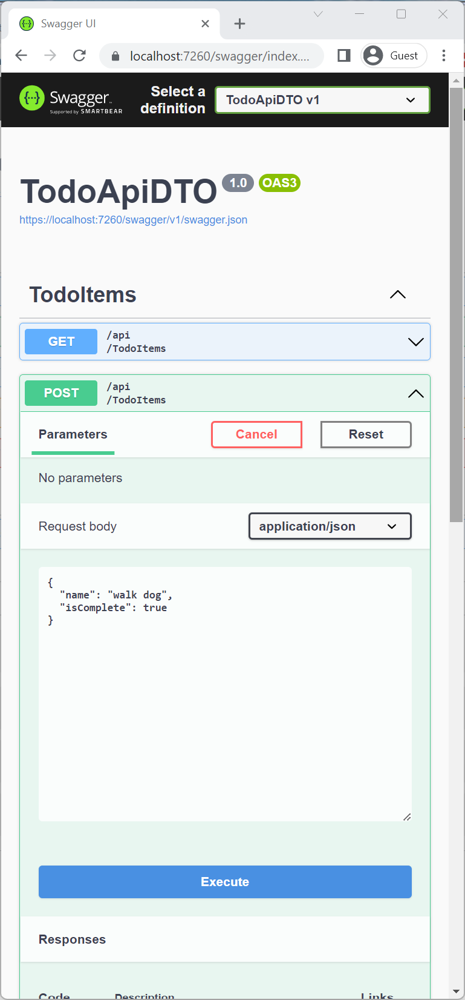
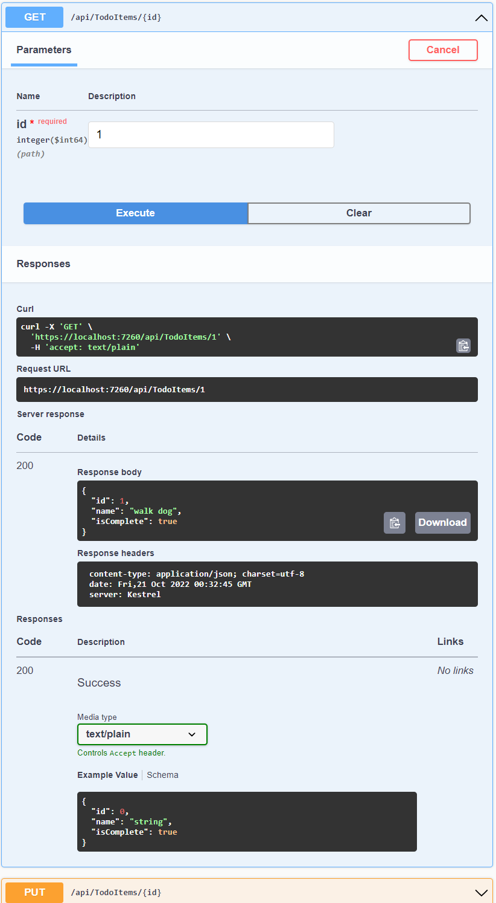

# Tutorial: Create a web API with ASP.NET Core


## 목차
- [Tutorial: Create a web API with ASP.NET Core](#tutorial-create-a-web-api-with-aspnet-core)
  - [목차](#목차)
  - [개요](#개요)
  - [필수 조건](#필수-조건)
  - [웹 프로젝트 만들기](#웹-프로젝트-만들기)
    - [프로젝트 테스트](#프로젝트-테스트)
  - [모델 클래스 추가](#모델-클래스-추가)
  - [데이터베이스 컨텍스트 추가](#데이터베이스-컨텍스트-추가)
  - [데이터베이스 컨텍스트 등록](#데이터베이스-컨텍스트-등록)
  - [컨트롤러 스캐폴딩](#컨트롤러-스캐폴딩)
  - [PostTodoItem 생성 메서드 업데이트](#posttodoitem-생성-메서드-업데이트)
    - [PostTodoItem 테스트](#posttodoitem-테스트)
    - [위치 헤더 URI 테스트](#위치-헤더-uri-테스트)
  - [GET 메서드 검토](#get-메서드-검토)
  - [라우팅 및 URL 경로](#라우팅-및-url-경로)
  - [반환 값](#반환-값)
  - [PutTodoItem 메서드](#puttodoitem-메서드)
    - [PutTodoItem 메서드 테스트](#puttodoitem-메서드-테스트)
  - [DeleteTodoItem 메서드](#deletetodoitem-메서드)
    - [DeleteTodoItem 메서드 테스트](#deletetodoitem-메서드-테스트)
  - [다른 도구로 테스트](#다른-도구로-테스트)
  - [과도한 포스팅 방지](#과도한-포스팅-방지)
  - [JavaScript로 웹 API 호출](#javascript로-웹-api-호출)
  - [웹 API 비디오 시리즈](#웹-api-비디오-시리즈)
  - [Reliable web app patterns](#reliable-web-app-patterns)
  - [웹 API에 인증 지원 추가](#웹-api에-인증-지원-추가)
  - [Azure에 배포](#azure에-배포)
  - [추가 자료](#추가-자료)
  - [출처](#출처)
  - [다음](#다음)

---

이 튜토리얼은 데이터베이스를 사용하는 컨트롤러 기반 웹 API를 만드는 기본 사항을 가르칩니다. ASP.NET Core에서 API를 만드는 또 다른 접근 방식은 *최소 API*를 만드는 것입니다.

## 개요

이 튜토리얼에서는 다음 API를 만듭니다:

|API | 설명 | 요청 본문 | 응답 본문 |
|--- | ---- | ---- | ---- |
|`GET /api/todoitems` | 모든 할 일 항목 가져오기 | 없음 | 할 일 항목 배열|
|`GET /api/todoitems/{id}` | ID로 항목 가져오기 | 없음 | 할 일 항목|
|`POST /api/todoitems` | 새 항목 추가 | 할 일 항목 | 할 일 항목 |
|`PUT /api/todoitems/{id}` | 기존 항목 업데이트 &nbsp; | 할 일 항목 | 없음 |
|`DELETE /api/todoitems/{id}` &nbsp; &nbsp; | 항목 삭제 &nbsp; &nbsp; | 없음 | 없음|

다음 다이어그램은 앱의 설계를 보여줍니다.


## 필수 조건

* [Visual Studio Code](https://code.visualstudio.com/download)
* [Visual Studio Code용 C# (최신 버전)](https://marketplace.visualstudio.com/items?itemName=ms-dotnettools.csharp)
* [.NET 8.0 SDK](https://dotnet.microsoft.com/download/dotnet/8.0)

Visual Studio Code 지침은 프로젝트 생성과 같은 ASP.NET Core 개발 기능을 위해 .NET CLI를 사용합니다. 이 지침은 macOS, Linux 또는 Windows 및 모든 코드 편집기에서 따를 수 있습니다. Visual Studio Code가 아닌 다른 편집기를 사용하는 경우 약간의 변경이 필요할 수 있습니다.

---

## 웹 프로젝트 만들기

* [통합 터미널](https://code.visualstudio.com/docs/editor/integrated-terminal)을 엽니다.
* 프로젝트 폴더가 포함될 폴더로 디렉터리를 변경합니다(`cd` 명령 사용).
* 다음 명령을 실행합니다:

   ```dotnetcli
   dotnet new webapi --use-controllers -o TodoApi
   cd TodoApi
   dotnet add package Microsoft.EntityFrameworkCore.InMemory
   code -r ../TodoApi
   ```

  이 명령들은 다음을 수행합니다:

  * 새 웹 API 프로젝트를 만들고 Visual Studio Code에서 엽니다.
  * 다음 섹션에 필요한 NuGet 패키지를 추가합니다.
  * 현재 Visual Studio Code 인스턴스에서 *TodoApi* 폴더를 엽니다.

Visual Studio Code는 다음과 같은 대화 상자를 표시할 수 있습니다: **이 폴더의 파일 작성자를 신뢰하십니까?**

* 상위 폴더의 모든 파일을 신뢰하는 경우, **상위 폴더의 모든 파일 작성자를 신뢰**를 선택하세요.
* 프로젝트 폴더에 .NET이 생성한 파일이 있으므로 **예, 작성자를 신뢰합니다**를 선택하세요.
* Visual Studio Code가 프로젝트를 빌드하고 디버그하는 데 필요한 자산을 추가하겠는지 묻는 경우, **예**를 선택하세요. Visual Studio Code가 빌드 및 디버그 자산을 추가하겠다는 제안을 하지 않으면, **보기** > **명령 팔레트**를 선택하고 검색 상자에 "`.NET`"을 입력하세요. 명령 목록에서 `.NET: Generate Assets for Build and Debug` 명령을 선택하세요.

Visual Studio Code는 생성된 `launch.json` 및 `tasks.json` 파일이 있는 `.vscode` 폴더를 추가합니다.

---

> [!NOTE]
> .NET 앱에 패키지를 추가하는 방법에 대한 지침은 [패키지 소비 워크플로 (NuGet 문서)](/nuget/consume-packages/overview-and-workflow)의 *패키지 설치 및 관리* 항목에서 확인하세요. 올바른 패키지 버전은 [NuGet.org](https://www.nuget.org)에서 확인하세요.

### 프로젝트 테스트

프로젝트 템플릿은 [Swagger](xref:tutorials/web-api-help-pages-using-swagger)를 지원하는 `WeatherForecast` API를 생성합니다.

* 다음 명령을 실행하여 HTTPS 개발 인증서를 신뢰합니다:

  ```dotnetcli
  dotnet dev-certs https --trust
  ```

  위 명령은 Linux에서는 작동하지 않습니다. 인증서를 신뢰하는 방법에 대한 자세한 내용은 해당 Linux 배포판의 문서를 참조하십시오.

  위 명령은 인증서가 이전에 신뢰되지 않은 경우 다음과 같은 대화 상자를 표시합니다:

  

* 개발 인증서를 신뢰하는 것에 동의하면 **예**를 선택합니다.

  자세한 내용은 [ASP.NET Core HTTPS 개발 인증서 신뢰](https://learn.microsoft.com/en-us/aspnet/core/security/enforcing-ssl?view=aspnetcore-8.0#trust-the-aspnet-core-https-development-certificate-on-windows-and-macos)를 참조하십시오.

앱을 실행합니다:

* `https` 프로파일에서 앱을 시작하려면 다음 명령을 실행합니다:

  ```dotnetcli
  dotnet run --launch-profile https
  ```

 출력에는 앱이 실행 중이며 요청을 기다리고 있음을 나타내는 다음과 유사한 메시지가 표시됩니다:

   ```output
   ...
   info: Microsoft.Hosting.Lifetime[14]
         Now listening on: https://localhost:{port}
   ...
   ```

* 출력에 표시된 HTTPS URL을 Ctrl 키를 누른 상태에서 클릭하여 웹 앱을 브라우저에서 테스트합니다.

* 기본 브라우저가 `https://localhost:<port>/swagger/index.html`로 실행됩니다. 여기서 `<port>`는 출력에 표시된 무작위로 선택된 포트 번호입니다. `https://localhost:<port>`에는 엔드포인트가 없으므로 브라우저는 [HTTP 404 Not Found](https://developer.mozilla.org/docs/Web/HTTP/Status/404)를 반환합니다. URL에 `/swagger`를 추가하여 `https://localhost:<port>/swagger`로 접속합니다.

다음 지침에서 웹 앱을 테스트한 후 통합 터미널에서 Ctrl+C를 눌러 앱을 종료합니다.


---

Swagger 페이지 `/swagger/index.html`이 표시됩니다. **GET** > **Try it out** > **Execute**를 선택합니다. 페이지에는 다음이 표시됩니다:

* WeatherForecast API를 테스트하기 위한 [Curl](https://curl.haxx.se/) 명령.
* WeatherForecast API를 테스트하기 위한 URL.
* 응답 코드, 본문 및 헤더.
* 미디어 유형 및 예제 값과 스키마가 있는 드롭다운 목록 상자.

Swagger 페이지가 표시되지 않으면 [이 GitHub 이슈](https://github.com/dotnet/AspNetCore.Docs/issues/21647)를 참조하세요.

Swagger는 웹 API에 대한 유용한 문서 및 도움말 페이지를 생성하는 데 사용됩니다. 이 튜토리얼에서는 Swagger를 사용하여 앱을 테스트합니다. Swagger에 대한 자세한 내용은 [<xref:tutorials/web-api-help-pages-using-swagger>](https://learn.microsoft.com/en-us/aspnet/core/tutorials/web-api-help-pages-using-swagger?view=aspnetcore-8.0)를 참조하세요.

브라우저에 **요청 URL**을 복사하여 붙여넣습니다: `https://localhost:<port>/weatherforecast`

다음 예제와 유사한 JSON이 반환됩니다:

```json
[
    {
        "date": "2019-07-16T19:04:05.7257911-06:00",
        "temperatureC": 52,
        "temperatureF": 125,
        "summary": "Mild"
    },
    {
        "date": "2019-07-17T19:04:05.7258461-06:00",
        "temperatureC": 36,
        "temperatureF": 96,
        "summary": "Warm"
    },
    {
        "date": "2019-07-18T19:04:05.7258467-06:00",
        "temperatureC": 39,
        "temperatureF": 102,
        "summary": "Cool"
    },
    {
        "date": "2019-07-19T19:04:05.7258471-06:00",
        "temperatureC": 10,
        "temperatureF": 49,
        "summary": "Bracing"
    },
    {
        "date": "2019-07-20T19:04:05.7258474-06:00",
        "temperatureC": -1,
        "temperatureF": 31,
        "summary": "Chilly"
    }
]
```

## 모델 클래스 추가

*모델*은 앱이 관리하는 데이터를 나타내는 클래스 집합입니다. 이 앱의 모델은 `TodoItem` 클래스입니다.

* `Models`라는 폴더를 추가합니다.
* `Models` 폴더에 `TodoItem.cs` 파일을 추가하고 다음 코드를 입력합니다:


---

```C#
namespace TodoApi.Models;

public class TodoItem
{
    public long Id { get; set; }
    public string? Name { get; set; }
    public bool IsComplete { get; set; }
}
```

`Id` 속성은 관계형 데이터베이스에서 고유 키로 작동합니다.

모델 클래스는 프로젝트 내 어디에나 위치할 수 있지만, `Models` 폴더는 관례적으로 사용됩니다.

## 데이터베이스 컨텍스트 추가

*데이터베이스 컨텍스트*는 데이터 모델에 대해 Entity Framework 기능을 조정하는 주요 클래스입니다. 이 클래스는 `Microsoft.EntityFrameworkCore.DbContext` 클래스를 상속하여 생성됩니다.

* `Models` 폴더에 `TodoContext.cs` 파일을 추가합니다.

---

* 다음 코드를 입력합니다:

  ```C#
  using Microsoft.EntityFrameworkCore;

  namespace TodoApi.Models;

  public class TodoContext : DbContext
  {
      public TodoContext(DbContextOptions<TodoContext> options)
          : base(options)
      {
      }

      public DbSet<TodoItem> TodoItems { get; set; } = null!;
  }
  ```

## 데이터베이스 컨텍스트 등록

ASP.NET Core에서 DB 컨텍스트와 같은 서비스는 [의존성 주입 (DI)](xref:fundamentals/dependency-injection) 컨테이너에 등록해야 합니다. 컨테이너는 컨트롤러에 서비스를 제공합니다.

`Program.cs`를 다음 강조 표시된 코드로 업데이트합니다:

```C#
using Microsoft.EntityFrameworkCore;
using TodoApi.Models;

var builder = WebApplication.CreateBuilder(args);

builder.Services.AddControllers();
builder.Services.AddDbContext<TodoContext>(opt =>
    opt.UseInMemoryDatabase("TodoList"));
builder.Services.AddEndpointsApiExplorer();
builder.Services.AddSwaggerGen();

var app = builder.Build();

if (app.Environment.IsDevelopment())
{
    app.UseSwagger();
    app.UseSwaggerUI();
}

app.UseHttpsRedirection();

app.UseAuthorization();

app.MapControllers();

app.Run();
```

위의 코드는 다음을 수행합니다:

* `using` 지시문을 추가합니다.
* 데이터베이스 컨텍스트를 DI 컨테이너에 추가합니다.
* 데이터베이스 컨텍스트가 인메모리 데이터베이스를 사용할 것임을 지정합니다.

## 컨트롤러 스캐폴딩

지금까지의 모든 변경 사항을 저장했는지 확인하세요.

* **TodoAPI** 프로젝트를 컨트롤 클릭하고 **터미널에서 열기**를 선택합니다. 터미널이 `TodoAPI` 프로젝트 폴더에서 열립니다. 다음 명령을 실행합니다:

```dotnetcli
dotnet add package Microsoft.VisualStudio.Web.CodeGeneration.Design
dotnet add package Microsoft.EntityFrameworkCore.Design
dotnet add package Microsoft.EntityFrameworkCore.SqlServer
dotnet add package Microsoft.EntityFrameworkCore.Tools
dotnet tool uninstall -g dotnet-aspnet-codegenerator
dotnet tool install -g dotnet-aspnet-codegenerator
dotnet tool update -g dotnet-aspnet-codegenerator
```

위의 명령들은 다음을 수행합니다:

* 스캐폴딩에 필요한 NuGet 패키지를 추가합니다.
* 스캐폴딩 엔진(`dotnet-aspnet-codegenerator`)을 설치합니다. 이전 버전이 있을 경우 제거합니다.

Linux의 경우, 다음 명령을 사용하여 .NET 도구 디렉터리를 시스템 경로에 추가합니다:

```Bash
echo 'export PATH=$HOME/.dotnet/tools:$PATH' >> ~/.bashrc
source ~/.bashrc
```

> [!NOTE]
> 기본적으로 설치할 .NET 바이너리의 아키텍처는 현재 실행 중인 운영 체제의 아키텍처를 나타냅니다. 다른 운영 체제 아키텍처를 지정하려면 [dotnet tool install, --arch 옵션](/dotnet/core/tools/dotnet-tool-install#options)을 참조하세요.
> 자세한 내용은 GitHub 이슈 [dotnet/AspNetCore.Docs #29262](https://github.com/dotnet/AspNetCore.Docs/issues/29262)를 참조하세요.

프로젝트를 빌드합니다.

다음 명령을 실행합니다:

  ```dotnetcli
  dotnet aspnet-codegenerator controller -name TodoItemsController -async -api -m TodoItem -dc TodoContext -outDir Controllers
  ```

위의 명령은 `TodoItemsController`를 스캐폴딩합니다.

---

생성된 코드는 다음과 같습니다:

* 클래스에 [`[ApiController]`](https://learn.microsoft.com/en-us/dotnet/api/microsoft.aspnetcore.mvc.apicontrollerattribute) 특성을 추가합니다. 이 특성은 컨트롤러가 웹 API 요청에 응답함을 나타냅니다. 이 특성이 활성화하는 특정 동작에 대한 자세한 내용은 [<xref:web-api/index>](https://learn.microsoft.com/en-us/aspnet/core/web-api/?view=aspnetcore-8.0)를 참조하세요.
* DI를 사용하여 데이터베이스 컨텍스트(`TodoContext`)를 컨트롤러에 주입합니다. 데이터베이스 컨텍스트는 컨트롤러의 각 [CRUD](https://wikipedia.org/wiki/Create,_read,_update_and_delete) 메서드에서 사용됩니다.

ASP.NET Core 템플릿은 다음을 위해:

* 뷰가 있는 컨트롤러는 라우트 템플릿에 `[action]`을 포함합니다.
* API 컨트롤러는 라우트 템플릿에 `[action]`을 포함하지 않습니다.

`[action]` 토큰이 라우트 템플릿에 없으면 [action](https://learn.microsoft.com/en-us/aspnet/core/mvc/controllers/routing?view=aspnetcore-8.0#action) 이름(메서드 이름)은 엔드포인트에 포함되지 않습니다. 즉, 액션의 관련 메서드 이름은 일치하는 라우트에서 사용되지 않습니다.

## PostTodoItem 생성 메서드 업데이트

`PostTodoItem`의 반환 문을 [nameof](https://learn.microsoft.com/en-us/dotnet/csharp/language-reference/operators/nameof) 연산자를 사용하도록 업데이트합니다:

```C#
[HttpPost]
public async Task<ActionResult<TodoItem>> PostTodoItem(TodoItem todoItem)
{
    _context.TodoItems.Add(todoItem);
    await _context.SaveChangesAsync();

    //    return CreatedAtAction("PostTodoItem", new { id = todoItem.Id }, todoItem);
    return CreatedAtAction(nameof(PostTodoItem), new { id = todoItem.Id }, todoItem);
}
```

위의 코드는 `HTTP POST` 메서드입니다. [`[HttpPost]`](https://learn.microsoft.com/en-us/dotnet/api/microsoft.aspnetcore.mvc.httppostattribute) 특성이 이를 나타냅니다. 이 메서드는 HTTP 요청 본문에서 `TodoItem` 값을 가져옵니다.

자세한 내용은 [Http[Verb] 특성과 함께 속성 라우팅](https://learn.microsoft.com/en-us/aspnet/core/mvc/controllers/routing?view=aspnetcore-8.0#verb)을 참조하세요.

`CreatedAtAction` 메서드는 다음을 수행합니다:

* 성공하면 [HTTP 201 상태 코드](https://developer.mozilla.org/docs/Web/HTTP/Status/201)를 반환합니다. `HTTP 201`은 서버에 새 리소스를 생성하는 `HTTP POST` 메서드의 표준 응답입니다.
* 응답에 [Location](https://developer.mozilla.org/docs/Web/HTTP/Headers/Location) 헤더를 추가합니다. `Location` 헤더는 새로 생성된 할 일 항목의 [URI](https://developer.mozilla.org/docs/Glossary/URI)를 지정합니다. 자세한 내용은 [10.2.2 201 Created](https://www.rfc-editor.org/rfc/rfc9110.html#section-10.2.2)를 참조하세요.
* `Location` 헤더의 URI를 생성하기 위해 `PostTodoItem` 액션을 참조합니다. C# `nameof` 키워드는 `CreatedAtAction` 호출에서 액션 이름을 하드 코딩하지 않도록 사용됩니다.

<a name="post7"></a>

### PostTodoItem 테스트

* Ctrl+F5를 눌러 앱을 실행합니다.
* Swagger 브라우저 창에서 **POST /api/TodoItems**를 선택한 다음 **Try it out**을 선택합니다.
* **Request body** 입력 창에서 JSON을 업데이트합니다. 예를 들어,

  ```JSON
  {
    "name": "walk dog",
    "isComplete": true
  }
  ```

* **Execute**를 선택합니다.

  

### 위치 헤더 URI 테스트

앞의 POST에서 Swagger UI는 **응답 헤더** 아래에 [위치 헤더](https://developer.mozilla.org/docs/Web/HTTP/Headers/Location)를 표시합니다. 예를 들어, `location: https://localhost:7260/api/TodoItems/1`. 위치 헤더는 생성된 리소스의 URI를 보여줍니다.

위치 헤더를 테스트하려면:

* Swagger 브라우저 창에서 **GET /api/TodoItems/{id}**를 선택한 다음 **Try it out**을 선택합니다.
* `id` 입력 상자에 `1`을 입력한 다음 **Execute**를 선택합니다.

  

## GET 메서드 검토

두 개의 GET 엔드포인트가 구현되었습니다:

* `GET /api/todoitems`
* `GET /api/todoitems/{id}`

이전 섹션에서는 `/api/todoitems/{id}` 경로의 예를 보여주었습니다.

[POST](#post7) 지침을 따라 또 다른 할 일 항목을 추가한 다음, Swagger를 사용하여 `/api/todoitems` 경로를 테스트하세요.

이 앱은 인메모리 데이터베이스를 사용합니다. 앱을 중지하고 다시 시작하면 이전 GET 요청이 데이터를 반환하지 않습니다. 데이터가 반환되지 않으면 앱에 [POST](#post7) 데이터를 추가하세요.

## 라우팅 및 URL 경로

[`[HttpGet]`](https://learn.microsoft.com/en-us/dotnet/api/microsoft.aspnetcore.mvc.httpgetattribute) 특성은 `HTTP GET` 요청에 응답하는 메서드를 나타냅니다. 각 메서드의 URL 경로는 다음과 같이 구성됩니다:

* 컨트롤러의 `Route` 특성에 있는 템플릿 문자열로 시작합니다:

  ```C#
  [Route("api/[controller]")]
  [ApiController]
  public class TodoItemsController : ControllerBase
  ```

* `[controller]`을 컨트롤러 이름으로 교체합니다. 관례적으로 이는 컨트롤러 클래스 이름에서 "Controller" 접미사를 뺀 것입니다. 이 예제에서는 컨트롤러 클래스 이름이 **TodoItems**Controller이므로 컨트롤러 이름은 "TodoItems"입니다. ASP.NET Core [라우팅](https://learn.microsoft.com/en-us/aspnet/core/mvc/controllers/routing?view=aspnetcore-8.0)은 대소문자를 구분하지 않습니다.
* `[HttpGet]` 특성이 라우트 템플릿을 가지고 있는 경우(예: `[HttpGet("products")]`), 해당 템플릿을 경로에 추가합니다. 이 예제에서는 템플릿을 사용하지 않습니다. 자세한 내용은 [Http[Verb] 특성과 함께 속성 라우팅](https://learn.microsoft.com/en-us/aspnet/core/mvc/controllers/routing?view=aspnetcore-8.0#verb)을 참조하세요.

다음 `GetTodoItem` 메서드에서, `"{id}"`는 할 일 항목의 고유 식별자에 대한 자리 표시자 변수입니다. `GetTodoItem`이 호출되면 URL의 `"{id}"` 값이 메서드의 `id` 매개 변수에 제공됩니다.

```C#
[HttpGet("{id}")]
public async Task<ActionResult<TodoItem>> GetTodoItem(long id)
{
    var todoItem = await _context.TodoItems.FindAsync(id);

    if (todoItem == null)
    {
        return NotFound();
    }

    return todoItem;
}
```

## 반환 값

`GetTodoItems` 및 `GetTodoItem` 메서드의 반환 타입은 [ActionResult\<T> 타입](https://learn.microsoft.com/en-us/aspnet/core/web-api/action-return-types?view=aspnetcore-8.0#actionresultt-type)입니다. ASP.NET Core는 객체를 자동으로 [JSON](https://www.json.org/)으로 직렬화하고 응답 메시지 본문에 JSON을 씁니다. 이 반환 타입의 응답 코드는 [200 OK](https://developer.mozilla.org/docs/Web/HTTP/Status/200)입니다. 처리되지 않은 예외가 없는 경우에만 해당됩니다. 처리되지 않은 예외는 5xx 오류로 변환됩니다.

`ActionResult` 반환 타입은 다양한 HTTP 상태 코드를 나타낼 수 있습니다. 예를 들어, `GetTodoItem`은 두 가지 다른 상태 값을 반환할 수 있습니다:

* 요청된 ID와 일치하는 항목이 없는 경우, 메서드는 [404 상태](https://developer.mozilla.org/docs/Web/HTTP/Status/404) `NotFound` 오류 코드를 반환합니다.
* 그렇지 않으면, 메서드는 JSON 응답 본문과 함께 200을 반환합니다. `item`을 반환하면 `HTTP 200` 응답이 생성됩니다.

## PutTodoItem 메서드

`PutTodoItem` 메서드를 검토합니다:

```C#
[HttpPut("{id}")]
public async Task<IActionResult> PutTodoItem(long id, TodoItem todoItem)
{
    if (id != todoItem.Id)
    {
        return BadRequest();
    }

    _context.Entry(todoItem).State = EntityState.Modified;

    try
    {
        await _context.SaveChangesAsync();
    }
    catch (DbUpdateConcurrencyException)
    {
        if (!TodoItemExists(id))
        {
            return NotFound();
        }
        else
        {
            throw;
        }
    }

    return NoContent();
}
```

`PutTodoItem`은 `HTTP PUT`을 사용한다는 점을 제외하면 `PostTodoItem`과 유사합니다. 응답은 [204 (내용 없음)](https://www.rfc-editor.org/rfc/rfc9110#status.204)입니다. HTTP 명세에 따르면, `PUT` 요청은 클라이언트가 전체 업데이트된 엔터티를 보내야 합니다. 변경 사항만 보내는 것이 아닙니다. 부분 업데이트를 지원하려면 [HTTP PATCH](https://learn.microsoft.com/en-us/dotnet/api/microsoft.aspnetcore.mvc.httppatchattribute)를 사용하세요.

### PutTodoItem 메서드 테스트

이 샘플은 앱이 시작될 때마다 초기화해야 하는 인메모리 데이터베이스를 사용합니다. PUT 호출을 하기 전에 데이터베이스에 항목이 있어야 합니다. PUT 호출을 하기 전에 GET을 호출하여 데이터베이스에 항목이 있는지 확인하세요.

Swagger UI를 사용하여 Id = 1인 `TodoItem`의 이름을 `"feed fish"`로 업데이트합니다. 응답이 [`HTTP 204 No Content`](https://developer.mozilla.org/docs/Web/HTTP/Status/204)임을 확인합니다.

## DeleteTodoItem 메서드

`DeleteTodoItem` 메서드를 검토합니다:

```C#
[HttpDelete("{id}")]
public async Task<IActionResult> DeleteTodoItem(long id)
{
    var todoItem = await _context.TodoItems.FindAsync(id);
    if (todoItem == null)
    {
        return NotFound();
    }

    _context.TodoItems.Remove(todoItem);
    await _context.SaveChangesAsync();

    return NoContent();
}
```

### DeleteTodoItem 메서드 테스트

Swagger UI를 사용하여 Id = 1인 `TodoItem`을 삭제합니다. 응답이 [`HTTP 204 No Content`](https://developer.mozilla.org/docs/Web/HTTP/Status/204)임을 확인합니다.

## 다른 도구로 테스트

다음과 같은 웹 API를 테스트할 수 있는 많은 도구가 있습니다:

* [Visual Studio Endpoints Explorer 및 .http 파일](https://learn.microsoft.com/en-us/aspnet/core/test/http-files?view=aspnetcore-8.0)
* [http-repl](https://learn.microsoft.com/en-us/aspnet/core/web-api/http-repl/?view=aspnetcore-8.0)
* [curl](https://terminalcheatsheet.com/guides/curl-rest-api). Swagger는 `curl`을 사용하며 제출하는 `curl` 명령을 보여줍니다.
* [Fiddler](https://www.telerik.com/fiddler)

자세한 내용은 다음을 참조하세요:

* [최소 API 튜토리얼: .http 파일 및 Endpoints Explorer로 테스트](https://learn.microsoft.com/en-us/aspnet/core/tutorials/min-web-api?view=aspnetcore-8.0)
* [http-repl로 API 설치 및 테스트](https://learn.microsoft.com/en-us/aspnet/core/tutorials/first-web-api?view=aspnetcore-8.0&preserve-view=true&view=aspnetcore-6.0#ihr6)

<!-- Verify https://go.microsoft.com/fwlink/?linkid=2123754 goes to this H2. Verify the latest released version is on top so this anchor works -->
<a name="over-post"></a>

## 과도한 포스팅 방지

현재 샘플 앱은 전체 `TodoItem` 객체를 노출합니다. 프로덕션 앱은 일반적으로 모델의 하위 집합을 사용하여 입력 및 반환되는 데이터를 제한합니다. 여러 가지 이유가 있으며, 보안이 주요 이유 중 하나입니다. 모델의 하위 집합은 일반적으로 데이터 전송 객체(DTO), 입력 모델 또는 뷰 모델이라고 합니다. 이 튜토리얼에서는 **DTO**를 사용합니다.

DTO는 다음을 수행할 수 있습니다:

* 과도한 포스팅 방지.
* 클라이언트가 보지 않아야 하는 속성을 숨김.
* 페이로드 크기를 줄이기 위해 일부 속성을 생략.
* 중첩된 객체를 포함하는 객체 그래프를 평면화. 평면화된 객체 그래프는 클라이언트에게 더 편리할 수 있습니다.

DTO 접근 방식을 보여주기 위해 `TodoItem` 클래스를 업데이트하여 비밀 필드를 추가합니다:

```C#
namespace TodoApi.Models
{
    public class TodoItem
    {
        public long Id { get; set; }
        public string? Name { get; set; }
        public bool IsComplete { get; set; }
        public string? Secret { get; set; }
    }
}
```

비밀 필드는 이 앱에서 숨겨야 하지만 관리 앱에서는 노출할 수 있습니다.

비밀 필드를 게시하고 가져올 수 있는지 확인하세요.

DTO 모델을 만듭니다:

```C#
namespace TodoApi.Models;

public class TodoItemDTO
{
    public long Id { get; set; }
    public string? Name { get; set; }
    public bool IsComplete { get; set; }
}
```

`TodoItemsController`를 `TodoItemDTO`를 사용하도록 업데이트합니다:

```C#
using Microsoft.AspNetCore.Mvc;
using Microsoft.EntityFrameworkCore;
using TodoApi.Models;

namespace TodoApi.Controllers;

[Route("api/[controller]")]
[ApiController]
public class TodoItemsController : ControllerBase
{
    private readonly TodoContext _context;

    public TodoItemsController(TodoContext context)
    {
        _context = context;
    }

    // GET: api/TodoItems
    [HttpGet]
    public async Task<ActionResult<IEnumerable<TodoItemDTO>>> GetTodoItems()
    {
        return await _context.TodoItems
            .Select(x => ItemToDTO(x))
            .ToListAsync();
    }

    // GET: api/TodoItems/5
    // <snippet_GetByID>
    [HttpGet("{id}")]
    public async Task<ActionResult<TodoItemDTO>> GetTodoItem(long id)
    {
        var todoItem = await _context.TodoItems.FindAsync(id);

        if (todoItem == null)
        {
            return NotFound();
        }

        return ItemToDTO(todoItem);
    }
    // </snippet_GetByID>

    // PUT: api/TodoItems/5
    // To protect from overposting attacks, see https://go.microsoft.com/fwlink/?linkid=2123754
    // <snippet_Update>
    [HttpPut("{id}")]
    public async Task<IActionResult> PutTodoItem(long id, TodoItemDTO todoDTO)
    {
        if (id != todoDTO.Id)
        {
            return BadRequest();
        }

        var todoItem = await _context.TodoItems.FindAsync(id);
        if (todoItem == null)
        {
            return NotFound();
        }

        todoItem.Name = todoDTO.Name;
        todoItem.IsComplete = todoDTO.IsComplete;

        try
        {
            await _context.SaveChangesAsync();
        }
        catch (DbUpdateConcurrencyException) when (!TodoItemExists(id))
        {
            return NotFound();
        }

        return NoContent();
    }
    // </snippet_Update>

    // POST: api/TodoItems
    // To protect from overposting attacks, see https://go.microsoft.com/fwlink/?linkid=2123754
    // <snippet_Create>
    [HttpPost]
    public async Task<ActionResult<TodoItemDTO>> PostTodoItem(TodoItemDTO todoDTO)
    {
        var todoItem = new TodoItem
        {
            IsComplete = todoDTO.IsComplete,
            Name = todoDTO.Name
        };

        _context.TodoItems.Add(todoItem);
        await _context.SaveChangesAsync();

        return CreatedAtAction(
            nameof(GetTodoItem),
            new { id = todoItem.Id },
            ItemToDTO(todoItem));
    }
    // </snippet_Create>

    // DELETE: api/TodoItems/5
    [HttpDelete("{id}")]
    public async Task<IActionResult> DeleteTodoItem(long id)
    {
        var todoItem = await _context.TodoItems.FindAsync(id);
        if (todoItem == null)
        {
            return NotFound();
        }

        _context.TodoItems.Remove(todoItem);
        await _context.SaveChangesAsync();

        return NoContent();
    }

    private bool TodoItemExists(long id)
    {
        return _context.TodoItems.Any(e => e.Id == id);
    }

    private static TodoItemDTO ItemToDTO(TodoItem todoItem) =>
       new TodoItemDTO
       {
           Id = todoItem.Id,
           Name = todoItem.Name,
           IsComplete = todoItem.IsComplete
       };
}
```

비밀 필드를 게시하거나 가져올 수 없는지 확인하세요.

## JavaScript로 웹 API 호출

[튜토리얼: JavaScript로 ASP.NET Core 웹 API 호출](https://learn.microsoft.com/en-us/aspnet/core/tutorials/web-api-javascript?view=aspnetcore-8.0)을 참조하세요.

## 웹 API 비디오 시리즈

[비디오: 웹 API 초보자 시리즈](https://learn.microsoft.com/en-us/shows/beginners-series-to-web-apis/)를 참조하세요.

## Reliable web app patterns

.NET 신뢰할 수 있는 웹 앱 패턴에 대한 [YouTube 비디오](https://www.youtube.com/watch?v=hNoUT9NRzDM) 및 [기사](https://learn.microsoft.com/en-us/azure/architecture/reference-architectures/reliable-web-app/dotnet/pattern-overview)를 참조하여, 처음부터 또는 기존 앱을 리팩토링하여 현대적이고, 신뢰할 수 있으며, 성능이 뛰어나고, 테스트 가능하며, 비용 효율적이고, 확장 가능한 ASP.NET Core 앱을 만드는 방법에 대한 지침을 확인하세요.

<a name="auth"></a>

## 웹 API에 인증 지원 추가

ASP.NET Core Identity는 ASP.NET Core 웹 앱에 사용자 인터페이스(UI) 로그인 기능을 추가합니다. 웹 API와 SPA를 보안하려면 다음 중 하나를 사용하세요:

* [Microsoft Entra ID](https://learn.microsoft.com/en-us/azure/api-management/api-management-howto-protect-backend-with-aad)
* [Azure Active Directory B2C](https://learn.microsoft.com/en-us/azure/active-directory-b2c/active-directory-b2c-custom-rest-api-netfw) (Azure AD B2C)
* [Duende Identity Server](https://docs.duendesoftware.com)

Duende Identity Server는 ASP.NET Core용 OpenID Connect 및 OAuth 2.0 프레임워크입니다. Duende Identity Server는 다음과 같은 보안 기능을 제공합니다:

* 서비스로서의 인증(Authentication as a Service, AaaS)
* 여러 응용 프로그램 유형에 대한 단일 로그인/로그아웃(SSO)
* API에 대한 접근 제어
* Federation Gateway

> [!IMPORTANT]
> [Duende Software](https://duendesoftware.com/)는 Duende Identity Server의 상용 사용에 대해 라이선스 비용을 요구할 수 있습니다. 자세한 내용은 [<xref:migration/50-to-60#project-templates-use-duende-identity-server](https://learn.microsoft.com/en-us/aspnet/core/migration/50-to-60?view=aspnetcore-8.0#project-templates-use-duende-identity-server)>을 참조하세요.

자세한 내용은 [Duende Identity Server 문서(Duende Software 웹사이트)](https://docs.duendesoftware.com)를 참조하세요.

## Azure에 배포

Azure에 배포하는 방법에 대한 자세한 내용은 [빠른 시작: ASP.NET 웹 앱 배포](https://learn.microsoft.com/en-us/azure/app-service/quickstart-dotnetcore)를 참조하세요.

## 추가 자료

[이 튜토리얼의 샘플 코드 보기 또는 다운로드](https://github.com/dotnet/AspNetCore.Docs/tree/main/aspnetcore/tutorials/first-web-api/samples). [다운로드 방법](https://learn.microsoft.com/en-us/aspnet/core/introduction-to-aspnet-core?view=aspnetcore-8.0#how-to-download-a-sample)을 참조하세요.

---
## 출처
[Tutorial: Create a web API with ASP.NET Core](https://learn.microsoft.com/en-us/aspnet/core/tutorials/first-web-api?view=aspnetcore-8.0&tabs=visual-studio-code)

---
## [다음](./05_Tutorial_with_db.md)
