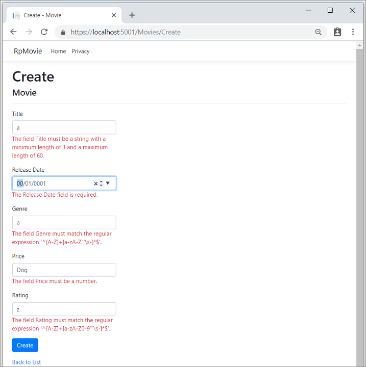

# Introduction to Razor Pages in ASP.NET Core


## 목차
- [Introduction to Razor Pages in ASP.NET Core](#introduction-to-razor-pages-in-aspnet-core)
  - [목차](#목차)
  - [전제 조건](#전제-조건)
  - [Razor Pages 프로젝트 생성](#razor-pages-프로젝트-생성)
  - [Razor Pages](#razor-pages)
  - [기본 양식 작성](#기본-양식-작성)
    - [홈 페이지](#홈-페이지)
    - [Edit.cshtml 파일](#editcshtml-파일)
  - [유효성 검사](#유효성-검사)
  - [CSS 격리](#css-격리)
  - [CSS 전처리기 지원](#css-전처리기-지원)
  - [CSS 격리 구성](#css-격리-구성)
    - [스코프 식별자 형식 사용자 지정](#스코프-식별자-형식-사용자-지정)
    - [정적 웹 자산의 기본 경로 변경](#정적-웹-자산의-기본-경로-변경)
    - [자동 번들링 비활성화](#자동-번들링-비활성화)
  - [Razor 클래스 라이브러리(RCL) 지원](#razor-클래스-라이브러리rcl-지원)
  - [OnGet 핸들러 폴백으로 HEAD 요청 처리](#onget-핸들러-폴백으로-head-요청-처리)
  - [XSRF/CSRF 및 Razor Pages](#xsrfcsrf-및-razor-pages)
  - [레이아웃, 부분, 템플릿, 및 태그 도우미를 사용한 Razor Pages](#레이아웃-부분-템플릿-및-태그-도우미를-사용한-razor-pages)
  - [Pages에 대한 URL 생성](#pages에-대한-url-생성)
  - [ViewData 속성](#viewdata-속성)
  - [TempData](#tempdata)
  - [페이지당 여러 핸들러](#페이지당-여러-핸들러)
  - [사용자 정의 라우트](#사용자-정의-라우트)
  - [JavaScript(JS) 파일의 동시 배치](#javascriptjs-파일의-동시-배치)
  - [고급 구성 및 설정](#고급-구성-및-설정)
    - [Razor Pages가 콘텐츠 루트에 있음을 지정](#razor-pages가-콘텐츠-루트에-있음을-지정)
    - [Razor Pages가 사용자 정의 루트 디렉터리에 있음을 지정](#razor-pages가-사용자-정의-루트-디렉터리에-있음을-지정)
  - [출처](#출처)
  - [다음](#다음)

---

Razor Pages는 컨트롤러와 뷰를 사용하는 것보다 페이지 중심의 시나리오 코딩을 더 쉽고 생산적으로 만들 수 있습니다.

Model-View-Controller 접근 방식을 사용하는 튜토리얼을 찾고 있다면 `ASP.NET Core MVC 시작하기`를 참조하세요.

이 문서는 Razor Pages에 대한 소개를 제공합니다. 단계별 튜토리얼이 아닙니다. 일부 섹션이 너무 어렵게 느껴진다면 `Razor Pages 시작하기`를 참조하세요. ASP.NET Core에 대한 개요는 `ASP.NET Core 소개`를 참조하세요.

## 전제 조건

* [Visual Studio Code](https://code.visualstudio.com/download)
* [Visual Studio Code용 C# (최신 버전)](https://marketplace.visualstudio.com/items?itemName=ms-dotnettools.csharp)
* [.NET 6.0 SDK](https://dotnet.microsoft.com/download/dotnet/6.0)

Visual Studio Code 지침은 프로젝트 생성과 같은 ASP.NET Core 개발 기능에 .NET CLI를 사용합니다. 이러한 지침은 macOS, Linux 또는 Windows와 모든 코드 편집기에서 따를 수 있습니다. Visual Studio Code 이외의 편집기를 사용하는 경우 약간의 변경이 필요할 수 있습니다.

---

<a name="rpvs17"></a>

## Razor Pages 프로젝트 생성

명령줄에서 `dotnet new webapp`을 실행하세요.

---

## Razor Pages

`Program.cs`에서 Razor Pages가 활성화됩니다:

```C#
var builder = WebApplication.CreateBuilder(args);

builder.Services.AddRazorPages();

var app = builder.Build();

if (!app.Environment.IsDevelopment())
{
    app.UseExceptionHandler("/Error");
    app.UseHsts();
}

app.UseHttpsRedirection();
app.UseStaticFiles();

app.UseRouting();

app.UseAuthorization();

app.MapRazorPages();

app.Run();
```

위의 코드에서:

* `AddRazorPages`는 앱에 Razor Pages 서비스를 추가합니다.
* `MapRazorPages`는 `IEndpointRouteBuilder`에 Razor Pages 엔드포인트를 추가합니다.

기본 페이지를 고려해보세요:
<a name="OnGet"></a>

```cshtml
@page

<h1>Hello, world!</h1>
<h2>The time on the server is @DateTime.Now</h2>
```

위의 코드는 ASP.NET Core 앱에서 컨트롤러와 뷰를 사용하는 `Razor 뷰 파일`과 매우 유사합니다. 다른 점은 `@page` 지시어입니다. `@page`는 파일을 MVC 액션으로 만들어 컨트롤러를 거치지 않고 직접 요청을 처리합니다. `@page`는 페이지에서 첫 번째 Razor 지시어여야 합니다. `@page`는 다른 `Razor` 구조의 동작에 영향을 미칩니다. Razor Pages 파일 이름은 `.cshtml` 접미사를 가집니다.

`PageModel` 클래스를 사용하는 유사한 페이지는 다음 두 파일에 표시됩니다. `Pages/Index2.cshtml` 파일:

```cshtml
@page
@using RazorPagesIntro.Pages
@model Index2Model

<h2>Separate page model</h2>
<p>
    @Model.Message
</p>
```

`Pages/Index2.cshtml.cs` 페이지 모델:

```C#
using Microsoft.AspNetCore.Mvc.RazorPages;
using Microsoft.Extensions.Logging;
using System;

namespace RazorPagesIntro.Pages
{
    public class Index2Model : PageModel
    {
        public string Message { get; private set; } = "PageModel in C#";

        public void OnGet()
        {
            Message += $" Server time is { DateTime.Now }";
        }
    }
}
```

관례에 따라, `PageModel` 클래스 파일은 `.cs`가 추가된 Razor Page 파일과 동일한 이름을 가집니다. 예를 들어, 앞의 Razor Page는 `Pages/Index2.cshtml`입니다. `PageModel` 클래스를 포함하는 파일 이름은 `Pages/Index2.cshtml.cs`입니다.

URL 경로의 페이지와 파일 시스템의 위치는 페이지의 위치에 따라 결정됩니다. 다음 표는 Razor Page 경로와 일치하는 URL을 보여줍니다:

| 파일 이름 및 경로         | 일치하는 URL  |
| ----------------- | ------------ |
| `/Pages/Index.cshtml` | `/` 또는 `/Index` |
| `/Pages/Contact.cshtml` | `/Contact` |
| `/Pages/Store/Contact.cshtml` | `/Store/Contact` |
| `/Pages/Store/Index.cshtml` | `/Store` 또는 `/Store/Index` |

참고 사항:

* 런타임은 기본적으로 *Pages* 폴더에서 Razor Pages 파일을 찾습니다.
* URL에 페이지가 포함되지 않은 경우 기본 페이지는 `Index`입니다.

## 기본 양식 작성

Razor Pages는 웹 브라우저를 사용할 때 일반적으로 사용하는 패턴을 쉽게 구현할 수 있도록 설계되었습니다. `모델 바인딩`, `태그 도우미`, 및 HTML 도우미는 Razor Page 클래스에 정의된 속성과 함께 작동합니다. `Contact` 모델을 위한 기본 "문의하기" 양식을 구현하는 페이지를 고려해보세요:

이 문서의 샘플에서 `DbContext`는 [Program.cs](https://github.com/dotnet/AspNetCore.Docs/blob/main/aspnetcore/razor-pages/index/6.0sample/RazorPagesContacts/Program.cs#L11-L12) 파일에서 초기화됩니다.

메모리 내 데이터베이스에는 `Microsoft.EntityFrameworkCore.InMemory` NuGet 패키지가 필요합니다.

```C#
using Microsoft.EntityFrameworkCore;
using RazorPagesContacts.Data;
var builder = WebApplication.CreateBuilder(args);

builder.Services.AddRazorPages();

builder.Services.AddDbContext<CustomerDbContext>(options =>
    options.UseInMemoryDatabase("name"));

var app = builder.Build();

if (!app.Environment.IsDevelopment())
{
    app.UseExceptionHandler("/Error");
    app.UseHsts();
}

app.UseHttpsRedirection();
app.UseStaticFiles();

app.UseRouting();

app.UseAuthorization();

app.MapRazorPages();

app.Run();
```

데이터 모델:

```C#
using System.ComponentModel.DataAnnotations;

namespace RazorPagesContacts.Models
{
    public class Customer
    {
        public int Id { get; set; }

        [Required, StringLength(10)]
        public string? Name { get; set; }
    }
}
```

db 컨텍스트:

```C#
using Microsoft.EntityFrameworkCore;

namespace RazorPagesContacts.Data
{
    public class CustomerDbContext : DbContext
    {
        public CustomerDbContext (DbContextOptions<CustomerDbContext> options)
            : base(options)
        {
        }

        public DbSet<RazorPagesContacts.Models.Customer> Customer => Set<RazorPagesContacts.Models.Customer>();
    }
}
```

`Pages/Customers/Create.cshtml` 뷰 파일:

```cshtml
@page
@model RazorPagesContacts.Pages.Customers.CreateModel
@addTagHelper *, Microsoft.AspNetCore.Mvc.TagHelpers

<p>Enter a customer name:</p>

<form method="post">
    Name:
    <input asp-for="Customer!.Name" />
    <input type="submit" />
</form>
```

`Pages/Customers/Create.cshtml.cs` 페이지 모델:

```C#
public class CreateModel : PageModel
{
    private readonly Data.CustomerDbContext _context;

    public CreateModel(Data.CustomerDbContext context)
    {
        _context = context;
    }

    public IActionResult OnGet()
    {
        return Page();
    }

    [BindProperty]
    public Customer? Customer { get; set; }

    public async Task<IActionResult> OnPostAsync()
    {
        if (!ModelState.IsValid)
        {
            return Page();
        }

        if (Customer != null) _context.Customer.Add(Customer);
        await _context.SaveChangesAsync();

        return RedirectToPage("./Index");
    }
}
```

관례에 따라 `PageModel` 클래스는 `<PageName>Model`로 명명되며 페이지와 동일한 네임스페이스에 있습니다.

`PageModel` 클래스는 페이지의 로직을 프레젠테이션과 분리할 수 있도록 합니다. 페이지에 전송된 요청을 처리하는 페이지 핸들러와 페이지를 렌더링하는 데 사용되는 데이터를 정의합니다. 이 분리를 통해:

* `종속성 주입`을 통한 페이지 종속성 관리.
* `단위 테스트`

페이지에는 `POST` 요청 시 실행되는 `OnPostAsync` *핸들러 메서드*가 있습니다(사용자가 양식을 게시할 때). 모든 HTTP 동사에 대한 핸들러 메서드를 추가할 수 있습니다. 가장 일반적인 핸들러는 다음과 같습니다:

* 페이지에 필요한 상태를 초기화하기 위한 `OnGet`. 앞의 코드에서 `OnGet` 메서드는 `CreateModel.cshtml` Razor Page를 표시합니다.
* 양식 제출을 처리하기 위한 `OnPost`.

`Async` 접미사는 선택 사항이지만 비동기 함수에 대한 관례로 자주 사용됩니다. 앞의 코드는 Razor Pages에 일반적입니다.

ASP.NET 앱에서 컨트롤러와 뷰를 사용하는 경우:

* 앞의 예제에서 `OnPostAsync` 코드는 일반적인 컨트롤러 코드와 유사합니다.
* 대부분의 MVC 기본 요소는 `모델 바인딩`, `유효성 검사`, 및 액션 결과와 같은 컨트롤러 및 Razor Pages에서 동일하게 작동합니다.

앞의 `OnPostAsync` 메서드:

```C#
[BindProperty]
public Customer? Customer { get; set; }

public async Task<IActionResult> OnPostAsync()
{
    if (!ModelState.IsValid)
    {
        return Page();
    }

    if (Customer != null) _context.Customer.Add(Customer);
    await _context.SaveChangesAsync();

    return RedirectToPage("./Index");
}
```

`OnPostAsync`의 기본 흐름:

유효성 검사 오류를 확인합니다.

* 오류가 없는 경우 데이터를 저장하고 리디렉션합니다.
* 오류가 있는 경우 유효성 검사 메시지와 함께 페이지를 다시 표시합니다. 많은 경우 유효성 검사 오류는 클라이언트에서 감지되어 서버에 제출되지 않습니다.

`Pages/Customers/Create.cshtml` 뷰 파일:

```cshtml
@page
@model RazorPagesContacts.Pages.Customers.CreateModel
@addTagHelper *, Microsoft.AspNetCore.Mvc.TagHelpers

<p>Enter a customer name:</p>

<form method="post">
    Name:
    <input asp-for="Customer!.Name" />
    <input type="submit" />
</form>
```

`Pages/Customers/Create.cshtml`에서 렌더링된 HTML:

```html
<p>Enter a customer name:</p>

<form method="post">
    Name:
    <input type="text" data-val="true"
           data-val-length="The field Name must be a string with a maximum length of 10."
           data-val-length-max="10" data-val-required="The Name field is required."
           id="Customer_Name" maxlength="10" name="Customer.Name" value="" />
    <input type="submit" />
    <input name="__RequestVerificationToken" type="hidden"
           value="<Antiforgery token here>" />
</form>
```

위의 코드에서, 양식을 게시하는 경우:

* 유효한 데이터가 있는 경우:

  * `OnPostAsync` 핸들러 메서드는 `RedirectToPage` 도우미 메서드를 호출합니다. `RedirectToPage`는 `RedirectToPageResult` 인스턴스를 반환합니다. `RedirectToPage`:

    * 액션 결과입니다.
    * 컨트롤러와 뷰에서 사용되는 `RedirectToAction` 또는 `RedirectToRoute`와 유사합니다.
    * 페이지에 맞게 사용자 지정되었습니다. 앞의 예제에서는 루트 인덱스 페이지(`/Index`)로 리디렉션합니다. `RedirectToPage`는 `페이지의 URL 생성` 섹션에서 자세히 설명합니다.

* 서버로 전달된 유효성 검사 오류가 있는 경우:

  * `OnPostAsync` 핸들러 메서드는 `Page` 도우미 메서드를 호출합니다. `Page`는 `PageResult` 인스턴스를 반환합니다. `Page`를 반환하는 것은 컨트롤러의 액션이 `View`를 반환하는 것과 유사합니다. `PageResult`는 핸들러 메서드의 기본 반환 유형입니다. 반환 유형이 `void`인 핸들러 메서드는 페이지를 렌더링합니다.
  * 앞의 예제에서는 값 없이 양식을 게시하면 `ModelState.IsValid`가 false를 반환합니다. 이 샘플에서는 클라이언트에 유효성 검사 오류가 표시되지 않습니다. 유효성 검사 오류 처리에 대해서는 이 문서에서 나중에 설명합니다.

    ```C#
    [BindProperty]
    public Customer? Customer { get; set; }

    public async Task<IActionResult> OnPostAsync()
    {
        if (!ModelState.IsValid)
        {
            return Page();
        }

        if (Customer != null) _context.Customer.Add(Customer);
        await _context.SaveChangesAsync();

        return RedirectToPage("./Index");
    }
    ```

* 클라이언트 측 유효성 검사로 감지된 유효성 검사 오류가 있는 경우:

  * 데이터가 서버에 게시되지 않습니다.
  * 클라이언트 측 유효성 검사는 이 문서에서 나중에 설명합니다.

`Customer` 속성은 `[BindProperty]` 속성을 사용하여 모델 바인딩에 참여합니다:

```C#
[BindProperty]
public Customer? Customer { get; set; }

public async Task<IActionResult> OnPostAsync()
{
    if (!ModelState.IsValid)
    {
        return Page();
    }

    if (Customer != null) _context.Customer.Add(Customer);
    await _context.SaveChangesAsync();

    return RedirectToPage("./Index");
}
```

`[BindProperty]`는 클라이언트가 변경해서는 안 되는 속성을 포함하는 모델에는 사용하면 **안 됩니다**. 자세한 내용은 [오버포스팅](https://learn.microsoft.com/en-us/aspnet/core/data/ef-rp/crud?view=aspnetcore-8.0#overposting)을 참조하세요.

Razor Pages는 기본적으로 `GET`이 아닌 동사와 속성을 바인딩합니다. 속성에 바인딩하면 HTTP 데이터를 모델 유형으로 변환하는 코드를 작성할 필요가 없습니다. 바인딩을 사용하면 동일한 속성을 사용하여 폼 필드를 렌더링(`input asp-for="Customer.Name"`)하고 입력을 받을 수 있습니다.

> [!WARNING]
> 보안상의 이유로 페이지 모델 속성에 `GET` 요청 데이터를 바인딩하려면 명시적으로 동의해야 합니다. 사용자 입력을 속성에 매핑하기 전에 검증하세요. 쿼리 문자열 또는 경로 값을 사용하는 시나리오를 처리할 때 `GET` 바인딩이 유용합니다.
>
> `GET` 요청에서 속성을 바인딩하려면 `[BindProperty]` 속성의 `SupportsGet` 속성을 `true`로 설정하세요:
>
> ```csharp
> [BindProperty(SupportsGet = true)]
> ```
>
> 자세한 내용은 [ASP.NET Core 커뮤니티 스탠드업: Bind on GET 토론 (YouTube)](https://www.youtube.com/watch?v=p7iHB9V-KVU&feature=youtu.be&t=54m27s)을 참조하세요.

`Pages/Customers/Create.cshtml` 뷰 파일을 검토해보세요:

```cshtml
@page
@model RazorPagesContacts.Pages.Customers.CreateModel
@addTagHelper *, Microsoft.AspNetCore.Mvc.TagHelpers

<p>Enter a customer name:</p>

<form method="post">
    Name:
    <input asp-for="Customer!.Name" />
    <input type="submit" />
</form>
```

* 앞의 코드에서 `input 태그 도우미` `<input asp-for="Customer.Name" />`는 HTML `<input>` 요소를 `Customer.Name` 모델 표현식에 바인딩합니다.
* `@addTagHelper`는 태그 도우미를 사용할 수 있게 합니다.

### 홈 페이지

`Index.cshtml`은 홈 페이지입니다:

```cshtml
@page
@model RazorPagesContacts.Pages.Customers.IndexModel
@addTagHelper *, Microsoft.AspNetCore.Mvc.TagHelpers

<h1>Contacts home page</h1>
<form method="post">
    <table class="table">
        <thead>
            <tr>
                <th>ID</th>
                <th>Name</th>
                <th></th>
            </tr>
        </thead>
        <tbody>
        @if (Model.Customers != null)
        {
            foreach (var contact in Model.Customers)
            {
                <tr>
                    <td> @contact.Id </td>
                    <td>@contact.Name</td>
                    <td>
                        <!-- <snippet_Edit> -->
                        <a asp-page="./Edit" asp-route-id="@contact.Id">Edit</a> |
                        <!-- </snippet_Edit> -->
                        <!-- <snippet_Delete> -->
                        <button type="submit" asp-page-handler="delete" asp-route-id="@contact.Id">delete</button>
                        <!-- </snippet_Delete> -->
                    </td>
                </tr>
            }
        }
        </tbody>
    </table>
    <a asp-page="Create">Create New</a>
</form>
```

관련된 `PageModel` 클래스(`Index.cshtml.cs`):

```C#
public class IndexModel : PageModel
{
    private readonly Data.CustomerDbContext _context;
    public IndexModel(Data.CustomerDbContext context)
    {
        _context = context;
    }

    public IList<Customer>? Customers { get; set; }

    public async Task OnGetAsync()
    {
        Customers = await _context.Customer.ToListAsync();
    }

    public async Task<IActionResult> OnPostDeleteAsync(int id)
    {
        var contact = await _context.Customer.FindAsync(id);

        if (contact != null)
        {
            _context.Customer.Remove(contact);
            await _context.SaveChangesAsync();
        }

        return RedirectToPage();
    }
}
```

`Index.cshtml` 파일에는 다음과 같은 마크업이 포함되어 있습니다:

```cshtml
<a asp-page="./Edit" asp-route-id="@contact.Id">Edit</a> |
```

`<a /a>` `앵커 태그 도우미`는 `asp-route-{value}` 속성을 사용하여 편집 페이지로 링크를 생성합니다. 링크에는 연락처 ID가 포함된 라우트 데이터가 포함됩니다. 예를 들어, `https://localhost:5001/Edit/1`입니다. `태그 도우미`는 서버 측 코드가 Razor 파일에서 HTML 요소를 생성하고 렌더링하는 데 참여할 수 있도록 합니다.

`Index.cshtml` 파일에는 각 고객 연락처에 대한 삭제 버튼을 생성하는 마크업이 포함되어 있습니다:

```cshtml
<button type="submit" asp-page-handler="delete" asp-route-id="@contact.Id">delete</button>
```

렌더링된 HTML:

```html
<button type="submit" formaction="/Customers?id=1&amp;handler=delete">delete</button>
```

삭제 버튼이 HTML로 렌더링될 때, 그 [formaction](https://developer.mozilla.org/docs/Web/HTML/Element/button#attr-formaction)에는 다음 매개변수가 포함됩니다:

* `asp-route-id` 속성으로 지정된 고객 연락처 ID.
* `asp-page-handler` 속성으로 지정된 `handler`.

버튼이 선택되면 폼 `POST` 요청이 서버로 전송됩니다. 관례에 따라, `handler` 매개변수의 값에 따라 핸들러 메서드 이름이 선택됩니다. 이 예제에서는 `handler`가 `delete`이므로 `OnPostDeleteAsync` 핸들러 메서드가 `POST` 요청을 처리하는 데 사용됩니다. `asp-page-handler`가 `remove`와 같은 다른 값으로 설정된 경우 `OnPostRemoveAsync`라는 핸들러 메서드가 선택됩니다.

```C#
public async Task<IActionResult> OnPostDeleteAsync(int id)
{
    var contact = await _context.Customer.FindAsync(id);

    if (contact != null)
    {
        _context.Customer.Remove(contact);
        await _context.SaveChangesAsync();
    }

    return RedirectToPage();
}
```

`OnPostDeleteAsync` 메서드:

* 쿼리 문자열에서 `id`를 가져옵니다.
* `FindAsync`를 사용하여 데이터베이스에서 고객 연락처를 쿼리합니다.
* 고객 연락처가 발견되면 제거하고 데이터베이스를 업데이트합니다.
* `RedirectToPage`를 호출하여 루트 인덱스 페이지(`/Index`)로 리디렉션합니다.

### Edit.cshtml 파일

```cshtml
@page "{id:int}"
@model RazorPagesContacts.Pages.Customers.EditModel

@{
    ViewData["Title"] = "Edit";
}

<h1>Edit</h1>

<h4>Customer</h4>
<hr />
<div class="row">
    <div class="col-md-4">
        <form method="post">
            <div asp-validation-summary="ModelOnly" class="text-danger"></div>
            <input type="hidden" asp-for="Customer!.Id" />
            <div class="form-group">
                <label asp-for="Customer!.Name" class="control-label"></label>
                <input asp-for="Customer!.Name" class="form-control" />
                <span asp-validation-for="Customer!.Name" class="text-danger"></span>
            </div>
            <div class="form-group">
                <input type="submit" value="Save" class="btn btn-primary" />
            </div>
        </form>
    </div>
</div>

<div>
    <a asp-page="./Index">Back to List</a>
</div>

@section Scripts {
    @{await Html.RenderPartialAsync("_ValidationScriptsPartial");}
}
```

첫 번째 줄에는 `@page "{id:int}"` 지시어가 포함되어 있습니다. 라우팅 제약 조건 `"{id:int}"`는 페이지에 `int` 라우트 데이터를 포함한 요청을 허용하도록 지정합니다. 페이지에 대한 요청에 `int`로 변환될 수 있는 라우트 데이터가 포함되지 않은 경우 런타임은 HTTP 404(찾을 수 없음) 오류를 반환합니다. ID를 선택 사항으로 만들려면 라우트 제약 조건에 `?`를 추가합니다:

 ```cshtml
@page "{id:int?}"
```

`Edit.cshtml.cs` 파일:

```C#
public class EditModel : PageModel
{
    private readonly RazorPagesContacts.Data.CustomerDbContext _context;

    public EditModel(RazorPagesContacts.Data.CustomerDbContext context)
    {
        _context = context;
    }

    [BindProperty]
    public Customer? Customer { get; set; }

    public async Task<IActionResult> OnGetAsync(int? id)
    {
        if (id == null)
        {
            return NotFound();
        }

        Customer = await _context.Customer.FirstOrDefaultAsync(m => m.Id == id);
        
        if (Customer == null)
        {
            return NotFound();
        }
        return Page();
    }

    // To protect from overposting attacks, enable the specific properties you want to bind to.
    // For more details, see https://aka.ms/RazorPagesCRUD.
    public async Task<IActionResult> OnPostAsync()
    {
        if (!ModelState.IsValid)
        {
            return Page();
        }

        if (Customer != null)
        {
            _context.Attach(Customer).State = EntityState.Modified;

            try
            {
                await _context.SaveChangesAsync();
            }
            catch (DbUpdateConcurrencyException)
            {
                if (!CustomerExists(Customer.Id))
                {
                    return NotFound();
                }
                else
                {
                    throw;
                }
            }
        }

        return RedirectToPage("./Index");
    }

    private bool CustomerExists(int id)
    {
        return _context.Customer.Any(e => e.Id == id);
    }
}
```

## 유효성 검사

유효성 검사 규칙은 다음과 같습니다:

* 모델 클래스에 선언적으로 지정됩니다.
* 앱의 모든 위치에서 강제 적용됩니다.

`System.ComponentModel.DataAnnotations` 네임스페이스는 클래스 또는 속성에 선언적으로 적용되는 내장된 유효성 검사 속성 세트를 제공합니다. DataAnnotations에는 형식 지정만 하고 유효성 검사를 제공하지 않는 `[DataType]`과 같은 형식 지정 속성도 포함되어 있습니다.

`Customer` 모델을 고려해보세요:

```C#
using System.ComponentModel.DataAnnotations;

namespace RazorPagesContacts.Models
{
    public class Customer
    {
        public int Id { get; set; }

        [Required, StringLength(10)]
        public string? Name { get; set; }
    }
}
```

다음 `Create.cshtml` 뷰 파일을 사용하여:

```cshtml
@page
@model RazorPagesContacts.Pages.Customers.CreateModel
@addTagHelper *, Microsoft.AspNetCore.Mvc.TagHelpers

<p>Validation: customer name:</p>

<form method="post">
    <div asp-validation-summary="ModelOnly"></div>
    <span asp-validation-for="Customer!.Name"></span>
    Name:
    <input asp-for="Customer!.Name" />
    <input type="submit" />
</form>

<script src="~/lib/jquery/dist/jquery.js"></script>
<script src="~/lib/jquery-validation/dist/jquery.validate.js"></script>
<script src="~/lib/jquery-validation-unobtrusive/jquery.validate.unobtrusive.js"></script>
```

앞의 코드는 다음을 포함합니다:

* jQuery 및 jQuery 유효성 검사 스크립트를 포함합니다.
* `<div />` 및 `<span />` 태그 도우미를 사용하여:

  * 클라이언트 측 유효성 검사를 사용합니다.
  * 유효성 검사 오류 렌더링을 사용합니다.

* 다음 HTML을 생성합니다:

    ```html
    <p>Enter a customer name:</p>

    <form method="post">
        Name:
        <input type="text" data-val="true"
            data-val-length="The field Name must be a string with a maximum length of 10."
            data-val-length-max="10" data-val-required="The Name field is required."
            id="Customer_Name" maxlength="10" name="Customer.Name" value="" />
        <input type="submit" />
        <input name="__RequestVerificationToken" type="hidden"
            value="<Antiforgery token here>" />
    </form>

    <script src="/lib/jquery/dist/jquery.js"></script>
    <script src="/lib/jquery-validation/dist/jquery.validate.js"></script>
    <script src="/lib/jquery-validation-unobtrusive/jquery.validate.unobtrusive.js"></script>
    ```

이름 값을 입력하지 않고 Create 양식을 게시하면 양식에 "The Name field is required." 오류 메시지가 표시됩니다. 클라이언트에서 JavaScript가 활성화된 경우 브라우저는 서버에 게시하지 않고 오류를 표시합니다.

`[StringLength(10)]` 속성은 렌더링된 HTML에 `data-val-length-max="10"`을 생성합니다. `data-val-length-max`는 지정된 최대 길이를 초과하는 브라우저 입력을 방지합니다. [Fiddler](https://www.telerik.com/fiddler)와 같은 도구를 사용하여 게시를 편집하고 다시 재생하면:

* 이름이 10자를 초과하는 경우.
* 오류 메시지 "The field Name must be a string with a maximum length of 10."이 반환됩니다.

`Movie` 모델을 고려해보세요:

```C#
using System;
using System.ComponentModel.DataAnnotations;
using System.ComponentModel.DataAnnotations.Schema;

namespace RazorPagesMovie.Models
{
    public class Movie
    {
        public int ID { get; set; }

        [StringLength(60, MinimumLength = 3)]
        [Required]
        public string Title { get; set; }

        [Display(Name = "Release Date")]
        [DataType(DataType.Date)]
        public DateTime ReleaseDate { get; set; }

        [Range(1, 100)]
        [DataType(DataType.Currency)]
        [Column(TypeName = "decimal(18, 2)")]
        public decimal Price { get; set; }

        [RegularExpression(@"^[A-Z]+[a-zA-Z\s]*$")]
        [Required]
        [StringLength(30)]
        public string Genre { get; set; }

        [RegularExpression(@"^[A-Z]+[a-zA-Z0-9""'\s-]*$")]
        [StringLength(5)]
        [Required]
        public string Rating { get; set; }
    }
}
```

유효성 검사 속성은 모델 속성에 적용되어야 하는 동작을 지정합니다:

* `Required` 및 `MinimumLength` 속성은 속성에 값이 있어야 함을 나타내지만, 공백을 입력하여 이 유효성 검사를 통과할 수는 없습니다.
* `RegularExpression` 속성은 입력할 수 있는 문자를 제한하는 데 사용됩니다. 앞의 코드에서 "Genre":

  * 문자만 사용해야 합니다.
  * 첫 번째 문자는 대문자여야 합니다. 공백, 숫자, 특수 문자는 허용되지 않습니다.

* `RegularExpression` "Rating":

  * 첫 번째 문자는 대문자여야 합니다.
  * 이후 공백에는 특수 문자와 숫자가 허용됩니다. "PG-13"은 유효한 평점이지만 "Genre"에서는 실패합니다.

* `Range` 속성은 값을 지정된 범위 내로 제한합니다.
* `StringLength` 속성은 문자열 속성의 최대 길이와 선택적으로 최소 길이를 설정합니다.
* 값 유형(예: `decimal`, `int`, `float`, `DateTime`)은 본질적으로 필수이며 `[Required]` 속성이 필요하지 않습니다.

`Movie` 모델의 Create 페이지는 유효하지 않은 값으로 오류를 표시합니다:



자세한 내용은 다음을 참조하세요:

* [영화 앱에 유효성 검사 추가](https://learn.microsoft.com/en-us/aspnet/core/tutorials/razor-pages/validation?view=aspnetcore-8.0)
* [ASP.NET Core의 모델 유효성 검사](https://learn.microsoft.com/en-us/aspnet/core/mvc/models/validation?view=aspnetcore-8.0).

## CSS 격리

개별 페이지, 뷰 및 구성 요소에 CSS 스타일을 격리하여 다음과 같은 문제를 줄이거나 피할 수 있습니다:

* 유지 관리가 어려운 전역 스타일에 대한 종속성.
* 중첩된 콘텐츠에서의 스타일 충돌.

페이지 또는 뷰에 *스코프된 CSS 파일*을 추가하려면 `.cshtml` 파일과 동일한 이름의 `.cshtml.css` 파일에 CSS 스타일을 배치하세요. 다음 예제에서는 `Index.cshtml.css` 파일이 `Index.cshtml` 페이지 또는 뷰에만 적용되는 CSS 스타일을 제공합니다.

`Pages/Index.cshtml.css`(Razor Pages) 또는 `Views/Index.cshtml.css`(MVC):

```css
h1 {
    color: red;
}
```

CSS 격리는 빌드 시간에 발생합니다. 프레임워크는 앱의 페이지 또는 뷰가 렌더링하는 마크업에 맞게 CSS 선택자를 다시 작성합니다. 다시 작성된 CSS 스타일은 `{APP ASSEMBLY}.styles.css`라는 정적 자산으로 번들링되고 생성됩니다. `{APP ASSEMBLY}` 플레이스홀더는 프로젝트의 어셈블리 이름입니다. 번들링된 CSS 스타일에 대한 링크가 앱의 레이아웃에 배치됩니다.

앱의 `Pages/Shared/_Layout.cshtml`(Razor Pages) 또는 `Views/Shared/_Layout.cshtml`(MVC)의 `<head>` 내용에 번들링된 CSS 스타일에 대한 링크를 추가하거나 확인합니다:

```html
<link rel="stylesheet" href="~/{APP ASSEMBLY}.styles.css" />
```

다음 예제에서는 앱의 어셈블리 이름이 `WebApp`입니다:

```html
<link rel="stylesheet" href="WebApp.styles.css" />
```

스코프된 CSS 파일에 정의된 스타일은 일치하는 파일의 렌더링된 출력에만 적용됩니다. 이전 예제에서는 다른 곳에 정의된 `h1` CSS 선언이 `Index`의 헤딩 스타일과 충돌하지 않습니다. CSS 스타일 캐스케이딩 및 상속 규칙은 스코프된 CSS 파일에도 적용됩니다. 예를 들어, `Index.cshtml` 파일의 `<h1>` 요소에 직접 적용된 스타일은 `Index.cshtml.css`의 스코프된 CSS 파일의 스타일을 덮어씁니다.

> [!NOTE]
> 번들링이 발생할 때 CSS 스타일 격리를 보장하기 위해 Razor 코드 블록에서 CSS를 가져오는 것은 지원되지 않습니다.
>
> CSS 격리는 HTML 요소에만 적용됩니다. 태그 헬퍼에 대한 CSS 격리는 지원되지 않습니다.

번들링된 CSS 파일 내에서 각 페이지, 뷰 또는 Razor 구성 요소는 `b-{STRING}` 형식의 스코프 식별자와 연결됩니다. 여기서 `{STRING}` 플레이스홀더는 프레임워크가 생성한 10자 문자열입니다. 다음 예제는 Razor Pages 앱의 `Index` 페이지에서 `<h1>` 요소에 대한 스타일을 제공합니다:

```css
/* /Pages/Index.cshtml.rz.scp.css */
h1[b-3xxtam6d07] {
    color: red;
}
```

CSS 스타일이 번들링된 파일에서 적용되는 `Index` 페이지에서는 스코프 식별자가 HTML 속성으로 추가됩니다:

```html
<h1 b-3xxtam6d07>
```

식별자는 앱에 고유합니다. 빌드 시간에 프로젝트 번들은 `{STATIC WEB ASSETS BASE PATH}/Project.lib.scp.css` 규칙에 따라 생성됩니다. 여기서 `{STATIC WEB ASSETS BASE PATH}` 플레이스홀더는 정적 웹 자산 기본 경로입니다.

다른 프로젝트(예: NuGet 패키지 또는 Razor 클래스 라이브러리)를 사용하는 경우, 번들링된 파일은 다음과 같은 동작을 합니다:

* CSS 가져오기를 사용하여 스타일을 참조합니다.
* 스타일을 사용하는 앱의 정적 웹 자산으로 게시되지 않습니다.

## CSS 전처리기 지원

CSS 전처리기는 변수, 중첩, 모듈, 믹스인 및 상속과 같은 기능을 사용하여 CSS 개발을 개선하는 데 유용합니다. CSS 격리는 Sass 또는 Less와 같은 CSS 전처리기를 기본적으로 지원하지 않지만, 프레임워크가 빌드 프로세스 중에 CSS 선택자를 다시 작성하기 전에 전처리기 컴파일이 발생하면 CSS 전처리기를 쉽게 통합할 수 있습니다. 예를 들어 Visual Studio를 사용하는 경우, Visual Studio Task Runner Explorer에서 기존 전처리기 컴파일을 **빌드 전** 작업으로 구성합니다.

[`AspNetCore.SassCompiler`](https://www.nuget.org/packages/AspNetCore.SassCompiler#readme-body-tab)와 같은 많은 타사 NuGet 패키지는 빌드 프로세스 시작 시 SASS/SCSS 파일을 컴파일하여 CSS 격리 전에 처리하며, 추가 구성은 필요하지 않습니다.

## CSS 격리 구성

CSS 격리는 기존 도구나 워크플로에 대한 종속성과 같은 고급 시나리오를 위한 구성을 허용합니다.

### 스코프 식별자 형식 사용자 지정

*이 섹션의 `{Pages|Views}` 플레이스홀더는 Razor Pages 앱의 경우 `Pages` 또는 MVC 앱의 경우 `Views`입니다.*

기본적으로 스코프 식별자는 `b-{STRING}` 형식을 사용합니다. 여기서 `{STRING}` 플레이스홀더는 프레임워크가 생성한 10자 문자열입니다. 스코프 식별자 형식을 사용자 지정하려면 프로젝트 파일을 원하는 패턴으로 업데이트합니다:

```xml
<ItemGroup>
  <None Update="{Pages|Views}/Index.cshtml.css" CssScope="custom-scope-identifier" />
</ItemGroup>
```

위의 예제에서 생성된 `Index.cshtml.css`의 CSS는 스코프 식별자를 `b-{STRING}`에서 `custom-scope-identifier`로 변경합니다.

스코프 식별자를 사용하여 스코프된 CSS 파일의 상속을 구현할 수 있습니다. 다음 프로젝트 파일 예제에서는 `BaseView.cshtml.css` 파일이 뷰 전반에 걸쳐 공통 스타일을 포함합니다. `DerivedView.cshtml.css` 파일은 이러한 스타일을 상속받습니다.

```xml
<ItemGroup>
  <None Update="{Pages|Views}/BaseView.cshtml.css" CssScope="custom-scope-identifier" />
  <None Update="{Pages|Views}/DerivedView.cshtml.css" CssScope="custom-scope-identifier" />
</ItemGroup>
```

와일드카드(`*`) 연산자를 사용하여 여러 파일 간에 스코프 식별자를 공유합니다:

```xml
<ItemGroup>
  <None Update="{Pages|Views}/*.cshtml.css" CssScope="custom-scope-identifier" />
</ItemGroup>
```

### 정적 웹 자산의 기본 경로 변경

스코프된 CSS 파일은 앱의 루트에 생성됩니다. 프로젝트 파일에서 `StaticWebAssetBasePath` 속성을 사용하여 기본 경로를 변경합니다. 다음 예제에서는 스코프된 CSS 파일과 앱의 나머지 자산을 `_content` 경로에 배치합니다:

```xml
<PropertyGroup>
  <StaticWebAssetBasePath>_content/$(PackageId)</StaticWebAssetBasePath>
</PropertyGroup>
```

### 자동 번들링 비활성화

프레임워크가 런타임에 스코프된 파일을 게시하고 로드하는 방법을 옵트아웃하려면 `DisableScopedCssBundling` 속성을 사용합니다. 이 속성을 사용할 때 다른 도구 또는 프로세스는 `obj` 디렉터리의 격리된 CSS 파일을 가져와 런타임에 게시하고 로드할 책임이 있습니다:

```xml
<PropertyGroup>
  <DisableScopedCssBundling>true</DisableScopedCssBundling>
</PropertyGroup>
```

## Razor 클래스 라이브러리(RCL) 지원

`Razor 클래스 라이브러리(RCL)`이 격리된 스타일을 제공하는 경우, `<link>` 태그의 `href` 속성은 `{STATIC WEB ASSET BASE PATH}/{PACKAGE ID}.bundle.scp.css`를 가리킵니다. 여기서 플레이스홀더는 다음과 같습니다:

* `{STATIC WEB ASSET BASE PATH}`: 정적 웹 자산 기본 경로.
* `{PACKAGE ID}`: 라이브러리의 패키지 식별자. 프로젝트 파일에 패키지 식별자가 지정되지 않은 경우 패키지 식별자는 기본적으로 프로젝트의 어셈블리 이름입니다.

다음 예제에서:

* 정적 웹 자산 기본 경로는 `_content/ClassLib`입니다.
* 클래스 라이브러리의 어셈블리 이름은 `ClassLib`입니다.

`Pages/Shared/_Layout.cshtml`(Razor Pages) 또는 `Views/Shared/_Layout.cshtml`(MVC):

```html
<link href="_content/ClassLib/ClassLib.bundle.scp.css" rel="stylesheet">
```


## OnGet 핸들러 폴백으로 HEAD 요청 처리

`HEAD` 요청은 특정 리소스의 헤더를 검색할 수 있습니다. `GET` 요청과 달리 `HEAD` 요청은 응답 본문을 반환하지 않습니다.

보통, `HEAD` 요청에 대해 `OnHead` 핸들러가 생성되고 호출됩니다:

```C#
public void OnHead()
{
    HttpContext.Response.Headers.Add("Head Test", "Handled by OnHead!");
}
```

Razor Pages는 `OnHead` 핸들러가 정의되지 않은 경우 `OnGet` 핸들러를 호출합니다.

<a name="xsrf"></a>

## XSRF/CSRF 및 Razor Pages

Razor Pages는 Antiforgery 유효성 검사로 보호됩니다. FormTagHelper는 HTML 양식 요소에 antiforgery 토큰을 삽입합니다.

<a name="layout"></a>

## 레이아웃, 부분, 템플릿, 및 태그 도우미를 사용한 Razor Pages

페이지는 Razor 뷰 엔진의 모든 기능을 사용할 수 있습니다. 레이아웃, 부분, 템플릿, 태그 도우미, `_ViewStart.cshtml`, 및 `_ViewImports.cshtml`은 기존 Razor 뷰와 동일한 방식으로 작동합니다.

이러한 기능을 활용하여 이 페이지를 정리해 보겠습니다.

레이아웃 페이지를 `Pages/Shared/_Layout.cshtml`에 추가하세요:

```cshtml
<!DOCTYPE html>
<html>
<head>
    <title>RP Sample</title>
    <link rel="stylesheet" href="~/lib/bootstrap/dist/css/bootstrap.css" />
</head>
<body>
    <a asp-page="/Index">Home</a>
    <a asp-page="/Customers/Create">Create</a>
    <a asp-page="/Customers/Index">Customers</a> <br />

    @RenderBody()
    <script src="~/lib/jquery/dist/jquery.js"></script>
    <script src="~/lib/jquery-validation/dist/jquery.validate.js"></script>
    <script src="~/lib/jquery-validation-unobtrusive/jquery.validate.unobtrusive.js"></script>
</body>
</html>
```

레이아웃:

* 각 페이지의 레이아웃을 제어합니다(페이지가 레이아웃을 제외하지 않는 한).
* JavaScript 및 스타일시트와 같은 HTML 구조를 가져옵니다.
* Razor 페이지의 내용은 `@RenderBody()`가 호출되는 위치에 렌더링됩니다.

자세한 내용은 `레이아웃 페이지`를 참조하세요.

레이아웃 속성은 `Pages/_ViewStart.cshtml`에 설정됩니다:

```cshtml
@{
    Layout = "_Layout";
}
```

레이아웃은 *Pages/Shared* 폴더에 있습니다. 페이지는 현재 페이지와 동일한 폴더에서 계층적으로 다른 뷰(레이아웃, 템플릿, 부분)를 찾습니다. *Pages* 폴더 아래의 모든 Razor 페이지에서 *Pages/Shared* 폴더에 있는 레이아웃을 사용할 수 있습니다.

레이아웃 파일은 *Pages/Shared* 폴더에 있어야 합니다.

레이아웃 파일을 *Views/Shared* 폴더에 넣지 않는 것이 좋습니다. *Views/Shared*는 MVC 뷰 패턴입니다. Razor Pages는 경로 규칙이 아닌 폴더 계층 구조를 사용하도록 설계되었습니다.

Razor Page에서 뷰 검색은 *Pages* 폴더를 포함합니다. MVC 컨트롤러 및 기존 Razor 뷰와 함께 사용하는 레이아웃, 템플릿, 및 부분 뷰는 그대로 작동합니다.

`Pages/_ViewImports.cshtml` 파일을 추가하세요:

```cshtml
@namespace RazorPagesContacts.Pages
@addTagHelper *, Microsoft.AspNetCore.Mvc.TagHelpers
```

`@namespace`는 튜토리얼 후반에 설명됩니다. `@addTagHelper` 지시어는 *Pages* 폴더의 모든 페이지에 내장된 태그 도우미를 추가합니다.

<a name="namespace"></a>

페이지에 설정된 `@namespace` 지시어:

```cshtml
@page
@namespace RazorPagesIntro.Pages.Customers

@model NameSpaceModel

<h2>Name space</h2>
<p>
    @Model.Message
</p>
```

`@namespace` 지시어는 페이지의 네임스페이스를 설정합니다. `@model` 지시어에는 네임스페이스가 포함될 필요가 없습니다.

`@namespace` 지시어가 `_ViewImports.cshtml`에 포함된 경우, 지정된 네임스페이스는 `@namespace` 지시어를 가져오는 페이지에서 생성된 네임스페이스의 접두사를 제공합니다. 생성된 네임스페이스의 나머지 부분(접미사)은 `_ViewImports.cshtml`을 포함하는 폴더와 페이지를 포함하는 폴더 사이의 점으로 구분된 상대 경로입니다.

예를 들어, `PageModel` 클래스 `Pages/Customers/Edit.cshtml.cs`는 명시적으로 네임스페이스를 설정합니다:

```C#
namespace RazorPagesContacts.Pages
{
    public class EditModel : PageModel
    {
        private readonly AppDbContext _db;

        public EditModel(AppDbContext db)
        {
            _db = db;
        }

        // Code removed for brevity.
```

`Pages/_ViewImports.cshtml` 파일은 다음과 같은 네임스페이스를 설정합니다:

```cshtml
@namespace RazorPagesContacts.Pages
@addTagHelper *, Microsoft.AspNetCore.Mvc.TagHelpers
```

`Pages/Customers/Edit.cshtml` Razor Page에 대한 생성된 네임스페이스는 `PageModel` 클래스와 동일합니다.

`@namespace`는 *기존 Razor 뷰*와도 작동합니다.

`Pages/Customers/Create.cshtml` 뷰 파일을 고려해보세요:

```cshtml
@page
@model RazorPagesContacts.Pages.Customers.CreateModel
@addTagHelper *, Microsoft.AspNetCore.Mvc.TagHelpers

<p>Validation: customer name:</p>

<form method="post">
    <div asp-validation-summary="ModelOnly"></div>
    <span asp-validation-for="Customer!.Name"></span>
    Name:
    <input asp-for="Customer!.Name" />
    <input type="submit" />
</form>

<script src="~/lib/jquery/dist/jquery.js"></script>
<script src="~/lib/jquery-validation/dist/jquery.validate.js"></script>
<script src="~/lib/jquery-validation-unobtrusive/jquery.validate.unobtrusive.js"></script>
```

`_ViewImports.cshtml` 및 앞의 레이아웃 파일이 포함된 업데이트된 `Pages/Customers/Create.cshtml` 뷰 파일:

```cshtml
@page
@model CreateModel

<p>Enter a customer name:</p>

<form method="post">
    Name:
    <input asp-for="Customer!.Name" />
    <input type="submit" />
</form>
```

앞의 코드에서 `_ViewImports.cshtml`은 네임스페이스와 태그 도우미를 가져왔습니다. 레이아웃 파일은 JavaScript 파일을 가져왔습니다.

Razor Pages 시작 프로젝트에는 클라이언트 측 유효성 검사를 연결하는 `Pages/_ValidationScriptsPartial.cshtml`이 포함되어 있습니다.

부분 뷰에 대한 자세한 내용은 `mvc/views/partial`을 참조하세요.

<a name="url_gen"></a>

## Pages에 대한 URL 생성

이전 섹션에서 보여준 `Create` 페이지는 `RedirectToPage`를 사용합니다:

```C#
public class CreateModel : PageModel
{
    private readonly Data.CustomerDbContext _context;

    public CreateModel(Data.CustomerDbContext context)
    {
        _context = context;
    }

    public IActionResult OnGet()
    {
        return Page();
    }

    [BindProperty]
    public Customer? Customer { get; set; }

    public async Task<IActionResult> OnPostAsync()
    {
        if (!ModelState.IsValid)
        {
            return Page();
        }

        if (Customer != null) _context.Customer.Add(Customer);
        await _context.SaveChangesAsync();

        return RedirectToPage("./Index");
    }
}
```

앱의 파일/폴더 구조는 다음과 같습니다:

* */Pages*

  * `Index.cshtml`
  * `Privacy.cshtml`
  * */Customers*

    * `Create.cshtml`
    * `Edit.cshtml`
    * `Index.cshtml`

`Pages/Customers/Create.cshtml` 및 `Pages/Customers/Edit.cshtml` 페이지는 성공 후 `Pages/Customers/Index.cshtml`로 리디렉션합니다. 문자열 `./Index`는 앞의 페이지에 액세스하는 데 사용되는 상대 페이지 이름입니다. 이는 `Pages/Customers/Index.cshtml` 페이지로의 URL을 생성하는 데 사용됩니다. 예를 들어:

* `Url.Page("./Index", ...)`
* `<a asp-page="./Index">Customers Index Page</a>`
* `RedirectToPage("./Index")`

절대 페이지 이름 `/Index`는 `Pages/Index.cshtml` 페이지로의 URL을 생성하는 데 사용됩니다. 예를 들어:

* `Url.Page("/Index", ...)`
* `<a asp-page="/Index">Home Index Page</a>`
* `RedirectToPage("/Index")`

페이지 이름은 루트 */Pages* 폴더에서 페이지까지의 경로를 포함하며 선행 `/`을 포함합니다(예: `/Index`). 앞의 URL 생성 샘플은 하드코딩된 URL보다 향상된 옵션과 기능을 제공합니다. URL 생성은 라우팅을 사용하며, 대상 경로에 정의된 라우트에 따라 매개변수를 생성하고 인코딩할 수 있습니다.

페이지에 대한 URL 생성은 상대 이름을 지원합니다. 다음 표는 `Pages/Customers/Create.cshtml`에서 다른 `RedirectToPage` 매개변수를 사용하여 선택한 Index 페이지를 보여줍니다.

| RedirectToPage(x) | 페이지 |
| ----------------- | ------------ |
| RedirectToPage("/Index") | *Pages/Index* |
| RedirectToPage("./Index") | *Pages/Customers/Index* |
| RedirectToPage("../Index") | *Pages/Index* |
| RedirectToPage("Index") | *Pages/Customers/Index* |

<!-- ~/razor-pages/index/6.0sample/RazorPagesContacts/Pages/Customers/Details.cshtml.cs 통해 테스트 -->

`RedirectToPage("Index")`, `RedirectToPage("./Index")`, 및 `RedirectToPage("../Index")`는 *상대 이름*입니다. `RedirectToPage` 매개변수는 현재 페이지의 경로와 결합되어 대상 페이지의 이름을 계산합니다.

상대 이름 링크는 복잡한 구조를 가진 사이트를 구축할 때 유용합니다. 페이지 간 링크에 상대 이름을 사용할 때:

* 폴더 이름을 바꿔도 상대 링크가 깨지지 않습니다.
* 링크가 폴더 이름을 포함하지 않으므로 깨지지 않습니다.

다른 영역에 있는 페이지로 리디렉션하려면 영역을 지정합니다:

```csharp
RedirectToPage("/Index", new { area = "Services" });
```

자세한 내용은 `mvc/controllers/areas` 및 `razor-pages/razor-pages-conventions`을 참조하세요.

## ViewData 속성

`ViewDataAttribute`를 사용하여 페이지에 데이터를 전달할 수 있습니다. `[ViewData]` 속성이 있는 속성의 값은 `ViewDataDictionary`에 저장되고 로드됩니다.

다음 예제에서 `AboutModel`은 `Title` 속성에 `[ViewData]` 속성을 적용합니다:

```csharp
public class AboutModel : PageModel
{
    [ViewData]
    public string Title { get; } = "About";

    public void OnGet()
    {
    }
}
```

About 페이지에서는 모델 속성으로 `Title` 속성에 접근합니다:

```cshtml
<h1>@Model.Title</h1>
```

레이아웃에서는 ViewData 사전에서 제목을 읽습니다:

```cshtml
<!DOCTYPE html>
<html lang="en">
<head>
    <title>@ViewData["Title"] - WebApplication</title>
    ...
```

## TempData

ASP.NET Core는 `TempData`를 노출합니다. 이 속성은 읽을 때까지 데이터를 저장합니다. `Keep` 및 `Peek` 메서드를 사용하여 데이터를 삭제하지 않고 검사할 수 있습니다. `TempData`는 단일 요청 이상에 대한 데이터가 필요한 리디렉션에 유용합니다.

다음 코드는 `TempData`를 사용하여 `Message` 값을 설정합니다:

```C#
public class CreateDotModel : PageModel
{
    private readonly AppDbContext _db;

    public CreateDotModel(AppDbContext db)
    {
        _db = db;
    }

    [TempData]
    public string Message { get; set; }

    [BindProperty]
    public Customer Customer { get; set; }

    public async Task<IActionResult> OnPostAsync()
    {
        if (!ModelState.IsValid)
        {
            return Page();
        }

        _db.Customers.Add(Customer);
        await _db.SaveChangesAsync();
        Message = $"Customer {Customer.Name} added";
        return RedirectToPage("./Index");
    }
}
```

`Pages/Customers/Index.cshtml` 파일의 다음 마크업은 `TempData`를 사용하여 `Message` 값을 표시합니다.

```cshtml
<h3>Msg: @Model.Message</h3>
```

`Pages/Customers/Index.cshtml.cs` 페이지 모델은 `Message` 속성에 `[TempData]` 속성을 적용합니다.

```csharp
[TempData]
public string Message { get; set; }
```

자세한 내용은 [TempData](https://learn.microsoft.com/en-us/aspnet/core/fundamentals/app-state?view=aspnetcore-8.0#tempdata)를 참조하세요.

<a name="mhpp"></a>

## 페이지당 여러 핸들러

다음 페이지는 `asp-page-handler` 태그 도우미를 사용하여 두 개의 핸들러에 대한 마크업을 생성합니다:

```cshtml
@page
@model CreateFATHModel

<html>
<body>
    <p>
        Enter your name.
    </p>
    <div asp-validation-summary="All"></div>
    <form method="POST">
        <div>Name: <input asp-for="Customer.Name" /></div>
        <!-- <snippet_Handlers> -->
        <input type="submit" asp-page-handler="JoinList" value="Join" />
        <input type="submit" asp-page-handler="JoinListUC" value="JOIN UC" />
        <!-- </snippet_Handlers> -->
    </form>
</body>
</html>
```

앞의 예제에서 양식에는 두 개의 제출 버튼이 있으며, 각각은 `FormActionTagHelper`를 사용하여 다른 URL로 제출합니다. `asp-page-handler` 속성은 `asp-page`의 동반자입니다. `asp-page-handler`는 페이지에 정의된 각 핸들러 메서드에 제출할 URL을 생성합니다. 샘플은 현재 페이지에 링크되므로 `asp-page`가 지정되지 않았습니다.

페이지 모델:

```C#
using System.Threading.Tasks;
using Microsoft.AspNetCore.Mvc;
using Microsoft.AspNetCore.Mvc.RazorPages;
using RazorPagesContacts.Data;

namespace RazorPagesContacts.Pages.Customers
{
    public class CreateFATHModel : PageModel
    {
        private readonly AppDbContext _db;

        public CreateFATHModel(AppDbContext db)
        {
            _db = db;
        }

        [BindProperty]
        public Customer Customer { get; set; }

        public async Task<IActionResult> OnPostJoinListAsync()
        {
            if (!ModelState.IsValid)
            {
                return Page();
            }

            _db.Customers.Add(Customer);
            await _db.SaveChangesAsync();
            return RedirectToPage("/Index");
        }

        public async Task<IActionResult> OnPostJoinListUCAsync()
        {
            if (!ModelState.IsValid)
            {
                return Page();
            }
            Customer.Name = Customer.Name?.ToUpperInvariant();
            return await OnPostJoinListAsync();
        }
    }
}
```

앞의 코드는 *이름이 지정된 핸들러 메서드*를 사용합니다. 이름이 지정된 핸들러 메서드는 `On<HTTP Verb>` 이후와 `Async` 이전(있는 경우) 텍스트를 사용하여 생성됩니다. 앞의 예제에서는 페이지 메서드가 OnPost**JoinList**Async 및 OnPost**JoinListUC**Async입니다. *OnPost* 및 *Async*를 제거하면 핸들러 이름은 `JoinList` 및 `JoinListUC`입니다.

```cshtml
<input type="submit" asp-page-handler="JoinList" value="Join" />
<input type="submit" asp-page-handler="JoinListUC" value="JOIN UC" />
```

앞의 코드를 사용하여 `OnPostJoinListAsync`에 제출되는 URL 경로는 `https://localhost:5001/Customers/CreateFATH?handler=JoinList`입니다. `OnPostJoinListUCAsync`에 제출되는 URL 경로는 `https://localhost:5001/Customers/CreateFATH?handler=JoinListUC`입니다.

## 사용자 정의 라우트

`@page` 지시어를 사용하여:

* 페이지에 대한 사용자 정의 라우트를 지정합니다. 예를 들어, About 페이지의 경로는 `@page "/Some/Other/Path"`로 설정할 수 있습니다.
* 페이지의 기본 라우트에 세그먼트를 추가합니다. 예를 들어, "item" 세그먼트를 페이지의 기본 라우트에 추가할 수 있습니다 `@page "item"`.
* 페이지의 기본 라우트에 매개변수를 추가합니다. 예를 들어, ID 매개변수 `id`가 페이지에 필요할 때 `@page "{id}"`로 설정할 수 있습니다.

경로의 시작 부분에 물결표(`~`)를 붙인 루트 상대 경로가 지원됩니다. 예를 들어, `@page "~/Some/Other/Path"`는 `@page "/Some/Other/Path"`와 동일합니다.

URL의 경로 부분에 핸들러 이름을 넣도록 라우트를 변경하여 URL에 `?handler=JoinList` 쿼리 문자열이 포함되지 않도록 할 수 있습니다. `@page` 지시어 뒤에 이중 따옴표로 묶인 라우트 템플릿을 추가하여 라우트를 사용자 지정할 수 있습니다.

```cshtml
@page "{handler?}"
@model CreateRouteModel

<html>
<body>
    <p>
        Enter your name.
    </p>
    <div asp-validation-summary="All"></div>
    <form method="POST">
        <div>Name: <input asp-for="Customer.Name" /></div>
        <input type="submit" asp-page-handler="JoinList" value="Join" />
        <input type="submit" asp-page-handler="JoinListUC" value="JOIN UC" />
    </form>
</body>
</html>
```

앞의 코드를 사용하여 `OnPostJoinListAsync`에 제출되는 URL 경로는 `https://localhost:5001/Customers/CreateFATH/JoinList`입니다. `OnPostJoinListUCAsync`에 제출되는 URL 경로는 `https://localhost:5001/Customers/CreateFATH/JoinListUC`입니다.

`handler` 뒤의 `?`는 라우트 매개변수가 선택 사항임을 의미합니다.

## JavaScript(JS) 파일의 동시 배치

페이지와 뷰에 대한 JavaScript(JS) 파일의 공동 배치는 앱에서 스크립트를 조직하는 편리한 방법입니다.

다음 파일명 확장 규칙을 사용하여 JS 파일을 공동 배치합니다:

* Razor Pages 앱의 페이지 및 MVC 앱의 뷰: `.cshtml.js`. 예:
  * `Pages/Index.cshtml`에 있는 Razor Pages 앱의 `Index` 페이지용 `Pages/Index.cshtml.js`.
  * `Views/Home/Index.cshtml`에 있는 MVC 앱의 `Index` 뷰용 `Views/Home/Index.cshtml.js`.

공동 배치된 JS 파일은 ***프로젝트의 파일 경로***를 사용하여 공개적으로 접근할 수 있습니다:

* 앱의 공동 배치된 스크립트 파일에서 페이지 및 뷰:

  `{PATH}/{PAGE, VIEW, OR COMPONENT}.{EXTENSION}.js`
  
  * `{PATH}` 플레이스홀더는 페이지, 뷰 또는 구성 요소의 경로입니다.
  * `{PAGE, VIEW, OR COMPONENT}` 플레이스홀더는 페이지, 뷰 또는 구성 요소입니다.
  * `{EXTENSION}` 플레이스홀더는 페이지, 뷰 또는 구성 요소의 확장자로, `razor` 또는 `cshtml`입니다.

  Razor Pages 예제:

  `Index` 페이지용 JS 파일은 `Pages` 폴더에 (`Pages/Index.cshtml.js`) `Index` 페이지 (`Pages/Index.cshtml`) 옆에 배치됩니다. `Index` 페이지에서 스크립트는 `Pages` 폴더의 경로로 참조됩니다:

  ```razor
  @section Scripts {
    <script src="~/Pages/Index.cshtml.js"></script>
  }
  ```

  앱이 게시되면 프레임워크는 스크립트를 자동으로 웹 루트로 이동합니다. 위 예제에서는 스크립트가 `bin\Release\{TARGET FRAMEWORK MONIKER}\publish\wwwroot\Pages\Index.cshtml.js`로 이동되며, `{TARGET FRAMEWORK MONIKER}` 플레이스홀더는 [대상 프레임워크 모니커(TFM)](https://learn.microsoft.com/en-us/dotnet/standard/frameworks)입니다. `Index` 페이지에서 스크립트의 상대 URL을 변경할 필요가 없습니다.

  앱이 게시되면 프레임워크는 스크립트를 자동으로 웹 루트로 이동합니다. 위 예제에서는 스크립트가 `bin\Release\{TARGET FRAMEWORK MONIKER}\publish\wwwroot\Components\Pages\Index.razor.js`로 이동되며, `{TARGET FRAMEWORK MONIKER}` 플레이스홀더는 대상 프레임워크 모니커(TFM)입니다. `Index` 구성 요소에서 스크립트의 상대 URL을 변경할 필요가 없습니다.

* Razor 클래스 라이브러리(RCL)에서 제공된 스크립트의 경우:

  `_content/{PACKAGE ID}/{PATH}/{PAGE, VIEW, OR COMPONENT}.{EXTENSION}.js`

  * `{PACKAGE ID}` 플레이스홀더는 RCL의 패키지 식별자(또는 앱에서 참조하는 클래스 라이브러리의 이름)입니다.
  * `{PATH}` 플레이스홀더는 페이지, 뷰 또는 구성 요소의 경로입니다. Razor 구성 요소가 RCL의 루트에 위치한 경우 경로 세그먼트는 포함되지 않습니다.
  * `{PAGE, VIEW, OR COMPONENT}` 플레이스홀더는 페이지, 뷰 또는 구성 요소입니다.
  * `{EXTENSION}` 플레이스홀더는 페이지, 뷰 또는 구성 요소의 확장자로, `razor` 또는 `cshtml`입니다.

## 고급 구성 및 설정

다음 섹션의 구성 및 설정은 대부분의 앱에 필요하지 않습니다.

고급 옵션을 구성하려면 `AddRazorPages` 오버로드를 사용하여 `RazorPagesOptions`를 구성합니다:
```C#
using Microsoft.EntityFrameworkCore;
using RazorPagesContacts.Data;
var builder = WebApplication.CreateBuilder(args);

builder.Services.AddRazorPages(options =>
{
    options.RootDirectory = "/MyPages";
    options.Conventions.AuthorizeFolder("/MyPages/Admin");
});

builder.Services.AddDbContext<CustomerDbContext>(options =>
    options.UseInMemoryDatabase("name"));

var app = builder.Build();

if (!app.Environment.IsDevelopment())
{
    app.UseExceptionHandler("/Error");
    app.UseHsts();
}

app.UseHttpsRedirection();
app.UseStaticFiles();

app.UseRouting();

app.UseAuthorization();

app.MapRazorPages();

app.Run();
```

`RazorPagesOptions`를 사용하여 페이지의 루트 디렉터리를 설정하거나 페이지에 대한 애플리케이션 모델 규칙을 추가합니다. 규칙에 대한 자세한 내용은 [Razor Pages 권한 부여 규칙](https://learn.microsoft.com/en-us/aspnet/core/security/authorization/razor-pages-authorization?view=aspnetcore-8.0)을 참조하세요.

뷰를 미리 컴파일하려면 [Razor 뷰 컴파일](https://learn.microsoft.com/en-us/aspnet/core/mvc/views/view-compilation?view=aspnetcore-8.0)을 참조하세요.

### Razor Pages가 콘텐츠 루트에 있음을 지정

기본적으로 Razor Pages는 */Pages* 디렉터리에 루트가 설정됩니다. Razor Pages가 앱의 [콘텐츠 루트](https://learn.microsoft.com/en-us/aspnet/core/fundamentals/?view=aspnetcore-8.0#content-root)(`ContentRootPath`)에 있음을 지정하려면 `WithRazorPagesAtContentRoot`를 추가합니다:

```C#
using Microsoft.EntityFrameworkCore;
using RazorPagesContacts.Data;
var builder = WebApplication.CreateBuilder(args);

builder.Services.AddRazorPages(options =>
{
    options.Conventions.AuthorizeFolder("/MyPages/Admin");
})
  .WithRazorPagesAtContentRoot();

builder.Services.AddDbContext<CustomerDbContext>(options =>
    options.UseInMemoryDatabase("name"));

var app = builder.Build();

if (!app.Environment.IsDevelopment())
{
    app.UseExceptionHandler("/Error");
    app.UseHsts();
}

app.UseHttpsRedirection();
app.UseStaticFiles();

app.UseRouting();

app.UseAuthorization();

app.MapRazorPages();

app.Run();
```

### Razor Pages가 사용자 정의 루트 디렉터리에 있음을 지정

Razor Pages가 앱의 사용자 정의 루트 디렉터리에 있음을 지정하려면 `WithRazorPagesRoot`를 추가합니다(상대 경로 제공):

```C#
using Microsoft.EntityFrameworkCore;
using RazorPagesContacts.Data;
var builder = WebApplication.CreateBuilder(args);

builder.Services.AddRazorPages(options =>
{
    options.Conventions.AuthorizeFolder("/MyPages/Admin");
})
  .WithRazorPagesRoot("/path/to/razor/pages");

builder.Services.AddDbContext<CustomerDbContext>(options =>
    options.UseInMemoryDatabase("name"));

var app = builder.Build();

if (!app.Environment.IsDevelopment())
{
    app.UseExceptionHandler("/Error");
    app.UseHsts();
}

app.UseHttpsRedirection();
app.UseStaticFiles();

app.UseRouting();

app.UseAuthorization();

app.MapRazorPages();

app.Run();
```

---
## 출처
[Introduction to Razor Pages in ASP.NET Core](https://learn.microsoft.com/en-us/aspnet/core/razor-pages/?view=aspnetcore-8.0&tabs=visual-studio-code)

---
## [다음](./06_02_Tutorial_overview.md)
