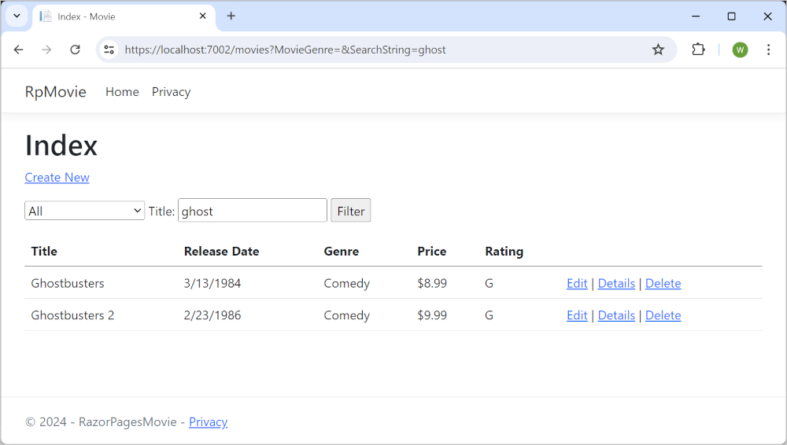
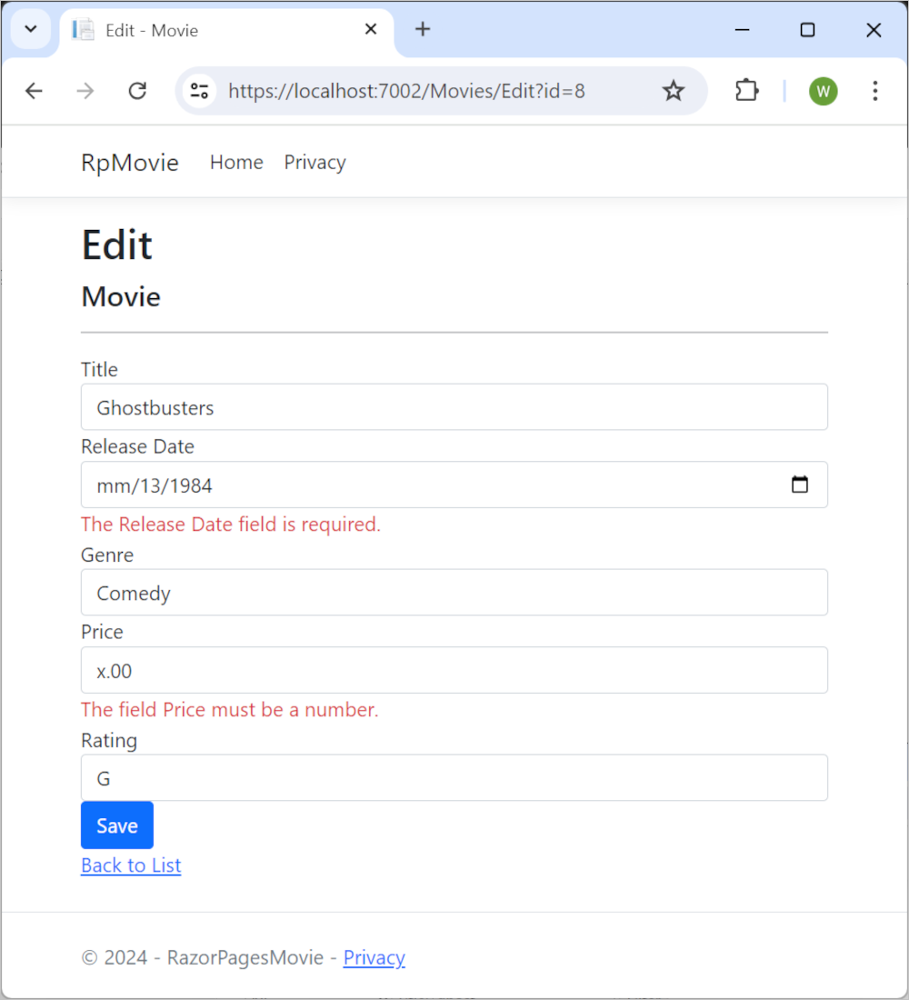

# Tutorial: Create a Razor Pages web app with ASP.NET Core

## 목차
- [Tutorial: Create a Razor Pages web app with ASP.NET Core](#tutorial-create-a-razor-pages-web-app-with-aspnet-core)
  - [목차](#목차)
  - [출처](#출처)
  - [다음](#다음)

---

이 일련의 자습서는 Razor Pages 웹 앱을 만드는 기본 사항을 설명합니다.

컨트롤러와 뷰에 익숙한 개발자를 위한 더 고급의 소개는 [Introduction to Razor Pages in ASP.NET Core](https://learn.microsoft.com/en-us/aspnet/core/razor-pages/?view=aspnetcore-8.0)를 참조하세요.

이 시리즈에는 다음 자습서가 포함됩니다:

1. Razor Pages 웹 앱 만들기
2. Razor Pages 앱에 모델 추가
3. Razor 페이지 스캐폴딩(생성)
4. 데이터베이스와 작업하기
5. Razor 페이지 업데이트
6. 검색 추가
7. 새 필드 추가
8. 유효성 검사 추가

마지막에는 영화 데이터베이스를 표시하고 관리할 수 있는 앱이 만들어집니다.

---
## 출처
[Tutorial: Create a Razor Pages web app with ASP.NET Core](https://learn.microsoft.com/en-us/aspnet/core/tutorials/razor-pages/?view=aspnetcore-8.0)

---
## [다음](./06_03_get_started.md)
