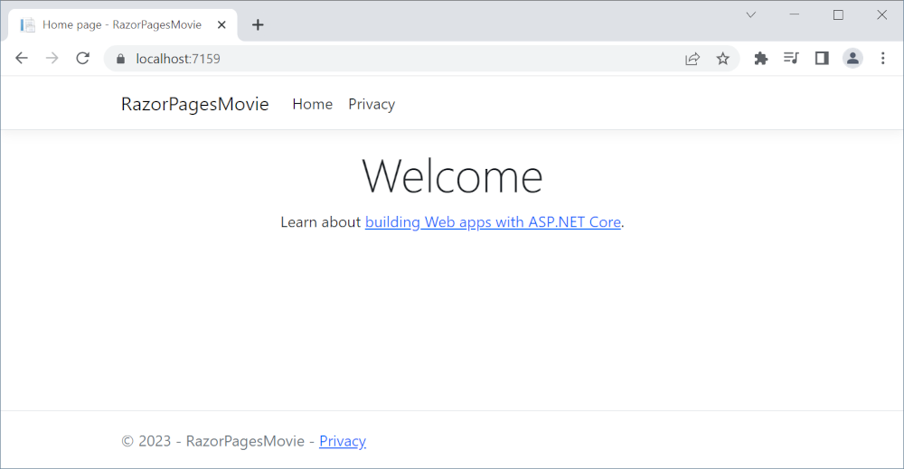
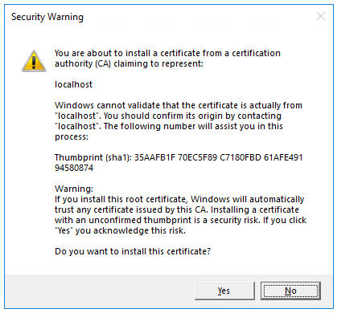
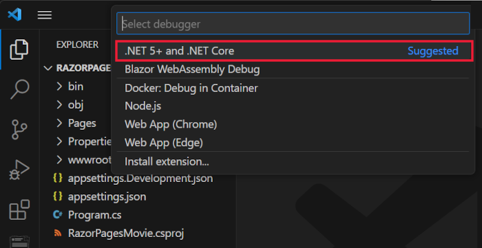

# Tutorial: Get started with Razor Pages in ASP.NET Core


## 목차
- [Tutorial: Get started with Razor Pages in ASP.NET Core](#tutorial-get-started-with-razor-pages-in-aspnet-core)
  - [목차](#목차)
  - [필수 조건](#필수-조건)
  - [Razor Pages 웹 앱 만들기](#razor-pages-웹-앱-만들기)
  - [앱 실행](#앱-실행)
  - [프로젝트 파일 검사](#프로젝트-파일-검사)
    - [Pages 폴더](#pages-폴더)
    - [wwwroot 폴더](#wwwroot-폴더)
    - [`appsettings.json`](#appsettingsjson)
    - [Program.cs](#programcs)
  - [완료된 샘플로 문제 해결](#완료된-샘플로-문제-해결)
  - [출처](#출처)
  - [다음](#다음)

---

이 자습서가 끝나면 영화 데이터베이스를 관리하는 Razor Pages 웹 앱을 갖게 됩니다.



## 필수 조건

* [Visual Studio Code](https://code.visualstudio.com/download)
* [Visual Studio Code용 C# (최신 버전)](https://marketplace.visualstudio.com/items?itemName=ms-dotnettools.csharp)
* [.NET 8.0 SDK](https://dotnet.microsoft.com/download/dotnet/8.0)

Visual Studio Code 지침에서는 프로젝트 생성과 같은 ASP.NET Core 개발 기능을 위해 .NET CLI를 사용합니다. 이 지침은 macOS, Linux 또는 Windows에서 모든 코드 편집기와 함께 사용할 수 있습니다. Visual Studio Code 이외의 도구를 사용하는 경우 약간의 변경이 필요할 수 있습니다.

---

## Razor Pages 웹 앱 만들기

이 자습서는 VS Code에 익숙하다는 가정을 합니다. 자세한 내용은 [VS Code 시작하기](https://code.visualstudio.com/docs)를 참조하세요.

* **터미널** 메뉴에서 **새 터미널**을 선택하여 [통합 터미널](https://code.visualstudio.com/docs/editor/integrated-terminal)을 엽니다.
* 프로젝트를 포함할 디렉터리로 이동합니다(`cd`).
* 다음 명령을 실행합니다:

  ```dotnetcli
  dotnet new webapp -o RazorPagesMovie
  code -r RazorPagesMovie
  ```

  `dotnet new` 명령은 *RazorPagesMovie* 폴더에 새로운 Razor Pages 프로젝트를 생성합니다.

  `code` 명령은 현재의 Visual Studio Code 인스턴스에서 *RazorPagesMovie* 폴더를 엽니다.

Visual Studio Code는 **이 폴더의 파일 작성자를 신뢰하십니까?** 라는 대화 상자를 표시할 수 있습니다.

* 상위 폴더의 모든 파일을 신뢰하는 경우 **상위 폴더의 모든 파일 작성자 신뢰**를 선택하십시오.
* 프로젝트 폴더에 .NET이 생성한 파일이 있으므로 **예, 작성자를 신뢰합니다**를 선택하십시오.
* Visual Studio Code가 프로젝트를 빌드 및 디버그하기 위한 자산을 추가하라는 요청을 할 때 **예**를 선택하십시오. Visual Studio Code가 빌드 및 디버그 자산을 추가하도록 제안하지 않는 경우, **보기** > **명령 팔레트**를 선택하고 검색 상자에 "`.NET`"을 입력하십시오. 명령 목록에서 `.NET: Generate Assets for Build and Debug` 명령을 선택하십시오.

Visual Studio Code는 `.vscode` 폴더에 생성된 `launch.json` 및 `tasks.json` 파일을 추가합니다.

---

## 앱 실행


* 다음 명령을 실행하여 HTTPS 개발 인증서를 신뢰하십시오:

  ```dotnetcli
  dotnet dev-certs https --trust
  ```
  
  위 명령은 Linux에서 작동하지 않습니다. 인증서를 신뢰하는 방법은 각 Linux 배포판의 문서를 참조하십시오.

  위 명령은 인증서가 이전에 신뢰되지 않은 경우 다음과 같은 대화 상자를 표시합니다:

  

* 개발 인증서를 신뢰하는 것에 동의하면 **예**를 선택하십시오.

  자세한 내용은 [ASP.NET Core HTTPS 개발 인증서 신뢰](https://learn.microsoft.com/en-us/aspnet/core/security/enforcing-ssl?view=aspnetcore-8.0#trust-the-aspnet-core-https-development-certificate-on-windows-and-macos)를 참조하십시오.
  
Firefox 브라우저를 신뢰하는 방법에 대한 정보는 [Firefox SEC_ERROR_INADEQUATE_KEY_USAGE 인증서 오류](https://learn.microsoft.com/en-us/aspnet/core/security/enforcing-ssl?view=aspnetcore-8.0#trust-ff)를 참조하십시오.

Visual Studio Code에서 <kbd>Ctrl</kbd>+<kbd>F5</kbd>(Windows) 또는 <kbd>⌘</kbd>+<kbd>F5</kbd>(macOS)를 눌러 디버깅 없이 앱을 실행합니다.

**디버거 선택** 프롬프트에서 **.NET 5+ 및 .NET Core**를 선택합니다.



기본 브라우저는 다음 URL로 시작됩니다: `https://localhost:<port>` 여기서 `<port>`는 임의로 생성된 포트 번호입니다.

브라우저 창을 닫습니다.

Visual Studio Code에서 **실행** 메뉴에서 **디버깅 중지**를 선택하거나 <kbd>Shift</kbd>+<kbd>F5</kbd>를 눌러 앱을 중지합니다.


---

## 프로젝트 파일 검사

다음 섹션에는 나중에 자습서에서 작업할 주요 프로젝트 폴더와 파일의 개요가 포함되어 있습니다.

### Pages 폴더

Razor 페이지와 지원 파일을 포함합니다. 각 Razor 페이지는 파일 쌍입니다:

* HTML 마크업과 Razor 구문을 사용한 C# 코드를 포함하는 `.cshtml` 파일.
* 페이지 이벤트를 처리하는 C# 코드를 포함하는 `.cshtml.cs` 파일.

지원 파일은 밑줄(_)로 시작하는 이름을 가집니다. 예를 들어, `_Layout.cshtml` 파일은 모든 페이지에 공통되는 UI 요소를 구성합니다. `_Layout.cshtml`은 페이지 상단의 탐색 메뉴와 하단의 저작권 공지를 설정합니다. 자세한 내용은 `Layout in ASP.NET Core`을 참조하세요.

### wwwroot 폴더

HTML 파일, JavaScript 파일, CSS 파일과 같은 정적 자산을 포함합니다. 자세한 내용은 [Static files in ASP.NET Core](https://learn.microsoft.com/en-us/aspnet/core/fundamentals/static-files?view=aspnetcore-8.0)를 참조하세요.

### `appsettings.json`

연결 문자열과 같은 구성 데이터를 포함합니다. 자세한 내용은 [Configuration in ASP.NET Core](https://learn.microsoft.com/en-us/aspnet/core/fundamentals/configuration/?view=aspnetcore-8.0)를 참조하세요

### Program.cs

다음 코드를 포함하고 있습니다:

```C#
var builder = WebApplication.CreateBuilder(args);

// Add services to the container.
builder.Services.AddRazorPages();

var app = builder.Build();

// Configure the HTTP request pipeline.
if (!app.Environment.IsDevelopment())
{
    app.UseExceptionHandler("/Error");
    // The default HSTS value is 30 days. You may want to change this for production scenarios, see https://aka.ms/aspnetcore-hsts.
    app.UseHsts();
}

app.UseHttpsRedirection();
app.UseStaticFiles();

app.UseRouting();

app.UseAuthorization();

app.MapRazorPages();

app.Run();
```

이 파일의 다음 코드 줄은 사전 구성된 기본값으로 `WebApplicationBuilder`를 생성하고, [의존성 주입(DI) 컨테이너](https://learn.microsoft.com/en-us/aspnet/core/fundamentals/dependency-injection?view=aspnetcore-8.0)에 Razor Pages 지원을 추가하며, 앱을 빌드합니다:

```C#
var builder = WebApplication.CreateBuilder(args);

// Add services to the container.
builder.Services.AddRazorPages();

var app = builder.Build();
```

개발자 예외 페이지는 기본적으로 활성화되어 예외에 대한 유용한 정보를 제공합니다. 운영 앱은 개발 모드에서 실행되어서는 안 됩니다. 개발자 예외 페이지가 민감한 정보를 유출할 수 있기 때문입니다.

다음 코드는 예외 엔드포인트를 `/Error`로 설정하고, 앱이 ***개발 모드가 아닐 때*** [HTTP 엄격 전송 보안 프로토콜(HSTS)](https://learn.microsoft.com/en-us/aspnet/core/security/enforcing-ssl?view=aspnetcore-8.0#http-strict-transport-security-protocol-hsts)을 활성화합니다:

```C#
// Configure the HTTP request pipeline.
if (!app.Environment.IsDevelopment())
{
    app.UseExceptionHandler("/Error");
    // The default HSTS value is 30 days. You may want to change this for production scenarios, see https://aka.ms/aspnetcore-hsts.
    app.UseHsts();
}
```

예를 들어, 위 코드는 앱이 운영 또는 테스트 모드일 때 실행됩니다. 자세한 내용은 [ASP.NET Core에서 여러 환경 사용](https://learn.microsoft.com/en-us/aspnet/core/fundamentals/environments?view=aspnetcore-8.0)을 참조하세요.

다음 코드는 다양한 [미들웨어](https://learn.microsoft.com/en-us/aspnet/core/fundamentals/middleware/?view=aspnetcore-8.0)를 활성화합니다:

* `app.UseHttpsRedirection();` : HTTP 요청을 HTTPS로 리디렉션합니다.
* `app.UseStaticFiles();` : HTML, CSS, 이미지 및 JavaScript와 같은 정적 파일을 제공할 수 있도록 합니다. 자세한 내용은 [Static files in ASP.NET Core](https://learn.microsoft.com/en-us/aspnet/core/fundamentals/static-files?view=aspnetcore-8.0)을 참조하세요.
* `app.UseRouting();` : 미들웨어 파이프라인에 경로 매칭을 추가합니다. 자세한 내용은 [Routing in ASP.NET Core](https://learn.microsoft.com/en-us/aspnet/core/fundamentals/routing?view=aspnetcore-8.0)을 참조하세요.
* `app.MapRazorPages();` : Razor Pages에 대한 엔드포인트 라우팅을 구성합니다.
* `app.UseAuthorization();` : 사용자가 보안 리소스에 접근할 수 있도록 권한을 부여합니다. 이 앱은 권한 부여를 사용하지 않으므로 이 줄을 제거할 수 있습니다.
* `app.Run();` : 앱을 실행합니다.

## 완료된 샘플로 문제 해결

해결할 수 없는 문제가 발생하면 완료된 프로젝트와 코드를 비교하세요. [완료된 프로젝트 보기 또는 다운로드](https://github.com/dotnet/AspNetCore.Docs/tree/main/aspnetcore/tutorials/razor-pages/razor-pages-start/sample/RazorPagesMovie80) ([샘플 다운로드 방법](https://learn.microsoft.com/en-us/aspnet/core/introduction-to-aspnet-core?view=aspnetcore-8.0#how-to-download-a-sample)).

---
## 출처
[Tutorial: Get started with Razor Pages in ASP.NET Core](https://learn.microsoft.com/en-us/aspnet/core/tutorials/razor-pages/razor-pages-start?view=aspnetcore-8.0&tabs=visual-studio-code)

---
## [다음](./06_04_add_model.md)
