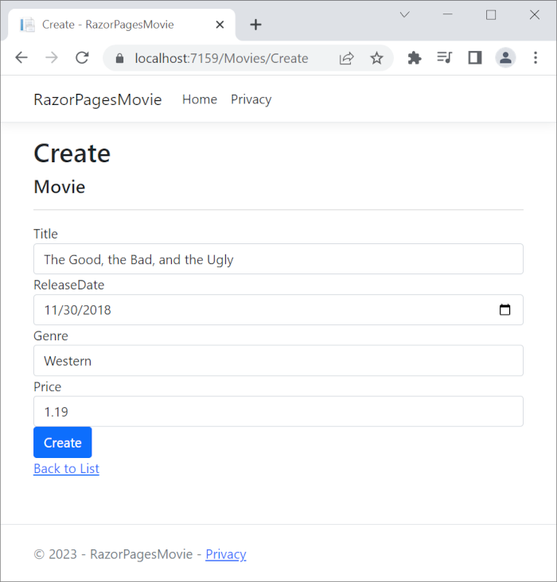

# Part 2, add a model to a Razor Pages app in ASP.NET Core


## 목차
- [Part 2, add a model to a Razor Pages app in ASP.NET Core](#part-2-add-a-model-to-a-razor-pages-app-in-aspnet-core)
  - [목차](#목차)
  - [데이터 모델 추가](#데이터-모델-추가)
    - [NuGet 패키지 및 EF 도구 추가](#nuget-패키지-및-ef-도구-추가)
  - [영화 모델 스캐폴드](#영화-모델-스캐폴드)
    - [생성된 파일 및 업데이트된 파일](#생성된-파일-및-업데이트된-파일)
  - [EF의 마이그레이션 기능을 사용하여 초기 데이터베이스 스키마 생성](#ef의-마이그레이션-기능을-사용하여-초기-데이터베이스-스키마-생성)
  - [앱 테스트](#앱-테스트)
    - [종속성 주입으로 등록된 컨텍스트 검토](#종속성-주입으로-등록된-컨텍스트-검토)
  - [완료된 샘플로 문제 해결](#완료된-샘플로-문제-해결)
  - [출처](#출처)
  - [다음](#다음)

---

이 튜토리얼에서는 데이터베이스에서 영화를 관리하기 위한 클래스를 추가합니다. 앱의 모델 클래스는 [Entity Framework Core (EF Core)](https://learn.microsoft.com/en-us/ef/core)를 사용하여 데이터베이스와 작업합니다. EF Core는 데이터 액세스를 간소화하는 객체-관계 매퍼(O/RM)입니다. 먼저 모델 클래스를 작성하고, EF Core가 데이터베이스를 생성합니다.

모델 클래스는 POCO 클래스("**P**lain-**O**ld **C**LR **O**bjects"에서 유래)로 알려져 있습니다. 이는 EF Core에 대한 종속성이 없기 때문입니다. 이 클래스들은 데이터베이스에 저장되는 데이터의 속성을 정의합니다.

## 데이터 모델 추가

1. `Models` 폴더를 추가합니다.
2. `Models` 폴더에 `Movie.cs`라는 클래스를 추가합니다.

`Movie` 클래스에 다음 속성을 추가합니다:

```C#
using System.ComponentModel.DataAnnotations;

namespace RazorPagesMovie.Models;

public class Movie
{
    public int Id { get; set; }
    public string? Title { get; set; }
    [DataType(DataType.Date)]
    public DateTime ReleaseDate { get; set; }
    public string? Genre { get; set; }
    public decimal Price { get; set; }
}
```

`Movie` 클래스에는 다음이 포함됩니다:

* 데이터베이스의 기본 키를 제공하는 `ID` 필드.
* `ReleaseDate` 필드의 데이터 형식을 지정하는 `[DataType]` 특성. 이 특성을 사용하면:
  * 사용자는 날짜 필드에 시간 정보를 입력할 필요가 없습니다.
  * 시간 정보가 아닌 날짜만 표시됩니다.
* `string` 뒤의 물음표는 속성이 null 값을 가질 수 있음을 나타냅니다. 자세한 내용은 [nullable reference types](https://learn.microsoft.com/en-us/dotnet/csharp/nullable-references)을 참조하세요.

[DataAnnotations](https://learn.microsoft.com/en-us/dotnet/api/system.componentmodel.dataannotations)는 나중에 튜토리얼에서 다룹니다.

<a name="dc7"></a>

### NuGet 패키지 및 EF 도구 추가

다음 .NET CLI 명령을 실행합니다:

```dotnetcli
dotnet tool uninstall --global dotnet-aspnet-codegenerator
dotnet tool install --global dotnet-aspnet-codegenerator
dotnet tool uninstall --global dotnet-ef
dotnet tool install --global dotnet-ef
dotnet add package Microsoft.EntityFrameworkCore.Design
dotnet add package Microsoft.EntityFrameworkCore.SQLite
dotnet add package Microsoft.VisualStudio.Web.CodeGeneration.Design
dotnet add package Microsoft.EntityFrameworkCore.SqlServer
dotnet add package Microsoft.EntityFrameworkCore.Tools
```

위 명령은 다음을 추가합니다:
* [EF Core의 명령줄 인터페이스(CLI) 도구](https://learn.microsoft.com/en-us/ef/core/miscellaneous/cli/dotnet)
* [aspnet-codegenerator 스캐폴딩 도구](https://learn.microsoft.com/en-us/aspnet/core/fundamentals/tools/dotnet-aspnet-codegenerator?view=aspnetcore-8.0).
* EF Core의 디자인 타임 도구
* EF Core 패키지를 종속성으로 설치하는 EF Core SQLite 공급자
* 스캐폴딩에 필요한 패키지: `Microsoft.VisualStudio.Web.CodeGeneration.Design` 및 `Microsoft.EntityFrameworkCore.SqlServer`.

여러 환경 설정을 통해 앱이 환경에 따라 데이터베이스 컨텍스트를 구성할 수 있는 지침은 [Use multiple environments in ASP.NET Core](https://learn.microsoft.com/en-us/aspnet/core/fundamentals/environments?view=aspnetcore-8.0#environment-based-startup-class-and-methods)를 참조하십시오.

> [!NOTE]
> 기본적으로 설치할 .NET 바이너리의 아키텍처는 현재 실행 중인 OS 아키텍처를 나타냅니다. 다른 OS 아키텍처를 지정하려면 [dotnet tool install, --arch 옵션](https://learn.microsoft.com/en-us/dotnet/core/tools/dotnet-tool-install#options)을 참조하십시오.
> 자세한 내용은 GitHub 이슈 [dotnet/AspNetCore.Docs #29262](https://github.com/dotnet/AspNetCore.Docs/issues/29262)를 참조하십시오.

Visual Studio Code에서 <kbd>Ctrl</kbd>+<kbd>F5</kbd> (Windows) 또는 <kbd>⌘</kbd>+<kbd>F5</kbd> (macOS)를 눌러 디버깅 없이 앱을 실행합니다.

편집기 아래의 *패널*에서 *PROBLEMS* 탭을 선택하거나, *보기* 메뉴에서 *문제*를 선택하여 컴파일 오류가 없는지 확인합니다.

---

## 영화 모델 스캐폴드

이 섹션에서는 영화 모델을 스캐폴드합니다. 즉, 스캐폴딩 도구는 영화 모델에 대한 Create, Read, Update 및 Delete (CRUD) 작업을 위한 페이지를 생성합니다.

* `Program.cs` 및 `.csproj` 파일이 포함된 프로젝트 디렉토리로 명령 셸을 엽니다. 다음 명령을 실행합니다:

  ```dotnetcli
  dotnet aspnet-codegenerator razorpage -m Movie -dc RazorPagesMovie.Data.RazorPagesMovieContext -udl -outDir Pages/Movies --referenceScriptLibraries --databaseProvider sqlite
  ```

<a name="codegenerator"></a>
다음 표는 ASP.NET Core 코드 생성기 옵션을 설명합니다.

| 옵션               | 설명 |
| ----------------- | ------------ |
| `-m`  | 모델의 이름. |
| `-dc`  | 사용할 `DbContext` 클래스(네임스페이스 포함). |
| `-udl` | 기본 레이아웃 사용. |
| `-outDir` | 뷰를 생성할 상대 출력 폴더 경로. |
| `--referenceScriptLibraries` | Edit 및 Create 페이지에 `_ValidationScriptsPartial` 추가 |

`dotnet aspnet-codegenerator razorpage` 명령에 대한 도움말을 얻으려면 `-h` 옵션을 사용하십시오:

```dotnetcli
dotnet aspnet-codegenerator razorpage -h
```

자세한 내용은 [dotnet aspnet-codegenerator](https://learn.microsoft.com/en-us/aspnet/core/fundamentals/tools/dotnet-aspnet-codegenerator?view=aspnetcore-8.0)를 참조하십시오.

<h3 id="sqlite-ss-6">개발에 SQLite 사용, 프로덕션에 SQL Server 사용</h3>

SQLite를 선택하면 템플릿에서 생성된 코드가 개발에 바로 사용할 수 있습니다. 다음 코드는 개발 시 SQLite 연결 문자열을 선택하고, 프로덕션에서는 SQL Server를 선택하는 방법을 보여줍니다.

```C#
using Microsoft.EntityFrameworkCore;

var builder = WebApplication.CreateBuilder(args);

builder.Services.AddRazorPages();

if (builder.Environment.IsDevelopment())
{
    builder.Services.AddDbContext<RazorPagesMovieContext>(options =>
        options.UseSqlite(builder.Configuration.GetConnectionString("RazorPagesMovieContext")));
}
else
{
    builder.Services.AddDbContext<RazorPagesMovieContext>(options =>
        options.UseSqlServer(builder.Configuration.GetConnectionString("ProductionMovieContext")));
}

var app = builder.Build();

if (!app.Environment.IsDevelopment())
{
    app.UseExceptionHandler("/Error");
    app.UseHsts();
}

app.UseHttpsRedirection();
app.UseStaticFiles();

app.UseRouting();

app.UseAuthorization();

app.MapRazorPages();

app.Run();
```

위의 코드는 `WebApplication`이 개발 모드에서 `UseDeveloperExceptionPage`를 호출하기 때문에 개발 시 `UseDeveloperExceptionPage`를 호출하지 않습니다.

---

### 생성된 파일 및 업데이트된 파일

스캐폴드 과정에서 다음 파일이 생성됩니다:

* *Pages/Movies*: Create, Delete, Details, Edit, 및 Index.
* `Data/RazorPagesMovieContext.cs`

생성된 파일은 다음 튜토리얼에서 설명합니다.

스캐폴드 과정은 다음과 같은 강조된 코드를 `Program.cs` 파일에 추가합니다:

```C#
using Microsoft.EntityFrameworkCore;
using Microsoft.Extensions.DependencyInjection;
var builder = WebApplication.CreateBuilder(args);

// Add services to the container.
builder.Services.AddRazorPages();
builder.Services.AddDbContext<RazorPagesMovieContext>(options =>
    options.UseSqlite(builder.Configuration.GetConnectionString("RazorPagesMovieContext") ?? throw new InvalidOperationException("Connection string 'RazorPagesMovieContext' not found.")));

var app = builder.Build();

// Configure the HTTP request pipeline.
if (!app.Environment.IsDevelopment())
{
    app.UseExceptionHandler("/Error");
    // The default HSTS value is 30 days. You may want to change this for production scenarios, see https://aka.ms/aspnetcore-hsts.
    app.UseHsts();
}

app.UseHttpsRedirection();
app.UseStaticFiles();

app.UseRouting();

app.UseAuthorization();

app.MapRazorPages();

app.Run();
```

---

`Program.cs` 변경 사항은 이 튜토리얼의 뒷부분에서 설명됩니다.

<a name="pmc7"></a>

## EF의 마이그레이션 기능을 사용하여 초기 데이터베이스 스키마 생성

Entity Framework Core의 마이그레이션 기능은 다음을 제공합니다:

* 초기 데이터베이스 스키마 생성.
* 데이터베이스 스키마를 앱의 데이터 모델과 동기화 상태로 유지하기 위해 점진적으로 업데이트. 기존 데이터는 보존됩니다.

* *RazorPagesMovie.csproj* 프로젝트를 마우스 오른쪽 버튼으로 클릭하고 **통합 터미널에서 열기**를 선택합니다.

  **터미널** 창이 `Program.cs` 및 `.csproj` 파일이 포함된 프로젝트 디렉토리에서 명령 프롬프트와 함께 열립니다.

* 다음 .NET CLI 명령을 실행합니다:

  ```dotnetcli
  dotnet ef migrations add InitialCreate
  ```

  `migrations` 명령은 초기 데이터베이스 스키마를 생성하는 코드를 생성합니다. 스키마는 `DbContext`에 지정된 모델을 기반으로 합니다. `InitialCreate` 인수는 마이그레이션의 이름을 지정하는 데 사용됩니다. 어떤 이름이든 사용할 수 있지만, 일반적으로 마이그레이션을 설명하는 이름을 선택합니다.

다음 경고가 표시됩니다. 이는 나중에 해결됩니다:

> 엔터티 유형 'Movie'의 열 'Price'에 대한 소수점 유형이 지정되지 않았습니다. 이는 값이 기본 정밀도 및 규모에 맞지 않을 경우 값이 조용히 잘리게 됩니다. 'HasColumnType()'을 사용하여 모든 값을 수용할 수 있는 SQL 서버 열 유형을 명시적으로 지정하십시오.

* 다음 .NET CLI 명령을 실행합니다:

  ```dotnetcli
  dotnet ef database update
  ```

 `update` 명령은 아직 적용되지 않은 마이그레이션의 `Up` 메서드를 실행합니다. 이 경우 `update`는 `Migrations/<time-stamp>_InitialCreate.cs` 파일의 `Up` 메서드를 실행하여 데이터베이스를 생성합니다.

> [!NOTE]
> SQLite의 경우, `Price` 필드의 열 유형이 `TEXT`로 설정됩니다. 이는 나중에 해결됩니다.

---

데이터 컨텍스트 `RazorPagesMovieContext`는:

* [Microsoft.EntityFrameworkCore.DbContext](https://learn.microsoft.com/en-us/dotnet/api/microsoft.entityframeworkcore.dbcontext)에서 파생됩니다.
* 데이터 모델에 포함된 엔터티를 지정합니다.
* `Movie` 모델에 대해 Create, Read, Update 및 Delete 기능을 조정합니다.

```C#
using System;
using System.Collections.Generic;
using System.Linq;
using System.Threading.Tasks;
using Microsoft.EntityFrameworkCore;
using RazorPagesMovie.Models;

namespace RazorPagesMovie.Data
{
    public class RazorPagesMovieContext : DbContext
    {
        public RazorPagesMovieContext (DbContextOptions<RazorPagesMovieContext> options)
            : base(options)
        {
        }

        public DbSet<RazorPagesMovie.Models.Movie> Movie { get; set; } = default!;
    }
}
```

위의 코드는 엔터티 집합에 대한 [DbSet\<Movie>](https://learn.microsoft.com/en-us/dotnet/api/microsoft.entityframeworkcore.dbset-1) 속성을 생성합니다. 엔터티 프레임워크 용어에서 엔터티 집합은 일반적으로 데이터베이스 테이블에 해당합니다. 엔터티는 테이블의 행에 해당합니다.

연결 문자열의 이름은 [DbContextOptions](https://learn.microsoft.com/en-us/dotnet/api/microsoft.entityframeworkcore.dbcontextoptions) 객체에서 메서드를 호출하여 컨텍스트에 전달됩니다. 로컬 개발의 경우, [구성 시스템](https://learn.microsoft.com/en-us/aspnet/core/fundamentals/configuration/?view=aspnetcore-8.0)은 `appsettings.json` 파일에서 연결 문자열을 읽습니다.

<a name="test7"></a>

## 앱 테스트

1. 앱을 실행하고 브라우저에서 URL에 `/Movies`를 추가합니다 (`http://localhost:port/movies`).

   다음 오류가 발생하면:

   ```console
   SqlException: "RazorPagesMovieContext-GUID" 데이터베이스를 열 수 없습니다. 로그인이 실패했습니다.
   'User-name' 사용자에 대한 로그인이 실패했습니다.
   ```

   [마이그레이션 단계](#pmc6)를 놓쳤습니다.

1. **Create New** 링크를 테스트합니다.

   

   > [!NOTE]
   > `Price` 필드에 소수점 쉼표를 입력할 수 없을 수도 있습니다. 쉼표(",")를 소수점으로 사용하는 비영어권 로캘 및 비미국 영어 날짜 형식을 위한 [jQuery 유효성 검사](https://jqueryvalidation.org/)를 지원하려면 앱을 글로벌화해야 합니다. 글로벌화 지침은 [이 GitHub 이슈](https://github.com/dotnet/AspNetCore.Docs/issues/4076#issuecomment-326590420)를 참조하십시오.

1. **Edit**, **Details**, **Delete** 링크를 테스트합니다.

다음 튜토리얼에서는 스캐폴딩으로 생성된 파일을 설명합니다.

### 종속성 주입으로 등록된 컨텍스트 검토

ASP.NET Core는 [종속성 주입](https://learn.microsoft.com/en-us/aspnet/core/fundamentals/dependency-injection?view=aspnetcore-8.0)으로 구축되었습니다. EF Core 데이터베이스 컨텍스트와 같은 서비스는 애플리케이션 시작 시 종속성 주입을 통해 등록됩니다. 이러한 서비스를 필요로 하는 구성 요소(예: Razor Pages)는 생성자 매개변수를 통해 제공됩니다. 데이터베이스 컨텍스트 인스턴스를 가져오는 생성자 코드는 튜토리얼의 뒷부분에서 설명됩니다.

스캐폴딩 도구는 데이터베이스 컨텍스트를 자동으로 생성하고 이를 종속성 주입 컨테이너에 등록합니다. 다음 강조된 코드는 스캐폴더에 의해 `Program.cs` 파일에 추가됩니다:

```C#
using Microsoft.EntityFrameworkCore;
using Microsoft.Extensions.DependencyInjection;
var builder = WebApplication.CreateBuilder(args);

// Add services to the container.
builder.Services.AddRazorPages();
builder.Services.AddDbContext<RazorPagesMovieContext>(options =>
    options.UseSqlite(builder.Configuration.GetConnectionString("RazorPagesMovieContext") ?? throw new InvalidOperationException("Connection string 'RazorPagesMovieContext' not found.")));

var app = builder.Build();

// Configure the HTTP request pipeline.
if (!app.Environment.IsDevelopment())
{
    app.UseExceptionHandler("/Error");
    // The default HSTS value is 30 days. You may want to change this for production scenarios, see https://aka.ms/aspnetcore-hsts.
    app.UseHsts();
}

app.UseHttpsRedirection();
app.UseStaticFiles();

app.UseRouting();

app.UseAuthorization();

app.MapRazorPages();

app.Run();
```

---

## 완료된 샘플로 문제 해결

해결할 수 없는 문제가 발생하면 코드를 완료된 프로젝트와 비교하십시오. [완료된 프로젝트 보기 또는 다운로드](https://github.com/dotnet/AspNetCore.Docs/tree/main/aspnetcore/tutorials/razor-pages/razor-pages-start/sample/RazorPagesMovie80) ([다운로드 방법](https://learn.microsoft.com/en-us/aspnet/core/introduction-to-aspnet-core?view=aspnetcore-8.0#how-to-download-a-sample)).

---
## 출처
[Part 2, add a model to a Razor Pages app in ASP.NET Core](https://learn.microsoft.com/en-us/aspnet/core/tutorials/razor-pages/model?view=aspnetcore-8.0&tabs=visual-studio-code)

---
## [다음](./06_05_scaffolded.md)
