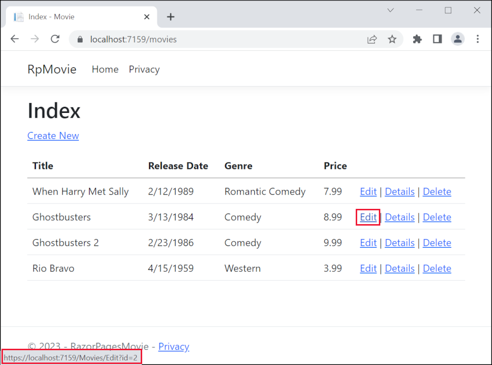

# Part 5, update the generated pages in an ASP.NET Core app

## 목차
- [Part 5, update the generated pages in an ASP.NET Core app](#part-5-update-the-generated-pages-in-an-aspnet-core-app)
  - [목차](#목차)
  - [모델 업데이트](#모델-업데이트)
    - [경로 템플릿 추가](#경로-템플릿-추가)
    - [동시성 예외 처리 검토](#동시성-예외-처리-검토)
    - [게시 및 바인딩 검토](#게시-및-바인딩-검토)
  - [출처](#출처)
  - [다음](#다음)

---

스캐폴드된 영화 앱은 좋은 시작을 했지만, 프레젠테이션이 이상적이지 않습니다. **ReleaseDate**는 두 단어, **Release Date**로 표시되어야 합니다.


## 모델 업데이트

`Models/Movie.cs`를 다음 강조된 코드로 업데이트합니다:

```C#
using System.ComponentModel.DataAnnotations;
using System.ComponentModel.DataAnnotations.Schema;

namespace RazorPagesMovie.Models;

public class Movie
{
    public int Id { get; set; }
    public string Title { get; set; } = string.Empty;

    [Display(Name = "Release Date")]
    [DataType(DataType.Date)]
    public DateTime ReleaseDate { get; set; }
    public string Genre { get; set; } = string.Empty;

    [Column(TypeName = "decimal(18, 2)")]
    public decimal Price { get; set; }
}
```

위의 코드에서:

* `[Column(TypeName = "decimal(18, 2)")]` 데이터 어노테이션은 Entity Framework Core가 `Price`를 데이터베이스에서 통화 형식으로 올바르게 매핑할 수 있게 합니다. 자세한 내용은 [데이터 형식](https://learn.microsoft.com/en-us/ef/core/modeling/relational/data-types)을 참조하십시오.
* [[Display]](https://learn.microsoft.com/en-us/dotnet/api/system.componentmodel.dataannotations.displayattribute) 어노테이션은 필드의 표시 이름을 지정합니다. 위의 코드에서는 `ReleaseDate` 대신 `Release Date`로 표시됩니다.
* [[DataType]](https://learn.microsoft.com/en-us/dotnet/api/system.componentmodel.dataannotations.datatypeattribute) 어노테이션은 데이터의 유형을 지정합니다 (`Date`). 필드에 저장된 시간 정보는 표시되지 않습니다.

[DataAnnotations](https://learn.microsoft.com/en-us/aspnet/mvc/overview/older-versions/mvc-music-store/mvc-music-store-part-6)은 다음 튜토리얼에서 다룹니다.

*Pages/Movies*로 이동하여 **Edit** 링크 위로 마우스를 가져가 대상 URL을 확인합니다.



**Edit**, **Details**, 및 **Delete** 링크는 `Pages/Movies/Index.cshtml` 파일의 [Anchor Tag Helper](https://learn.microsoft.com/en-us/aspnet/core/mvc/views/tag-helpers/built-in/anchor-tag-helper?view=aspnetcore-8.0)에 의해 생성됩니다.

```CSHTML
@foreach (var item in Model.Movie) {
        <tr>
            <td>
                @Html.DisplayFor(modelItem => item.Title)
            </td>
            <td>
                @Html.DisplayFor(modelItem => item.ReleaseDate)
            </td>
            <td>
                @Html.DisplayFor(modelItem => item.Genre)
            </td>
            <td>
                @Html.DisplayFor(modelItem => item.Price)
            </td>
            <td>
                <a asp-page="./Edit" asp-route-id="@item.Id">Edit</a> |
                <a asp-page="./Details" asp-route-id="@item.Id">Details</a> |
                <a asp-page="./Delete" asp-route-id="@item.Id">Delete</a>
            </td>
        </tr>
}
    </tbody>
</table>
```

[Tag Helpers](https://learn.microsoft.com/en-us/aspnet/core/mvc/views/tag-helpers/intro?view=aspnetcore-8.0)는 서버 측 코드가 Razor 파일의 HTML 요소 생성 및 렌더링에 참여할 수 있도록 합니다.

위의 코드에서, [Anchor Tag Helper](https://learn.microsoft.com/en-us/aspnet/core/mvc/views/tag-helpers/built-in/anchor-tag-helper?view=aspnetcore-8.0)는 Razor 페이지(경로는 상대적임), `asp-page`, 및 경로 식별자(`asp-route-id`)로부터 동적으로 HTML `href` 속성 값을 생성합니다. 자세한 내용은 [페이지에 대한 URL 생성](https://learn.microsoft.com/en-us/aspnet/core/razor-pages/?view=aspnetcore-8.0#url-generation-for-pages)을 참조하십시오.

브라우저에서 **View Source**를 사용하여 생성된 마크업을 확인합니다. 생성된 HTML의 일부는 다음과 같습니다:

```html
<td>
  <a href="/Movies/Edit?id=1">Edit</a> |
  <a href="/Movies/Details?id=1">Details</a> |
  <a href="/Movies/Delete?id=1">Delete</a>
</td>
```

   동적으로 생성된 링크는 [쿼리 문자열](https://launchschool.com/books/http/read/what_is_a_url)로 영화 ID를 전달합니다. 예를 들어, `https://localhost:5001/Movies/Details?id=1`의 `?id=1`처럼.

### 경로 템플릿 추가

Edit, Details 및 Delete Razor 페이지를 `{id:int}` 경로 템플릿을 사용하도록 업데이트합니다. 각 페이지의 페이지 지시문을 `@page`에서 `@page "{id:int}"`로 변경합니다. 앱을 실행한 다음 소스를 봅니다.

생성된 HTML은 URL의 경로 부분에 ID를 추가합니다:

```html
<td>
  <a href="/Movies/Edit/1">Edit</a> |
  <a href="/Movies/Details/1">Details</a> |
  <a href="/Movies/Delete/1">Delete</a>
</td>
```

정수를 포함하지 않는 `{id:int}` 경로 템플릿이 있는 페이지에 대한 요청은 HTTP 404(찾을 수 없음) 오류를 반환합니다. 예를 들어, `https://localhost:5001/Movies/Details`는 404 오류를 반환합니다. ID를 선택적으로 만들려면 경로 제약 조건에 `?`를 추가합니다:

```cshtml
@page "{id:int?}"
```

`@page "{id:int?}"`의 동작을 테스트합니다:

1. `Pages/Movies/Details.cshtml`의 페이지 지시문을 `@page "{id:int?}"`로 설정합니다.
1. `Pages/Movies/Details.cshtml.cs`에서 `public async Task<IActionResult> OnGetAsync(int? id)`에 중단점을 설정합니다.
1. `https://localhost:5001/Movies/Details/`로 이동합니다.

`@page "{id:int}"` 지시문을 사용할 경우, 중단점이 절대 걸리지 않습니다. 라우팅 엔진은 HTTP 404를 반환합니다. `@page "{id:int?}"`를 사용할 경우, `OnGetAsync` 메서드는 `NotFound`(HTTP 404)를 반환합니다:

```C#
public async Task<IActionResult> OnGetAsync(int? id)
{
    if (id == null)
    {
        return NotFound();
    }

    Movie = await _context.Movie.FirstOrDefaultAsync(m => m.ID == id);

    if (Movie == null)
    {
        return NotFound();
    }
    return Page();
}
```

### 동시성 예외 처리 검토

`Pages/Movies/Edit.cshtml.cs` 파일의 `OnPostAsync` 메서드를 검토합니다:

```C#
public async Task<IActionResult> OnPostAsync()
{
    if (!ModelState.IsValid)
    {
        return Page();
    }

    _context.Attach(Movie).State = EntityState.Modified;

    try
    {
        await _context.SaveChangesAsync();
    }
    catch (DbUpdateConcurrencyException)
    {
        if (!MovieExists(Movie.Id))
        {
            return NotFound();
        }
        else
        {
            throw;
        }
    }

    return RedirectToPage("./Index");
}

private bool MovieExists(int id)
{
  return _context.Movie.Any(e => e.Id == id);
}
```

이전 코드는 한 클라이언트가 영화를 삭제하고 다른 클라이언트가 영화에 대한 변경 사항을 게시할 때 동시성 예외를 감지합니다.

`catch` 블록을 테스트하려면:

1. `catch (DbUpdateConcurrencyException)`에 중단점을 설정합니다.
2. 영화를 선택하여 **Edit**을 하고, 변경 사항을 입력하지만 **Save**를 누르지 않습니다.
3. 다른 브라우저 창에서 동일한 영화에 대한 **Delete** 링크를 선택하고 영화를 삭제합니다.
4. 이전 브라우저 창에서 영화에 대한 변경 사항을 게시합니다.

프로덕션 코드는 동시성 충돌을 감지해야 할 수 있습니다. 자세한 내용은 [동시성 충돌 처리](https://learn.microsoft.com/en-us/aspnet/core/data/ef-rp/concurrency?view=aspnetcore-8.0)를 참조하십시오.

### 게시 및 바인딩 검토

`Pages/Movies/Edit.cshtml.cs` 파일을 검토합니다:

```C#
public class EditModel : PageModel
{
    private readonly RazorPagesMovie.Data.RazorPagesMovieContext _context;

    public EditModel(RazorPagesMovie.Data.RazorPagesMovieContext context)
    {
        _context = context;
    }

    [BindProperty]
    public Movie Movie { get; set; } = default!;

    public async Task<IActionResult> OnGetAsync(int? id)
    {
        if (id == null || _context.Movie == null)
        {
            return NotFound();
        }

        var movie =  await _context.Movie.FirstOrDefaultAsync(m => m.Id == id);
        if (movie == null)
        {
            return NotFound();
        }
        Movie = movie;
        return Page();
    }

    // To protect from overposting attacks, enable the specific properties you want to bind to.
    // For more details, see https://aka.ms/RazorPagesCRUD.
    public async Task<IActionResult> OnPostAsync()
    {
        if (!ModelState.IsValid)
        {
            return Page();
        }

        _context.Attach(Movie).State = EntityState.Modified;

        try
        {
            await _context.SaveChangesAsync();
        }
        catch (DbUpdateConcurrencyException)
        {
            if (!MovieExists(Movie.Id))
            {
                return NotFound();
            }
            else
            {
                throw;
            }
        }

        return RedirectToPage("./Index");
    }

    private bool MovieExists(int id)
    {
      return _context.Movie.Any(e => e.Id == id);
    }
```

영화/Edit 페이지에 HTTP GET 요청이 들어오면, 예를 들어 `https://localhost:5001/Movies/Edit/3`:

* `OnGetAsync` 메서드는 데이터베이스에서 영화를 가져와 `Page` 메서드를 반환합니다.
* `Page` 메서드는 `Pages/Movies/Edit.cshtml` Razor 페이지를 렌더링합니다. `Pages/Movies/Edit.cshtml` 파일은 `@model RazorPagesMovie.Pages.Movies.EditModel` 모델 지시문을 포함하며, 이를 통해 페이지에서 영화 모델을 사용할 수 있습니다.
* Edit 양식은 영화의 값으로 표시됩니다.

영화/Edit 페이지가 게시될 때:

* 페이지의 양식 값은 `Movie` 속성에 바인딩됩니다. `[BindProperty]` 어노테이션은 [모델 바인딩](https://learn.microsoft.com/en-us/aspnet/core/mvc/models/model-binding?view=aspnetcore-8.0)을 활성화합니다.

  ```csharp
  [BindProperty]
  public Movie Movie { get; set; }
  ```

* 모델 상태에 오류가 있는 경우, 예를 들어 `ReleaseDate`를 날짜로 변환할 수 없는 경우, 양식은 제출된 값과 함께 다시 표시됩니다.
* 모델 오류가 없는 경우, 영화가 저장됩니다.

Index, Create 및 Delete Razor 페이지의 HTTP GET 메서드는 유사한 패턴을 따릅니다. Create Razor 페이지의 HTTP POST `OnPostAsync` 메서드는 Edit Razor 페이지의 `OnPostAsync` 메서드와 유사한 패턴을 따릅니다.

---
## 출처
[Part 5, update the generated pages in an ASP.NET Core app](https://learn.microsoft.com/en-us/aspnet/core/tutorials/razor-pages/da1?view=aspnetcore-8.0)

---
## [다음](./06_08_search.md)
