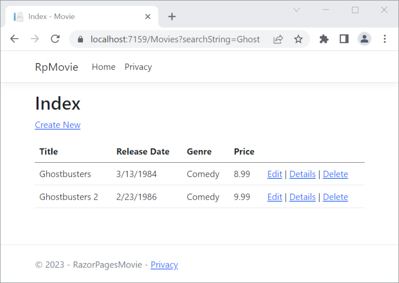
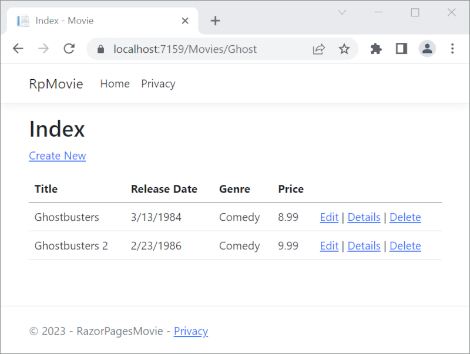
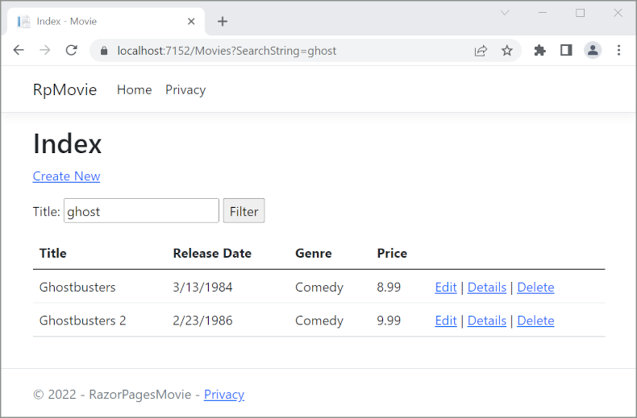

# Part 6, add search to ASP.NET Core Razor Pages

## 목차
- [Part 6, add search to ASP.NET Core Razor Pages](#part-6-add-search-to-aspnet-core-razor-pages)
  - [목차](#목차)
  - [장르별 검색](#장르별-검색)
    - [장르별 검색을 Razor 페이지에 추가](#장르별-검색을-razor-페이지에-추가)
  - [출처](#출처)
  - [다음](#다음)

---

다음 섹션에서는 *장르* 또는 *이름*으로 영화를 검색하는 기능이 추가됩니다.

`Pages/Movies/Index.cshtml.cs`에 다음 강조된 코드를 추가하세요:

```C#
public class IndexModel : PageModel
{
    private readonly RazorPagesMovie.Data.RazorPagesMovieContext _context;

    public IndexModel(RazorPagesMovie.Data.RazorPagesMovieContext context)
    {
        _context = context;
    }

    public IList<Movie> Movie { get;set; }  = default!;

    [BindProperty(SupportsGet = true)]
    public string? SearchString { get; set; }

    public SelectList? Genres { get; set; }

    [BindProperty(SupportsGet = true)]
    public string? MovieGenre { get; set; }
```

이전 코드에서:

* `SearchString`: 사용자가 검색 텍스트 상자에 입력하는 텍스트를 포함합니다. `SearchString`에는 [`[BindProperty]`](https://learn.microsoft.com/en-us/dotnet/api/microsoft.aspnetcore.mvc.bindpropertyattribute) 어노테이션이 있습니다. `[BindProperty]`는 폼 값과 쿼리 문자열을 속성과 같은 이름으로 바인딩합니다. HTTP GET 요청에서 바인딩하려면 `[BindProperty(SupportsGet = true)]`가 필요합니다.
* `Genres`: 장르 목록을 포함합니다. `Genres`는 사용자가 목록에서 장르를 선택할 수 있도록 합니다. `SelectList`는 `using Microsoft.AspNetCore.Mvc.Rendering;`을 필요로 합니다.
* `MovieGenre`: 사용자가 선택한 특정 장르를 포함합니다. 예를 들어, "Western".
* `Genres`와 `MovieGenre`는 이후 이 튜토리얼에서 사용됩니다.

> [!WARNING]
> 보안상의 이유로, 페이지 모델 속성에 `GET` 요청 데이터를 바인딩하려면 선택해야 합니다. 속성에 매핑하기 전에 사용자 입력을 확인하십시오. 쿼리 문자열이나 경로 값에 의존하는 시나리오를 처리할 때 `GET` 바인딩을 선택하는 것이 유용합니다.
>
> `GET` 요청에서 속성을 바인딩하려면 `[BindProperty]` 어노테이션의 `SupportsGet` 속성을 `true`로 설정하십시오:
>
> ```csharp
> [BindProperty(SupportsGet = true)]
> ```
>
> 자세한 내용은 [ASP.NET Core Community Standup: Bind on GET discussion (YouTube)](https://www.youtube.com/watch?v=p7iHB9V-KVU&feature=youtu.be&t=54m27s)을 참조하십시오.

Index 페이지의 `OnGetAsync` 메서드를 다음 코드로 업데이트하세요:

```C#
public async Task OnGetAsync()
{
    var movies = from m in _context.Movie
                 select m;
    if (!string.IsNullOrEmpty(SearchString))
    {
        movies = movies.Where(s => s.Title.Contains(SearchString));
    }

    Movie = await movies.ToListAsync();
}
```

`OnGetAsync` 메서드의 첫 번째 줄은 영화를 선택하기 위한 [LINQ](https://learn.microsoft.com/en-us/dotnet/csharp/programming-guide/concepts/linq/) 쿼리를 생성합니다:

```csharp
// using System.Linq;
var movies = from m in _context.Movie
             select m;
```

이 시점에서 쿼리는 ***정의***되었지만, 데이터베이스에 대해 ***실행되지*** 않았습니다.

`SearchString` 속성이 `null` 또는 비어 있지 않은 경우, 영화 쿼리는 검색 문자열로 필터링되도록 수정됩니다:

```C#
if (!string.IsNullOrEmpty(SearchString))
{
    movies = movies.Where(s => s.Title.Contains(SearchString));
}
```

`s => s.Title.Contains()` 코드는 [Lambda Expression](https://learn.microsoft.com/en-us/dotnet/csharp/programming-guide/statements-expressions-operators/lambda-expressions)입니다. 람다는 표준 쿼리 연산자 메서드(예: [Where](https://learn.microsoft.com/en-us/dotnet/csharp/programming-guide/concepts/linq/query-syntax-and-method-syntax-in-linq) 메서드 또는 `Contains`)의 인수로 메서드 기반 [LINQ](https://learn.microsoft.com/en-us/dotnet/csharp/programming-guide/concepts/linq/) 쿼리에서 사용됩니다. LINQ 쿼리는 정의될 때 또는 `Where`, `Contains`, `OrderBy`와 같은 메서드를 호출하여 수정될 때 실행되지 않습니다. 대신 쿼리 실행은 지연됩니다. 표현식의 평가가 지연되어 그 값이 반복되거나 `ToListAsync` 메서드가 호출될 때까지 평가가 연기됩니다. 자세한 내용은 [쿼리 실행](https://learn.microsoft.com/en-us/dotnet/csharp/linq/get-started/introduction-to-linq-queries#deferred)을 참조하십시오.

> [!NOTE]
> `Contains` 메서드는 C# 코드에서 실행되는 것이 아니라 데이터베이스에서 실행됩니다. 쿼리의 대소문자 구분 여부는 데이터베이스와 정렬에 따라 다릅니다. SQL Server에서는 `Contains`가 대소문자를 구분하지 않는 [SQL LIKE](https://learn.microsoft.com/en-us/sql/t-sql/language-elements/like-transact-sql)로 매핑됩니다. 기본 정렬이 혼합된 대소문자 구분과 대소문자 구분 없는 SQLite에 대한 자세한 내용은 다음을 참조하십시오:
> 
> * [How to use case-insensitive query with Sqlite provider? (`dotnet/efcore` #11414)](https://github.com/dotnet/efcore/issues/11414)
> * [How to make a SQLite column case insensitive (`dotnet/AspNetCore.Docs` #22314)](https://github.com/dotnet/AspNetCore.Docs/issues/22314)
> * [Collations and Case Sensitivity](https://learn.microsoft.com/en-us/ef/core/miscellaneous/collations-and-case-sensitivity)

영화 페이지로 이동하여 URL에 `?searchString=Ghost`와 같은 쿼리 문자열을 추가합니다. 예를 들어, `https://localhost:5001/Movies?searchString=Ghost`. 필터링된 영화가 표시됩니다.



다음 경로 템플릿이 Index 페이지에 추가된 경우, 검색 문자열을 URL 세그먼트로 전달할 수 있습니다. 예를 들어, `https://localhost:5001/Movies/Ghost`.

```cshtml
@page "{searchString?}"
```

위의 경로 제약 조건은 검색 문자열을 쿼리 문자열 값 대신 경로 데이터(URL 세그먼트)로 검색할 수 있게 합니다. `"{searchString?}"`의 `?`는 이것이 선택적 경로 매개변수임을 의미합니다.



ASP.NET Core 런타임은 쿼리 문자열(`?searchString=Ghost`) 또는 경로 데이터(`https://localhost:5001/Movies/Ghost`)에서 `SearchString` 속성의 값을 설정하기 위해 [모델 바인딩](https://learn.microsoft.com/en-us/aspnet/core/mvc/models/model-binding?view=aspnetcore-8.0)을 사용합니다. 모델 바인딩은 ***대소문자를 구분하지 않습니다***.

그러나 사용자가 URL을 수정하여 영화를 검색할 것이라고 기대할 수는 없습니다. 이 단계에서는 영화를 필터링할 UI가 추가됩니다. 경로 제약 조건 `"{searchString?}"`을 추가한 경우, 이를 제거하십시오.

`Pages/Movies/Index.cshtml` 파일을 열고 다음 코드에서 강조된 마크업을 추가합니다:

```cshtml
@page
@model RazorPagesMovie.Pages.Movies.IndexModel

@{
    ViewData["Title"] = "Index";
}

<h1>Index</h1>

<p>
    <a asp-page="Create">Create New</a>
</p>

<form>
    <p>
        Title: <input type="text" asp-for="SearchString" />
        <input type="submit" value="Filter" />
    </p>
</form>

<table class="table">
    @*Markup removed for brevity.*@
```

HTML `<form>` 태그는 다음 [Tag Helpers](https://learn.microsoft.com/en-us/aspnet/core/mvc/views/tag-helpers/intro?view=aspnetcore-8.0)를 사용합니다:

* [Form Tag Helper](https://learn.microsoft.com/en-us/aspnet/core/mvc/views/working-with-forms?view=aspnetcore-8.0#the-form-tag-helper). 폼이 제출되면, 필터 문자열이 쿼리 문자열을 통해 *Pages/Movies/Index* 페이지로 전송됩니다.
* [Input Tag Helper](https://learn.microsoft.com/en-us/aspnet/core/mvc/views/working-with-forms?view=aspnetcore-8.0#the-input-tag-helper)

변경 사항을 저장하고 필터를 테스트합니다.



## 장르별 검색

`Movies/Index.cshtml.cs` 페이지의 `OnGetAsync` 메서드를 다음 코드로 업데이트합니다:

```C#
public async Task OnGetAsync()
{
    // Use LINQ to get list of genres.
    IQueryable<string> genreQuery = from m in _context.Movie
                                    orderby m.Genre
                                    select m.Genre;

    var movies = from m in _context.Movie
                 select m;

    if (!string.IsNullOrEmpty(SearchString))
    {
        movies = movies.Where(s => s.Title.Contains(SearchString));
    }

    if (!string.IsNullOrEmpty(MovieGenre))
    {
        movies = movies.Where(x => x.Genre == MovieGenre);
    }
    Genres = new SelectList(await genreQuery.Distinct().ToListAsync());
    Movie = await movies.ToListAsync();
}
```

다음 코드는 데이터베이스에서 모든 장르를 검색하는 LINQ 쿼리입니다.

```csharp
// Use LINQ to get list of genres.
IQueryable<string> genreQuery = from m in _context.Movie
                                orderby m.Genre
                                select m.Genre;
```

`SelectList`의 장르는 고유한 장르로 프로젝션하여 생성됩니다.

```csharp
Genres = new SelectList(await genreQuery.Distinct().ToListAsync());
```

### 장르별 검색을 Razor 페이지에 추가

다음 마크업에서 강조된 것처럼 `Index.cshtml` [`<form>` 요소](https://developer.mozilla.org/docs/Web/HTML/Element/form)를 업데이트합니다:

```C#
@page
@model RazorPagesMovie.Pages.Movies.IndexModel

@{
    ViewData["Title"] = "Index";
}

<h1>Index</h1>

<p>
    <a asp-page="Create">Create New</a>
</p>

<form>
    <p>
        <select asp-for="MovieGenre" asp-items="Model.Genres">
            <option value="">All</option>
        </select>
        Title: <input type="text" asp-for="SearchString" />
        <input type="submit" value="Filter" />
    </p>
</form>
```

앱을 테스트하여 장르별, 영화 제목별, 또는 둘 다로 검색합니다.

---
## 출처
[Part 6, add search to ASP.NET Core Razor Pages](https://learn.microsoft.com/en-us/aspnet/core/tutorials/razor-pages/search?view=aspnetcore-8.0)

---
## [다음](./06_09_add_field.md)
