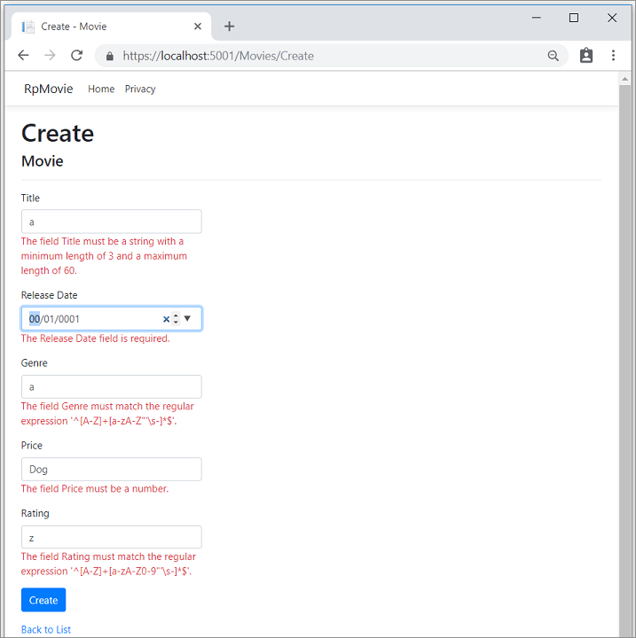

# Part 8 of tutorial series on Razor Pages

## 목차
- [Part 8 of tutorial series on Razor Pages](#part-8-of-tutorial-series-on-razor-pages)
  - [목차](#목차)
  - [유효성 검사](#유효성-검사)
  - [영화 모델에 유효성 검사 규칙 추가](#영화-모델에-유효성-검사-규칙-추가)
    - [Razor Pages의 유효성 검사 오류 UI](#razor-pages의-유효성-검사-오류-ui)
    - [서버 측 유효성 검사](#서버-측-유효성-검사)
  - [DataType 속성 사용](#datatype-속성-사용)
    - [마이그레이션 적용](#마이그레이션-적용)
    - [Azure에 게시](#azure에-게시)
  - [출처](#출처)

---

이 섹션에서는 `Movie` 모델에 유효성 검사 로직을 추가합니다. 유효성 검사 규칙은 사용자가 영화를 생성하거나 편집할 때마다 적용됩니다.

## 유효성 검사

소프트웨어 개발의 핵심 원칙 중 하나는 [DRY](https://wikipedia.org/wiki/Don%27t_repeat_yourself) ("**D**on't **R**epeat **Y**ourself")입니다. Razor Pages는 기능을 한 번 지정하면 앱 전체에 반영되는 개발 방식을 장려합니다. DRY는 다음에 도움이 됩니다:

* 앱의 코드 양을 줄입니다.
* 코드를 덜 오류가 발생하게 하고, 테스트 및 유지 보수가 더 쉬워집니다.

Razor Pages와 Entity Framework에서 제공하는 유효성 검사 지원은 DRY 원칙의 좋은 예입니다:

* 유효성 검사 규칙은 모델 클래스에서 한 곳에 선언적으로 지정됩니다.
* 규칙은 앱 전체에서 적용됩니다.

## 영화 모델에 유효성 검사 규칙 추가

`System.ComponentModel.DataAnnotations` 네임스페이스는 다음을 제공합니다:

* 클래스 또는 속성에 선언적으로 적용되는 내장 유효성 검사 속성 세트.
* 형식 지정 속성(예: `[DataType]`)은 형식을 지정하는 데 도움이 되며 유효성 검사를 제공하지 않습니다.

`Movie` 클래스를 업데이트하여 내장된 `[Required]`, `[StringLength]`, `[RegularExpression]`, `[Range]` 유효성 검사 속성을 활용하십시오.

```C#
using System.ComponentModel.DataAnnotations;
using System.ComponentModel.DataAnnotations.Schema;

namespace RazorPagesMovie.Models;

public class Movie
{
    public int Id { get; set; }

    [StringLength(60, MinimumLength = 3)]
    [Required]
    public string Title { get; set; } = string.Empty;

    [DataType(DataType.Date)]
    public DateTime ReleaseDate { get; set; }

    [Range(1, 100)]
    [DataType(DataType.Currency)]
    [Column(TypeName = "decimal(18, 2)")]
    public decimal Price { get; set; }

    [RegularExpression(@"^[A-Z]+[a-zA-Z\s]*$")]
    [Required]
    [StringLength(30)]
    public string Genre { get; set; } = string.Empty;

    [RegularExpression(@"^[A-Z]+[a-zA-Z0-9""'\s-]*$")]
    [StringLength(5)]
    [Required]
    public string Rating { get; set; } = string.Empty;
}
```

유효성 검사 속성은 적용된 모델 속성에 적용할 동작을 지정합니다:

* `[Required]` 및 `[MinimumLength]` 속성은 속성에 값이 있어야 함을 나타냅니다. 이 유효성 검사를 만족하기 위해 사용자가 공백을 입력하는 것을 막지는 않습니다.
* `[RegularExpression]` 속성은 입력할 수 있는 문자를 제한하는 데 사용됩니다. 이전 코드에서, `Genre`:

  * 문자만 사용해야 합니다.
  * 첫 글자는 대문자여야 합니다. 공백은 허용되지만 숫자와 특수 문자는 허용되지 않습니다.

* `RegularExpression` `Rating`:

  * 첫 글자는 대문자여야 합니다.
  * 이후 공백에는 특수 문자와 숫자가 허용됩니다. "PG-13"은 유효한 등급이지만 `Genre`에는 실패합니다.

* `[Range]` 속성은 값을 지정된 범위 내로 제한합니다.
* `[StringLength]` 속성은 문자열 속성의 최대 길이와 선택적으로 최소 길이를 설정할 수 있습니다.
* `decimal`, `int`, `float`, `DateTime`과 같은 값 형식은 본질적으로 필요하며 `[Required]` 속성이 필요하지 않습니다.

위의 유효성 검사 규칙은 데모를 위해 사용되며, 프로덕션 시스템에 최적화된 것은 아닙니다. 예를 들어, 위의 규칙은 두 글자로만 된 영화를 입력하는 것을 방지하며, `Genre`에 특수 문자를 허용하지 않습니다.

ASP.NET Core에서 유효성 검사 규칙을 자동으로 적용하면 다음과 같은 도움이 됩니다:

* 앱을 더 견고하게 만듭니다.
* 잘못된 데이터를 데이터베이스에 저장할 가능성을 줄입니다.

### Razor Pages의 유효성 검사 오류 UI

앱을 실행하고 Pages/Movies로 이동합니다.

**Create New** 링크를 선택합니다. 잘못된 값을 입력하여 양식을 작성합니다. jQuery 클라이언트 측 유효성 검사가 오류를 감지하면 오류 메시지가 표시됩니다.



> [!NOTE]
> 십진 필드에 소수점을 입력할 수 없을 수 있습니다. 소수점을 쉼표(",")로 사용하는 비영어권 로케일과 비미국식 날짜 형식을 지원하기 위해, 앱을 글로벌화하는 조치를 취해야 합니다. 십진 소수점을 추가하는 방법에 대한 지침은 [이 GitHub 댓글 4076](https://github.com/dotnet/AspNetCore.Docs/issues/4076#issuecomment-1153254062)을 참조하십시오.

양식이 잘못된 값이 포함된 각 필드에 자동으로 유효성 검사 오류 메시지를 렌더링하는 것을 볼 수 있습니다. 오류는 클라이언트 측에서는 JavaScript와 jQuery를 사용하여, 서버 측에서는 사용자가 JavaScript를 비활성화했을 때 강제됩니다.

중요한 이점은 Create 또는 Edit 페이지에서 코드 변경이 필요 없었다는 것입니다. 데이터 주석이 모델에 적용되면 유효성 검사 UI가 활성화되었습니다. 이 튜토리얼에서 생성된 Razor Pages는 `Movie` 모델 클래스의 속성에 있는 유효성 검사 속성을 사용하여 유효성 검사 규칙을 자동으로 적용했습니다. Edit 페이지를 사용하여 유효성을 테스트하면 동일한 유효성 검사가 적용됩니다.

클라이언트 측 유효성 검사 오류가 없을 때까지 양식 데이터는 서버에 게시되지 않습니다. 다음 접근 방식 중 하나 이상을 사용하여 양식 데이터가 게시되지 않았는지 확인하십시오:

* `OnPostAsync` 메서드에 중단점을 설정합니다. **Create** 또는 **Save**를 선택하여 양식을 제출합니다. 중단점이 한 번도 도달되지 않습니다.
* [Fiddler 도구](https://www.telerik.com/fiddler)를 사용합니다.
* 브라우저 개발자 도구를 사용하여 네트워크 트래픽을 모니터링합니다.

### 서버 측 유효성 검사

브라우저에서 JavaScript가 비활성화되면 오류가 있는 양식을 제출할 때 서버에 게시됩니다.

옵션, 서버 측 유효성 검사 테스트:

1. 브라우저에서 JavaScript를 비활성화합니다. JavaScript는 브라우저의 개발자 도구를 사용하여 비활성화할 수 있습니다. 브라우저에서 JavaScript를 비활성화할 수 없는 경우 다른 브라우저를 시도하십시오.
1. Create 또는 Edit 페이지의 `OnPostAsync` 메서드에 중단점을 설정합니다.
1. 잘못된 데이터를 사용하여 양식을 제출합니다.
1. 모델 상태가 잘못되었는지 확인합니다:

   ```csharp
    if (!ModelState.IsValid)
    {
       return Page();
    }
   ```
  
또는, [서버에서 클라이언트 측 유효성 검사 비활성화](https://learn.microsoft.com/en-us/aspnet/core/mvc/models/validation?view=aspnetcore-8.0#disable-client-side-validation)를 참조하십시오.

다음 코드는 튜토리얼에서 이전에 스캐폴드된 `Create.cshtml` 페이지의 일부를 보여줍니다. 이 코드는 Create 및 Edit 페이지에서 다음을 수행하는 데 사용됩니다:

* 초기 양식을 표시합니다.
* 오류 발생 시 양식을 다시 표시합니다.

```cshtml
<form method="post">
    <div asp-validation-summary="ModelOnly" class="text-danger"></div>
    <div class="form-group">
        <label asp-for="Movie.Title" class="control-label"></label>
        <input asp-for="Movie.Title" class="form-control" />
        <span asp-validation-for="Movie.Title" class="text-danger"></span>
    </div>
```

[Input Tag Helper](https://learn.microsoft.com/en-us/aspnet/core/mvc/views/working-with-forms?view=aspnetcore-8.0)는 [DataAnnotations](https://learn.microsoft.com/en-us/aspnet/mvc/overview/older-versions/mvc-music-store/mvc-music-store-part-6) 속성을 사용하며 클라이언트 측에서 jQuery 유효성 검사에 필요한 HTML 속성을 생성합니다. [Validation Tag Helper](https://learn.microsoft.com/en-us/aspnet/core/mvc/views/working-with-forms?view=aspnetcore-8.0#the-validation-tag-helpers)는 유효성 검사 오류를 표시합니다. 자세한 내용은 [유효성 검사](https://learn.microsoft.com/en-us/aspnet/core/mvc/models/validation?view=aspnetcore-8.0)를 참조하십시오.

Create 및 Edit 페이지에는 유효성 검사 규칙이 없습니다. 유효성 검사 규칙과 오류 문자열은 `Movie` 클래스에만 지정됩니다. 이러한 유효성 검사 규칙은 `Movie` 모델을 편집하는 Razor Pages에 자동으로 적용됩니다.

유효성 검사 로직을 변경해야 할 때, 이는 모델에서만 수행됩니다. 유효성 검사는 앱 전체에서 일관되게 적용되며, 유효성 검사 로직은 한 곳에 정의됩니다. 한 곳에 유효성 검사가 있으면 코드를 깔끔하게 유지하고 유지 보수 및 업데이트를 쉽게 할 수 있습니다.

## DataType 속성 사용

`Movie` 클래스를 살펴보십시오. `System.ComponentModel.DataAnnotations` 네임스페이스는 내장된 유효성 검사 속성 세트 외에도 형식 지정 속성을 제공합니다. `[DataType]` 속성은 `ReleaseDate` 및 `Price` 속성에 적용됩니다.

```C#
[DataType(DataType.Date)]
public DateTime ReleaseDate { get; set; }

[Range(1, 100)]
[DataType(DataType.Currency)]
[Column(TypeName = "decimal(18, 2)")]
public decimal Price { get; set; }
```

`[DataType]` 속성은 다음을 제공합니다:

* 데이터 형식을 지정하기 위한 힌트를 뷰 엔진에 제공합니다.
* URL의 `<a>` 및 이메일의 `<a href="mailto:EmailAddress.com">`와 같은 속성을 제공합니다.

`[RegularExpression]` 속성을 사용하여 데이터 형식을 유효성 검사합니다. `[DataType]` 속성은 데이터베이스 고유 형식보다 더 구체적인 데이터 형식을 지정하는 데 사용됩니다. `[DataType]` 속성은 유효성 검사 속성이 아닙니다. 샘플 앱에서는 시간 없이 날짜만 표시됩니다.

`DataType` 열거형은 `Date`, `Time`, `PhoneNumber`, `Currency`, `EmailAddress` 등 많은 데이터 형식을 제공합니다.

`[DataType]` 속성:

* 앱이 유형 별 기능을 자동으로 제공할 수 있습니다. 예를 들어, `DataType.EmailAddress`에 대해 `mailto:` 링크를 생성할 수 있습니다.
* HTML5를 지원하는 브라우저에서 날짜 선택기 `DataType.Date`를 제공할 수 있습니다.
* HTML 5 브라우저가 사용하는 `data-` 속성을 내보냅니다.
* 유효성 검사를 제공하지 않습니다.

`DataType.Date`는 표시되는 날짜 형식을 지정하지 않습니다. 기본적으로 데이터 필드는 서버의 `CultureInfo`를 기반으로 한 기본 형식에 따라 표시됩니다.

`[Column(TypeName = "decimal(18, 2)")]` 데이터 주석은 Entity Framework Core가 `Price`를 데이터베이스의 통화로 올바르게 매핑할 수 있도록 필요합니다. 자세한 내용은 [데이터 유형](https://learn.microsoft.com/en-us/ef/core/modeling/relational/data-types)을 참조하십시오.

`[DisplayFormat]` 속성은 날짜 형식을 명시적으로 지정하는 데 사용됩니다:

```csharp
[DisplayFormat(DataFormatString = "{0:yyyy-MM-dd}", ApplyFormatInEditMode = true)]
public DateTime ReleaseDate { get; set; }
```

`ApplyFormatInEditMode` 설정은 값이 편집을 위해 표시될 때 형식이 적용되도록 지정합니다. 이 동작은 일부 필드에서는 원하지 않을 수 있습니다. 예를 들어, 통화 값에서는 편집 UI에 통화 기호가 표시되지 않는 것이 일반적입니다.

`[DisplayFormat]` 속성은 단독으로 사용할 수 있지만, 일반적으로 `[DataType]` 속성을 사용하는 것이 좋습니다. `[DataType]` 속성은 데이터를 화면에 렌더링하는 방법보다 데이터의 의미를 전달합니다. `[DataType]` 속성은 `[DisplayFormat]`으로 제공되지 않는 다음과 같은 이점을 제공합니다:

* 브라우저는 HTML5 기능을 활성화할 수 있으며, 예를 들어 달력 제어, 로케일에 적합한 통화 기호, 이메일 링크 등을 표시할 수 있습니다.
* 기본적으로 브라우저는 로케일을 기반으로 데이터를 올바른 형식으로 렌더링합니다.
* `[DataType]` 속성은 ASP.NET Core 프레임워크가 데이터를 렌더링할 올바른 필드 템플릿을 선택할 수 있도록 합니다. `[DisplayFormat]`이 단독으로 사용되면 문자열 템플릿을 사용합니다.

**참고:** jQuery 유효성 검사는 `[Range]` 속성과 `DateTime`에서 작동하지 않습니다. 예를 들어, 다음 코드는 날짜가 지정된 범위 내에 있더라도 항상 클라이언트 측 유효성 검사 오류를 표시합니다:

```csharp
[Range(typeof(DateTime), "1/1/1966", "1/1/2020")]
   ```

모델에 하드 날짜를 컴파일하는 것은 모범 사례가 아니므로 `[Range]` 속성과 `DateTime`을 사용하는 것은 권장되지 않습니다. 코드에서 지정하기보다는 자주 변경되는 값에 대해 [구성](https://learn.microsoft.com/en-us/aspnet/core/fundamentals/configuration/?view=aspnetcore-8.0)을 사용하십시오.

다음 코드는 하나의 줄에 속성을 결합한 예입니다:

```C#
using System.ComponentModel.DataAnnotations;
using System.ComponentModel.DataAnnotations.Schema;

namespace RazorPagesMovie.Models;

public class Movie
{
    public int Id { get; set; }

    [StringLength(60, MinimumLength = 3)]
    public string Title { get; set; } = string.Empty;

    [Display(Name = "Release Date"), DataType(DataType.Date)]
    public DateTime ReleaseDate { get; set; }

    [RegularExpression(@"^[A-Z]+[a-zA-Z\s]*$"), Required, StringLength(30)]
    public string Genre { get; set; } = string.Empty;

    [Range(1, 100), DataType(DataType.Currency)]
    [Column(TypeName = "decimal(18, 2)")]
    public decimal Price { get; set; }

    [RegularExpression(@"^[A-Z]+[a-zA-Z0-9""'\s-]*$"), StringLength(5)]
    public string Rating { get; set; } = string.Empty;
}
```

[Razor Pages 및 EF Core로 시작하기](https://learn.microsoft.com/en-us/aspnet/core/data/ef-rp/intro?view=aspnetcore-8.0)에서는 Razor Pages와 함께 고급 EF Core 작업을 보여줍니다.

### 마이그레이션 적용

클래스에 적용된 데이터 주석은 스키마를 변경합니다. 예를 들어, `Title` 필드에 적용된 데이터 주석:

```C#
[StringLength(60, MinimumLength = 3)]
[Required]
public string Title { get; set; } = string.Empty;
```

* 문자를 60자로 제한합니다.
* `null` 값을 허용하지 않습니다.

현재 `Movie` 테이블의 스키마는 다음과 같습니다:

```sql
CREATE TABLE [dbo].[Movie] (
    [ID]          INT             IDENTITY (1, 1) NOT NULL,
    [Title]       NVARCHAR (MAX)  NULL,
    [ReleaseDate] DATETIME2 (7)   NOT NULL,
    [Genre]       NVARCHAR (MAX)  NULL,
    [Price]       DECIMAL (18, 2) NOT NULL,
    [Rating]      NVARCHAR (MAX)  NULL,
    CONSTRAINT [PK_Movie] PRIMARY KEY CLUSTERED ([ID] ASC)
);
```

위의 스키마 변경은 EF가 예외를 throw하지 않습니다. 그러나 모델과 스키마가 일치하도록 마이그레이션을 생성하십시오.

새로운 DataAnnotations에 대한 마이그레이션을 추가하려면 다음 명령을 사용하십시오:

```dotnetcli
dotnet ef migrations add New_DataAnnotations
dotnet ef database update
```

`dotnet ef database update`는 `New_DataAnnotations` 클래스의 `Up` 메서드를 실행합니다.

---

`Up` 메서드를 살펴보십시오:

```C#
public partial class New_DataAnnotations : Migration
{
    /// <inheritdoc />
    protected override void Up(MigrationBuilder migrationBuilder)
    {
        migrationBuilder.AlterColumn<string>(
            name: "Title",
            table: "Movie",
            type: "nvarchar(60)",
            maxLength: 60,
            nullable: false,
            oldClrType: typeof(string),
            oldType: "nvarchar(max)");

        migrationBuilder.AlterColumn<string>(
            name: "Rating",
            table: "Movie",
            type: "nvarchar(5)",
            maxLength: 5,
            nullable: false,
            oldClrType: typeof(string),
            oldType: "nvarchar(max)");

        migrationBuilder.AlterColumn<string>(
            name: "Genre",
            table: "Movie",
            type: "nvarchar(30)",
            maxLength: 30,
            nullable: false,
            oldClrType: typeof(string),
            oldType: "nvarchar(max)");
    }
```

업데이트된 `Movie` 테이블의 스키마는 다음과 같습니다:

```sql
CREATE TABLE [dbo].[Movie] (
    [ID]          INT             IDENTITY (1, 1) NOT NULL,
    [Title]       NVARCHAR (60)   NOT NULL,
    [ReleaseDate] DATETIME2 (7)   NOT NULL,
    [Genre]       NVARCHAR (30)   NOT NULL,
    [Price]       DECIMAL (18, 2) NOT NULL,
    [Rating]      NVARCHAR (5)    NOT NULL,
    CONSTRAINT [PK_Movie] PRIMARY KEY CLUSTERED ([ID] ASC)
);
```

### Azure에 게시

Azure에 배포하는 방법에 대한 자세한 내용은 [자습서: SQL 데이터베이스로 ASP.NET Core 앱 빌드 및 Azure에 게시](https://learn.microsoft.com/en-us/azure/app-service/tutorial-dotnetcore-sqldb-app)를 참조하십시오.

Razor Pages 소개를 완료해 주셔서 감사합니다. 이 튜토리얼에 이어 [Razor Pages 및 EF Core로 시작하기](https://learn.microsoft.com/en-us/aspnet/core/data/ef-rp/intro?view=aspnetcore-8.0)가 훌륭한 후속 자습서입니다.

---
## 출처
[Part 8 of tutorial series on Razor Pages](https://learn.microsoft.com/en-us/aspnet/core/tutorials/razor-pages/validation?view=aspnetcore-8.0&tabs=visual-studio-code)

